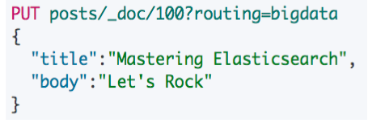
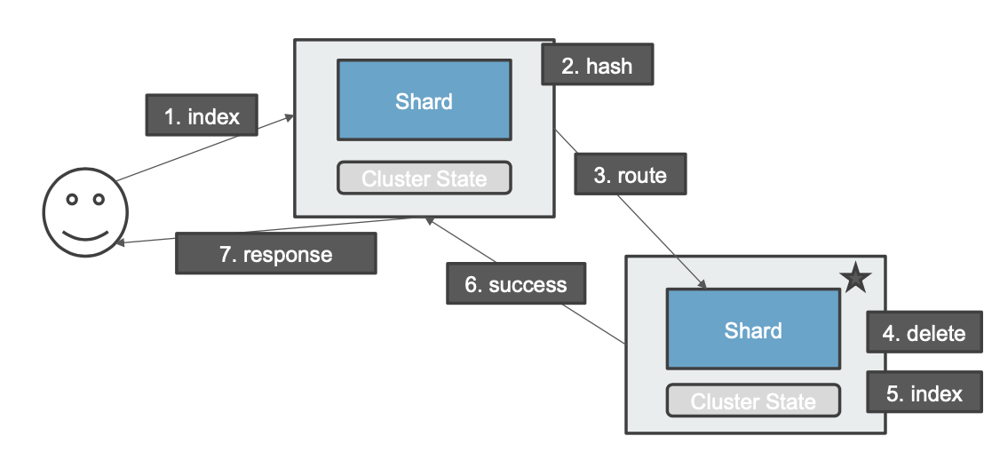
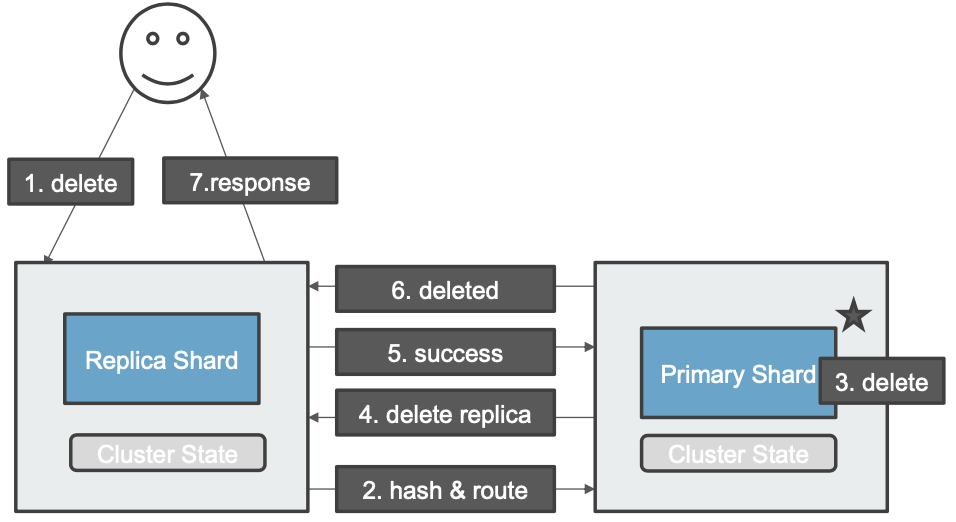

# **第三节 ⽂档分布式存储**

## **1、文档存储在分片上**

* 文档会存储在具体的某个主分⽚和副本分⽚上: 
	* **例如文档 1， 会存储在 P0 和 R0 分片上**
* 文档到分⽚的映射算法
	* 确保文档能均匀分布在所⽤分片上，充分利⽤硬件资源，避免部分机器器空闲，部分机器器繁忙 
	* 潜在的算法
		* **随机 / Round Robin**。当查询⽂档 1，分⽚数很多，需要多次查询才可能查到文档 1
		* **维护⽂档到分⽚的映射关系**，当⽂档数据量大的时候，维护成本⾼
		* **实时计算，通过文档 1，⾃动算出，需要去那个分⽚上获取⽂档**

## **2、⽂档到分片的路由算法**

* `shard = hash(_routing) % number_of_primary_shards`
	* Hash 算法确保文档均匀分散到分⽚中
	* 默认的 `_routing` 值是⽂档 id
	* **可以⾃⾏制定 routing数值，例如⽤相同国家的商品，都分配到指定的 shard**
	* 设置 Index Settings 后，**Primary 数，不能随意修改的根本原因，要修改是需要重建索引**

 

## **3、更新一个⽂档**

 

1. **用户发送请求到一个节点，接受请求的节点扮演Coordinator的角色**
2. 通过Hash算法判断请求被路由到哪一个分片
3. 请求被路由其他节点的分片上
4. Es对文档的更新实际上对文档的删除
5. 然后再创建出来新的文档
6. 创建成功，成功信息发给Coordinator node
7. 最终结果返回给用户

## **4、删除⼀个⽂档**

 

1. **用户发送删除请求到一个节点，接受请求的节点扮演Coordinator的角色**
2. 通过Hash算法判断请求被路由到哪一个分片，并请求被路由其他节点的分片上
3. 节点上对分片进行删除
4. 删除replica的请求发送到其他的replica node上，路由信息通过cluster state来获取
5. replica删除会将信息发回给primary shared
6. primary shared将删除信息发回到Coordinator node
7. 最终将信息发回到用户

## **5、本节知识点回顾**

1. 可以通过设置 Index Settings，控制数据的分⽚
2. **Primary Shard 的值不能修改，修改需要重新 Index。默认值是 5**， 从 7 开始，默认值改为 1
3. **索引写入数据后，Replica 的值可以修改。增加副本，可提高大并发下的读取性能**
4. 通过控制集群的节点数，设置 Primary Shard 数，实现⽔平扩展

