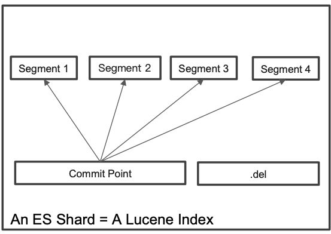
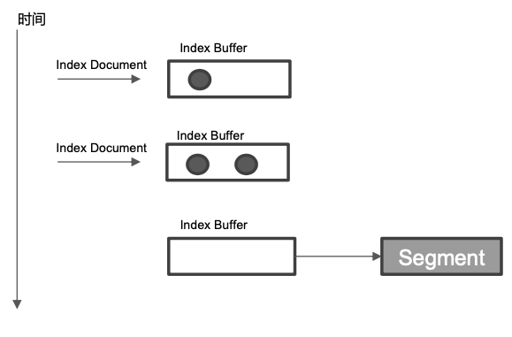
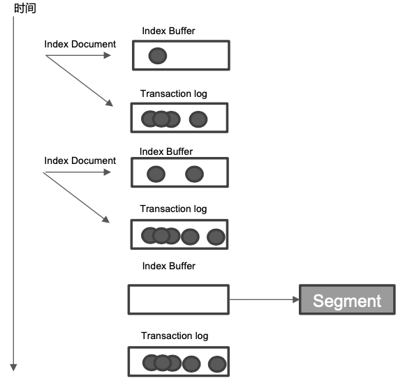
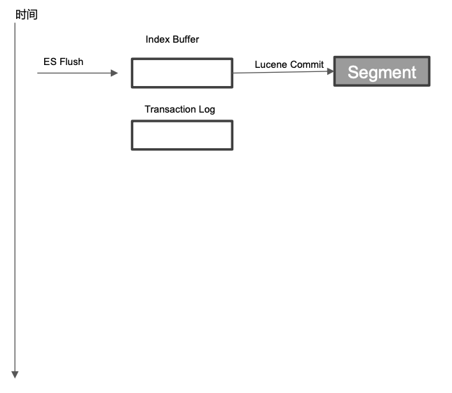

# **第四节 分⽚及其生命周期**

## **1、分⽚的内部原理**

### **1-1 什么是 ES 的分⽚**

* ES 中最小的工作单元 
* 是一个 Lucene 的 Index

### **1-2 一些问题:**

* 为什么 ES 的搜索是近实时的(1 秒后被搜到)
* ES 如何保证在断电时数据也不会丢失
* 为什么删除文档，并不会立刻释放空间

## **2、倒排索引不可变性**

* 倒排索引采用 Immutable Design，⼀旦生成，不可更改
* 不可变性，带来了的好处如下
	* ⽆需考虑并发写文件的问题，避免了了锁机制带来的性能问题 
	* **⼀旦读入内核的文件系统缓存，便留在哪⾥。** 只要文件系统存有足够的空间，⼤部分请求就会直接请求内存，不会命中磁盘，提升了了很⼤的性能
	* 缓存容易生成和维护 / 数据可以被压缩
* 不可变更性，带来了的挑战: **如果需要让⼀个新的文档可以被搜索，需要重建整个索引。**

## **3、Lucene Index**

* 在 Lucene 中，单个倒排索引文件被称为 Segment。**Segment 是自包含的，不可变更的。** **多个 Segments 汇总在⼀起，称为 Lucene 的 Index，其对应的就是 ES 中的 Shard**
* 当有新⽂档写⼊时，**会⽣成新 Segment，查询时会同时查询所有 Segments，并且对结果汇总。**Lucene 中有⼀个⽂件，用来记录所有 Segments 信息，叫做 Commit Point
* 删除的文档信息，**保存在`“.del”`⽂件中**

 

## **4、什么是 Refresh**

* **将 Index buffer 写入 Segment 的过程叫 Refresh**。Refresh 不执⾏ fsync 操作
* **Refresh 频率:	默认 1 秒发⽣一次**，可通过 `index.refresh_interval` 配置。`Refresh` 后， 数据就可以被搜索到了。这也是为什么 `Elasticsearch` 被称为近实时搜索
*  如果系统有⼤量的数据写入，那就会产⽣很多的 Segment
*  `Index Buffer` 被占满时，会触发 `Refresh`，**默认值是 `JVM` 的 10%**

 

## **5、什么是 Transaction Log**

* Segment 写⼊磁盘的过程相对耗时，借助文件系统缓存，**Refresh 时，先将 Segment 写入缓存以开放查询**
* 为了保证数据不会丢失。**所以在 Index ⽂档时，同时写 Transaction Log，⾼版本开始，Transaction Log 默认落盘。每个分⽚有一个 Transaction Log**
* **在 ES Refresh 时，Index Buffer 被清空， Transaction log 不会清空**

 

## **6、什么是 Flush**

* ES Flush & Lucene Commit
	* 调⽤ Refresh，Index Buffer 清空并且 Refresh
	* 调⽤ fsync，将缓存中的 Segments 写入磁盘
	* 清空(删除)Transaction Log
	* 默认 30 分钟调⽤用⼀次
	* Transaction Log 满 (默认 512 MB)

 	
## **7、Merge**

* Segment 很多，需要被定期被合并
	* 减少 Segments / 删除已经删除的文档
* ES 和 Lucene 会⾃动进⾏ Merge 操作
	* `POST my_index/_forcemerge`

## **8、本节知识点回顾**

**Shard 和 Lucene Index**

* Index Buffer / Segment / Transaction Log

**Refresh & Flush**

**Merge**
	
	
## **9、三&四节知识总结**

1. 客户端发起数据写入请求，对你写的这条数据根据`_routing`规则选择发给哪个`Shard`。
	* 确认`Index Request`中是否设置了使用哪个`Filed`的值作为路由参数，如果没有设置，则使用Mapping中的配置
	* 如果mapping中也没有配置，则使用`_id`作为路由参数，然后通过`_routing`的`Hash`值选择出`Shard`，最后从集群的`Meta`中找出该`Shard`的`Primary`节点 
2. 写入请求到达Shard后，先把数据写入到内存（buffer）中，同时会写入一条日志到Transaction Log日志文件中去。
	* 当写入请求到shard后，首先是写Lucene，其实就是创建索引。
	* **索引创建好后并不是马上生成segment，这个时候索引数据还在缓存中，这里的缓存是lucene的缓存，并非Elasticsearch缓存，lucene缓存中的数据是不可被查询的**。
3. 执行refresh操作：从内存`buffer`中将数据写入`os cache`(操作系统的内存)，产生一个`segment file`文件，buffer清空。写入os cache的同时，建立倒排索引，这时数据就可以供客户端进行访问了。
	* 默认是每隔1秒refresh一次的，所以`es`是准实时的，因为写入的数据1秒之后才能被看到。
	* `buffer`内存占满的时候也会执行`refresh`操作，`buffer`默认值是`JVM`内存的10%。
	* 通过`es`的`restful api`或者`java api`，手动执行一次`refresh`操作，就是手动将`buffer`中的数据刷入`os cache`中，让数据立马就可以被搜索到。
	* **若要优化索引速度, 而不注重实时性, 可以降低刷新频率。**
4. `translog`会每隔5秒或者在一个变更请求完成之后，将`translog`从缓存刷入磁盘。
	* translog是存储在os cache中，每个分片有一个，如果节点宕机会有5秒数据丢失，但是性能比较好，最多丢5秒的数据。
	* 可以将translog设置成每次写操作必须是直接fsync到磁盘，但是性能会差很多。
	* 可以通过配置增加transLog刷磁盘的频率来增加数据可靠性，最小可配置100ms，但不建议这么做，因为这会对性能有非常大的影响。
5. 每30分钟或者当tanslog的大小达到512M时候，就会执行`commit`操作（`flush`操作），**将os cache中所有的数据全以segment file的形式，持久到磁盘上去**。
	* 第一步，就是将`buffer`中现有数据`refresh`到`os cache`中去。
	* 清空`buffer` 然后强行将`os cache`中所有的数据全都一个一个的通过`segmentfile`的形式，持久到磁盘上去。
	* 将`commit point`这个文件更新到磁盘中，每个`Shard`都有一个提交点(`commit point`), 其中保存了当前Shard成功写入磁盘的所有segment。
	* 把translog文件删掉清空，再开一个空的translog文件。
	* flush参数设置：
		* `index.translog.flush_threshold_period`:
		* `index.translog.flush_threshold_size`:
		* `#控制每收到多少条数据后flush一次`
		* `index.translog.flush_threshold_ops`:
6. Segment的merge操作：
	* 随着时间，磁盘上的segment越来越多，需要定期进行合并。
	* Es和Lucene 会自动进行merge操作，合并segment和删除已经删除的文档。
	* 我们可以手动进行merge：`POST index/_forcemerge`。一般不需要，这是一个比较消耗资源的操作。
	* 当数据从hot移动到warm，官方建议手工执行一下`_forcemerge`
  
	