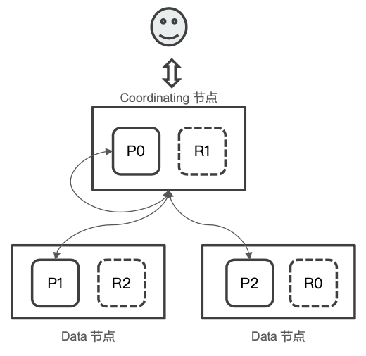
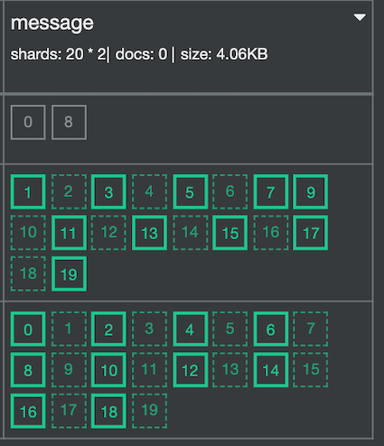

# **第五节 剖析分布式查询及相关性算分**

## **1、分布式搜索的运⾏机制**

* **Elasticsearch 的搜索，会分两阶段进⾏**
	* 第⼀阶段 - Query 
	* 第⼆阶段 - Fetch
* `Query-then-Fetch`


## **2、Query 阶段**

* ⽤户发出搜索请求到 ES 节点。节点收到请求后， 会以 Coordinating 节点的身份，在 6 个 主副分⽚中随机选择 3 个分片，**发送查询请求**
* **被选中的分⽚执⾏查询，进⾏排序**。然后，每个分⽚都会返回 **From + Size** 个排序后的⽂档 Id 和排序值给 Coordinating 节点

 

## **3、Fetch 阶段**

* Coordinating Node 会将 Query 阶段，**从每个分⽚获取的排序后的文档 Id 列表， 重新进⾏排序**。选取 From 到 From + Size 个⽂档的 Id
* **以 multi get 请求的⽅式，到相应的分片获取详细的⽂档数据**

 

## **4、Query Then Fetch 潜在的问题**

* 性能问题
	*  **每个分⽚上需要查的⽂档个数 = from + size**
	*  **最终协调节点需要处理: `number_of_shard * ( from+size )`**
	*  深度分⻚
* 相关性算分
	* 每个分⽚都基于⾃己的分⽚上的数据进⾏相关度计算。这会导致打分偏离的情况，特别是数据量很少时。相关性算分在分⽚之间是相互独立。**当⽂档总数很少的情况下，如果主分片⼤于 1，主分⽚数越多 ，相关性算分会越不准**

## **5、解决算分不准的⽅法**

**数据量不⼤的时候，可以将主分⽚数设置为 1**

* 当数据量⾜够⼤时候，只要保证⽂档均匀分散在各个分片上，结果一般就不会出现偏差

**使⽤ DFS Query Then Fetch**

* **搜索的URL 中指定参数 `“_search?search_type=dfs_query_then_fetch”`**
* 到每个分⽚把各分⽚的词频和⽂档频率进⾏搜集，然后完整的进⾏⼀次相关性算分， 耗费更加多的 CPU 和内存，执⾏性能低下，⼀般不建议使⽤

## **6、相关性算分问题 Demo**

* 写⼊ 3 条记录 “Good” / “Good morning” / “good morning everyone”
* 使⽤ 1 个主分⽚测试， Good 应该排在第⼀，Good DF 数值应该是 3
* 和 20 个主分⽚，测试
* 当 多个主分⽚时，3 个⽂档的算分都⼀样。 可以通过 Explain API 进⾏分析
* 在 3 个主分片上 执⾏ DFS Query Then Fetch，结果和⼀个分⽚上⼀致

```
DELETE message
PUT message
{
  "settings": {
    "number_of_shards": 20
  }
}
```

```
{
  "acknowledged" : true,
  "shards_acknowledged" : true,
  "index" : "message"
}
```

 

```
GET message
```

**Output**

```
{
  "message" : {
    "aliases" : { },
    "mappings" : {
      "properties" : {
        "content" : {
          "type" : "text",
          "fields" : {
            "keyword" : {
              "type" : "keyword",
              "ignore_above" : 256
            }
          }
        }
      }
    },
    "settings" : {
      "index" : {
        "creation_date" : "1603408677309",
        "number_of_shards" : "20",
        "number_of_replicas" : "1",
        "uuid" : "QKfnIdUsR9Gj8giWp7Kr0g",
        "version" : {
          "created" : "7090199"
        },
        "provided_name" : "message"
      }
    }
  }
}
```

**写入数据**

```
POST message/_doc?routing=1
{
  "content":"good"
}

POST message/_doc?routing=2
{
  "content":"good morning"
}

POST message/_doc?routing=3
{
  "content":"good morning everyone"
}
```

```
POST message/_search
{
  "explain": true,
  "query": {
    "match_all": {}
  }
}
```

***Ouput***

```
"_shard" : "[message][2]",
"_score" : 1.0,
"_routing" : "3",
"_source" : {
          "content" : "good morning everyone"
        },
...
"_shard" : "[message][14]",
"_score" : 1.0,
"_routing" : "2",
 "_source" : {
          "content" : "good morning"
 },
 ...
"_shard" : "[message][17]",
"_score" : 1.0,
        "_routing" : "1",
        "_source" : {
          "content" : "good"
        },
```

当⽂档总数很少的情况下，如果主分片⼤于 1，主分⽚数越多 ，相关性算分会越不准

```
POST message/_search
{
  "explain": true,
  "query": {
    "term": {
      "content": {
        "value": "good"
      }
    }
  }
}
```

***Ouput :***

```
"_score" : 0.2876821,
"_source" : {
          "content" : "good morning everyone"
        },
...
"_score" : 0.2876821,

"_source" : {
          "content" : "good morning"
        }, 
...
"_score" : 0.2876821,
"_source" : {
          "content" : "good"
        },
```

**使⽤ DFS Query Then Fetch**

```

POST message/_search?search_type=dfs_query_then_fetch
{

  "query": {
    "term": {
      "content": {
        "value": "good"
      }
    }
  }
}
```

***Ouput :***

```
"hits" : [
      {
        "_index" : "message",
        "_type" : "_doc",
        "_id" : "rX2gUnUBaxLQOLM-iUzd",
        "_score" : 0.16786805,
        "_routing" : "1",
        "_source" : {
          "content" : "good"
        }
      },
      {
        "_index" : "message",
        "_type" : "_doc",
        "_id" : "sH2gUnUBaxLQOLM-p0xC",
        "_score" : 0.13353139,
        "_routing" : "2",
        "_source" : {
          "content" : "good morning"
        }
      },
      {
        "_index" : "message",
        "_type" : "_doc",
        "_id" : "tX2gUnUBaxLQOLM-vkyS",
        "_score" : 0.110856235,
        "_routing" : "3",
        "_source" : {
          "content" : "good morning everyone"
        }
      }
    ]
```