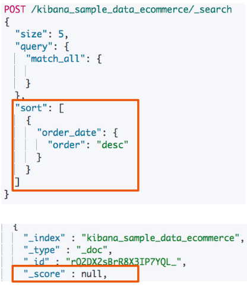
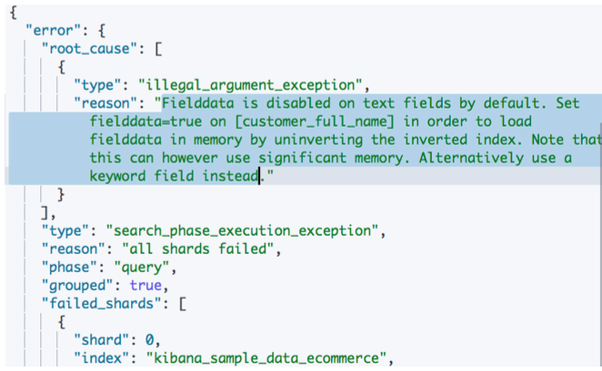
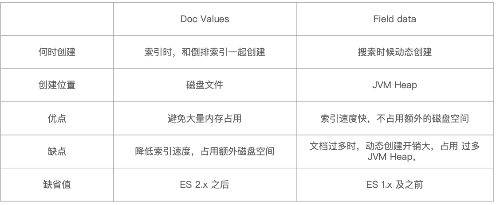
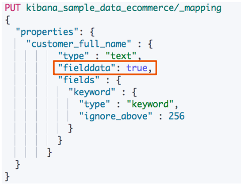
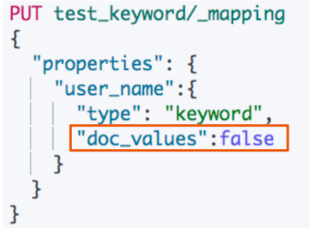

# **第六节 排序及Doc Values&Fielddata**

## **1、排序**

* Elasticsearch 默认采⽤**相关性算分对结果进⾏降序排序**
* 可以通过**设定 sorting 参数，⾃⾏设定排序**
* 如果不指定`_score`，**算分为 Null**

 

### **1-1 单字段排序**

```
#单字段排序
POST /kibana_sample_data_ecommerce/_search
{
  "size": 5,
  "query": {
    "match_all": {

    }
  },
  "sort": [
    {"order_date": {"order": "desc"}}
  ]
}
```

```
"_score" : null,
 "order_date" : "2020-10-10T23:45:36+00:00", 
.....
 "order_date" : "2020-10-10T23:31:12+00:00",
 ...
```

### **1-2 多字段进行排序**
 
*  组合多个条件
* 优先考虑写在前⾯的排序
* ⽀持对相关性算分进⾏排序 

```
#多字段排序
POST /kibana_sample_data_ecommerce/_search
{
  "size": 5,
  "query": {
    "match_all": {

    }
  },
  "sort": [
    {"order_date": {"order": "desc"}},
    {"_doc":{"order": "asc"}},
    {"_score":{ "order": "desc"}}
  ]
}
```

## **2、对 Text 类型排序**

```
GET kibana_sample_data_ecommerce/_mapping
```

**fielddata: 默认关闭**

```
#对 text 字段进行排序。默认会报错，需打开fielddata
POST /kibana_sample_data_ecommerce/_search
{
  "size": 5,
  "query": {
    "match_all": {

    }
  },
  "sort": [
    {"customer_full_name": {"order": "desc"}}
  ]
}
```

 

**400 - Bad Request**

```
 {
  "error" : {
    "root_cause" : [
      {
        "type" : "illegal_argument_exception",
        "reason" : "Text fields are not optimised for operations that require per-document field data like aggregations and sorting, so these operations are disabled by default. Please use a keyword field instead. Alternatively, set fielddata=true on [customer_full_name] in order to load field data by uninverting the inverted index. Note that this can use significant memory."
      }
    ],
...
```

## **3、排序的过程**

* **排序是针对字段原始内容进行的。 倒排索引⽆法发挥作⽤**
* **需要⽤到正排索引。通过⽂档 Id 和字段快速得到字段原始内容**
* Elasticsearch 有两种实现⽅法
	* Fielddata
	* **Doc Values (列式存储，对 Text 类型⽆效)**

 
### **3-1 Doc Values vs Field Data**

 

**Demo**

* 单字段多字段排序
* 对 Text 和 Keyword 类型进行排序

## **4、打开 Fielddata**

 

*  默认关闭，可以通过 Mapping 设置打开。**修改设置后，即时⽣效，⽆需重建索引**
*  其他字段类型不不⽀支持，只支持对 Text 进⾏设定
*  打开后，可以对 Text 字段进⾏排序。**但是是对分词后的 term 排序，所以，结果往往⽆法满足预期，不建议使⽤**
*  部分情况下打开，满⾜⼀些聚合分析的特定需求

***打开 text的 fielddata***

```
PUT kibana_sample_data_ecommerce/_mapping
{
  "properties": {
    "customer_full_name" : {
          "type" : "text",
          "fielddata": true,
          "fields" : {
            "keyword" : {
              "type" : "keyword",
              "ignore_above" : 256
            }
          }
        }
  }
}
```

```
POST /kibana_sample_data_ecommerce/_search
{
  "size": 5,
  "query": {
    "match_all": {

    }
  },
  "sort": [
    {"customer_full_name": {"order": "desc"}}
  ]
}
```

***Output***

```
"customer_full_name" : "Yuri Foster",
"customer_full_name" : "Yuri Roberson",
"customer_full_name" : "Yuri Greer",
"customer_full_name" : "Yuri Duncan",
```


## **5、关闭 Doc Values**

* **默认启⽤，可以通过 Mapping 设置关闭**
	* 增加索引的速度 / 减少磁盘空间
* 如果重新打开，**需要重建索引**
	* 什么时候需要关闭
		* **明确不不需要做排序及聚合分析**

>  doc values是在创建时所产生，默认打开，关闭后可以对老的数据进行`query then update`的操作，更新索引

 

```
#关闭 keyword的 doc values
PUT test_keyword
PUT test_keyword/_mapping
{
  "properties": {
    "user_name":{
      "type": "keyword",
      "doc_values":false
    }
  }
}

DELETE test_keyword
```

```
PUT test_text
PUT test_text/_mapping
{
  "properties": {
    "intro":{
      "type": "text",
      "doc_values":true
    }
  }
}

DELETE test_text
```

## **6、获取 Doc Values & Fielddata 中存储的内容**

* Text 类型的不支持 Doc Values
* Text 类型打开 Fielddata后，可以查看分词后的数据


**使⽤ `docvalue_fields` 查看存储的信息**

```
DELETE temp_users
PUT temp_users
PUT temp_users/_mapping
{
  "properties": {
    "name":{"type": "text","fielddata": true},
    "desc":{"type": "text","fielddata": true}
  }
}
```

```
POST temp_users/_doc
{"name":"Jack","desc":"Jack is a good boy!","age":10}
```

### **6-1 查看 `docvalue_fields`数据**

打开fielddata 后，查看 `docvalue_fields`数据

```
POST  temp_users/_search
{
  "docvalue_fields": [
    "name","desc"
    ]
}
```
```
 "hits" : [
      {
        "_index" : "temp_users",
        "_type" : "_doc",
        "_id" : "AX25U3UBaxLQOLM-FE5T",
        "_score" : 1.0,
        "_source" : {
          "name" : "Jack",
          "desc" : "Jack is a good boy!",
          "age" : 10
        },
        "fields" : {
          "name" : [
            "jack"
          ],
          "desc" : [
            "a",
            "boy",
            "good",
            "is",
            "jack"
          ]
        }
      }
    ]
```

**查看整型字段的docvalues**

```
POST  temp_users/_search
{
  "docvalue_fields": [
    "age"
    ]
}
```

**查看整型字段的docvalues**

```
"hits" : [
      {
        "_index" : "temp_users",
        "_type" : "_doc",
        "_id" : "AX25U3UBaxLQOLM-FE5T",
        "_score" : 1.0,
        "_source" : {
          "name" : "Jack",
          "desc" : "Jack is a good boy!",
          "age" : 10
        },
        "fields" : {
          "age" : [
            10
          ]
        }
      }
    ]
```

## **7、本节知识点回顾**


* Elasticsearch ⽀持⾃定义排序
* Doc Values 和 Fielddata 的对⽐
* 如何设置 `Doc Values` 和 `Fielddata`

