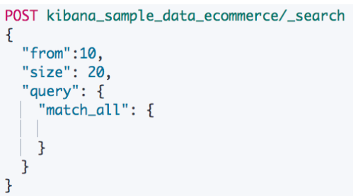
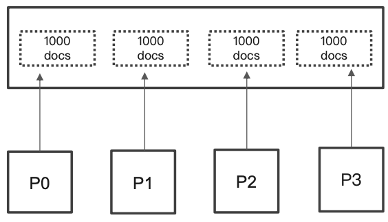
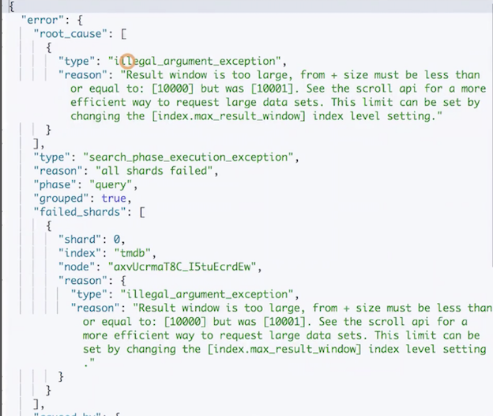
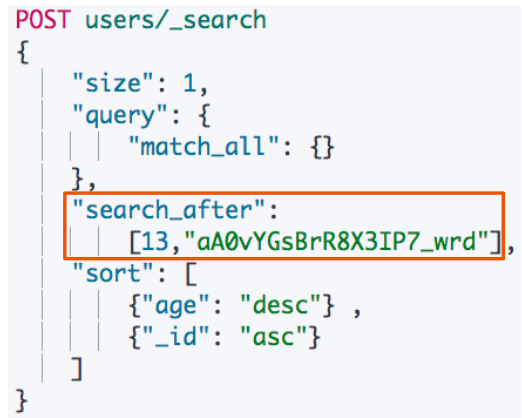
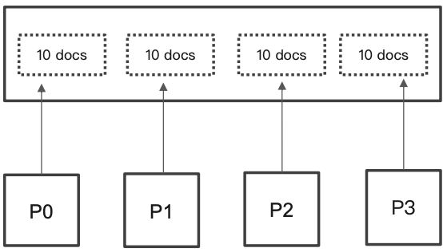
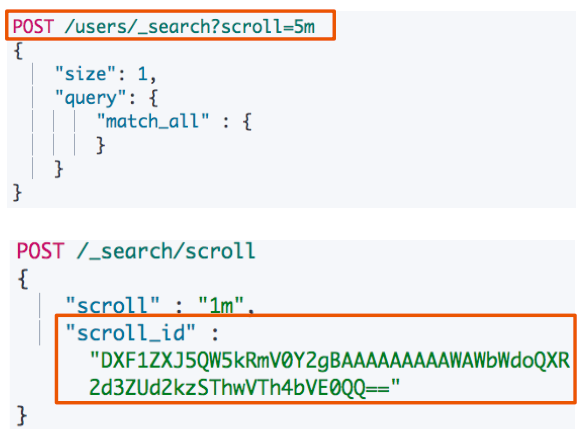

# **第七节 分页与遍历 – From，Size，Search After & Scroll API**

## **1、From / Size**

* 默认情况下，查询按照相关度算分排序，返回前 10 条记录
* 容易理解的分页方案
	* **From:开始位置**
	* **Size:期望获取文档的总数**

 

## **2、分布式系统中深度分⻚的问题**

* ES 天⽣就是分布式的。查询信息，**但是数据分别保存在多个分片，多台机器上，ES 天生就需要满⾜排序的需要(按照相关性算分)**
* **当⼀个查询: From = 990， Size =10**
	* 会在每个分片上先都获取 1000 个文档。然后， 通过 Coordinating Node 聚合所有结果。最后 再通过排序选取前 1000 个⽂档
	* **⻚数越深，占用内存越多。为了避免深度分页带来的内存开销。ES 有一个设定，默认限定到 10000 个文档**
	* `Index.max_result_window`

 

```
POST tmdb/_search
{
  "from": 10000,
  "size": 1,
  "query": {
    "match_all": {

    }
  }
}
```

```
POST tmdb/_search
{
  "from": 0,
  "size": 10001,
  "query": {
    "match_all": {

    }
  }
}
```

 

## **3、Search After 避免深度分页的问题**

* 避免深度分⻚页的性能问题，可以实时获取下⼀⻚⽂档信息
	* 不支持指定页数(From)
	* 只能往下翻

* **第⼀步搜索需要指定 sort，并且保证值是唯一的(可以通过加⼊ `_id` 保证唯⼀性)**
* 然后使用上⼀次，最后⼀个⽂档的 sort 值进⾏查询

 

### Demo for Search After

**避免深度分页的性能问题，可以实时获取下一⻚文档信息**

* 不⽀持指定⻚数(From)
* 只能往下翻

**Search After**

```
DELETE users

POST users/_doc
{"name":"user1","age":10}

POST users/_doc
{"name":"user2","age":11}


POST users/_doc
{"name":"user2","age":12}

POST users/_doc
{"name":"user2","age":13}

POST users/_count

# output
{
  "count" : 4,
  "_shards" : {
    "total" : 1,
    "successful" : 1,
    "skipped" : 0,
    "failed" : 0
  }
}
```

***Output :***

```
"hits" : [
      {
        "_index" : "users",
        "_type" : "_doc",
        "_id" : "Z30JVHUBaxLQOLM-KE5P",
        "_score" : null,
        "_source" : {
          "name" : "user2",
          "age" : 13
        },
        "sort" : [
          13,
          "Z30JVHUBaxLQOLM-KE5P"
        ]
      }
    ]
```

*  13
* `"Z30JVHUBaxLQOLM-KE5P"`


**往下翻**

```
POST users/_search
{
    "size": 1,
    "query": {
        "match_all": {}
    },
    "search_after":
        [
          13,
          "Z30JVHUBaxLQOLM-KE5P"],
    "sort": [
        {"age": "desc"} ,
        {"_id": "asc"}    
    ]
}
```

***Output***

```
"hits" : [
      {
        "_index" : "users",
        "_type" : "_doc",
        "_id" : "ZX0JVHUBaxLQOLM-CE4d",
        "_score" : null,
        "_source" : {
          "name" : "user2",
          "age" : 11
        },
        "sort" : [
          11,
          "ZX0JVHUBaxLQOLM-CE4d"
        ]
      }
    ]
```

*  user2, 12, 	Zn0JVHUBaxLQOLM-Ek6e
*  user2 11, ZX0JVHUBaxLQOLM-CE4d
*  user1, 10, Y30IVHUBaxLQOLM-906J
*  "hits" : [ ]


## **4、Search After 是如何解决深度分页的问题**

* 假定Size是10
* 当查询 990 – 1000
* **通过唯⼀排序值定位，将每次要处理的文档数都控制在 10**

 


## **5、Scroll API**

* **创建⼀个快照，有新的数据写入以后，⽆法被查到**
* **每次查询后，输⼊上⼀次的 Scroll Id**

 

### **5-1 Demo for Scroll API**

**插⼊4条记录**

```
#Scroll API
DELETE users
POST users/_doc
{"name":"user1","age":10}

POST users/_doc
{"name":"user2","age":20}

POST users/_doc
{"name":"user3","age":30}

POST users/_doc
{"name":"user4","age":40}
```

**调⽤ Scroll API, 创建⼀个快照**

```
POST /users/_search?scroll=5m
{
    "size": 1,
    "query": {
        "match_all" : {
        }
    }
}
```

>  `scroll=5m`: 最好设置的不要过大，在一分钟或5分钟后会失效的意思

```
...
"max_score" : 1.0,
    "hits" : [
      {
        "_index" : "users",
        "_type" : "_doc",
        "_id" : "i30sVHUBaxLQOLM-706K",
        "_score" : 1.0,
        "_source" : {
          "name" : "user1",
          "age" : 10
        }
      }
    ]
```

* `"_scroll_id" : "FGluY2x1ZGVfY29udGV4dF91dWlkDXF1ZXJ5QW5kRmV0Y2gBFDBuczRWSFVCUzd6ekR6aElZWHN6AAAAAAAADX4WbFRGRDZxQkNRNDYweGRXOFhGZ2FJZw=="`

**插⼊⼀条新的记录**

```
POST users/_doc
{"name":"user5","age":50}
```

**发现只能查到 4 条数据**


```
POST /_search/scroll
{
    "scroll" : "1m",
    "scroll_id" : "FGluY2x1ZGVfY29udGV4dF91dWlkDXF1ZXJ5QW5kRmV0Y2gBFDBuczRWSFVCUzd6ekR6aElZWHN6AAAAAAAADX4WbFRGRDZxQkNRNDYweGRXOFhGZ2FJZw=="
}
```

## **6、不同的搜索类型和使⽤场景**

* **Regular**
	* 需要实时获取顶部的部分文档。例如查询最新的订单
* **Scroll**
	* 需要全部⽂档，例如导出全部数据
* **Pagination**
	* From 和 Size
	* 如果需要深度分页，则选⽤ Search After

## **7、本节知识点回顾**

* Elasticsearch 默认返回 10 个结果
* 为了获取更多的结果，提供 3 种⽅式解决分⻚与遍历
	* 	From / Size 的⽤法，深度分页所存在的问题
	*  Search After 解决深度分页的问题
	*  Scroll API，通过快照，遍历数据

	
*
	