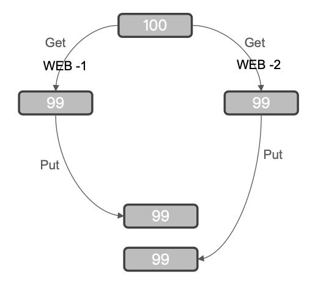
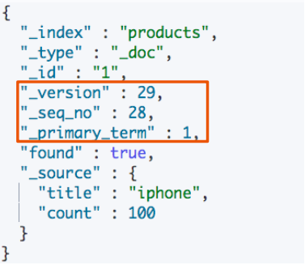

# **第八节 处理并发读写操作**

## **1、并发控制的必要性**

* 两个 Web 程序同时更新某个⽂档，如果缺乏有效的并发，会导致更改的数据丢失
* **悲观并发控制**
	* 假定有变更冲突的可能。会对资源加锁，防止冲突。例如数据库⾏锁 
* **乐观并发控制**
	* **假定冲突是不会发⽣的，不会阻塞正在尝试的操作。如果数据在读写中被修改，更新将会失败。** 应⽤程序决定如何解决冲突，例如重试更新，使⽤新的数据，或者将错误报告给⽤户
	* ES 采⽤的是乐观并发控制

 

## **2、ES 的乐观并发控制**

* ES 中的⽂档是不可变更的。如果你更新⼀个⽂档，会将就文档标记为删除，同时增加一个全新的⽂档。同时⽂档 的 version 字段加 1
* **内部版本控制**
	* `If_seq_no + If_primary_term`
* **使⽤外部版本(使⽤其他数据库作为主要数据存储)**
	* `version + version_type=external`

 

```
DELETE products
PUT products
```

***Output***

```
{
  "acknowledged" : true,
  "shards_acknowledged" : true,
  "index" : "products"
}
```

```
GET products/_doc/1
```
```
{
  "_index" : "products",
  "_type" : "_doc",
  "_id" : "1",
  "_version" : 1,
  "_seq_no" : 0,
  "_primary_term" : 1,
  "found" : true,
  "_source" : {
    "title" : "iphone",
    "count" : 100
  }
}
```

### **2-1 内部版本控制:  `If_seq_no + If_primary_term`**

```
PUT products/_doc/1?if_seq_no=0&if_primary_term=1
{
  "title":"iphone",
  "count":100
}
```
***Output:***

```
{
  "_index" : "products",
  "_type" : "_doc",
  "_id" : "1",
  "_version" : 2,
  "result" : "updated",
  "_shards" : {
    "total" : 2,
    "successful" : 2,
    "failed" : 0
  },
  "_seq_no" : 1,
  "_primary_term" : 1
}
```

* `if_seq_no=0&if_primary_term=1`
* 改变 count 到 99

```
PUT products/_doc/1?if_seq_no=0&if_primary_term=1
{
  "title":"iphone",
  "count":99
}
```

***Output: 409 - Conflict***

```
{
  "error" : {
    "root_cause" : [
      {
        "type" : "version_conflict_engine_exception",
        "reason" : "[1]: version conflict, required seqNo [0], primary term [1]. current document has seqNo [1] and primary term [1]",
        "index_uuid" : "YrNla_cjTweku9BxzjH2Ig",
        "shard" : "0",
        "index" : "products"
      }
    ],
    "type" : "version_conflict_engine_exception",
    "reason" : "[1]: version conflict, required seqNo [0], primary term [1]. current document has seqNo [1] and primary term [1]",
    "index_uuid" : "YrNla_cjTweku9BxzjH2Ig",
    "shard" : "0",
    "index" : "products"
  },
  "status" : 409
}
```

### 2-2 使⽤外部版本：  `version + version_type=external`

```
PUT products/_doc/1?version=30000&version_type=external
{
  "title":"iphone",
  "count":100
}
```

***Output***

```
{
  "_index" : "products",
  "_type" : "_doc",
  "_id" : "1",
  "_version" : 30000,
  "result" : "updated",
  "_shards" : {
    "total" : 2,
    "successful" : 2,
    "failed" : 0
  },
  "_seq_no" : 2,
  "_primary_term" : 1
}
```

*  `"_version" : 30000`
* 改变 count 到 99

```
PUT products/_doc/1?version=30000&version_type=external
{
  "title":"iphone",
  "count":99
}
```
***Output: 409 - Conflict***

```
{
  "error" : {
    "root_cause" : [
      {
        "type" : "version_conflict_engine_exception",
        "reason" : "[1]: version conflict, current version [30000] is higher or equal to the one provided [30000]",
        "index_uuid" : "YrNla_cjTweku9BxzjH2Ig",
        "shard" : "0",
        "index" : "products"
      }
    ],
    "type" : "version_conflict_engine_exception",
    "reason" : "[1]: version conflict, current version [30000] is higher or equal to the one provided [30000]",
    "index_uuid" : "YrNla_cjTweku9BxzjH2Ig",
    "shard" : "0",
    "index" : "products"
  },
  "status" : 409
}

```

