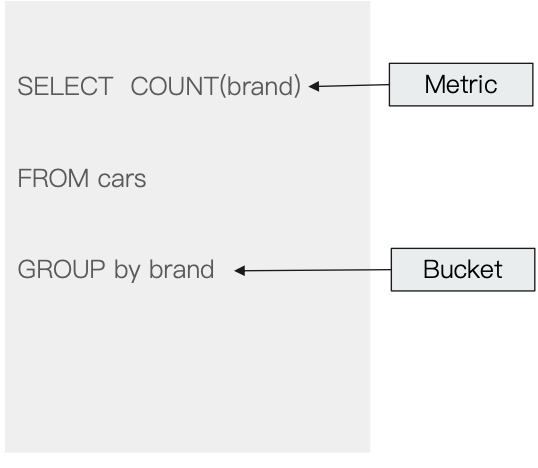
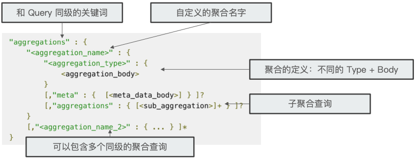
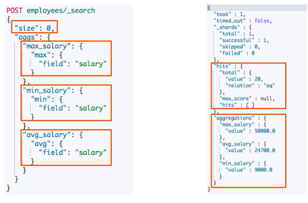
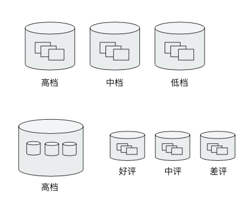
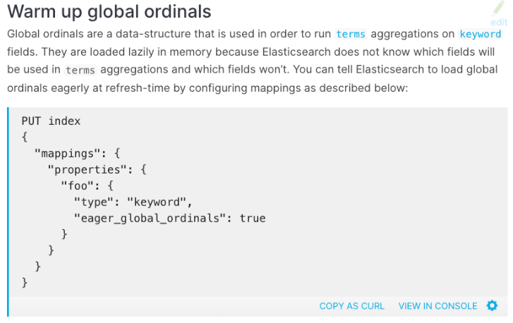

# **第一节 Bucket & Metric 聚合分析及嵌套聚合**

## **1、Bucket & Metric Aggregation**

* Metric —— **⼀些系列的统计⽅法**
* Bucket —— **⼀组满足条件的文档**



## **2、Aggregation 的语法**

**Aggregation 属于 Search 的 一部分。一般情况下，建议将其 Size 指定为 0**




## **3、⼀个例子:⼯资统计信息**



## **4、Metric Aggregation**

### **4-1 单值分析:只输出⼀个分析结果**

* min, max, avg, sum
* Cardinality (类似 distinct Count)

### **4-2 多值分析:输出多个分析结果**

* stats, extended stats
* percentile, percentile rank
* top hits (排在前⾯的示例)


## **5、Metric 聚合的具体 Demo**

* 查看最低⼯资
* 查看最⾼⼯资
* ⼀个聚合输出多个值
* 一次查询包含多个聚合
	* 同时查看最低，最⾼和平均工资

```
DELETE /employees

PUT /employees/
{
  "mappings" : {
      "properties" : {
        "age" : {
          "type" : "integer"
        },
        "gender" : {
          "type" : "keyword"
        },
        "job" : {
          "type" : "text",
          "fields" : {
            "keyword" : {
              "type" : "keyword",
              "ignore_above" : 50
            }
          }
        },
        "name" : {
          "type" : "keyword"
        },
        "salary" : {
          "type" : "integer"
        }
      }
    }
}
```

* job: text
	* `keyword: keyword`
* name: keyword

***Output:***

```
{
  "acknowledged" : true,
  "shards_acknowledged" : true,
  "index" : "employees"
}
```

```
PUT /employees/_bulk
{ "index" : {  "_id" : "1" } }
{ "name" : "Emma","age":32,"job":"Product Manager","gender":"female","salary":35000 }
{ "index" : {  "_id" : "2" } }
{ "name" : "Underwood","age":41,"job":"Dev Manager","gender":"male","salary": 50000}
{ "index" : {  "_id" : "3" } }
{ "name" : "Tran","age":25,"job":"Web Designer","gender":"male","salary":18000 }
{ "index" : {  "_id" : "4" } }
{ "name" : "Rivera","age":26,"job":"Web Designer","gender":"female","salary": 22000}
{ "index" : {  "_id" : "5" } }
{ "name" : "Rose","age":25,"job":"QA","gender":"female","salary":18000 }
{ "index" : {  "_id" : "6" } }
{ "name" : "Lucy","age":31,"job":"QA","gender":"female","salary": 25000}
{ "index" : {  "_id" : "7" } }
{ "name" : "Byrd","age":27,"job":"QA","gender":"male","salary":20000 }
{ "index" : {  "_id" : "8" } }
{ "name" : "Foster","age":27,"job":"Java Programmer","gender":"male","salary": 20000}
{ "index" : {  "_id" : "9" } }
{ "name" : "Gregory","age":32,"job":"Java Programmer","gender":"male","salary":22000 }
{ "index" : {  "_id" : "10" } }
{ "name" : "Bryant","age":20,"job":"Java Programmer","gender":"male","salary": 9000}
{ "index" : {  "_id" : "11" } }
{ "name" : "Jenny","age":36,"job":"Java Programmer","gender":"female","salary":38000 }
{ "index" : {  "_id" : "12" } }
{ "name" : "Mcdonald","age":31,"job":"Java Programmer","gender":"male","salary": 32000}
{ "index" : {  "_id" : "13" } }
{ "name" : "Jonthna","age":30,"job":"Java Programmer","gender":"female","salary":30000 }
{ "index" : {  "_id" : "14" } }
{ "name" : "Marshall","age":32,"job":"Javascript Programmer","gender":"male","salary": 25000}
{ "index" : {  "_id" : "15" } }
{ "name" : "King","age":33,"job":"Java Programmer","gender":"male","salary":28000 }
{ "index" : {  "_id" : "16" } }
{ "name" : "Mccarthy","age":21,"job":"Javascript Programmer","gender":"male","salary": 16000}
{ "index" : {  "_id" : "17" } }
{ "name" : "Goodwin","age":25,"job":"Javascript Programmer","gender":"male","salary": 16000}
{ "index" : {  "_id" : "18" } }
{ "name" : "Catherine","age":29,"job":"Javascript Programmer","gender":"female","salary": 20000}
{ "index" : {  "_id" : "19" } }
{ "name" : "Boone","age":30,"job":"DBA","gender":"male","salary": 30000}
{ "index" : {  "_id" : "20" } }
{ "name" : "Kathy","age":29,"job":"DBA","gender":"female","salary": 20000}
```

***Output:***

```
{
  "took" : 110,
  "errors" : false,
  "items" : [
    {
      "index" : {
        "_index" : "employees",
        "_type" : "_doc",
        "_id" : "1",
        "_version" : 1,
        "result" : "created",
        "_shards" : {
          "total" : 2,
          "successful" : 2,
          "failed" : 0
        },
        "_seq_no" : 0,
        "_primary_term" : 1,
        "status" : 201
      }
    },
 ...
```

### **5-1 Metric 聚合，找到最低的工资**

```
# Metric 聚合，找到最低的工资
POST employees/_search
{
  "size": 0,
  "aggs": {
    "min_salary": {
      "min": {
        "field":"salary"
      }
    }
  }
}
```

***Output***

```
"hits" : {
    "total" : {
      "value" : 20,
      "relation" : "eq"
    },
    "max_score" : null,
    "hits" : [ ]
  },
  "aggregations" : {
    "min_salary" : {
      "value" : 9000.0
    }
  }
```

### **5-2 Metric 聚合，找到最高的工资**

```
# Metric 聚合，找到最高的工资
POST employees/_search
{
  "size": 0,
  "aggs": {
    "max_salary": {
      "max": {
        "field":"salary"
      }
    }
  }
}
```

### **5-3 多个 Metric 聚合，找到最低最高和平均工资**

```
POST employees/_search
{
  "size": 0,
  "aggs": {
    "max_salary": {
      "max": {
        "field": "salary"
      }
    },
    "min_salary": {
      "min": {
        "field": "salary"
      }
    },
    "avg_salary": {
      "avg": {
        "field": "salary"
      }
    }
  }
}
```

***Output***

```
"aggregations" : {
    "max_salary" : {
      "value" : 50000.0
    },
    "avg_salary" : {
      "value" : 24700.0
    },
    "min_salary" : {
      "value" : 9000.0
    }
  }
```

### **5-4 一个聚合，输出多值**

```
POST employees/_search
{
  "size": 0,
  "aggs": {
    "stats_salary": {
      "stats": {
        "field":"salary"
      }
    }
  }
}
```

***Output:***

```
"aggregations" : {
    "stats_salary" : {
      "count" : 20,
      "min" : 9000.0,
      "max" : 50000.0,
      "avg" : 24700.0,
      "sum" : 494000.0
    }
  }
```

## **6、Bucket**

* **按照⼀定的规则，将⽂档分配到不同的桶中，从⽽达到分类的⽬的。ES 提供的一些常见的 Bucket Aggregation**
	* Terms
	* 数字类型
		* Range / Data Range
		* Histogram / Date Histogram
* **支持嵌套:也就在桶里再做分桶**




## **7、Terms Aggregation**


* 字段需要打开 fielddata，才能进行 Terms Aggregation
	* Keyword 默认支持 `doc_values`
	* Text 需要在 Mapping 中 enable。会按照分词后的结果进⾏分类

* **Demo**
	* 对 `job` 和 `job.keyword` 进⾏聚合
	* 对性别进⾏ Terms 聚合
	* 指定 bucket size

### 7-1 对keword 进行聚合

```
POST employees/_search
{
  "size": 0,
  "aggs": {
    "jobs": {
      "terms": {
        "field":"job.keyword"
      }
    }
  }
}
```
**`"field":"job.keyword"`**

```
"aggregations" : {
    "jobs" : {
      "doc_count_error_upper_bound" : 0,
      "sum_other_doc_count" : 0,
      "buckets" : [
        {
          "key" : "Java Programmer",
          "doc_count" : 7
        },
        {
          "key" : "Javascript Programmer",
          "doc_count" : 4
        },
        {
          "key" : "QA",
          "doc_count" : 3
        },
        {
          "key" : "DBA",
          "doc_count" : 2
        },
        {
          "key" : "Web Designer",
          "doc_count" : 2
        },
        {
          "key" : "Dev Manager",
          "doc_count" : 1
        },
        {
          "key" : "Product Manager",
          "doc_count" : 1
        }
      ]
    }
  }
```

* Java Programmer, Javascript Programmer, QA, DBA, Web Designer, Dev Manager, Product Manager

### **7-2 对 Text 字段进行 terms 聚合查询，失败**

```
# 对 Text 字段进行 terms 聚合查询，失败
POST employees/_search
{
  "size": 0,
  "aggs": {
    "jobs": {
      "terms": {
        "field":"job"
      }
    }
  }
 }
```

**Output**

```
{
  "error" : {
    "root_cause" : [
      {
        "type" : "illegal_argument_exception",
        "reason" : "Text fields are not optimised for operations that require per-document field data like aggregations and sorting, so these operations are disabled by default. Please use a keyword field instead. Alternatively, set fielddata=true on [job] in order to load field data by uninverting the inverted index. Note that this can use significant memory."
      }
    ],
    "type" : "search_phase_execution_exception",
    "reason" : "all shards failed",
    "phase" : "query",
    "grouped" : true,
    "failed_shards" : [
      {
        "shard" : 0,
        "index" : "employees",
        "node" : "L7jf3HA8TqOEtNY8BrU82A",
```


**对 Text 字段打开 fielddata，支持terms aggregation**

```
PUT employees/_mapping
{
  "properties" : {
    "job":{
       "type":     "text",
       "fielddata": true
    }
  }
}
```

**对 Text 字段进行 terms 分词。分词后的terms**

```
POST employees/_search
{
  "size": 0,
  "aggs": {
    "jobs": {
      "terms": {
        "field":"job"
      }
    }
  }
}
```

***Output***

```
"aggregations" : {
    "jobs" : {
      "doc_count_error_upper_bound" : 0,
      "sum_other_doc_count" : 0,
      "buckets" : [
        {
          "key" : "programmer",
          "doc_count" : 11
        },
        {
          "key" : "java",
          "doc_count" : 7
        },
        {
          "key" : "javascript",
          "doc_count" : 4
        },
        {
          "key" : "qa",
          "doc_count" : 3
        },
        {
          "key" : "dba",
          "doc_count" : 2
        },
        {
          "key" : "designer",
          "doc_count" : 2
        },
        {
          "key" : "manager",
          "doc_count" : 2
        },
        {
          "key" : "web",
          "doc_count" : 2
        },
        {
          "key" : "dev",
          "doc_count" : 1
        },
        {
          "key" : "product",
          "doc_count" : 1
        }
      ]
    }
  }
```


### **7-3 对`job.keyword` 和 `job` 进行 `terms` 聚合，分桶的总数并不一样**

```
POST employees/_search
{
  "size": 0,
  "aggs": {
    "jobs": {
      "terms": {
        "field":"job.keyword"
      }
    }
  }
}
```

***Output:***

```
"buckets" : [
        {
          "key" : "Java Programmer",
          "doc_count" : 7
        },
        {
          "key" : "Javascript Programmer",
          "doc_count" : 4
        },
        {
          "key" : "QA",
          "doc_count" : 3
        },
        {
...
```


## **8、 Cardinality**

**类似 SQL 中的 Distinct**

对 `job.keyword` 和 `job` 进行 `terms` 聚合，分桶的总数并不一样

### **8-1  `"field": "job"`**

```
POST employees/_search
{
  "size": 0,
  "aggs": {
    "cardinate": {
      "cardinality": {
        "field": "job"
      }
    }
  }
}
```

***Output:***

```
"aggregations" : {
    "cardinate" : {
      "value" : 10
    }
  }
}
```

### **8-2 `"field": "job.keyword"`**

```
POST employees/_search
{
  "size": 0,
  "aggs": {
    "cardinate": {
      "cardinality": {
        "field": "job.keyword"
      }
    }
  }
}
```
***Output:***

```
"aggregations" : {
    "cardinate" : {
      "value" : 7
    }
  }
```

## **9、Bucket Size & Top Hits Demo**


* 应⽤场景:当获取分桶后，桶内最匹配的顶部⽂档列列表 
* Size:按年龄分桶，找出指定数据量的分桶信息
* Top Hits:查看各个⼯种中，年纪最⼤的 3 名员工

```
# 对 性别的 keyword 进行聚合
POST employees/_search
{
  "size": 0,
  "aggs": {
    "gender": {
      "terms": {
        "field":"gender"
      }
    }
  }
}
```

***Output***

```
"aggregations" : {
    "gender" : {
      "doc_count_error_upper_bound" : 0,
      "sum_other_doc_count" : 0,
      "buckets" : [
        {
          "key" : "male",
          "doc_count" : 12
        },
        {
          "key" : "female",
          "doc_count" : 8
        }
      ]
    }
  }
```

### **9-1 指定 bucket 的 size**

```
POST employees/_search
{
  "size": 0,
  "aggs": {
    "ages_5": {
      "terms": {
        "field":"age",
        "size":3
      }
    }
  }
}
```

***Output***

```
"aggregations" : {
    "ages_5" : {
      "doc_count_error_upper_bound" : 0,
      "sum_other_doc_count" : 12,
      "buckets" : [
        {
          "key" : 25,
          "doc_count" : 3
        },
        {
          "key" : 32,
          "doc_count" : 3
        },
        {
          "key" : 27,
          "doc_count" : 2
        }
      ]
    }
  }
```


### **9-2 优化 Terms 聚合的性能**




[https://www.elastic.co/guide/en/elasticsearch/reference/7.1/tune-for-search-speed.html](https://www.elastic.co/guide/en/elasticsearch/reference/7.1/tune-for-search-speed.html)


指定size，不同工种中，年纪最大的3个员工的具体信息

```
POST employees/_search
{
  "size": 0,
  "aggs": {
    "jobs": {
      "terms": {
        "field":"job.keyword"
      },
      "aggs":{
        "old_employee":{
          "top_hits":{
            "size":3,
            "sort":[
              {
                "age":{
                  "order":"desc"
                }
              }
            ]
          }
        }
      }
    }
  }
}
```

***Output***

```
"aggregations" : {
    "jobs" : {
      "doc_count_error_upper_bound" : 0,
      "sum_other_doc_count" : 0,
      "buckets" : [
        {
          "key" : "Java Programmer",
          "doc_count" : 7,
          "old_employee" : {
            "hits" : {
              "total" : {
                "value" : 7,
                "relation" : "eq"
              },
              "max_score" : null,
              "hits" : [
                {
                  "_index" : "employees",
                  "_type" : "_doc",
                  "_id" : "11",
                  "_score" : null,
                  "_source" : {
                    "name" : "Jenny",
                    "age" : 36,
                    "job" : "Java Programmer",
                    "gender" : "female",
                    "salary" : 38000
                  },
                  "sort" : [
                    36
                  ]
                },
 ...
```

## **10、Range & Histogram 聚合**

* 按照数字的范围，进⾏分桶
* 在 Range Aggregation 中，可以⾃定义 Key
*  Demo:
	*  按照工资的 Range 分桶
	*  按照⼯资的间隔(Histogram)分桶

```
#Salary Ranges 分桶，可以自己定义 key
POST employees/_search
{
  "size": 0,
  "aggs": {
    "salary_range": {
      "range": {
        "field":"salary",
        "ranges":[
          {
            "to":10000
          },
          {
            "from":10000,
            "to":20000
          },
          {
            "key":">20000",
            "from":20000
          }
        ]
      }
    }
  }
}
```

***Output***

```
"aggregations" : {
    "salary_range" : {
      "buckets" : [
        {
          "key" : "*-10000.0",
          "to" : 10000.0,
          "doc_count" : 1
        },
        {
          "key" : "10000.0-20000.0",
          "from" : 10000.0,
          "to" : 20000.0,
          "doc_count" : 4
        },
        {
          "key" : ">20000",
          "from" : 20000.0,
          "doc_count" : 15
        }
      ]
    }
  }
```

```
#Salary Histogram,工资0到10万，以 5000一个区间进行分桶
POST employees/_search
{
  "size": 0,
  "aggs": {
    "salary_histrogram": {
      "histogram": {
        "field":"salary",
        "interval":5000,
        "extended_bounds":{
          "min":0,
          "max":100000

        }
      }
    }
  }
}
```

***Output:***

```
"aggregations" : {
    "salary_histrogram" : {
      "buckets" : [
        {
          "key" : 0.0,
          "doc_count" : 0
        },
        {
          "key" : 5000.0,
          "doc_count" : 1
        },
        {
          "key" : 10000.0,
          "doc_count" : 0
        },
        {
          "key" : 15000.0,
          "doc_count" : 4
        },
        {
          "key" : 20000.0,
          "doc_count" : 6
        },
...
```

## **10、Bucket + Metric Aggregation**

* Bucket 聚合分析允许通过添加**⼦聚合**分析来进⼀步分析，子聚合分析可以是
	* Bucket
	* Metric

**Demo**

* 按照⼯作类型进⾏分桶，并统计⼯资信息
* 先按照⼯作类型分桶，然后按性别分桶，并统计工资信息

```
# 嵌套聚合1，按照工作类型分桶，并统计工资信息
 
 POST employees/_search
{
  "size": 0,
  "aggs": {
    "Job_salary_stats": {
      "terms": {
        "field": "job.keyword"
      },
      "aggs": {
        "salary": {
          "stats": {
            "field": "salary"
          }
        }
      }
    }
  }
}
```

***Output***

```
"aggregations" : {
    "Job_salary_stats" : {
      "doc_count_error_upper_bound" : 0,
      "sum_other_doc_count" : 0,
      "buckets" : [
        {
          "key" : "Java Programmer",
          "doc_count" : 7,
          "salary" : {
            "count" : 7,
            "min" : 9000.0,
            "max" : 38000.0,
            "avg" : 25571.428571428572,
            "sum" : 179000.0
          }
        },
        {
          "key" : "Javascript Programmer",
          "doc_count" : 4,
          "salary" : {
            "count" : 4,
            "min" : 16000.0,
            "max" : 25000.0,
            "avg" : 19250.0,
            "sum" : 77000.0
          }
        },
```

多次嵌套。根据工作类型分桶，然后按照性别分桶，计算工资的统计信息

```
POST employees/_search
{
  "size": 0,
  "aggs": {
    "Job_gender_stats": {
      "terms": {
        "field": "job.keyword"
      },
      "aggs": {
        "gender_stats": {
          "terms": {
            "field": "gender"
          },
          "aggs": {
            "salary_stats": {
              "stats": {
                "field": "salary"
              }
            }
          }
        }
      }
    }
  }
}
```

***Output***

```
"aggregations" : {
    "Job_gender_stats" : {
      "doc_count_error_upper_bound" : 0,
      "sum_other_doc_count" : 0,
      "buckets" : [
        {
          "key" : "Java Programmer",
          "doc_count" : 7,
          "gender_stats" : {
            "doc_count_error_upper_bound" : 0,
            "sum_other_doc_count" : 0,
            "buckets" : [
              {
                "key" : "male",
                "doc_count" : 5,
                "salary_stats" : {
                  "count" : 5,
                  "min" : 9000.0,
                  "max" : 32000.0,
                  "avg" : 22200.0,
                  "sum" : 111000.0
                }
              },
              {
                "key" : "female",
                "doc_count" : 2,
                "salary_stats" : {
                  "count" : 2,
                  "min" : 30000.0,
                  "max" : 38000.0,
                  "avg" : 34000.0,
                  "sum" : 68000.0
                }
              }
            ]
          }
        },
```

## **11、本节知识点**


* 聚合分析的具体语法
	* 一个聚合查询中可以包含多个聚合; 每个 Bucket 聚合可以包含子聚合
* Metrix
	* 单值输出 & 多值输出
* Bucket
	* Terms&数字范围