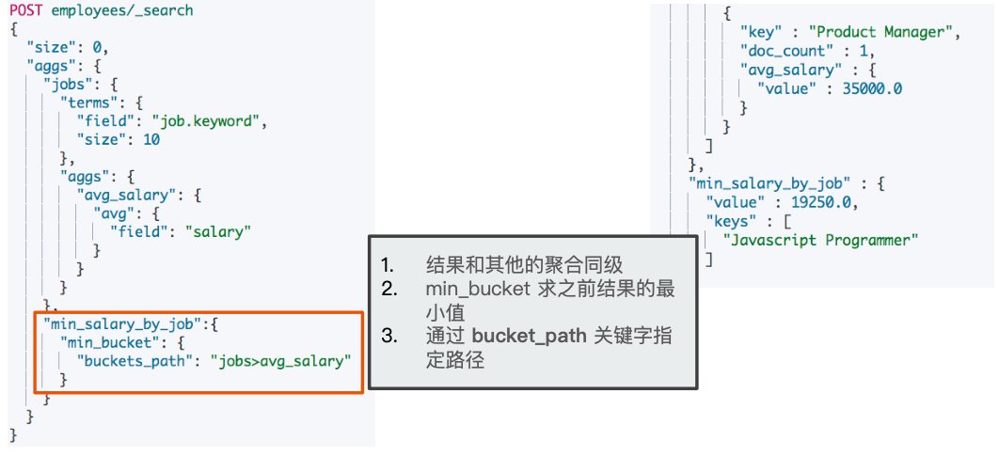
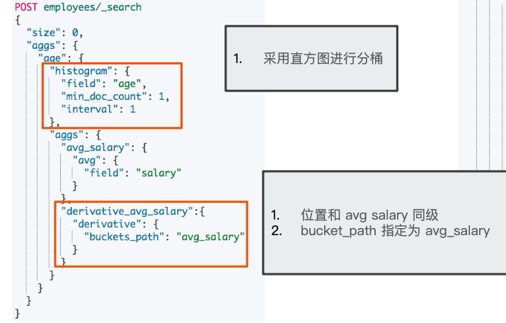

# **第二节 Pipeline 聚合分析**

**Pipeline aggregation——对分组+聚合继续再做分组+聚合。**


## **1、一个例子:`Pipeline:min_bucket`**

* **在员⼯数最多的⼯种里**，找出**平均工资最低的工种**




## **2、Pipeline**

* 管道的概念: ⽀持聚合分析的结果，再次进⾏聚合分析
* Pipeline 的分析结果会输出到原结果中，根据位置的不同，分为两类
	* **Sibling - 结果和现有分析结果同级**
		* Max，min，Avg & Sum Bucket
		* Stats，Extended Status Bucket
		* Percentiles Bucket
	* **Parent - 结果内嵌到现有的聚合分析结果之中**
		* Derivative (求导)
		* Cumultive Sum (累计求和)
		* Moving Function (滑动窗⼝)

## **3、Sibling Pipeline 的例子**

* 对不同类型⼯作的，平均工资

* 求最⼤
* 平均
* 统计信息 
* 百分位数

```
DELETE employees
PUT /employees/_bulk
{ "index" : {  "_id" : "1" } }
{ "name" : "Emma","age":32,"job":"Product Manager","gender":"female","salary":35000 }
{ "index" : {  "_id" : "2" } }
{ "name" : "Underwood","age":41,"job":"Dev Manager","gender":"male","salary": 50000}
{ "index" : {  "_id" : "3" } }
{ "name" : "Tran","age":25,"job":"Web Designer","gender":"male","salary":18000 }
{ "index" : {  "_id" : "4" } }
{ "name" : "Rivera","age":26,"job":"Web Designer","gender":"female","salary": 22000}
{ "index" : {  "_id" : "5" } }
{ "name" : "Rose","age":25,"job":"QA","gender":"female","salary":18000 }
{ "index" : {  "_id" : "6" } }
{ "name" : "Lucy","age":31,"job":"QA","gender":"female","salary": 25000}
{ "index" : {  "_id" : "7" } }
{ "name" : "Byrd","age":27,"job":"QA","gender":"male","salary":20000 }
{ "index" : {  "_id" : "8" } }
{ "name" : "Foster","age":27,"job":"Java Programmer","gender":"male","salary": 20000}
{ "index" : {  "_id" : "9" } }
{ "name" : "Gregory","age":32,"job":"Java Programmer","gender":"male","salary":22000 }
{ "index" : {  "_id" : "10" } }
{ "name" : "Bryant","age":20,"job":"Java Programmer","gender":"male","salary": 9000}
{ "index" : {  "_id" : "11" } }
{ "name" : "Jenny","age":36,"job":"Java Programmer","gender":"female","salary":38000 }
{ "index" : {  "_id" : "12" } }
{ "name" : "Mcdonald","age":31,"job":"Java Programmer","gender":"male","salary": 32000}
{ "index" : {  "_id" : "13" } }
{ "name" : "Jonthna","age":30,"job":"Java Programmer","gender":"female","salary":30000 }
{ "index" : {  "_id" : "14" } }
{ "name" : "Marshall","age":32,"job":"Javascript Programmer","gender":"male","salary": 25000}
{ "index" : {  "_id" : "15" } }
{ "name" : "King","age":33,"job":"Java Programmer","gender":"male","salary":28000 }
{ "index" : {  "_id" : "16" } }
{ "name" : "Mccarthy","age":21,"job":"Javascript Programmer","gender":"male","salary": 16000}
{ "index" : {  "_id" : "17" } }
{ "name" : "Goodwin","age":25,"job":"Javascript Programmer","gender":"male","salary": 16000}
{ "index" : {  "_id" : "18" } }
{ "name" : "Catherine","age":29,"job":"Javascript Programmer","gender":"female","salary": 20000}
{ "index" : {  "_id" : "19" } }
{ "name" : "Boone","age":30,"job":"DBA","gender":"male","salary": 30000}
{ "index" : {  "_id" : "20" } }
{ "name" : "Kathy","age":29,"job":"DBA","gender":"female","salary": 20000}
```

### **3-1 `min_bucket`**

**平均工资最低的工作类型**

```
# 平均工资最低的工作类型
POST employees/_search
{
  "size": 0,
  "aggs": {
    "jobs": {
      "terms": {
        "field": "job.keyword",
        "size": 10
      },
      "aggs": {
        "avg_salary": {
          "avg": {
            "field": "salary"
          }
        }
      }
    },
    "min_salary_by_job":{
      "min_bucket": {
        "buckets_path": "jobs>avg_salary"
      }
    }
  }
}
```

* **`min_bucket`**
* **`jobs>avg_salary`**

**Output**

```
aggregations" : {
    "jobs" : {
      "doc_count_error_upper_bound" : 0,
      "sum_other_doc_count" : 0,
      "buckets" : [
        {
          "key" : "Java Programmer",
          "doc_count" : 7,
          "avg_salary" : {
            "value" : 25571.428571428572
          }
        },
        {
          "key" : "Javascript Programmer",
          "doc_count" : 4,
          "avg_salary" : {
            "value" : 19250.0
          }
        },
        {
          "key" : "QA",
          "doc_count" : 3,
          "avg_salary" : {
            "value" : 21000.0
          }
        },
        {
          "key" : "DBA",
          "doc_count" : 2,
          "avg_salary" : {
            "value" : 25000.0
          }
        },
        {
          "key" : "Web Designer",
          "doc_count" : 2,
          "avg_salary" : {
            "value" : 20000.0
          }
        },
        {
          "key" : "Dev Manager",
          "doc_count" : 1,
          "avg_salary" : {
            "value" : 50000.0
          }
        },
        {
          "key" : "Product Manager",
          "doc_count" : 1,
          "avg_salary" : {
            "value" : 35000.0
          }
        }
      ]
    },
    "min_salary_by_job" : {
      "value" : 19250.0,
      "keys" : [
        "Javascript Programmer"
      ]
    }
  }
```

### **3-2 `max_bucket`**

```
# 平均工资最高的工作类型
POST employees/_search
{
  "size": 0,
  "aggs": {
    "jobs": {
      "terms": {
        "field": "job.keyword",
        "size": 10
      },
      "aggs": {
        "avg_salary": {
          "avg": {
            "field": "salary"
          }
        }
      }
    },
    "max_salary_by_job":{
      "max_bucket": {
        "buckets_path": "jobs>avg_salary"
      }
    }
  }
}
```

***Output :***

```
...
"max_salary_by_job" : {
      "value" : 50000.0,
      "keys" : [
        "Dev Manager"
      ]
    }
  }
```

### **3-3 `stats_bucket`**


```
# 平均工资的统计分析
POST employees/_search
{
  "size": 0,
  "aggs": {
    "jobs": {
      "terms": {
        "field": "job.keyword",
        "size": 10
      },
      "aggs": {
        "avg_salary": {
          "avg": {
            "field": "salary"
          }
        }
      }
    },
    "stats_salary_by_job":{
      "stats_bucket": {
        "buckets_path": "jobs>avg_salary"
      }
    }
  }
}
```

***Output***

```
...
"stats_salary_by_job" : {
      "count" : 7,
      "min" : 19250.0,
      "max" : 50000.0,
      "avg" : 27974.48979591837,
      "sum" : 195821.42857142858
    }
```

### **3-4 `percentiles_bucket`**

```
# 平均工资的百分位数
POST employees/_search
{
  "size": 0,
  "aggs": {
    "jobs": {
      "terms": {
        "field": "job.keyword",
        "size": 10
      },
      "aggs": {
        "avg_salary": {
          "avg": {
            "field": "salary"
          }
        }
      }
    },
    "percentiles_salary_by_job":{
      "percentiles_bucket": {
        "buckets_path": "jobs>avg_salary"
      }
    }
  }
}
```

***Output :***

```
 "percentiles_salary_by_job" : {
      "values" : {
        "1.0" : 19250.0,
        "5.0" : 19250.0,
        "25.0" : 21000.0,
        "50.0" : 25000.0,
        "75.0" : 35000.0,
        "95.0" : 50000.0,
        "99.0" : 50000.0
      }
    }
  }
```

## **4、Parent Pipeline:Derivative**

* 按照年龄，对⼯资进⾏求导(看⼯资发展的趋势)



## **5、Parent Pipeline 的例子**


* 年龄直⽅图划分的平均工资
	*  Cumulative Sum
	* Moving Function

### **5-1 derivative**

```
#按照年龄对平均工资求导
POST employees/_search
{
  "size": 0,
  "aggs": {
    "age": {
      "histogram": {
        "field": "age",
        "min_doc_count": 0,
        "interval": 1
      },
      "aggs": {
        "avg_salary": {
          "avg": {
            "field": "salary"
          }
        },
        "derivative_avg_salary":{
          "derivative": {
            "buckets_path": "avg_salary"
          }
        }
      }
    }
  }
}
```	

***Output***

```
"aggregations" : {
    "age" : {
      "buckets" : [
        {
          "key" : 20.0,
          "doc_count" : 1,
          "avg_salary" : {
            "value" : 9000.0
          }
        },
        {
          "key" : 21.0,
          "doc_count" : 1,
          "avg_salary" : {
            "value" : 16000.0
          },
          "derivative_avg_salary" : {
            "value" : 7000.0
          }
        },
 ...
```

### **5-2 `Cumulative_sum`** 

```
#Cumulative_sum
POST employees/_search
{
  "size": 0,
  "aggs": {
    "age": {
      "histogram": {
        "field": "age",
        "min_doc_count": 0,
        "interval": 1
      },
      "aggs": {
        "avg_salary": {
          "avg": {
            "field": "salary"
          }
        },
        "cumulative_salary":{
          "cumulative_sum": {
            "buckets_path": "avg_salary"
          }
        }
      }
    }
  }
}
```

**Output :**

```
  "aggregations" : {
    "age" : {
      "buckets" : [
        {
          "key" : 20.0,
          "doc_count" : 1,
          "avg_salary" : {
            "value" : 9000.0
          },
          "cumulative_salary" : {
            "value" : 9000.0
          }
        },
        {
          "key" : 21.0,
          "doc_count" : 1,
          "avg_salary" : {
            "value" : 16000.0
          },
          "cumulative_salary" : {
            "value" : 25000.0
          }
        },
        {
          "key" : 22.0,
          "doc_count" : 0,
          "avg_salary" : {
            "value" : null
          },
          "cumulative_salary" : {
            "value" : 25000.0
          }
        },
        ...
```

### **5-3 `moving_fn`**

`Moving Function`也是一个`Parent Pipeline Agg`。它表示对于一个一定顺序的集合，维护一个窗口大小 N（当前 Bucket 往前的 N 个Buckets，支持用户自定义，默认不确定，待看，这里指定了是10），然后对这 N 个 Buckets 进行一个 Function 求解（默认值不确定，待看，支持用户自定义，这里我们定义了一个"script"类型的 Function："MovingFunctions.min(values)" ：表示对 `"avg_salary"`的结果"value"求最小值，也就是求窗口之内的 Bucket 的 Metric 最小值）。


```
#Moving Function
POST employees/_search
{
  "size": 0,
  "aggs": {
    "age": {
      "histogram": {
        "field": "age",
        "min_doc_count": 0,
        "interval": 1
      },
      "aggs": {
        "avg_salary": {
          "avg": {
            "field": "salary"
          }
        },
        "moving_avg_salary":{
          "moving_fn": {
            "buckets_path": "avg_salary",
            "window":10,
            "script": "MovingFunctions.min(values)"
          }
        }
      }
    }
  }
}
```

***Ourtput***

```
"aggregations" : {
    "age" : {
      "buckets" : [
        {
          "key" : 20.0,
          "doc_count" : 1,
          "avg_salary" : {
            "value" : 9000.0
          },
          "moving_avg_salary" : {
            "value" : null
          }
        },
        {
          "key" : 21.0,
          "doc_count" : 1,
          "avg_salary" : {
            "value" : 16000.0
          },
          "moving_avg_salary" : {
            "value" : 9000.0
          }
        },
        {
          "key" : 22.0,
          "doc_count" : 0,
          "avg_salary" : {
            "value" : null
          }
        },
        ...
        "moving_avg_salary" : {
            "value" : 16000.0
          }
```