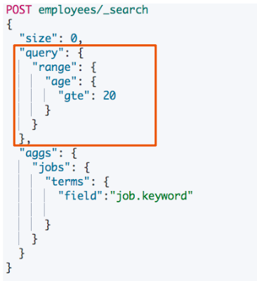
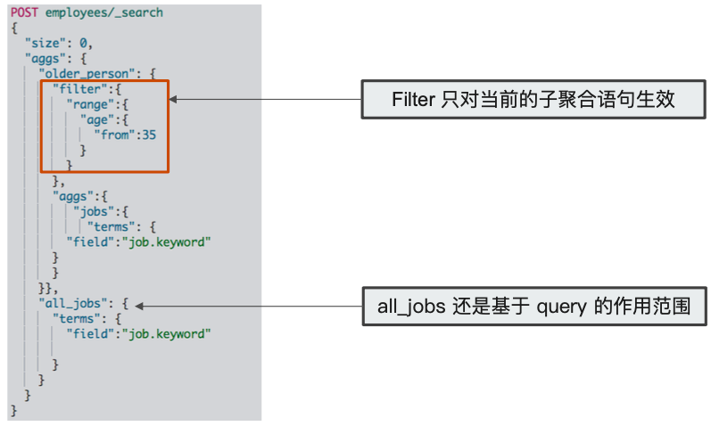
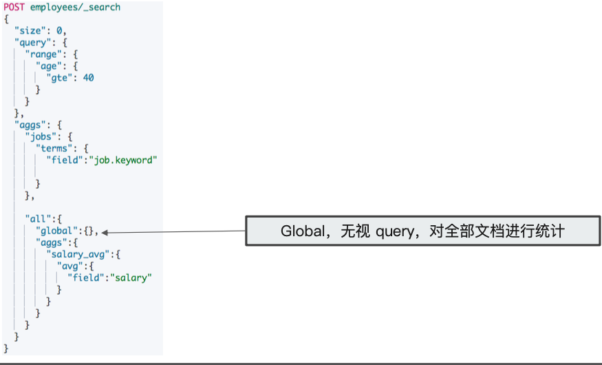
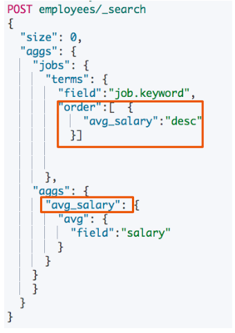

# **第三节 聚合的作⽤用范围及排序**

## **1、聚合的作⽤范围**

* ES 聚合分析的默认作⽤范围是 query 的查询结果集
* 同时 ES 还⽀持以下⽅式改变聚合的作⽤范围
	* Filter
	* `Post_Filter`
	* Global


* `global`的作用是覆盖掉query的查询作用



```
DELETE /employees

PUT /employees/
{
  "mappings" : {
      "properties" : {
        "age" : {
          "type" : "integer"
        },
        "gender" : {
          "type" : "keyword"
        },
        "job" : {
          "type" : "text",
          "fields" : {
            "keyword" : {
              "type" : "keyword",
              "ignore_above" : 50
            }
          }
        },
        "name" : {
          "type" : "keyword"
        },
        "salary" : {
          "type" : "integer"
        }
      }
    }
}
```

```
PUT /employees/_bulk
{ "index" : {  "_id" : "1" } }
{ "name" : "Emma","age":32,"job":"Product Manager","gender":"female","salary":35000 }
{ "index" : {  "_id" : "2" } }
{ "name" : "Underwood","age":41,"job":"Dev Manager","gender":"male","salary": 50000}
{ "index" : {  "_id" : "3" } }
{ "name" : "Tran","age":25,"job":"Web Designer","gender":"male","salary":18000 }
{ "index" : {  "_id" : "4" } }
{ "name" : "Rivera","age":26,"job":"Web Designer","gender":"female","salary": 22000}
{ "index" : {  "_id" : "5" } }
{ "name" : "Rose","age":25,"job":"QA","gender":"female","salary":18000 }
{ "index" : {  "_id" : "6" } }
{ "name" : "Lucy","age":31,"job":"QA","gender":"female","salary": 25000}
{ "index" : {  "_id" : "7" } }
{ "name" : "Byrd","age":27,"job":"QA","gender":"male","salary":20000 }
{ "index" : {  "_id" : "8" } }
{ "name" : "Foster","age":27,"job":"Java Programmer","gender":"male","salary": 20000}
{ "index" : {  "_id" : "9" } }
{ "name" : "Gregory","age":32,"job":"Java Programmer","gender":"male","salary":22000 }
{ "index" : {  "_id" : "10" } }
{ "name" : "Bryant","age":20,"job":"Java Programmer","gender":"male","salary": 9000}
{ "index" : {  "_id" : "11" } }
{ "name" : "Jenny","age":36,"job":"Java Programmer","gender":"female","salary":38000 }
{ "index" : {  "_id" : "12" } }
{ "name" : "Mcdonald","age":31,"job":"Java Programmer","gender":"male","salary": 32000}
{ "index" : {  "_id" : "13" } }
{ "name" : "Jonthna","age":30,"job":"Java Programmer","gender":"female","salary":30000 }
{ "index" : {  "_id" : "14" } }
{ "name" : "Marshall","age":32,"job":"Javascript Programmer","gender":"male","salary": 25000}
{ "index" : {  "_id" : "15" } }
{ "name" : "King","age":33,"job":"Java Programmer","gender":"male","salary":28000 }
{ "index" : {  "_id" : "16" } }
{ "name" : "Mccarthy","age":21,"job":"Javascript Programmer","gender":"male","salary": 16000}
{ "index" : {  "_id" : "17" } }
{ "name" : "Goodwin","age":25,"job":"Javascript Programmer","gender":"male","salary": 16000}
{ "index" : {  "_id" : "18" } }
{ "name" : "Catherine","age":29,"job":"Javascript Programmer","gender":"female","salary": 20000}
{ "index" : {  "_id" : "19" } }
{ "name" : "Boone","age":30,"job":"DBA","gender":"male","salary": 30000}
{ "index" : {  "_id" : "20" } }
{ "name" : "Kathy","age":29,"job":"DBA","gender":"female","salary": 20000}
```

```
# Query
POST employees/_search
{
  "size": 0,
  "query": {
    "range": {
      "age": {
        "gte": 20
      }
    }
  },
  "aggs": {
    "jobs": {
      "terms": {
        "field":"job.keyword"
        
      }
    }
  }
}
```

***Output:***

```
aggregations" : {
    "jobs" : {
      "doc_count_error_upper_bound" : 0,
      "sum_other_doc_count" : 0,
      "buckets" : [
        {
          "key" : "Java Programmer",
          "doc_count" : 7
        },
        {
          "key" : "Javascript Programmer",
          "doc_count" : 4
        },
        {
          "key" : "QA",
          "doc_count" : 3
        },
        {
          "key" : "DBA",
          "doc_count" : 2
        },
...
```


### **1-1 Filter** 

`query`和`filter`，**是先选定数据范围，在聚合桶**；



```
#Filter
POST employees/_search
{
  "size": 0,
  "aggs": {
    "older_person": {
      "filter":{
        "range":{
          "age":{
            "from":35
          }
        }
      },
      "aggs":{
         "jobs":{
           "terms": {
        "field":"job.keyword"
      }
      }
    }},
    "all_jobs": {
      "terms": {
        "field":"job.keyword"
        
      }
    }
  }
}
```

***Output :***

```
 "aggregations" : {
    "older_person" : {
      "doc_count" : 2,
      "jobs" : {
        "doc_count_error_upper_bound" : 0,
        "sum_other_doc_count" : 0,
        "buckets" : [
          {
            "key" : "Dev Manager",
            "doc_count" : 1
          },
          {
            "key" : "Java Programmer",
            "doc_count" : 1
          }
        ]
      }
    },
    },
    "all_jobs" : {
      "doc_count_error_upper_bound" : 0,
      "sum_other_doc_count" : 0,
      "buckets" : [
        {
          "key" : "Java Programmer",
          "doc_count" : 7
        },
        {
          "key" : "Javascript Programmer",
          "doc_count" : 4
        },
        {
          "key" : "QA",
          "doc_count" : 3
        },
       ... 
```

### **1-2 `Post_Filter`**


* **是对聚合分析后的⽂档进⾏再次过滤**
* Size ⽆需设置为 0
* 使⽤场景
	* **一条语句，获取聚合信息 + 获取符合条件的文档**

`post_filter`对聚合桶没影响，桶是全部返回，只对查询结果进行过滤返回

```
#Post field. 一条语句，找出所有的job类型。还能找到聚合后符合条件的结果
POST employees/_search
{
  "aggs": {
    "jobs": {
      "terms": {
        "field": "job.keyword"
      }
    }
  },
  "post_filter": {
    "match": {
      "job.keyword": "Dev Manager"
    }
  }
}
```

***Output :***

```
"hits" : [
      {
        "_index" : "employees",
        "_type" : "_doc",
        "_id" : "2",
        "_score" : 1.0,
        "_source" : {
          "name" : "Underwood",
          "age" : 41,
          "job" : "Dev Manager",
          "gender" : "male",
          "salary" : 50000
        }
      }
    ]
  },
  "aggregations" : {
    "jobs" : {
      "doc_count_error_upper_bound" : 0,
      "sum_other_doc_count" : 0,
      "buckets" : [
        {
          "key" : "Java Programmer",
          "doc_count" : 7
        },
        {
          "key" : "Javascript Programmer",
          "doc_count" : 4
        },
        {
          "key" : "QA",
          "doc_count" : 3
        },
        ...

```


```
#global
POST employees/_search
{
  "size": 0,
  "query": {
    "range": {
      "age": {
        "gte": 40
      }
    }
  },
  "aggs": {
    "jobs": {
      "terms": {
        "field":"job.keyword"
        
      }
    },
    
    "all":{
      "global":{},
      "aggs":{
        "salary_avg":{
          "avg":{
            "field":"salary"
          }
        }
      }
    }
  }
}
```

### **1-3 `global`**

**`global`的作用是覆盖掉`query`的查询作用**



```
#global
POST employees/_search
{
  "size": 0,
  "query": {
    "range": {
      "age": {
        "gte": 40
      }
    }
  },
  "aggs": {
    "jobs": {
      "terms": {
        "field":"job.keyword"
        
      }
    },
    
    "all":{
      "global":{},
      "aggs":{
        "salary_avg":{
          "avg":{
            "field":"salary"
          }
        }
      }
    }
  }
}
```

***Output :***

```
"hits" : {
    "total" : {
      "value" : 1,
      "relation" : "eq"
    },
    "max_score" : null,
    "hits" : [ ]
  },
  "aggregations" : {
    "all" : {
      "doc_count" : 20,
      "salary_avg" : {
        "value" : 24700.0
      }
    },
    "jobs" : {
      "doc_count_error_upper_bound" : 0,
      "sum_other_doc_count" : 0,
      "buckets" : [
        {
          "key" : "Dev Manager",
          "doc_count" : 1
        }
      ]
    }
  }
```

## **2、排序**

* 指定 order， 按照 count 和 key 进⾏排序
	* 默认情况，按照 count 降序排序
	* 指定 size，就能返回相应的桶

```
#排序 order
#count and key
POST employees/_search
{
  "size": 0,
  "query": {
    "range": {
      "age": {
        "gte": 20
      }
    }
  },
  "aggs": {
    "jobs": {
      "terms": {
        "field":"job.keyword",
        "order":[
          {"_count":"asc"},
          {"_key":"desc"}
          ]
        
      }
    }
  }
}
```

* `_count`: asc
* 如果`_count`一致，`_key` : desc 

```
#排序 order
#count and key
POST employees/_search
{
  "size": 0,
  "aggs": {
    "jobs": {
      "terms": {
        "field":"job.keyword",
        "order":[  {
            "avg_salary":"desc"
          }]
        
        
      },
    "aggs": {
      "avg_salary": {
        "avg": {
          "field":"salary"
        }
      }
    }
    }
  }
}
```

***Output :***

```
 "aggregations" : {
    "jobs" : {
      "doc_count_error_upper_bound" : 0,
      "sum_other_doc_count" : 0,
      "buckets" : [
        {
          "key" : "Dev Manager",
          "doc_count" : 1,
          "avg_salary" : {
            "value" : 50000.0
          }
        },
        {
          "key" : "Product Manager",
          "doc_count" : 1,
          "avg_salary" : {
            "value" : 35000.0
          }
        },
        {
          "key" : "Java Programmer",
          "doc_count" : 7,
          "avg_salary" : {
            "value" : 25571.428571428572
          }
        },
        {
          "key" : "DBA",
          "doc_count" : 2,
          "avg_salary" : {
            "value" : 25000.0
          }
        },
        {
          "key" : "QA",
          "doc_count" : 3,
          "avg_salary" : {
            "value" : 21000.0
          }
        },
        {
          "key" : "Web Designer",
          "doc_count" : 2,
          "avg_salary" : {
            "value" : 20000.0
          }
        },
        {
          "key" : "Javascript Programmer",
          "doc_count" : 4,
          "avg_salary" : {
            "value" : 19250.0
          }
        }
      ]
    }
```

## **2-1 基于⼦聚合的值排序**

* 基于子聚合的数值进⾏排序
* 使⽤⼦聚合，Aggregation name



```
#排序 order
#count and key
POST employees/_search
{
  "size": 0,
  "aggs": {
    "jobs": {
      "terms": {
        "field":"job.keyword",
        "order":[  {
            "stats_salary.min":"desc"
          }]
        
        
      },
    "aggs": {
      "stats_salary": {
        "stats": {
          "field":"salary"
        }
      }
    }
    }
  }
}
```

***Output :***

```
"aggregations" : {
    "jobs" : {
      "doc_count_error_upper_bound" : 0,
      "sum_other_doc_count" : 0,
      "buckets" : [
        {
          "key" : "Dev Manager",
          "doc_count" : 1,
          "stats_salary" : {
            "count" : 1,
            "min" : 50000.0,
            "max" : 50000.0,
            "avg" : 50000.0,
            "sum" : 50000.0
          }
        },
        {
          "key" : "Product Manager",
          "doc_count" : 1,
          "stats_salary" : {
            "count" : 1,
            "min" : 35000.0,
            "max" : 35000.0,
            "avg" : 35000.0,
            "sum" : 35000.0
          }
        },
        {
          "key" : "DBA",
          "doc_count" : 2,
          "stats_salary" : {
            "count" : 2,
            "min" : 20000.0,
            "max" : 30000.0,
            "avg" : 25000.0,
            "sum" : 50000.0
          }
        },
        {
          "key" : "QA",
          "doc_count" : 3,
          "stats_salary" : {
            "count" : 3,
            "min" : 18000.0,
            "max" : 25000.0,
            "avg" : 21000.0,
            "sum" : 63000.0
          }
        },
        {
          "key" : "Web Designer",
          "doc_count" : 2,
          "stats_salary" : {
            "count" : 2,
            "min" : 18000.0,
            "max" : 22000.0,
            "avg" : 20000.0,
            "sum" : 40000.0
          }
        },
        {
          "key" : "Javascript Programmer",
          "doc_count" : 4,
          "stats_salary" : {
            "count" : 4,
            "min" : 16000.0,
            "max" : 25000.0,
            "avg" : 19250.0,
            "sum" : 77000.0
          }
        },
        {
          "key" : "Java Programmer",
          "doc_count" : 7,
          "stats_salary" : {
            "count" : 7,
            "min" : 9000.0,
            "max" : 38000.0,
            "avg" : 25571.428571428572,
            "sum" : 179000.0
          }
        }
      ]
    }
  }
```