# **第四节 聚合的精准度问题**

## **1、分布式系统的近似统计算法**

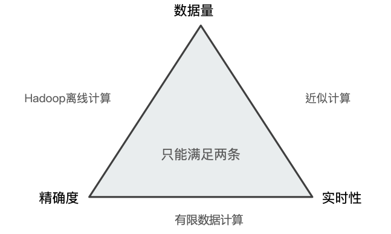

## **2、Min 聚合分析的执⾏流程**

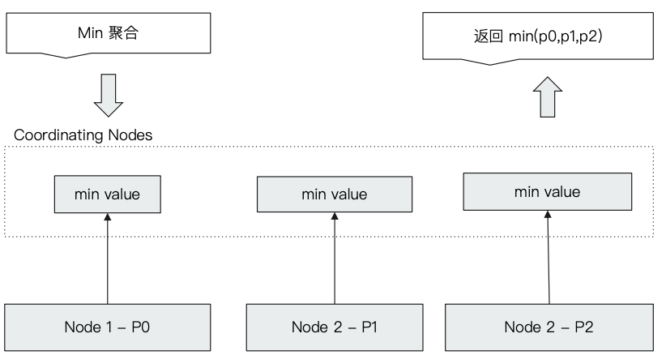

## **3、Terms Aggregation 的返回值**

* 在 Terms Aggregation 的返回中有两个特殊的数值
	* `doc_count_error_upper_bound` : **被遗漏的 `term` 分桶，包含的⽂档，有可能的最⼤值**
	* `sum_other_doc_count`: **除了返回结果 bucket 的 terms 以外，其他 terms 的⽂档总数(总 数-返回的总数)**

## **4、Terms 聚合分析的执⾏流程**

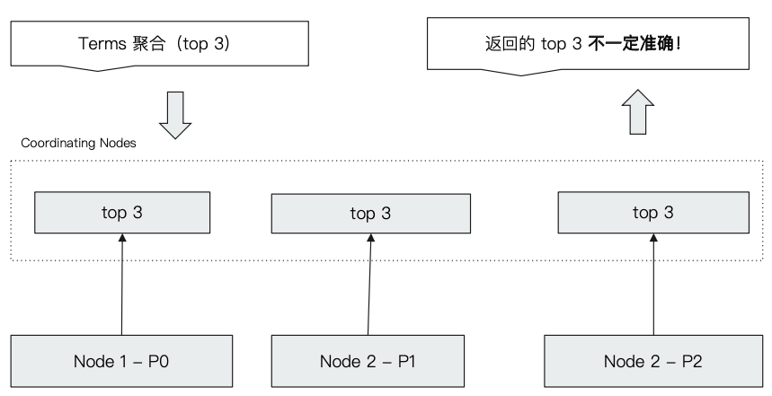

## **5、Terms 不正确的案例**

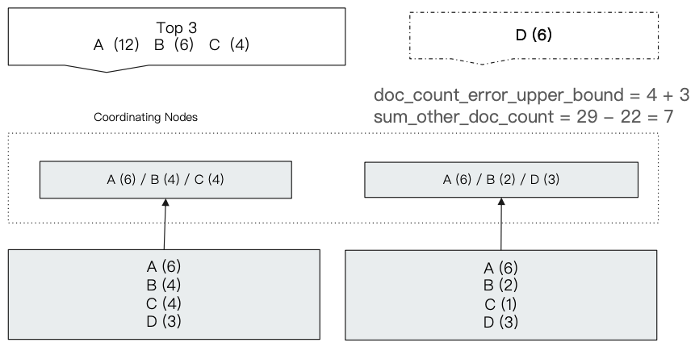

* `sum_other_doc_count` = 29 - (12+6+3) = 7


## **6、 如何解决 Terms 不准的问题:提升 `shard_size` 的参数**


* Terms 聚合分析不准的原因，数据分散在多个分片上， `Coordinating Node` ⽆法获取数据全
*  **解决⽅案 1:当数据量不大时，设置 Primary Shard 为 1; 实现准确性**
* **方案 2:在分布式数据上，设置 `shard_size` 参 数，提⾼精确度**
	* **原理:每次从 Shard 上额外多获取数据，提升准确率**

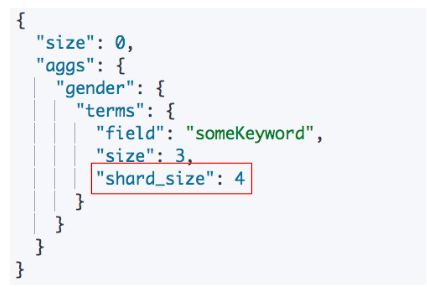

## 7、**打开 `show_term_doc_count_error`**

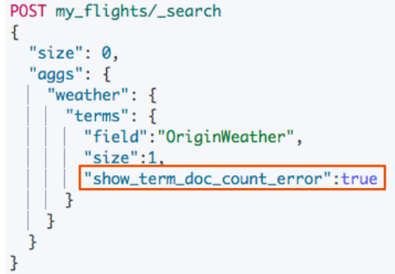

## 8、**`shard_size` 设定**

* 调整 `shard size` ⼤小，降低 `doc_count_error_upper_bound` 来提升准确度 
	* **增加整体计算量量，提⾼了准确度，但会降低相应时间**
* Shard Size 默认⼤小设定
	* **`shard size = size *1.5 +10`**
	* https://www.elastic.co/guide/en/elasticsearch/reference/7.1/search-aggregations-bucket-terms-aggregation.html#search-aggregations-bucket-terms-aggregation-approximate-counts


```
DELETE my_flights
PUT my_flights
{
  "settings": {
    "number_of_shards": 20
  },
  "mappings" : {
      "properties" : {
        "AvgTicketPrice" : {
          "type" : "float"
        },
        "Cancelled" : {
          "type" : "boolean"
        },
        "Carrier" : {
          "type" : "keyword"
        },
        "Dest" : {
          "type" : "keyword"
        },
        "DestAirportID" : {
          "type" : "keyword"
        },
        "DestCityName" : {
          "type" : "keyword"
        },
        "DestCountry" : {
          "type" : "keyword"
        },
        "DestLocation" : {
          "type" : "geo_point"
        },
        "DestRegion" : {
          "type" : "keyword"
        },
        "DestWeather" : {
          "type" : "keyword"
        },
        "DistanceKilometers" : {
          "type" : "float"
        },
        "DistanceMiles" : {
          "type" : "float"
        },
        "FlightDelay" : {
          "type" : "boolean"
        },
        "FlightDelayMin" : {
          "type" : "integer"
        },
        "FlightDelayType" : {
          "type" : "keyword"
        },
        "FlightNum" : {
          "type" : "keyword"
        },
        "FlightTimeHour" : {
          "type" : "keyword"
        },
        "FlightTimeMin" : {
          "type" : "float"
        },
        "Origin" : {
          "type" : "keyword"
        },
        "OriginAirportID" : {
          "type" : "keyword"
        },
        "OriginCityName" : {
          "type" : "keyword"
        },
        "OriginCountry" : {
          "type" : "keyword"
        },
        "OriginLocation" : {
          "type" : "geo_point"
        },
        "OriginRegion" : {
          "type" : "keyword"
        },
        "OriginWeather" : {
          "type" : "keyword"
        },
        "dayOfWeek" : {
          "type" : "integer"
        },
        "timestamp" : {
          "type" : "date"
        }
      }
    }
}
```

***Output :***

```
{
  "acknowledged" : true,
  "shards_acknowledged" : true,
  "index" : "my_flights"
}
```

### **8-1 将`kibana_sample_data_flights` 数据导入`my_flights`**

```
POST _reindex
{
  "source": {
    "index": "kibana_sample_data_flights"
  },
  "dest": {
    "index": "my_flights"
  }
}
```

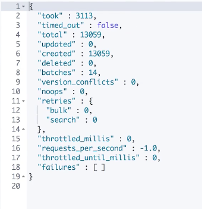

```
GET kibana_sample_data_flights/_count
```

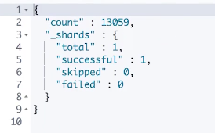

Only one shard for `kibana_sample_data_flights`

```
GET my_flights/_count
```

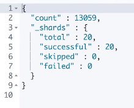

20 shards for `my_flights`

```
GET kibana_sample_data_flights/_search

POST kibana_sample_data_flights/_search
{
  "size": 0,
  "aggs": {
    "weather": {
      "terms": {
        "field":"OriginWeather",
        "size":1,
        "shard_size":1,
        "show_term_doc_count_error":true
      }
    }
  }
}
```

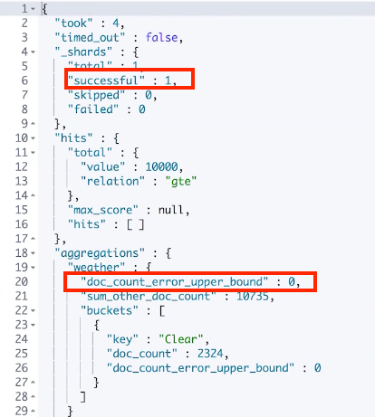


`doc_count_error_upper_bound = 0`

**因为从ES7开始，默认的primary shard 为一，所以不会出现 Terms 不准的问题**

### **8-2 调整 shard size ⼤小**


**提高 shard size ⼤小，降低 `doc_count_error_upper_bound` 来提升准确度**

**`"shard_size":1`**

```
GET my_flights/_search
{
  "size": 0,
  "aggs": {
    "weather": {
      "terms": {
        "field":"OriginWeather",
        "size":1,
        "shard_size":1,
        "show_term_doc_count_error":true
      }
    }
  }
}
```
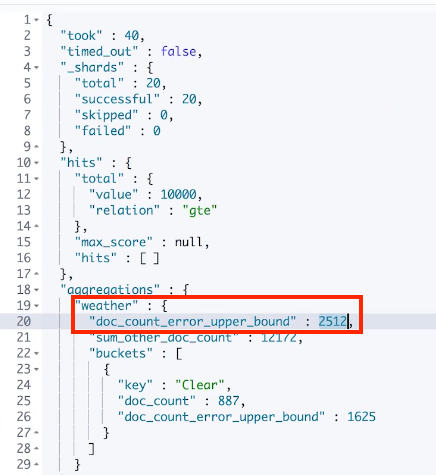


**` "shard_size":10`**

```
GET my_flights/_search
{
  "size": 0,
  "aggs": {
    "weather": {
      "terms": {
        "field":"OriginWeather",
        "size":1,
        "shard_size":10,
        "show_term_doc_count_error":true
      }
    }
  }
}
```
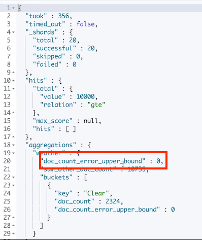

`doc_count_error_upper_bound = 0` 完全正确

## **9、本节总结**


### **9-1 size和`shard_size`的区别？**

* size是最终返回多少个buckt的数量。
* **`shard_size`是每个bucket在一个`shard`上取回的`bucket`的总数。** 然后，每个`shard`上的结果，会在`coordinate`节点上在做一次汇总，返回总数。

### **9-2 `doc_count_error_upper_bound`**

* 被遗漏的term分桶里面包含的文档有可能的最大值——千万注意“可能的最大值”！
* 文中的例子 4+3 没毛病，因为取回的三个的最小的桶里面是4个。所以遗漏的最大的可能数值是4。注意是“可能最大”而不是“实际最大值”。

### **9-3 关于coordinate的注意事项？**

* 任何节点都具备coordinate的能力，也就是说你无法配置一个节点，不具备coordinate的角色。
* 但是你可以配置只负责coordinate的节点。数据存储，都保存在数据节点上。一个节点如果是数据节点，则必然具备存储数据的能力，而ES中任何节点都天生具备路由的能力。


