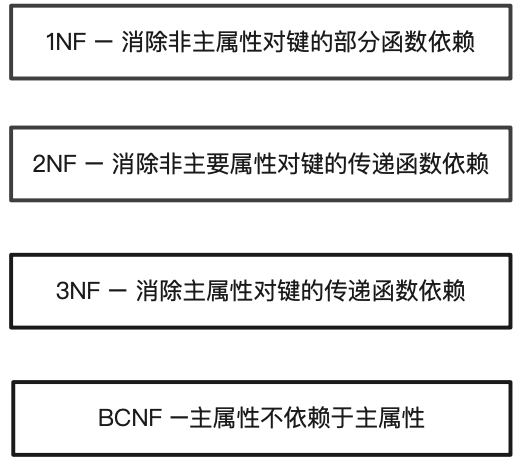
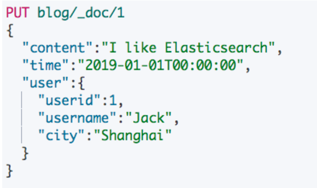
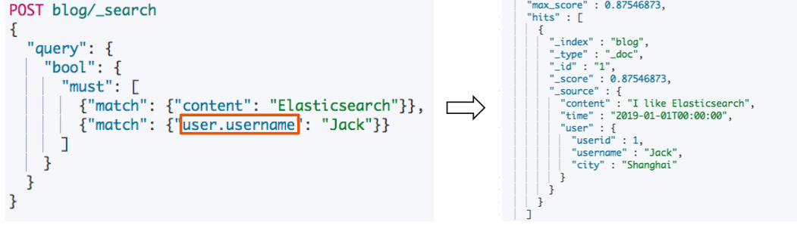
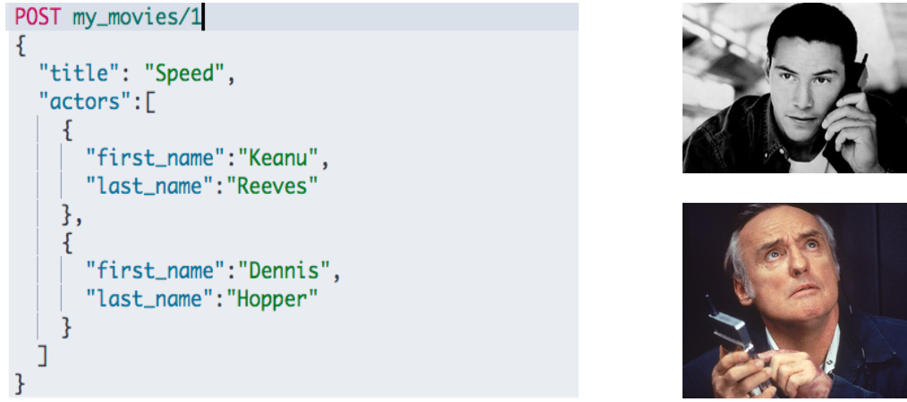
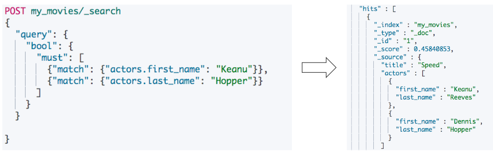
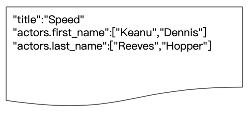
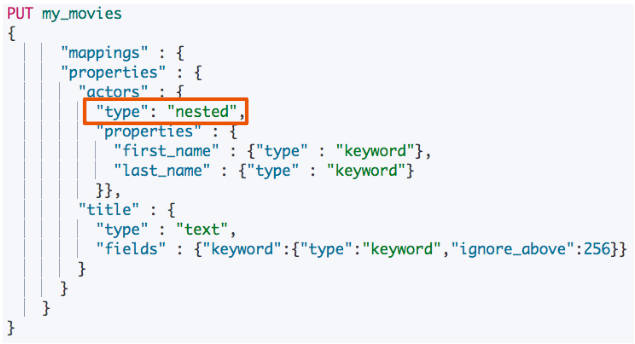
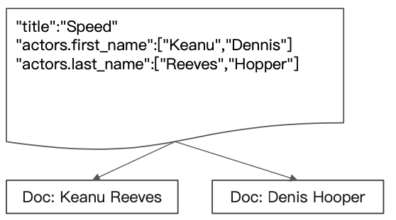

# **第一节 对象及 Nested 对象**

## **1、数据的关联关系**

* **真实世界中有很多重要的关联关系**
	* 博客/作者/评论
	* 银行账户有多次交易记录
	* 客户有多个银⾏账户
	* ⽬录文件有多个⽂件和⼦目录

## **2、关系型数据库的范式化设计**



* **范式化设计(Normalization)的主要⽬标是“减少不必要的更新”**
* 副作⽤: ⼀个完全范式化设计的数据库会经常面临 “查询缓慢”的问题
	*  **数据库越范式化，就需要 Join 越多的表**
*  范式化节省了存储空间，但是存储空间却越来越便宜
*  范式化简化了更新，但是数据“读”取操作可能更多


## **3、Denormalization**

* **反范式化设计**
	* **数据 “Flattening”，不使⽤关联关系，⽽是在⽂档中保存冗余的数据拷⻉**
* 优点: **无需处理 Joins 操作，数据读取性能好**
	* Elasticsearch 通过压缩 `_source` 字段，减少磁盘空间的开销
* 缺点:**不适合在数据频繁修改的场景**
	* **一条数据(⽤户名)的改动，可能会引起很多数据的更新**

## **4、在 Elasticsearch 中处理关联关系**

* **关系型数据库，⼀般会考虑 Normalize 数据; 在 Elasticsearch，往往考虑 Denormalize 数据**
	* **Denormalize 的好处:	读的速度变快 / ⽆需表连接 / ⽆需行锁**
* Elasticsearch 并不擅⻓处理关联关系。我们⼀般采用以下四种⽅法处理关联
	* 对象类型
	* 嵌套对象(Nested Object)
	* ⽗子关联关系(Parent / Child )
	* 应⽤端关联


### **4-1 案例 1:博客和其作者信息**



* **对象类型**
	* 在每⼀博客的⽂档中都保留作者的信息
	* 如果作者信息发⽣变化，需要修改相关的博客文档

```
DELETE blog
# 设置blog的 Mapping
PUT /blog
{
  "mappings": {
    "properties": {
      "content": {
        "type": "text"
      },
      "time": {
        "type": "date"
      },
      "user": {
        "properties": {
          "city": {
            "type": "text"
          },
          "userid": {
            "type": "long"
          },
          "username": {
            "type": "keyword"
          }
        }
      }
    }
  }
}
```

```
# 插入一条 Blog 信息
PUT blog/_doc/1
{
  "content":"I like Elasticsearch",
  "time":"2019-01-01T00:00:00",
  "user":{
    "userid":1,
    "username":"Jack",
    "city":"Shanghai"
  }
}
```

```
# 查询 Blog 信息
POST blog/_search
{
  "query": {
    "bool": {
      "must": [
        {"match": {"content": "Elasticsearch"}},
        {"match": {"user.username": "Jack"}}
      ]
    }
  }
}
```

***Output:***

```
"hits" : {
    "total" : {
      "value" : 1,
      "relation" : "eq"
    },
    "max_score" : 0.36464313,
    "hits" : [
      {
        "_index" : "blog",
        "_type" : "_doc",
        "_id" : "1",
        "_score" : 0.36464313,
        "_source" : {
          "content" : "I like Elasticsearch",
          "time" : "2019-01-01T00:00:00",
          "user" : {
            "userid" : 1,
            "username" : "Jack",
            "city" : "Shanghai"
          }
        }
      }
    ]
  }
```
 
* **通过⼀条查询即可获取到博客和作者信息**



### **4-2 案例 2:包含对象数组的⽂档**



```
DELETE my_movies

# 电影的Mapping信息
PUT my_movies
{
      "mappings" : {
      "properties" : {
        "actors" : {
          "properties" : {
            "first_name" : {
              "type" : "keyword"
            },
            "last_name" : {
              "type" : "keyword"
            }
          }
        },
        "title" : {
          "type" : "text",
          "fields" : {
            "keyword" : {
              "type" : "keyword",
              "ignore_above" : 256
            }
          }
        }
      }
    }
}
```

***Output:***

```
{
  "acknowledged" : true,
  "shards_acknowledged" : true,
  "index" : "my_movies"
}
```

```
# 写入一条电影信息
POST my_movies/_doc/1
{
  "title":"Speed",
  "actors":[
    {
      "first_name":"Keanu",
      "last_name":"Reeves"
    },

    {
      "first_name":"Dennis",
      "last_name":"Hopper"
    }

  ]
}
```



```
# 查询电影信息
POST my_movies/_search
{
  "query": {
    "bool": {
      "must": [
        {"match": {"actors.first_name": "Keanu"}},
        {"match": {"actors.last_name": "Hopper"}}
      ]
    }
  }

}
```

***Output:***

```
"max_score" : 0.723315,
    "hits" : [
      {
        "_index" : "my_movies",
        "_type" : "_doc",
        "_id" : "1",
        "_score" : 0.723315,
        "_source" : {
          "title" : "Speed",
          "actors" : [
            {
              "first_name" : "Keanu",
              "last_name" : "Reeves"
            },
            {
              "first_name" : "Dennis",
              "last_name" : "Hopper"
            }
          ]
        }
      }
    ]
```

## **5、为什么会搜到不需要的结果?**

* 存储时，内部对象的边界并没有考虑在内，JSON 格式被处理理成扁平式键值对的结构 
* 当对多个字段进⾏查询时，导致了意外的搜索结果
* **可以⽤ Nested Data Type 解决这个问题**



## **6、什么是 Nested Data Type**

* **Nested 数据类型: 允许对象数组中的对象被独立索引**
* **使⽤ nested 和 properties 关键字，将所有 actors 索引到多个分隔的⽂档**
* 在内部， Nested ⽂档会被保存在两个 Lucene ⽂档中，在查询时做 Join 处理




```
DELETE my_movies
# 创建 Nested 对象 Mapping
PUT my_movies
{
      "mappings" : {
      "properties" : {
        "actors" : {
          "type": "nested",
          "properties" : {
            "first_name" : {"type" : "keyword"},
            "last_name" : {"type" : "keyword"}
          }},
        "title" : {
          "type" : "text",
          "fields" : {"keyword":{"type":"keyword","ignore_above":256}}
        }
      }
    }
}
```

```
POST my_movies/_doc/1
{
  "title":"Speed",
  "actors":[
    {
      "first_name":"Keanu",
      "last_name":"Reeves"
    },

    {
      "first_name":"Dennis",
      "last_name":"Hopper"
    }

  ]
}
```

***Output:***

```
{
  "_index" : "my_movies",
  "_type" : "_doc",
  "_id" : "1",
  "_version" : 1,
  "result" : "created",
  "_shards" : {
    "total" : 2,
    "successful" : 2,
    "failed" : 0
  },
  "_seq_no" : 0,
  "_primary_term" : 1
}
```

## **7、嵌套查询**

在内部， Nested ⽂档会被保存在两个 Lucene ⽂文档中，会在查询时做 Join 处理




```
# Nested 查询
POST my_movies/_search
{
  "query": {
    "bool": {
      "must": [
        {"match": {"title": "Speed"}},
        {
          "nested": {
            "path": "actors",
            "query": {
              "bool": {
                "must": [
                  {"match": {
                    "actors.first_name": "Keanu"
                  }},

                  {"match": {
                    "actors.last_name": "Hopper"
                  }}
                ]
              }
            }
          }
        }
      ]
    }
  }
}
```

***Output: The name does not exist***

```
{
  "took" : 261,
  "timed_out" : false,
  "_shards" : {
    "total" : 1,
    "successful" : 1,
    "skipped" : 0,
    "failed" : 0
  },
  "hits" : {
    "total" : {
      "value" : 0,
      "relation" : "eq"
    },
    "max_score" : null,
    "hits" : [ ]
  }
}
```

## **8、嵌套聚合Nested Aggregation**

```
# Nested Aggregation
POST my_movies/_search
{
  "size": 0,
  "aggs": {
    "actors": {
      "nested": {
        "path": "actors"
      },
      "aggs": {
        "actor_name": {
          "terms": {
            "field": "actors.first_name",
            "size": 10
          }
        }
      }
    }
  }
}
```

***Output***

```
 "aggregations" : {
    "actors" : {
      "doc_count" : 2,
      "actor_name" : {
        "doc_count_error_upper_bound" : 0,
        "sum_other_doc_count" : 0,
        "buckets" : [
          {
            "key" : "Dennis",
            "doc_count" : 1
          },
          {
            "key" : "Keanu",
            "doc_count" : 1
          }
        ]
      }
    }
  }
```

**普通 aggregation不工作**

```
# 普通 aggregation不工作
POST my_movies/_search
{
  "size": 0,
  "aggs": {
    "NAME": {
      "terms": {
        "field": "actors.first_name",
        "size": 10
      }
    }
  }
}
```

***Output***

```
{
  "took" : 1,
  "timed_out" : false,
  "_shards" : {
    "total" : 1,
    "successful" : 1,
    "skipped" : 0,
    "failed" : 0
  },
  "hits" : {
    "total" : {
      "value" : 1,
      "relation" : "eq"
    },
    "max_score" : null,
    "hits" : [ ]
  },
  "aggregations" : {
    "NAME" : {
      "doc_count_error_upper_bound" : 0,
      "sum_other_doc_count" : 0,
      "buckets" : [ ]
    }
  }
}
```

## **9、本节知识点**

* 在 Elasticsearch 中，往往会 Denormalize 数据的⽅式建模(使⽤用对象的⽅方式) 
	* **好处是:读写的速度变快 / ⽆无需表连接 / ⽆无需⾏锁**
* 如果⽂档的更新并不频繁，可以在文档中使⽤对象 
* **当对象包含了了多值对象时**
	* 可以使⽤嵌套对象(Nested Object)解决查询正确性的问题

### **9-1 提问**

> 1. 反范式化设计的缺点是不适合在数据频繁修改的场景，咨询下，什么频次算频繁修改？

**举个例子，反范式化的设计，会在电影中保存这个演员的全部信息，而不是一个演员的ID**。当一个演员改了名字，我们就需要将包含了所有电影的信息，都做一次update。所以，一个与演员不会天天改名，所以这个例子中，修改频次不高。但是如果你保存的不是演员的出生年月，而是保留了他的年龄，相对姓名，这个修改的频率就要高一些

