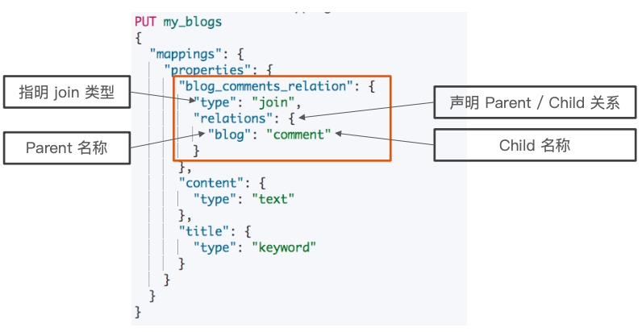
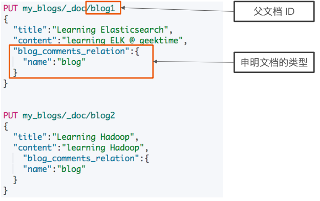
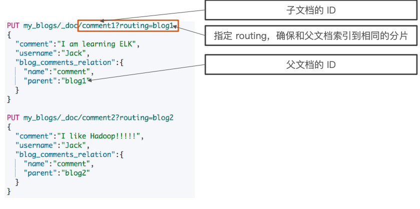
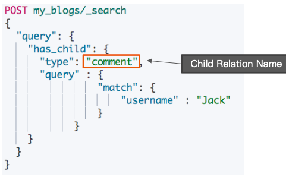
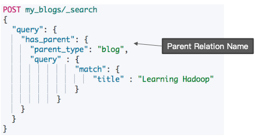
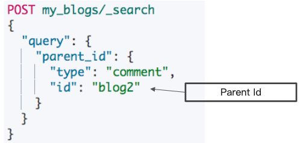
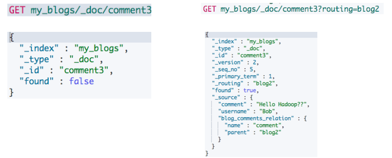
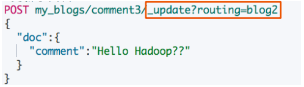

# **第二节 文档的父子关系**

## **1、文档的父子关系**

* **对象和 Nested 对象的局限性**
	* **每次更新，需要重新索引整个对象(包括根对象和嵌套对象)**
* ES 提供了类似关系型数据库中 Join 的实现。**使用 Join 数据类型实现，可以通过维护 Parent / Child 的关系，从⽽分离两个对象**
	* **⽗文档和⼦文档是两个独⽴的文档**
		* 更新⽗文档无需重新索引子文档。
		* ⼦文档被添加，更新或者删除也不会影响到⽗文档和其他的⼦文档

## **2、⽗子关系**

### **2-1 定义⽗子关系的⼏个步骤**

1. 设置索引的 Mapping 
2. 索引⽗文档
3. 索引⼦文档
4. 按需查询⽂档
	
### **2-2 设置 Mapping**

	
### **2-3 索引⽗⽂档**



### **2-4 索引⼦文档**

* ⽗文档和⼦文档必须存在相同的分⽚上 
	* **确保查询 join 的性能**
* **当指定⼦文档时候，必须指定它的⽗文档 Id** 
	* **使⽤ route 参数来保证，分配到相同的分⽚**



```
DELETE my_blogs

# 设定 Parent/Child Mapping
PUT my_blogs
{
  "settings": {
    "number_of_shards": 2
  },
  "mappings": {
    "properties": {
      "blog_comments_relation": {
        "type": "join",
        "relations": {
          "blog": "comment"
        }
      },
      "content": {
        "type": "text"
      },
      "title": {
        "type": "keyword"
      }
    }
  }
}
```

* **⽗文档: blog**
* **子文档：comment**

***Output:***

```
{
  "acknowledged" : true,
  "shards_acknowledged" : true,
  "index" : "my_blogs"
}
```

### **2-5 插入索引父文档**

```
#索引父文档
PUT my_blogs/_doc/blog1
{
  "title":"Learning Elasticsearch",
  "content":"learning ELK @ geektime",
  "blog_comments_relation":{
    "name":"blog"
  }
}


#索引父文档
PUT my_blogs/_doc/blog2
{
  "title":"Learning Hadoop",
  "content":"learning Hadoop",
    "blog_comments_relation":{
    "name":"blog"
  }
}
```

### **2-6 插入索引⼦文档**

```
#索引子文档
PUT my_blogs/_doc/comment1?routing=blog1
{
  "comment":"I am learning ELK",
  "username":"Jack",
  "blog_comments_relation":{
    "name":"comment",
    "parent":"blog1"
  }
}
```

### **2-7 查询所有文档**

```
# 查询所有文档
POST my_blogs/_search
{

}
```

```
"hits" : {
    "total" : {
      "value" : 5,
      "relation" : "eq"
    },
    "max_score" : 1.0,
    "hits" : [
      {
        "_index" : "my_blogs",
        "_type" : "_doc",
        "_id" : "blog1",
        "_score" : 1.0,
        "_source" : {
          "title" : "Learning Elasticsearch",
          "content" : "learning ELK @ geektime",
          "blog_comments_relation" : {
            "name" : "blog"
          }
        }
      },
      {
        "_index" : "my_blogs",
        "_type" : "_doc",
        "_id" : "blog2",
        "_score" : 1.0,
        "_source" : {
          "title" : "Learning Hadoop",
          "content" : "learning Hadoop",
          "blog_comments_relation" : {
            "name" : "blog"
          }
        }
      },
      {
        "_index" : "my_blogs",
        "_type" : "_doc",
        "_id" : "comment1",
        "_score" : 1.0,
        "_routing" : "blog1",
        "_source" : {
          "comment" : "I am learning ELK",
          "username" : "Jack",
          "blog_comments_relation" : {
            "name" : "comment",
            "parent" : "blog1"
          }
        }
      },
      {
        "_index" : "my_blogs",
        "_type" : "_doc",
        "_id" : "comment2",
        "_score" : 1.0,
        "_routing" : "blog2",
        "_source" : {
          "comment" : "I like Hadoop!!!!!",
          "username" : "Jack",
          "blog_comments_relation" : {
            "name" : "comment",
            "parent" : "blog2"
          }
        }
      },
      {
        "_index" : "my_blogs",
        "_type" : "_doc",
        "_id" : "comment3",
        "_score" : 1.0,
        "_routing" : "blog2",
        "_source" : {
          "comment" : "Hello Hadoop",
          "username" : "Bob",
          "blog_comments_relation" : {
            "name" : "comment",
            "parent" : "blog2"
          }
        }
      }
    ]
  }
```

**根据父文档ID查看**

```
#根据父文档ID查看
GET my_blogs/_doc/blog2
```

***Output:***

```
{
  "_index" : "my_blogs",
  "_type" : "_doc",
  "_id" : "blog2",
  "_version" : 1,
  "_seq_no" : 1,
  "_primary_term" : 1,
  "found" : true,
  "_source" : {
    "title" : "Learning Hadoop",
    "content" : "learning Hadoop",
    "blog_comments_relation" : {
      "name" : "blog"
    }
  }
```

## **3、Parent / Child 所⽀持的查询**

* 查询所有⽂档
* Parent Id 查询
* Has Child 查询
* Has Parent 查询

### **3-1 使⽤ `has_child` 查询**

* 返回⽗文档
* 通过对⼦文档进⾏查询
	* **返回具有相关⼦文档的⽗文档**
	* **⽗子⽂档在相同的分片上，因此 Join 效率⾼**



```
# Has Child 查询,返回父文档
POST my_blogs/_search
{
  "query": {
    "has_child": {
      "type": "comment",
      "query" : {
                "match": {
                    "username" : "Jack"
                }
            }
    }
  }
```

***Output:***

```
"hits" : {
    "total" : {
      "value" : 2,
      "relation" : "eq"
    },
    "max_score" : 1.0,
    "hits" : [
      {
        "_index" : "my_blogs",
        "_type" : "_doc",
        "_id" : "blog1",
        "_score" : 1.0,
        "_source" : {
          "title" : "Learning Elasticsearch",
          "content" : "learning ELK @ geektime",
          "blog_comments_relation" : {
            "name" : "blog"
          }
        }
      },
      {
        "_index" : "my_blogs",
        "_type" : "_doc",
        "_id" : "blog2",
        "_score" : 1.0,
        "_source" : {
          "title" : "Learning Hadoop",
          "content" : "learning Hadoop",
          "blog_comments_relation" : {
            "name" : "blog"
          }
        }
      }
    ]
```

### **3-2 使用 `has_parent` 查询**

* **返回相关的⼦文档**
* **通过对⽗文档进⾏查询**
	* 返回所有相关⼦文档

	
	

``` 
# Has Parent 查询，返回相关的子文档
POST my_blogs/_search
{
  "query": {
    "has_parent": {
      "parent_type": "blog",
      "query" : {
                "match": {
                    "title" : "Learning Hadoop"
                }
            }
    }
  }
}
```

***Output:***

```
 "hits" : [
      {
        "_index" : "my_blogs",
        "_type" : "_doc",
        "_id" : "comment2",
        "_score" : 1.0,
        "_routing" : "blog2",
        "_source" : {
          "comment" : "I like Hadoop!!!!!",
          "username" : "Jack",
          "blog_comments_relation" : {
            "name" : "comment",
            "parent" : "blog2"
          }
        }
      },
      {
        "_index" : "my_blogs",
        "_type" : "_doc",
        "_id" : "comment3",
        "_score" : 1.0,
        "_routing" : "blog2",
        "_source" : {
          "comment" : "Hello Hadoop",
          "username" : "Bob",
          "blog_comments_relation" : {
            "name" : "comment",
            "parent" : "blog2"
          }
        }
      }
    ]
```
 
### **3-2 使⽤ `parent_id` 查询**

* 返回所有相关⼦文档
* 通过对⽗文档 Id 进⾏查询
	* 返回所有相关⼦文档



**Parent Id 查询**

```
# Parent Id 查询
POST my_blogs/_search
{
  "query": {
    "parent_id": {
      "type": "comment",
      "id": "blog2"
    }
  }
}
```

***output***

```
"max_score" : 0.44183272,
    "hits" : [
      {
        "_index" : "my_blogs",
        "_type" : "_doc",
        "_id" : "comment2",
        "_score" : 0.44183272,
        "_routing" : "blog2",
        "_source" : {
          "comment" : "I like Hadoop!!!!!",
          "username" : "Jack",
          "blog_comments_relation" : {
            "name" : "comment",
            "parent" : "blog2"
          }
        }
      },
      {
        "_index" : "my_blogs",
        "_type" : "_doc",
        "_id" : "comment3",
        "_score" : 0.44183272,
        "_routing" : "blog2",
        "_source" : {
          "comment" : "Hello Hadoop",
          "username" : "Bob",
          "blog_comments_relation" : {
            "name" : "comment",
            "parent" : "blog2"
          }
        }
      }
    ]
```

### **3-3 访问⼦⽂档**

* 需指定⽗文档 routing 参数



```
#通过ID ，访问子文档
GET my_blogs/_doc/comment3
#通过ID和routing ，访问子文档
GET my_blogs/_doc/comment3?routing=blog2
```

***Output:***

```
{
  "_index" : "my_blogs",
  "_type" : "_doc",
  "_id" : "comment3",
  "_version" : 1,
  "_seq_no" : 5,
  "_primary_term" : 1,
  "_routing" : "blog2",
  "found" : true,
  "_source" : {
    "comment" : "Hello Hadoop",
    "username" : "Bob",
    "blog_comments_relation" : {
      "name" : "comment",
      "parent" : "blog2"
    }
  }
}
```

### **3-4 更新⼦文档**

* 更新⼦⽂档不会影响到⽗⽂档



```
#更新子文档
PUT my_blogs/_doc/comment3?routing=blog2
{
    "comment": "Hello Hadoop??",
    "blog_comments_relation": {
      "name": "comment",
      "parent": "blog2"
    }
}
```

## **4、嵌套对象 v.s ⽗⼦⽂档**


## **5、本节总结**

* 嵌套对象反范式模式设计，通过冗余数据来提高查询性能，适用于读多写少的场景。
* **父子文档类似关系型数据库中的关联关系，适用于写多的场景，减少了文档修改的范围。**
* 感觉就是时空的此消彼长，要提高性能就费点空间，要节省修改的空间就费点性能。
* 相对来说时间更宝贵，也就是怎么能提高性能怎么来更合适！

> blog的浏览量和评论数等频繁更新的数字字段适合用父子结构存储吗？

 浏览量如果变化非常快，数据量非常的大，建议不要做实时更新，会有性能的问题，可以每天定期做增量update，也可以考虑或者只记录数据库的字段，到数据库取浏览量
 
> 浏览量如果变化非常快，数据量非常的大，建议不要做实时更新，会有性能的问题，可以每天定期做增量update，也可以考虑或者只记录数据库的字段，到数据库取浏览量
 
 父子文档关系适合大量更新的操作。比如blog里有评论信息，经常有大量的更新修改。嵌套对象适用于字段中有多值对象，同时需要查询。这在课程中有提到的