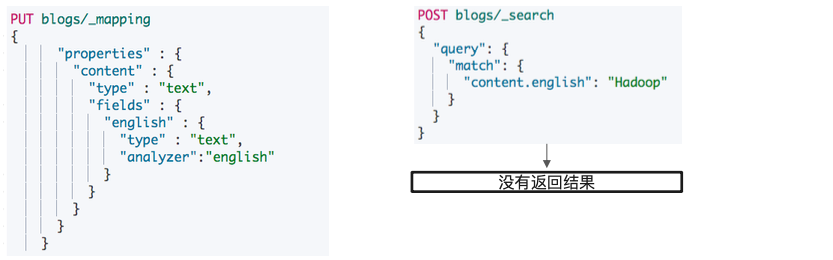
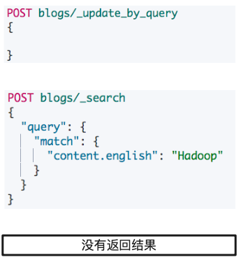
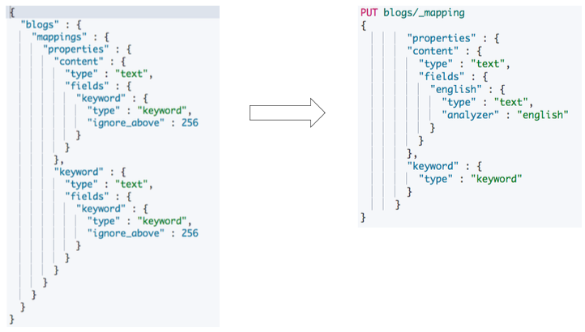
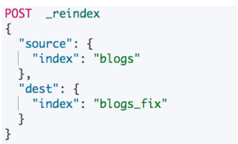
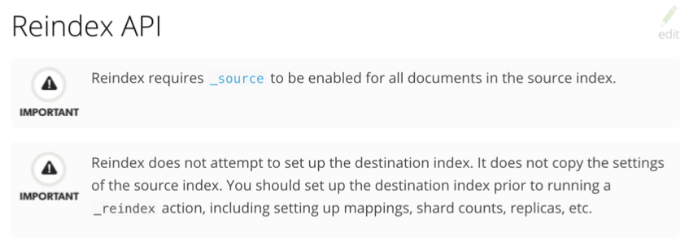
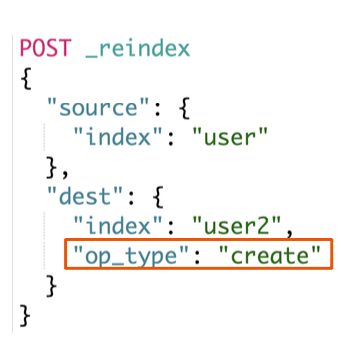
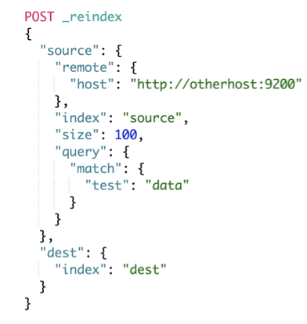
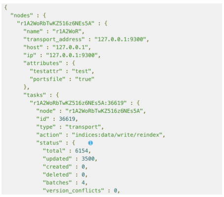

# **第三节 Update By Query & Reindex API**


## **1、使⽤场景**

* 一般在以下⼏种情况时，我们需要重建索引
	* **索引的 Mappings 发生变更: 字段类型更改，分词器及字典更新**
	* **索引的 Settings 发生变更:索引的主分⽚数发⽣改变**
	* **集群内，集群间需要做数据迁移**
* Elasticsearch 的内置提供的 API
	* **Update By Query:在现有索引上重建** 
	* **Reindex:在其他索引上重建索引**

	
## **2、案例 1:为索引增加子字段**



* 变 Mapping，增加⼦字段，使⽤英⽂分词器器 
* **此时尝试对⼦字段进行询**
* **虽然有数据已经存在，但是没有返回结果**


```
DELETE blogs/

# 写入文档
PUT blogs/_doc/1
{
  "content":"Hadoop is cool",
  "keyword":"hadoop"
}

# 查看 Mapping
GET blogs/_mapping
```

***Output:***

```
{
  "blogs" : {
    "mappings" : {
      "properties" : {
        "content" : {
          "type" : "text",
          "fields" : {
            "keyword" : {
              "type" : "keyword",
              "ignore_above" : 256
            }
          }
        },
        "keyword" : {
          "type" : "text",
          "fields" : {
            "keyword" : {
              "type" : "keyword",
              "ignore_above" : 256
            }
          }
        }
      }
    }
  }
}

```

```
# 修改 Mapping，增加子字段，使用英文分词器
PUT blogs/_mapping
{
      "properties" : {
        "content" : {
          "type" : "text",
          "fields" : {
            "english" : {
              "type" : "text",
              "analyzer":"english"
            }
          }
        }
      }
    }
```

```
# 写入文档
PUT blogs/_doc/2
{
  "content":"Elasticsearch rocks",
    "keyword":"elasticsearch"
}
```

```
# 查询新写入文档
POST blogs/_search
{
  "query": {
    "match": {
      "content.english": "Elasticsearch"
    }
  }
}
```

***Output: correct***

```
 "max_score" : 0.2876821,
    "hits" : [
      {
        "_index" : "blogs",
        "_type" : "_doc",
        "_id" : "2",
        "_score" : 0.2876821,
        "_source" : {
          "content" : "Elasticsearch rocks",
          "keyword" : "elasticsearch"
        }
      }
    ]
```


```
POST blogs/_search
{
  "query": {
    "match": {
      "content.english": "Hadoop"
    }
  }
}
```

***Output: null***

```
"hits" : {
    "total" : {
      "value" : 0,
      "relation" : "eq"
    },
    "max_score" : null,
    "hits" : [ ]
  }
```


## **3、Update By Query**



 * **执⾏ Update By Query**
 * **尝试对 Multi-Fields 查询** 
 * 返回结果

 
### **3-1 执⾏ Update By Query**

```
# Update所有文档
POST blogs/_update_by_query
{

}
```

***Output***

```
{
  "took" : 4376,
  "timed_out" : false,
  "total" : 2,
  "updated" : 2,
  "deleted" : 0,
  "batches" : 1,
  "version_conflicts" : 0,
  "noops" : 0,
  "retries" : {
    "bulk" : 0,
    "search" : 0
  },
  "throttled_millis" : 0,
  "requests_per_second" : -1.0,
  "throttled_until_millis" : 0,
  "failures" : [ ]
}
```

### **3-2 查询之前写入的文档**

```
POST blogs/_search
{
  "query": {
    "match": {
      "content.english": "Hadoop"
    }
  }
}
```
 
***Output: `"hits" :1`***

```
"hits" : {
    "total" : {
      "value" : 1,
      "relation" : "eq"
    },
    "max_score" : 0.6931471,
    "hits" : [
      {
        "_index" : "blogs",
        "_type" : "_doc",
        "_id" : "1",
        "_score" : 0.6931471,
        "_source" : {
          "content" : "Hadoop is cool",
          "keyword" : "hadoop"
        }
      }
    ]
  }
```
 
## **4、案例 2:更改已有字段类型的 Mappings**

* **ES 不允许在原有 Mapping 上对字段类型进⾏修改** 
* **只能创建新的索引，并且设定正确的字段类型，再重新导⼊数据**



```
GET blogs/_mapping
```

***Output:***

```
{
  "blogs" : {
    "mappings" : {
      "properties" : {
        "content" : {
          "type" : "text",
          "fields" : {
            "english" : {
              "type" : "text",
              "analyzer" : "english"
            },
            "keyword" : {
              "type" : "keyword",
              "ignore_above" : 256
            }
          }
        },
        "keyword" : {
          "type" : "text",
          "fields" : {
            "keyword" : {
              "type" : "keyword",
              "ignore_above" : 256
            }
          }
        }
      }
    }
  }
}
```

```
PUT blogs/_mapping
{
        "properties" : {
        "content" : {
          "type" : "text",
          "fields" : {
            "english" : {
              "type" : "text",
              "analyzer" : "english"
            }
          }
        },
        "keyword" : {
          "type" : "keyword"
        }
      }
}
```

**`"type" : "keyword"` => `"type" : "text"`**

***Output:***

```
{
  "error" : {
    "root_cause" : [
      {
        "type" : "illegal_argument_exception",
        "reason" : "mapper [keyword] cannot be changed from type [text] to [keyword]"
      }
    ],
    "type" : "illegal_argument_exception",
    "reason" : "mapper [keyword] cannot be changed from type [text] to [keyword]"
  },
  "status" : 400
}
```

**"mapper [keyword] cannot be changed from type [text] to [keyword]"**

## **5、Reindex API**



* Reindex API ⽀持把⽂档从⼀个索引拷⻉到另外⼀个索引
* 使⽤ Reindex API 的⼀些场景 
	* 修改索引的主分⽚数
	* 改变字段的 Mapping 中的字段类型
	* 集群内数据迁移 / 跨集群的数据迁移

```
DELETE blogs_fix
# 404 - Not Found
```

### **5-1 创建新的索引并且设定新的Mapping**

```
# 创建新的索引并且设定新的Mapping
PUT blogs_fix/
{
  "mappings": {
        "properties" : {
        "content" : {
          "type" : "text",
          "fields" : {
            "english" : {
              "type" : "text",
              "analyzer" : "english"
            }
          }
        },
        "keyword" : {
          "type" : "keyword"
        }
      }    
  }
}
```

***Output***

```
{
  "acknowledged" : true,
  "shards_acknowledged" : true,
  "index" : "blogs_fix"
}
```

```
# Reindx API
POST  _reindex
{
  "source": {
    "index": "blogs"
  },
  "dest": {
    "index": "blogs_fix"
  }
}
```

```
GET  blogs_fix/_doc/1
```

***Output:***

```
{
  "_index" : "blogs_fix",
  "_type" : "_doc",
  "_id" : "1",
  "_version" : 1,
  "_seq_no" : 0,
  "_primary_term" : 1,
  "found" : true,
  "_source" : {
    "content" : "Hadoop is cool",
    "keyword" : "hadoop"
  }
}
```


### **5-2 测试 Term Aggregation**

```
# 测试 Term Aggregation
POST blogs_fix/_search
{
  "size": 0,
  "aggs": {
    "blog_keyword": {
      "terms": {
        "field": "keyword",
        "size": 10
      }
    }
  }
}
```

***Output***

```
 "hits" : {
    "total" : {
      "value" : 2,
      "relation" : "eq"
    },
    "max_score" : null,
    "hits" : [ ]
  },
  "aggregations" : {
    "blog_keyword" : {
      "doc_count_error_upper_bound" : 0,
      "sum_other_doc_count" : 0,
      "buckets" : [
        {
          "key" : "elasticsearch",
          "doc_count" : 1
        },
        {
          "key" : "hadoop",
          "doc_count" : 1
        }
      ]
    }
  }
```

## **6、两个注意点**



## **7、OP Type**

* **`_reindex` 只会创建不存在的⽂档**
* **⽂档如果已经存在，会导致版本冲突**



```
# Reindx API，version Type Internal
POST  _reindex
{
  "source": {
    "index": "blogs"
  },
  "dest": {
    "index": "blogs_fix",
    "op_type": "create"
  }
}
```

***Output: 409 - Conflict***

```
"failures" : [
    {
      "index" : "blogs_fix",
      "type" : "_doc",
      "id" : "1",
      "cause" : {
        "type" : "version_conflict_engine_exception",
        "reason" : "[1]: version conflict, document already exists (current version [2])",
        "index_uuid" : "jPf0gwF2T3qpBz64AHkRbg",
        "shard" : "0",
        "index" : "blogs_fix"
      },
      "status" : 409
    },
    {
      "index" : "blogs_fix",
      "type" : "_doc",
      "id" : "2",
      "cause" : {
        "type" : "version_conflict_engine_exception",
        "reason" : "[2]: version conflict, document already exists (current version [2])",
        "index_uuid" : "jPf0gwF2T3qpBz64AHkRbg",
        "shard" : "0",
        "index" : "blogs_fix"
      },
      "status" : 409
    }
  ]
```


## **8、跨集群 ReIndex**

`reindex.remote.whitelist: "otherhost:9200, another:9200”`

* 需要修改 `elasticsearch.yml`，并且重启节点




## **9、查看 Task API**

`GET _tasks?detailed=true&actions=*reindex`

* `Reindx API` ⽀持异步操作，执⾏只返回` Task Id`
* `POST _reindex?wait_for_completion=false`




```
# Reindx API，version Type Internal
POST  _reindex
{
  "source": {
    "index": "blogs"
  },
  "dest": {
    "index": "blogs_fix",
    "version_type": "internal"
  }
}
```

**Output:**

```
{
  "_index" : "blogs_fix",
  "_type" : "_doc",
  "_id" : "1",
  "_version" : 2,
  "_seq_no" : 2,
  "_primary_term" : 1,
  "found" : true,
  "_source" : {
    "content" : "Hadoop is cool",
    "keyword" : "hadoop"
  }
}
```

```
# Reindx API，version Type external
POST  _reindex
{
  "source": {
    "index": "blogs"
  },
  "dest": {
    "index": "blogs_fix",
    "version_type": "external"
  }
}
```

***Output :409 - Conflict***

```
"failures" : [
    {
      "index" : "blogs_fix",
      "type" : "_doc",
      "id" : "1",
      "cause" : {
        "type" : "version_conflict_engine_exception",
        "reason" : "[1]: version conflict, current version [2] is higher or equal to the one provided [2]",
        "index_uuid" : "jPf0gwF2T3qpBz64AHkRbg",
        "shard" : "0",
        "index" : "blogs_fix"
      },
      "status" : 409
    },
    {
      "index" : "blogs_fix",
      "type" : "_doc",
      "id" : "2",
      "cause" : {
        "type" : "version_conflict_engine_exception",
        "reason" : "[2]: version conflict, current version [2] is higher or equal to the one provided [2]",
        "index_uuid" : "jPf0gwF2T3qpBz64AHkRbg",
        "shard" : "0",
        "index" : "blogs_fix"
      },
      "status" : 409
```

```
# Reindx API，version Type external
POST  _reindex
{
  "source": {
    "index": "blogs"
  },
  "dest": {
    "index": "blogs_fix",
    "version_type": "external"
  },
  "conflicts": "proceed"
}
```

**`"conflicts": "proceed"`**

***Output: 200 - Conflict***

## **10、本节回顾**

* Update By Query 的使⽤场景:**为字段新增⼦字段;字段更换分词器，或更新分词器词库**
* Reindex API 的使⽤场景:	**修改字段类型**
	* **需要先对新索引设置 Mapping，索引的设置和映射关系不会被复制**
* 通过查看 Task API，了解 Reindex 的状况
* **Remote ReIndex，需要修改 elasticsearch.yml 配置并且重启**
* **一定要尽量使⽤ Index Alias 读写数据。即便发⽣ Reindex，也能够实现零停机维护**