# **第四节 Ingest Pipeline 与 Painless Script**

## **1、需求:修复与增强写⼊的数据**


* Tags 字段中，逗号分隔的⽂本应该是数组，⽽不是⼀个字符串
	* **需求:后期需要对 Tags 进⾏ Aggregation 统计**

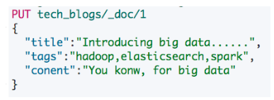

## **2、Ingest Node**

* Elasticsearch 5.0 后，引⼊的⼀种新的节点类型。默认配置下，**每个节点都是 Ingest Node**
	*  具有预处理数据的能⼒，**可拦截 Index 或 Bulk API 的请求**
	*  **对数据进⾏转换，并重新返回给 Index 或 Bulk API**

* ⽆需 Logstash，就可以进⾏数据的预处理，例如
	* 为某个字段设置默认值; 
	* 重命名某个字段的字段名;
	* 对字段值进⾏ Split 操作
	* **⽀持设置 Painless 脚本，对数据进⾏更加复杂的加⼯**


## **3、Pipeline & Processor**

* Pipeline - 管道会对通过的数据(⽂档)，按照顺序进⾏加⼯
* **Processor - Elasticsearch 对⼀些加⼯的⾏为进⾏了抽象包装**
	* **Elasticsearch 有很多内置的 Processors**。**也⽀持通过插件的⽅式**，实现⾃己的 Processor

### **3-1 使⽤ Pipeline 切分字符串**

```
{
  "split": {
     "field": "tags",
     "separator": ","
    }
}
```

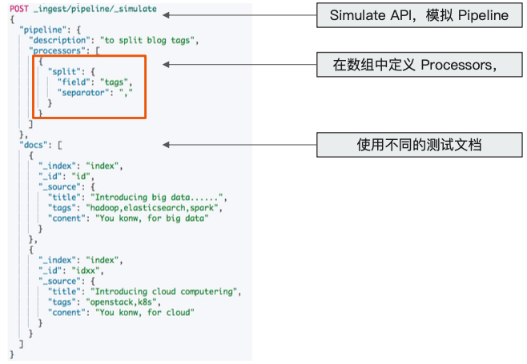

```
DELETE tech_blogs

#Blog数据，包含3个字段，tags用逗号间隔
PUT tech_blogs/_doc/1
{
  "title":"Introducing big data......",
  "tags":"hadoop,elasticsearch,spark",
  "content":"You konw, for big data"
}
```

```
# 测试split tags
POST _ingest/pipeline/_simulate
{
  "pipeline": {
    "description": "to split blog tags",
    "processors": [
      {
        "split": {
          "field": "tags",
          "separator": ","
        }
      }
    ]
  },
  "docs": [
    {
      "_index": "index",
      "_id": "id",
      "_source": {
        "title": "Introducing big data......",
        "tags": "hadoop,elasticsearch,spark",
        "content": "You konw, for big data"
      }
    },
    {
      "_index": "index",
      "_id": "idxx",
      "_source": {
        "title": "Introducing cloud computering",
        "tags": "openstack,k8s",
        "content": "You konw, for cloud"
      }
    }
  ]
}
```

***Output:***

```
{
  "docs" : [
    {
      "doc" : {
        "_index" : "index",
        "_type" : "_doc",
        "_id" : "id",
        "_source" : {
          "title" : "Introducing big data......",
          "content" : "You konw, for big data",
          "tags" : [
            "hadoop",
            "elasticsearch",
            "spark"
          ]
        },
        "_ingest" : {
          "timestamp" : "2020-11-02T11:54:24.335498Z"
        }
      }
    },
    {
      "doc" : {
        "_index" : "index",
        "_type" : "_doc",
        "_id" : "idxx",
        "_source" : {
          "title" : "Introducing cloud computering",
          "content" : "You konw, for cloud",
          "tags" : [
            "openstack",
            "k8s"
          ]
        },
        "_ingest" : {
          "timestamp" : "2020-11-02T11:54:24.335525Z"
        }
      }
    }
  ]
}
```

### **3-2 为⽂档增加字段**


```
{
   "set":{
     "field": "views",
     "value": 0
	}
}
```

```
#同时为文档，增加一个字段。blog查看量
POST _ingest/pipeline/_simulate
{
  "pipeline": {
    "description": "to split blog tags",
    "processors": [
      {
        "split": {
          "field": "tags",
          "separator": ","
        }
      },

      {
        "set":{
          "field": "views",
          "value": 0
        }
      }
    ]
  },

  "docs": [
    {
      "_index":"index",
      "_id":"id",
      "_source":{
        "title":"Introducing big data......",
  "tags":"hadoop,elasticsearch,spark",
  "content":"You konw, for big data"
      }
    },


    {
      "_index":"index",
      "_id":"idxx",
      "_source":{
        "title":"Introducing cloud computering",
  "tags":"openstack,k8s",
  "content":"You konw, for cloud"
      }
    }

    ]
}
```

***Output***

```
{
  "docs" : [
    {
      "doc" : {
        "_index" : "index",
        "_type" : "_doc",
        "_id" : "id",
        "_source" : {
          "title" : "Introducing big data......",
          "content" : "You konw, for big data",
          "views" : 0,
          "tags" : [
            "hadoop",
            "elasticsearch",
            "spark"
          ]
        },
        "_ingest" : {
          "timestamp" : "2020-11-02T12:02:21.430235Z"
        }
      }
    },
    {
      "doc" : {
        "_index" : "index",
        "_type" : "_doc",
        "_id" : "idxx",
        "_source" : {
          "title" : "Introducing cloud computering",
          "content" : "You konw, for cloud",
          "views" : 0,
          "tags" : [
            "openstack",
            "k8s"
          ]
        },
        "_ingest" : {
          "timestamp" : "2020-11-02T12:02:21.430244Z"
        }
      }
    }
  ]
}
```


### **3-3 Pipeline API**

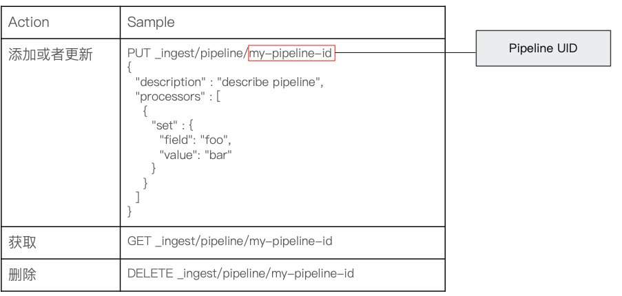

### **3-4 添加 Pipeline 并测试**

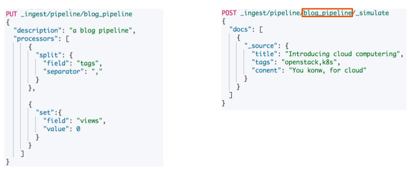

```
# 为ES添加一个 Pipeline
PUT _ingest/pipeline/blog_pipeline
{
  "description": "a blog pipeline",
  "processors": [
      {
        "split": {
          "field": "tags",
          "separator": ","
        }
      },

      {
        "set":{
          "field": "views",
          "value": 0
        }
      }
    ]
}
```

```
#查看Pipleline
GET _ingest/pipeline/blog_pipeline
```

***Output***

```
{
  "blog_pipeline" : {
    "description" : "a blog pipeline",
    "processors" : [
      {
        "split" : {
          "field" : "tags",
          "separator" : ","
        }
      },
      {
        "set" : {
          "field" : "views",
          "value" : 0
        }
      }
    ]
  }
}
```

**测试pipeline**

```
#测试pipeline
POST _ingest/pipeline/blog_pipeline/_simulate
{
  "docs": [
    {
      "_source": {
        "title": "Introducing cloud computering",
        "tags": "openstack,k8s",
        "content": "You konw, for cloud"
      }
    }
  ]
}
```

***Output:***

```
{
  "docs" : [
    {
      "doc" : {
        "_index" : "_index",
        "_type" : "_doc",
        "_id" : "_id",
        "_source" : {
          "title" : "Introducing cloud computering",
          "content" : "You konw, for cloud",
          "views" : 0,
          "tags" : [
            "openstack",
            "k8s"
          ]
        },
        "_ingest" : {
          "timestamp" : "2020-11-02T12:06:53.905829Z"
        }
      }
    }
  ]
}
```

### **3-5 Index & Update By Query**

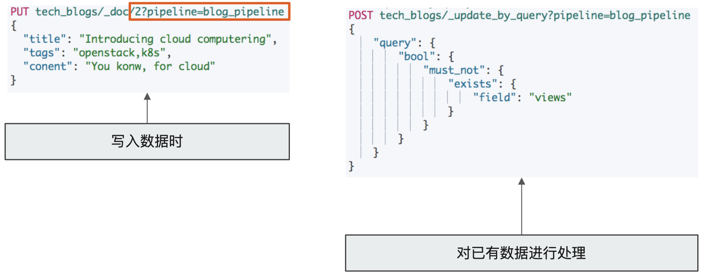

```
#不使用pipeline更新数据
PUT tech_blogs/_doc/1
{
  "title":"Introducing big data......",
  "tags":"hadoop,elasticsearch,spark",
  "content":"You konw, for big data"
}

#使用pipeline更新数据
PUT tech_blogs/_doc/2?pipeline=blog_pipeline
{
  "title": "Introducing cloud computering",
  "tags": "openstack,k8s",
  "content": "You konw, for cloud"
}
```

```
#查看两条数据，一条被处理，一条未被处理
POST tech_blogs/_search
{}
```

***Ouput:***

```
"hits" : [
      {
        "_index" : "tech_blogs",
        "_type" : "_doc",
        "_id" : "1",
        "_score" : 1.0,
        "_source" : {
          "title" : "Introducing big data......",
          "tags" : "hadoop,elasticsearch,spark",
          "content" : "You konw, for big data"
        }
      },
      {
        "_index" : "tech_blogs",
        "_type" : "_doc",
        "_id" : "2",
        "_score" : 1.0,
        "_source" : {
          "title" : "Introducing cloud computering",
          "content" : "You konw, for cloud",
          "views" : 0,
          "tags" : [
            "openstack",
            "k8s"
          ]
        }
      }
    ]
```

**`update_by_query` 会导致错误**

```
#update_by_query 会导致错误
POST tech_blogs/_update_by_query?pipeline=blog_pipeline
{
}
```

***Output: 400 - Bad Request***

```
"failures" : [
    {
      "index" : "tech_blogs",
      "type" : "_doc",
      "id" : "2",
      "cause" : {
        "type" : "illegal_argument_exception",
        "reason" : "field [tags] of type [java.util.ArrayList] cannot be cast to [java.lang.String]"
      },
      "status" : 400
    }
  ]
```

**`"reason" : "field [tags] of type [java.util.ArrayList] cannot be cast to [java.lang.String]"`**

**增加`update_by_query`的条件**

```
#增加update_by_query的条件
POST tech_blogs/_update_by_query?pipeline=blog_pipeline
{
    "query": {
        "bool": {
            "must_not": {
                "exists": {
                    "field": "views"
                }
            }
        }
    }
}
```

***Output: 200-ok***

```
{
  "took" : 726,
  "timed_out" : false,
  "total" : 0,
  "updated" : 0,
  "deleted" : 0,
  "batches" : 0,
  "version_conflicts" : 0,
  "noops" : 0,
  "retries" : {
    "bulk" : 0,
    "search" : 0
  },
  "throttled_millis" : 0,
  "requests_per_second" : -1.0,
  "throttled_until_millis" : 0,
  "failures" : [ ]
}
```

## **4、一些内置 Processors**

* [https://www.elastic.co/guide/en/elasticsearch/reference/7.1/ingest-processors.html](https://www.elastic.co/guide/en/elasticsearch/reference/7.1/ingest-processors.html)
	* Split Processor (例:将给定字段值分成一个数组)
	* Remove / Rename Processor (例例:移除一个重命名字段)
	* Append (例:为商品增加一个新的标签)
	* Convert(例:将商品价格，从字符串转换成 float 类型)
	* Date / JSON(例:⽇期格式转换，字符串转 JSON 对象)
	* Date Index Name Processor (例:将通过该处理器的⽂档，分配到指定时间格式的索引中)
	* Fail Processor (⼀旦出现异常，该 Pipeline 指定的错误信息能返回给用户
	* Foreach Process(数组字段，数组的每个元素都会使⽤到⼀个相同的处理器)
	* Grok Processor(⽇志的⽇期格式切割)
	* Gsub / Join / Split(字符串替换 / 数组转字符串/ 字符串转数组)
	* Lowercase / Upcase(⼤小写转换)

	
## **5、Ingest Node v.s Logstash**

[https://www.elastic.co/cn/blog/should-i-use-logstash-or-elasticsearch-ingest-nodes](https://www.elastic.co/cn/blog/should-i-use-logstash-or-elasticsearch-ingest-nodes)


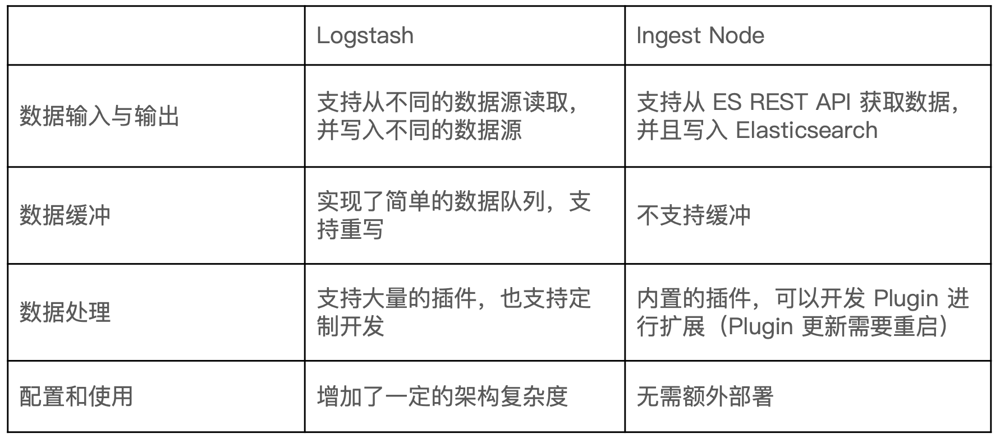

## **6、Painless 简介**

* 自 Elasticsearch 5.x 后引入，专⻔为 Elasticsearch 设计，扩展了 Java 的语法。
* 6.0 开始，ES 只⽀持 Painless。Groovy， JavaScript 和 Python 都不再⽀支持
* Painless ⽀持所有 Java 的数据类型及 Java API 子集
* Painless Script 具备以下特性
	* 高性能/安全
	* 支持显示类型或者动态定义类型

## **7、Painless 的用途**

* **可以对文档字段进行加⼯处理**
	* **更新或删除字段，处理数据聚合操作**
	* **Script Field:对返回的字段提前进⾏计算**
	* **Function Score:对文档的算分进⾏处理**
* 在 Ingest Pipeline 中执⾏脚本
* 在 Reindex API，Update By Query 时，对数据进⾏处理

## **8、通过 Painless 脚本访问字段**

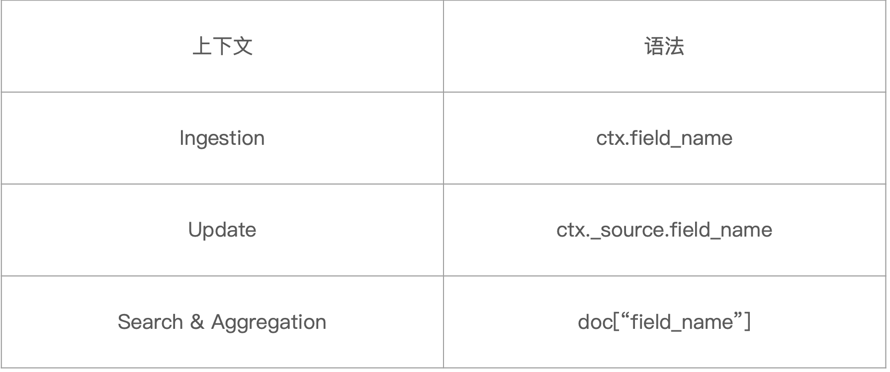

### **8-1 案例 1:Script Processor**

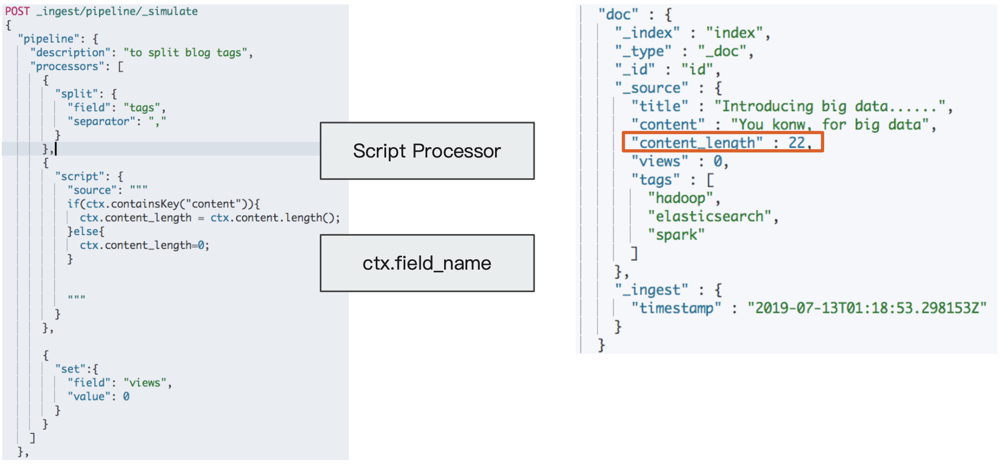

```
# 增加一个 Script Prcessor
POST _ingest/pipeline/_simulate
{
  "pipeline": {
    "description": "to split blog tags",
    "processors": [
      {
        "split": {
          "field": "tags",
          "separator": ","
        }
      },
      {
        "script": {
          "source": """
          if(ctx.containsKey("content")){
            ctx.content_length = ctx.content.length();
          }else{
            ctx.content_length=0;
          }


          """
        }
      },

      {
        "set":{
          "field": "views",
          "value": 0
        }
      }
    ]
  },

  "docs": [
    {
      "_index":"index",
      "_id":"id",
      "_source":{
        "title":"Introducing big data......",
  "tags":"hadoop,elasticsearch,spark",
  "content":"You konw, for big data"
      }
    },


    {
      "_index":"index",
      "_id":"idxx",
      "_source":{
        "title":"Introducing cloud computering",
  "tags":"openstack,k8s",
  "content":"You konw, for cloud"
      }
    }

    ]
}
```

***Output***

```
{
  "docs" : [
    {
      "doc" : {
        "_index" : "index",
        "_type" : "_doc",
        "_id" : "id",
        "_source" : {
          "title" : "Introducing big data......",
          "content" : "You konw, for big data",
          "content_length" : 22,
          "views" : 0,
          "tags" : [
            "hadoop",
            "elasticsearch",
            "spark"
          ]
        },
        "_ingest" : {
          "timestamp" : "2020-11-02T12:40:15.6128Z"
        }
      }
    },
    {
      "doc" : {
        "_index" : "index",
        "_type" : "_doc",
        "_id" : "idxx",
        "_source" : {
          "title" : "Introducing cloud computering",
          "content" : "You konw, for cloud",
          "content_length" : 19,
          "views" : 0,
          "tags" : [
            "openstack",
            "k8s"
          ]
        },
        "_ingest" : {
          "timestamp" : "2020-11-02T12:40:15.612807Z"
        }
      }
    }
  ]
}
```

*  `"content_length" : 22`
*  `"content_length" : 19`


### **8-2 案例 2:⽂档更新计数**

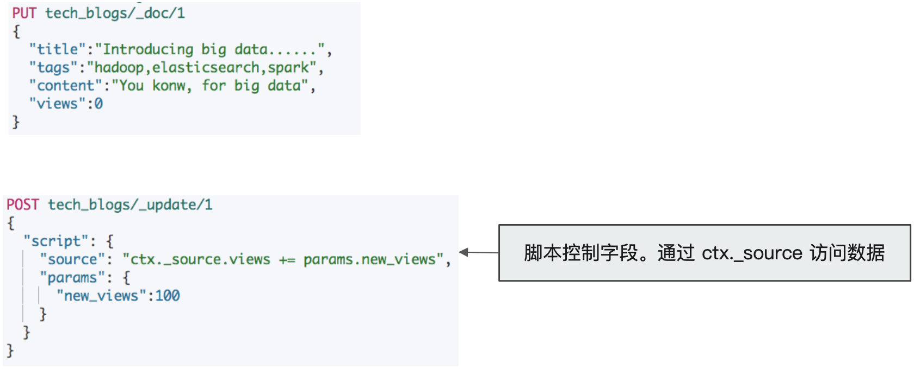

```
DELETE tech_blogs
PUT tech_blogs/_doc/1
{
  "title":"Introducing big data......",
  "tags":"hadoop,elasticsearch,spark",
  "content":"You konw, for big data",
  "views":0
}
```

```
POST tech_blogs/_update/1
{
  "script": {
    "source": "ctx._source.views += params.new_views",
    "params": {
      "new_views":100
    }
  }
}
```

***Output：200***

```
# 查看views计数
POST tech_blogs/_search
{

}
```

***Output：***

```
"max_score" : 1.0,
    "hits" : [
      {
        "_index" : "tech_blogs",
        "_type" : "_doc",
        "_id" : "1",
        "_score" : 1.0,
        "_source" : {
          "title" : "Introducing big data......",
          "tags" : "hadoop,elasticsearch,spark",
          "content" : "You konw, for big data",
          "views" : 100
        }
      }
    ]
```

```
#保存脚本在 Cluster State
POST _scripts/update_views
{
  "script":{
    "lang": "painless",
    "source": "ctx._source.views += params.new_views"
  }
}
```

**200**

```
POST tech_blogs/_update/1
{
  "script": {
    "id": "update_views",
    "params": {
      "new_views":1000
    }
  }
}
```
```
POST tech_blogs/_search
{

}
```

***Output:***

```
"max_score" : 1.0,
    "hits" : [
      {
        "_index" : "tech_blogs",
        "_type" : "_doc",
        "_id" : "1",
        "_score" : 1.0,
        "_source" : {
          "title" : "Introducing big data......",
          "tags" : "hadoop,elasticsearch,spark",
          "content" : "You konw, for big data",
          "views" : 1100
        }
      }
    ]
```

**`"views" : 1100`**

### **8-3 案例 3:搜索时的 Script 字段**

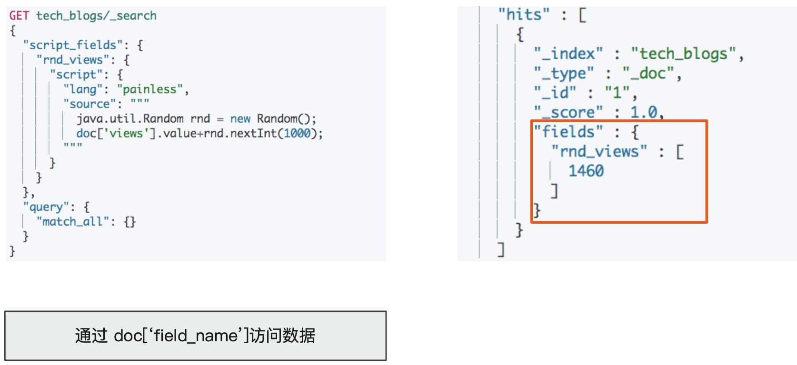

```
GET tech_blogs/_search
{
  "script_fields": {
    "rnd_views": {
      "script": {
        "lang": "painless",
        "source": """
          java.util.Random rnd = new Random();
          doc['views'].value+rnd.nextInt(1000);
        """
      }
    }
  },
  "query": {
    "match_all": {}
  }
}
```

***Output***

```
"max_score" : 1.0,
    "hits" : [
      {
        "_index" : "tech_blogs",
        "_type" : "_doc",
        "_id" : "1",
        "_score" : 1.0,
        "fields" : {
          "rnd_views" : [
            2692
          ]
        }
      }
    ]
```

### **8-4 Script: Inline v.s Stored**

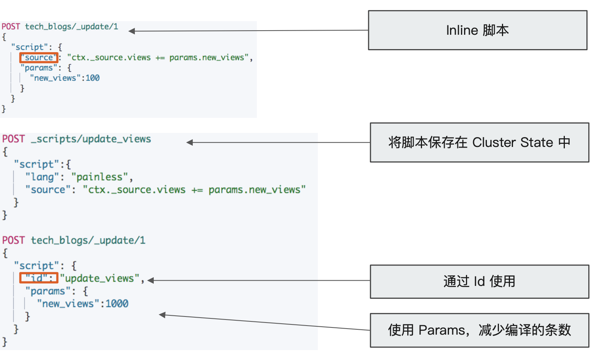

## **9、脚本缓存**

* 编译的开销相较大
* Elasticsearch 会将脚本编译后缓存在Cache 中
	* Inline scripts 和 Stored Scripts 都会被缓存
	* 默认缓存 100 个脚本

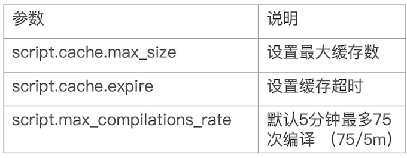

## **10、本节知识点**

* 概念讲解:Ingest Node，Pipeline 与 Processor
* Ingest Node 与 Logstash 的⽐较
* Pipeline 的 相关操作 / 内置 Processor 讲解与演示
* Painless 脚本与
	* Ingestion (Pipeline)
	* Update
	* Search & Aggregation