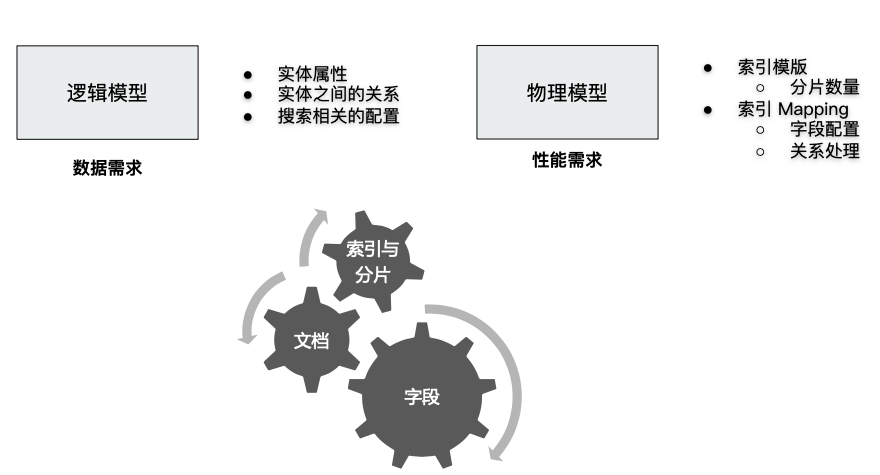
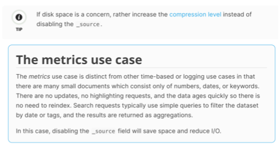
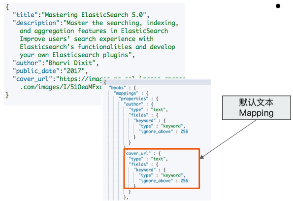
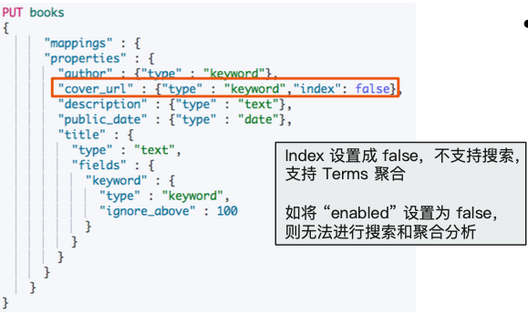

# **第五节 Elasticsearch 数据建模实例**

## **1、什么是数据建模?**

* 数据建模(Data modeling)， 是创建数据模型的过程
	*  数据模型是对真实世界进⾏抽象描述的⼀种⼯具和方法，实现对现实世界的映射
		*   博客/作者/⽤用户评论
	* 三个过程:**概念模型 => 逻辑模型 => 数据模型(第三范式)**
		* 数据模型:结合具体的数据库，在满⾜足业务读写性能等需求的前提下，确定最终的定义

## **2、数据建模:功能需求 + 性能需求**



## **3、如何对字段进⾏建模**


## **4、字段类型:Text v.s Keyword**

### **4-1 Text**

* ⽤于全文本字段，⽂本会被 Analyzer 分词
* **默认不⽀持聚合分析及排序。需要设置 fielddata 为 true**

### **4-2 Keyword**

* **用于 id，枚举及不需要分词的⽂本**。**例如电话号码，email地址，⼿机号码，邮政编码，性别等**
* **适用于 Filter(精确匹配)，Sorting 和 Aggregations**

### **4-3 设置多字段类型**

* 默认会为⽂本类型设置成 text，并且设置⼀个 keyword 的⼦字段
* **在处理⼈类语⾔时，通过增加“英⽂”，“拼⾳”和“标准”分词器，提⾼搜索结构**


## **5、字段类型 :结构化数据**

* **数值类型**
	* 尽量选择贴近的类型。例如可以⽤ byte，就不要用 long
* **枚举类型**
	* **设置为 keyword。即便是数字，也应该设置成 keyword，获取更加好的性能**
* 其他
	*  ⽇期/布尔/地理信息

## **6、检索**

* 如不需要检索，排序和聚合分析
	* **Enable 设置成 false**
* 如不需要检索	
	* **Index 设置成 false**
* 对需要检索的字段，可以通过如下配置，设定存储粒度
	* **`Index_options` / Norms :不需要归⼀化数据时，可以关闭**
	
## **7、聚合及排序**

* 如不需要检索，排序和聚合分析
	* **Enable 设置成 false**
* 如不需要排序或者聚合分析功能
	* **`Doc_values` / fielddata 设置成 false**
* 更新频繁，聚合查询频繁的 keyword 类型的字段
	* **推荐将 `eager_global_ordinals` 设置为 true**

## **8、额外的存储**



*  **是否需要专⻔存储当前字段数据**
	*  **Store 设置成 true，可以存储该字段的原始内容**
	* **一般结合 `_source` 的 `enabled` 为 `false` 时候使⽤**
* `Disable _source`:节约磁盘; 适⽤于指标型数据
	* **一般建议先考虑增加压缩⽐**
	* **⽆法看到 `_source` 字段，⽆法做 `ReIndex`，⽆法做 `Update`**
	* Kibana 中⽆无法做 discovery

## **9、⼀个数据建模的实例**



 图书的索引 
 
* 书名 
* 简介 
* 作者
* 发⾏日期 
* 图书封⾯

```
# Index 一本书的信息
PUT books/_doc/1
{
  "title":"Mastering ElasticSearch 5.0",
  "description":"Master the searching, indexing, and aggregation features in ElasticSearch Improve users’ search experience with Elasticsearch’s functionalities and develop your own Elasticsearch plugins",
  "author":"Bharvi Dixit",
  "public_date":"2017",
  "cover_url":"https://images-na.ssl-images-amazon.com/images/I/51OeaMFxcML.jpg"
}
```
```
#查询自动创建的Mapping
GET books/_mapping
```

***Output:***

```
{
  "books" : {
    "mappings" : {
      "properties" : {
        "author" : {
          "type" : "text",
          "fields" : {
            "keyword" : {
              "type" : "keyword",
              "ignore_above" : 256
            }
          }
        },
        "cover_url" : {
          "type" : "text",
          "fields" : {
            "keyword" : {
              "type" : "keyword",
              "ignore_above" : 256
            }
          }
        },
        "description" : {
          "type" : "text",
          "fields" : {
            "keyword" : {
              "type" : "keyword",
              "ignore_above" : 256
            }
          }
        },
        "public_date" : {
          "type" : "text",
          "fields" : {
            "keyword" : {
              "type" : "keyword",
              "ignore_above" : 256
            }
          }
        },
        "title" : {
          "type" : "text",
          "fields" : {
            "keyword" : {
              "type" : "keyword",
              "ignore_above" : 256
...
```

**All type is keyword**

### **9-1 优化字段类型**

* 图书的索引
	* 书名:⽀持全⽂和精确匹配 
	* 简介:⽀持全⽂
	* 作者:精确值
	* 发⾏⽇期:⽇期类型
	* 图书封面:精确值




```
DELETE books

PUT books
{
      "mappings" : {
      "properties" : {
        "author" : {"type" : "keyword"},
        "cover_url" : {"type" : "keyword","index": false},
        "description" : {"type" : "text"},
        "public_date" : {"type" : "date"},
        "title" : {
          "type" : "text",
          "fields" : {
            "keyword" : {
              "type" : "keyword",
              "ignore_above" : 100
            }
          }
        }
      }
    }
}
```

*  `"cover_url" : {"type" : "keyword","index": false},`: 如不需要检索

***Output:***

```
{
  "acknowledged" : true,
  "shards_acknowledged" : true,
  "index" : "books"
}
```

**Cover URL index 设置成false，无法对该字段进行搜索**

```
#Cover URL index 设置成false，无法对该字段进行搜索
POST books/_search
{
  "query": {
    "term": {
      "cover_url": {
        "value": "https://images-na.ssl-images-amazon.com/images/I/51OeaMFxcML.jpg"
      }
    }
  }
}
```

**Output: 400 - Bad Request**

```
failed_shards" : [
      {
        "shard" : 0,
        "index" : "books",
        "node" : "L7jf3HA8TqOEtNY8BrU82A",
        "reason" : {
          "type" : "query_shard_exception",
          "reason" : "failed to create query: Cannot search on field [cover_url] since it is not indexed.",
          "index_uuid" : "trWUWXSwSAiS-TvtsvDQSA",
          "index" : "books",
          "caused_by" : {
            "type" : "illegal_argument_exception",
            "reason" : "Cannot search on field [cover_url] since it is not indexed."
          }
        }
      }
    ]
```

* **"reason" : "failed to create query: Cannot search on field [cover_url] since it is not indexed."**


**Cover URL index 设置成false，依然支持聚合分析**

```
#Cover URL index 设置成false，依然支持聚合分析
POST books/_search
{
  "aggs": {
    "cover": {
      "terms": {
        "field": "cover_url",
        "size": 10
      }
    }
  }
}
```

***Output:***

```
aggregations" : {
    "cover" : {
      "doc_count_error_upper_bound" : 0,
      "sum_other_doc_count" : 0,
      "buckets" : [ ]
```

### **9-2 需求变更**

* 新需求:增加图书内容的字段。并要求能被搜索同时⽀持⾼亮显示
* **新需求会导致 `_source` 的内容过⼤**
	* Source Filtering 只是传输给客户端时进⾏过滤，Fetch 数据时，ES 节点还是会传输 `_source` 中的数据 

* 解决⽅法
	* **关闭 `_source`**
	* **然后将每个字段的 “store” 设置成 true**

```
DELETE books
```
**新增 Content字段。数据量很大。选择将Source 关闭**

```
#新增 Content字段。数据量很大。选择将Source 关闭
PUT books
{
      "mappings" : {
      "_source": {"enabled": false},
      "properties" : {
        "author" : {"type" : "keyword","store": true},
        "cover_url" : {"type" : "keyword","index": false,"store": true},
        "description" : {"type" : "text","store": true},
         "content" : {"type" : "text","store": true},
        "public_date" : {"type" : "date","store": true},
        "title" : {
          "type" : "text",
          "fields" : {
            "keyword" : {
              "type" : "keyword",
              "ignore_above" : 100
            }
          },
          "store": true
        }
      }
    }
}
```

**`"_source": {"enabled": false},`**

***Output:***

```
{
  "acknowledged" : true,
  "shards_acknowledged" : true,
  "index" : "books"
}
```

```
# Index 一本书的信息,包含Content
PUT books/_doc/1
{
  "title":"Mastering ElasticSearch 5.0",
  "description":"Master the searching, indexing, and aggregation features in ElasticSearch Improve users’ search experience with Elasticsearch’s functionalities and develop your own Elasticsearch plugins",
  "content":"The content of the book......Indexing data, aggregation, searching.    something else. something in the way............",
  "author":"Bharvi Dixit",
  "public_date":"2017",
  "cover_url":"https://images-na.ssl-images-amazon.com/images/I/51OeaMFxcML.jpg"
}
```

```
# Index 一本书的信息,包含Content
PUT books/_doc/1
{
  "title":"Mastering ElasticSearch 5.0",
  "description":"Master the searching, indexing, and aggregation features in ElasticSearch Improve users’ search experience with Elasticsearch’s functionalities and develop your own Elasticsearch plugins",
  "content":"The content of the book......Indexing data, aggregation, searching.    something else. something in the way............",
  "author":"Bharvi Dixit",
  "public_date":"2017",
  "cover_url":"https://images-na.ssl-images-amazon.com/images/I/51OeaMFxcML.jpg"
}
```

```
#查询结果中，Source不包含数据
POST books/_search
{}
```

**搜索，通过store 字段显示数据，同时高亮显示 conent的内容**


**查询图书:解决字段过⼤引发的性能问题**

* 返回结果不包含 `_source` 字段
* 对于需要显示的信息，可以在在查询中指定`“stored_fields"`
* 禁⽌ `_source `字段后，还是⽀持使⽤ `highlights API`，⾼亮显示 `content` 中匹配的相关信息

```
#搜索，通过store 字段显示数据，同时高亮显示 conent的内容
POST books/_search
{
  "stored_fields": ["title","author","public_date"],
  "query": {
    "match": {
      "content": "searching"
    }
  },

  "highlight": {
    "fields": {
      "content":{}
    }
  }
}
```

***Output:***

```
    "max_score" : 0.2876821,
    "hits" : [
      {
        "_index" : "books",
        "_type" : "_doc",
        "_id" : "1",
        "_score" : 0.2876821,
        "fields" : {
          "author" : [
            "Bharvi Dixit"
          ],
          "title" : [
            "Mastering ElasticSearch 5.0"
          ],
          "public_date" : [
            "2017-01-01T00:00:00.000Z"
          ]
        },
        "highlight" : {
          "content" : [
            "The content of the book......Indexing data, aggregation, <em>searching</em>."
          ]
        }
      }
    ]
  }
```

## **10、Mapping 字段的相关设置**

* [https://www.elastic.co/guide/en/elasticsearch/reference/current/mapping-params.html](https://www.elastic.co/guide/en/elasticsearch/reference/current/mapping-params.html)
	* `Enabled` – 设置成 false，仅做存储，不支持搜索和聚合分析 (数据保存在 `_source` 中)
	* Index – 是否构倒排索引。设置成 false，⽆法被搜索，但还是⽀持 aggregation，并出现在 `_source`中
	* `Norms` – 如果字段⽤来过滤和聚合分析，可以关闭，节约存储
	* `Doc_values` – 是否启⽤ `doc_values`，⽤用于排序和聚合分析
	* `Field_data` – 如果要对 text 类型启⽤排序和聚合分析， fielddata 需要设置成true
	* Store – 默认不存储，数据默认存储在 `_source`。
	* Coerce – 默认开启，是否开启数据类型的⾃动转换(例如，字符串转数字)
	* Multifields 多字段特性
	* Dynamic – true / false / strict 控制 Mapping 的⾃动更新

### **1-1 ⼀些相关的 API**

* Index Template & Dynamic Template
	* 根据索引的名字匹配不同的 Mappings 和 Settings
	*  可以在⼀个 Mapping 上动态的设定字段类型
* Index Alias
	* **⽆需停机，⽆需修改程序，即可进⾏修改**
* Update By Query & Reindex


## **11、本章知识点**

* 数据建模对功能与性能⾄至关重要
	* **Mapping. & Setting**
	* 字段 Mapping 参数的⼀些回顾，分⽚的设定，会在后续讲解
* 通过具体的实例，学习了数据建模时需要考虑的点
	* 确定字段类型
	* **是否需要搜索和聚合以及排序**
	* **是否需要禁⽌ `_source` 以及打开 `store`**