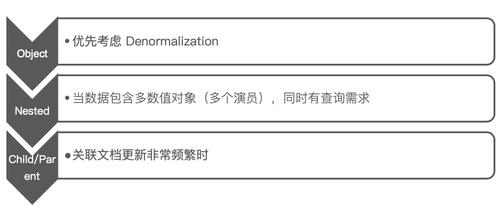
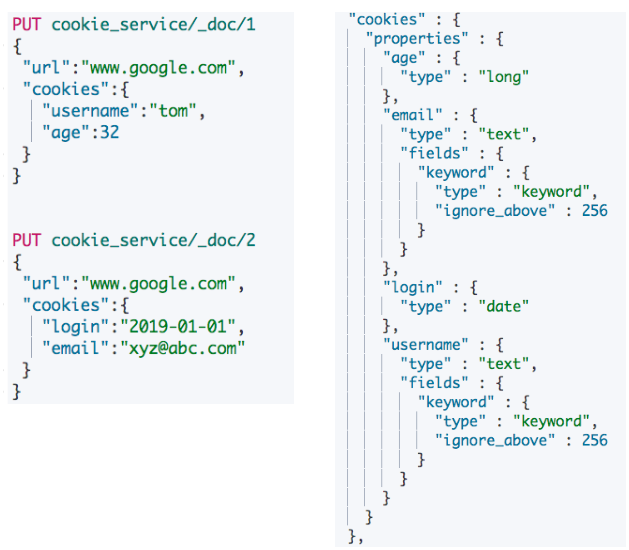
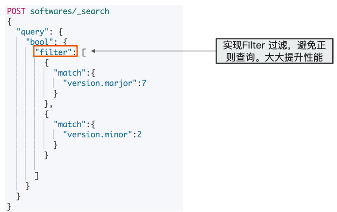
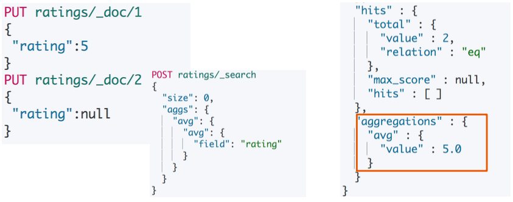
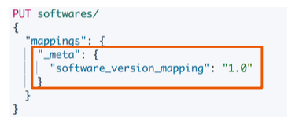

# **第六节 Elasticsearch 数据建模最佳实践**

## **1、建模建议(⼀):如何处理关联关系**



## **2、Kibana......**

* Kibana ⽬前暂不⽀持 nested 类型和 parent/child 类型 ，在未来有可能会支持
* **如果需要使⽤ Kibana 进行数据分析，在数据建模时仍需对嵌套和⽗子关联类型作出取舍**

## **3、建模建议(⼆): 避免过多字段**

* 一个⽂档中，最好避免⼤量的字段 
	* 过多的字段数不容易维护
	* Mapping 信息保存在 Cluster State 中，数据量量过⼤，对集群性能会有影响 (Cluster State 信息需要和所有的节点同步)
	* **删除或者修改数据需要 reindex**
* 默认最⼤字段数是 1000，可以设置 `index.mapping.total_fields.limt` 限定最⼤字段数。 
* 什么原因会导致文档中有成百上千的字段?

## **4、Dynamic v.s Strict**

* **Dynamic(⽣产环境中，尽量不要打开 Dynamic)**
	*  true - 未知字段会被⾃动加入
	*  false - 新字段不会被索引。但是会保存在 `_source`
	*  strict - 新增字段不会被索引，⽂档写⼊失败

* **Strict**
	* 可以控制到字段级别 


## **5、⼀个例⼦:Cookie Service 的数据**



* 来自 Cookie Service 的数据
	* Cookie 的键值对很多
	* 当 Dynamic 设置为 True
	* 同时采用扁平化的设计，必然导致字段数量的膨胀

```
##索引数据，dynamic mapping 会不断加入新增字段
PUT cookie_service/_doc/1
{
 "url":"www.google.com",
 "cookies":{
   "username":"tom",
   "age":32
 }
}

PUT cookie_service/_doc/2
{
 "url":"www.amazon.com",
 "cookies":{
   "login":"2019-01-01",
   "email":"xyz@abc.com"
 }
}
```

```
GET cookie_service/_mapping
```

**Output:**

```
{
  "cookie_service" : {
    "mappings" : {
      "properties" : {
        "cookies" : {
          "properties" : {
            "age" : {
              "type" : "long"
            },
            "email" : {
              "type" : "text",
              "fields" : {
                "keyword" : {
                  "type" : "keyword",
                  "ignore_above" : 256
                }
              }
            },
            "login" : {
              "type" : "date"
            },
            "username" : {
              "type" : "text",
              "fields" : {
                "keyword" : {
                  "type" : "keyword",
                  "ignore_above" : 256
                }
              }
            }
          }
        },
        "url" : {
          "type" : "text",
          "fields" : {
            "keyword" : {
              "type" : "keyword",
              "ignore_above" : 256
            }
          }
        }
      }
    }
  }
}
```


## **6、解决⽅案:Nested Object & Key Value**


**`"type": "nested",`**

### **6-1 使用 Nested 对象，增加key/value**

```
DELETE cookie_service

PUT cookie_service
{
  "mappings": {
    "properties": {
      "cookies": {
        "type": "nested",
        "properties": {
          "name": {
            "type": "keyword"
          },
          "dateValue": {
            "type": "date"
          },
          "keywordValue": {
            "type": "keyword"
          },
          "IntValue": {
            "type": "integer"
          }
        }
      },
      "url": {
        "type": "text",
        "fields": {
          "keyword": {
            "type": "keyword",
            "ignore_above": 256
          }
        }
      }
    }
  }
}
```

***Output:***

```
{
  "acknowledged" : true,
  "shards_acknowledged" : true,
  "index" : "cookie_service"
}
```

### **6-2 写入数据，使用key和合适类型的value字段**

```
PUT cookie_service/_doc/1
{
 "url":"www.google.com",
 "cookies":[
    {
      "name":"username",
      "keywordValue":"tom"
    },
    {
       "name":"age",
      "intValue":32

    }

   ]
 }


PUT cookie_service/_doc/2
{
 "url":"www.amazon.com",
 "cookies":[
    {
      "name":"login",
      "dateValue":"2019-01-01"
    },
    {
       "name":"email",
      "IntValue":32

    }

   ]
 }

```

### **6-3 写⼊ & 查询**


**Nested 查询，通过bool查询进行过滤**

```
POST cookie_service/_search
{
  "query": {
    "nested": {
      "path": "cookies",
      "query": {
        "bool": {
          "filter": [
            {
            "term": {
              "cookies.name": "age"
            }},
            {
              "range":{
                "cookies.intValue":{
                  "gte":30
                }
              }
            }
          ]
        }
      }
    }
  }
}
```

***Output***

```
"hits" : [
      {
        "_index" : "cookie_service",
        "_type" : "_doc",
        "_id" : "1",
        "_score" : 0.0,
        "_source" : {
          "url" : "www.google.com",
          "cookies" : [
            {
              "name" : "username",
              "keywordValue" : "tom"
            },
            {
              "name" : "age",
              "intValue" : 32
            }
          ]
        }
      }
    ]
```

### **6-4 通过 Nested 对象保存 Key/Value 的⼀些不足**

* 可以减少字段数量，解决 Cluster State 中保存过多 Meta 信息的问题，但是
	* **导致查询语句复杂度增加**
	*  Nested 对象，不利于在 Kibana 中实现可视化分析

## **7、建模建议(三):避免正则查询**

**问题:**

* 正则，通配符查询，前缀查询属于 Term 查询，**但是性能不够好** 
* **特别是将通配符放在开头，会导致性能的灾难**

**案例:**

* 文档中某个字段包含了 Elasticsearch 的版本信息，例如 version: “7.1.0”
* 搜索所有是 bug fix 的版本?每个主要版本号所关联的⽂文档?

```
# 在Mapping中加入元信息，便于管理
PUT softwares/
{
  "mappings": {
    "_meta": {
      "software_version_mapping": "1.0"
    }
  }
}
```

```
GET softwares/_mapping

PUT softwares/_doc/1
{
  "software_version":"7.1.0"
}
```

```
POST softwares/_search
{}
```

Output:

```
hits" : [
      {
        "_index" : "softwares",
        "_type" : "_doc",
        "_id" : "1",
        "_score" : 1.0,
        "_source" : {
          "software_version" : "7.1.0"
        }
      }
    ]
```


### **7-1 解决⽅案:将字符串转换为对象**

```
DELETE softwares

# 优化,使用inner object
PUT softwares/
{
  "mappings": {
    "_meta": {
      "software_version_mapping": "1.1"
    },
    "properties": {
      "version": {
        "properties": {
          "display_name": {
            "type": "keyword"
          },
          "hot_fix": {
            "type": "byte"
          },
          "marjor": {
            "type": "byte"
          },
          "minor": {
            "type": "byte"
          }
        }
      }
    }
  }
}
```

**通过 Inner Object 写入多个文档**

```
#通过 Inner Object 写入多个文档
PUT softwares/_doc/1
{
  "version":{
  "display_name":"7.1.0",
  "marjor":7,
  "minor":1,
  "hot_fix":0  
  }

}

PUT softwares/_doc/2
{
  "version":{
  "display_name":"7.2.0",
  "marjor":7,
  "minor":2,
  "hot_fix":0  
  }
}

PUT softwares/_doc/3
{
  "version":{
  "display_name":"7.2.1",
  "marjor":7,
  "minor":2,
  "hot_fix":1  
  }
}
```

### **7-2 搜索过滤**



```
# 通过 bool 查询，
POST softwares/_search
{
  "query": {
    "bool": {
      "filter": [
        {
          "match":{
            "version.marjor":7
          }
        },
        {
          "match":{
            "version.minor":2
          }
        }

      ]
    }
  }
}
```

***Output:***

```
"max_score" : 0.0,
    "hits" : [
      {
        "_index" : "softwares",
        "_type" : "_doc",
        "_id" : "2",
        "_score" : 0.0,
        "_source" : {
          "version" : {
            "display_name" : "7.2.0",
            "marjor" : 7,
            "minor" : 2,
            "hot_fix" : 0
          }
        }
      },
      {
        "_index" : "softwares",
        "_type" : "_doc",
        "_id" : "3",
        "_score" : 0.0,
        "_source" : {
          "version" : {
            "display_name" : "7.2.1",
            "marjor" : 7,
            "minor" : 2,
            "hot_fix" : 1
          }
        }
      }
    ]
```

## **8、建模建议(四):避免空值引起的聚合不准**




```

PUT ratings/_doc/1
{
 "rating":5
}
PUT ratings/_doc/2
{
 "rating":null
}

POST ratings/_search
{
  "size": 0,
  "aggs": {
    "avg": {
      "avg": {
        "field": "rating"
      }
    }
  }
}
```

***Output:***

```
"hits" : {
    "total" : {
      "value" : 2,
      "relation" : "eq"
    },
    "max_score" : null,
    "hits" : [ ]
  },
"aggregations" : {
    "avg" : {
      "value" : 5.0
    }
  }
```

**"value" : 5.0 是不对的**


### 8-1 **Not Null 解决聚合的问题**

```
DELETE ratings

PUT ratings
{
  "mappings": {
      "properties": {
        "rating": {
          "type": "float",
          "null_value": 1.0
        }
      }
    }
}


PUT ratings/_doc/1
{
 "rating":5
}
PUT ratings/_doc/2
{
 "rating":null
}
```

 ```
 POST ratings/_search
{
  "size": 0,
  "aggs": {
    "avg": {
      "avg": {
        "field": "rating"
      }
    }
  }
}
```

***Output***

```
 "hits" : {
    "total" : {
      "value" : 2,
      "relation" : "eq"
    },
    "max_score" : null,
    "hits" : [ ]
  },
  "aggregations" : {
    "avg" : {
      "value" : 3.0
    }
  }
 ```

*  `"value" : 3.0` 得到正确的输出

## **9、建模建议(五): 为索引的 Mapping 加⼊ Meta 信息**


* **Mappings 设置⾮常重要，需要从两个维度进⾏考虑**
	* 功能:搜索，聚合，排序
	* 性能:
		* 存储的开销;
		* 内存的开销;
		* 搜索的性能
* **Mappings 设置是⼀个迭代的过程**
	* **加⼊新的字段很容易(必要时需要 `update_by_query`)**
	* **更新删除字段不允许(需要 Reindex 重建数据)**
	* 最好能对 `Mappings` 加⼊ `Meta` 信息，更好的进⾏版本管理
	* **可以考虑将 Mapping ⽂件上传 git 进⾏管理**

	

## **10、本章知识点**

* 数据建模对于功能与性能⾄关重要。 Mapping ⽂文件需要考虑加⼊入版本管理理
* 通过 2 个例子，了解如何通过建模，提⾼系统的性能
	* 使⽤用 Inner Object 避免了了低性能的正则匹配
	*** 使⽤ Nested Object 和将 Dynamic Mapping 设为 Strict 避免字段数量过多带来的问题**
* 通过 1 个例⼦，了解如何通过建模，提⾼聚合结果的准确度
	* **设置 Null Value**

	
不过原则都是一样，不管用什么数据库：

* 1：要满足功能需求
* 2：存储最小化
* 3：性能最大化