# **第一节 集群身份认证与用户鉴权**

* 如何为集群启用X-Pack Security
* 如何为内置用户设置密码
* 设置 Kibana与ElasticSearch通信鉴权
* 使用安全API创建对特定索引具有有限访问权限的用户


This tutorial involves a single node cluster, but if you had multiple nodes, you would enable Elasticsearch security features on every node in the cluster and configure Transport Layer Security (TLS) for internode-communication, which is beyond the scope of this tutorial. By enabling single-node discovery, we are postponing the configuration of TLS. For example, add the following setting:

discovery.type: single-node

**5700 万用户数据泄漏**

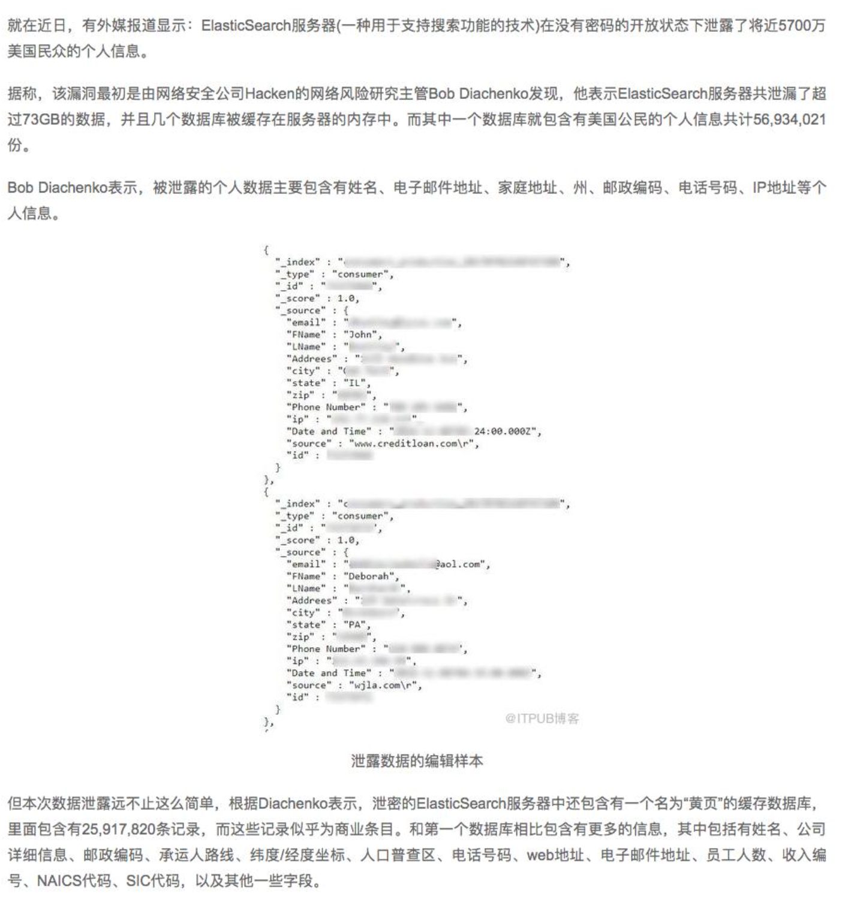

**1.08 亿条投注信息泄漏**

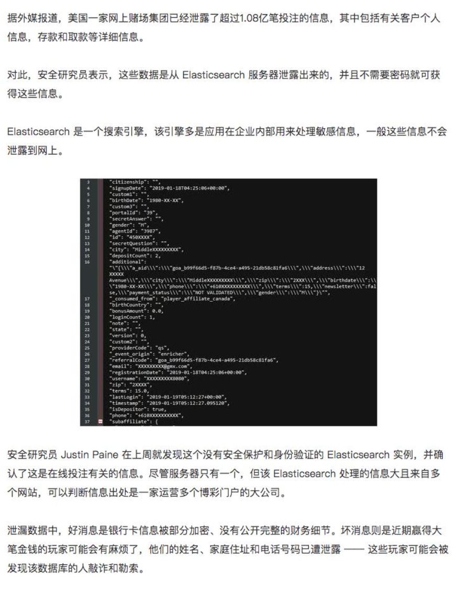


## **1、原因分析**

* Elasticsearch 在默认安装后，不提供任何形式的安全防护
* 错误的配置信息导致公网可以访问 ES 集群
* 在 `elasticsearch.yml` 文件中， `server.host` 被错误的配置为 `0.0.0.0`

## **2、数据安全性的基本需求**

* 身份认证
	* 鉴定用户是否合法
* 用户鉴权
	* 指定那个用户可以访问哪个索引
* 传输加密 
* 日志审计

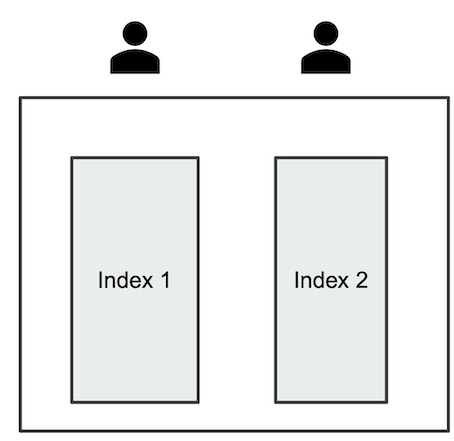

## **3、一些免费的方案**

* 设置 Nginx 反向代理
* 安装免费的 Security 插件
	* Search Guard - [https://search-guard.com/](https://search-guard.com/)
	* ReadOnly REST - [https://github.com/sscarduzio/elasticsearch-readonlyrest-plugin](https://github.com/sscarduzio/elasticsearch-readonlyrest-plugin)
* X-Pack 的 Basic 版
	* 从 ES 6.8 & ES 7.0 开始，Security 纳入 x-pack 的 Basic 版本中，免费使用一些基本的功能
	* [https://www.elastic.co/what-is/elastic-stack-security](https://www.elastic.co/what-is/elastic-stack-security)

## **4、Authentication - 身份认证**

* 认证体系的几种类型
	*  提供用户名和密码
	*  提供秘钥或 Kerberos 票据

* Realms:X-Pack 中的认证服务
	* 内置 Realms (免费)
		* File / Native(用户名密码保存在 Elasticsearch)
	* 外部 Realms (收费)

## **5、RBAC - 用户鉴权**

* 什么是 RBAC:Role Based Access Control， 定义一个角色，并分配一组权限。权限包括索引 级，字段级，集群级的不同的操作。然后通过将角色分配给用户，使得用户拥有这些权限
	* User —— The authenticated User
	* Role —— A named set of permission
	* Permission —— A set of one or more privileges against a secured resource
	* Privilege —— A named group of 1 or more actions that user may execute against a secured resource

## **6、Privilege**

### **6-1 Cluster Privileges**

all / monitor / manager / `manage_index` / `manage_index_template` / `manage_rollup`

### **6-2 Indices Privileges**

all / create / `create_index` / delete / `delete_index` / index / manage / read /write /`view_index_metadata`

## **7、创建内置的用户和角色**

**内置的角色与用户**

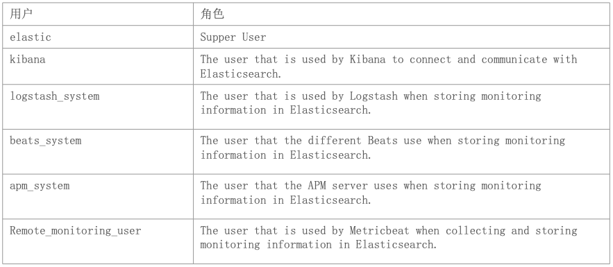

## **8、使用 Security API 创建用户**

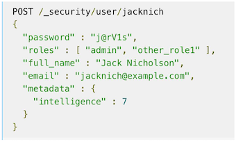

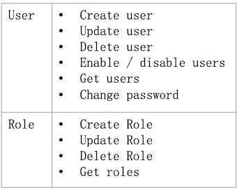

## **9、开启并配置 `X-Pack` 的认证与鉴权**

###  **9-1 修改配置文件，打开认证与授权**

```
bin/elasticsearch -E node.name=node0 -E cluster.name=geektime -E path.data=node0_data -E http.port=9200 -E xpack.security.enabled=true
```

新版本需要打开SSL： `xpack.security.transport.ssl.enabled=true`

```
elasticsearch -E node.name=node0 -E cluster.name=jx -E path.data=node0_data -E http.port=9200 -E xpack.security.enabled=true -E xpack.security.transport.ssl.enabled=true 
```

使用Curl访问ES，或者浏览器访问 `“localhost:9200/_cat/nodes?pretty”`。返回401错误

`curl 'localhost:9200/_cat/nodes?pretty'`

### **9-2 创建默认的用户和分组**

```
cd /usr/share/elasticsearch/
bin/elasticsearch-setup-passwords interactive
```

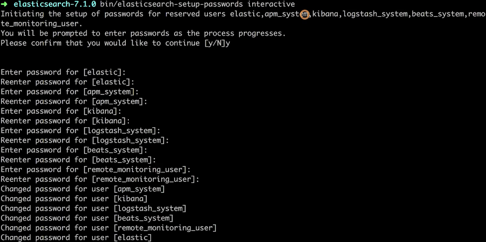

* changeme

```
localhost:9200/_cat/nodes
```

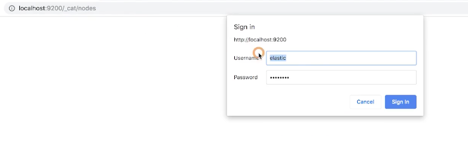

* elastic
* changeme

### **9-3 当集群开启身份认证之后，配置 Kibana**

* Demo
	* 创建一个 Role，配置为对某个索引只读权限 / 创建一个用户，把用户加入 Role

## **10、配置 Kibana**

修改 kibana.yml

```
# If your Elasticsearch is protected with basic authentication, these settings provide
# the username and password that the Kibana server uses to perform maintenance on the Kibana
# index at startup. Your Kibana users still need to authenticate with Elasticsearch, which
# is proxied through the Kibana server.
#elasticsearch.username: "kibana_system"
#elasticsearch.password: "pass"
```

* `elasticsearch.username: "kibana"`
* `elasticsearch.password: "changeme" `


`sudo vim /usr/share/kibana/config/kibana.yml`

后台运行 kibana

```
nohup kibana &
```

```
http://192.168.33.12:5601/
#启动。使用用户名，elastic，密码elastic，特权账户
```

```
POST orders/_bulk
{"index":{}}
{"product" : "1","price" : 18,"payment" : "master","card" : "9876543210123456","name" : "jack"}
{"index":{}}
{"product" : "2","price" : 99,"payment" : "visa","card" : "1234567890123456","name" : "bob"}
```

**信息信息中包含敏感信息，需要给限制特殊用户的访问权限**


### **10-1 创建 Role**

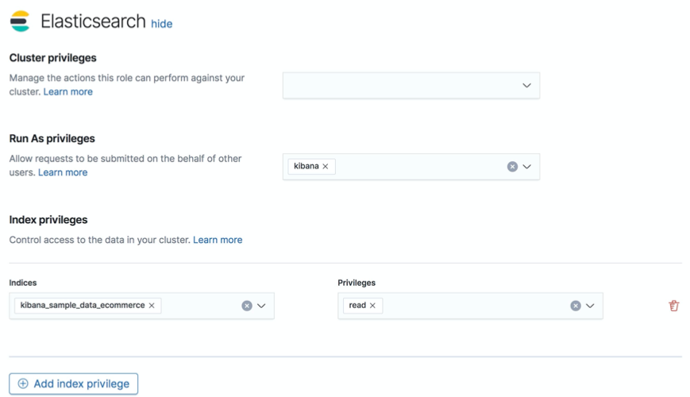

* **create a new role named `read_only_orders`, that satisfies the following criteria:**
	* The role has no cluster privileges
	* The role only has access to indices that match the pattern `orders`
	* The index privileges are **read**, and **`view_index_metadata`**

### **10-2 创建用户**

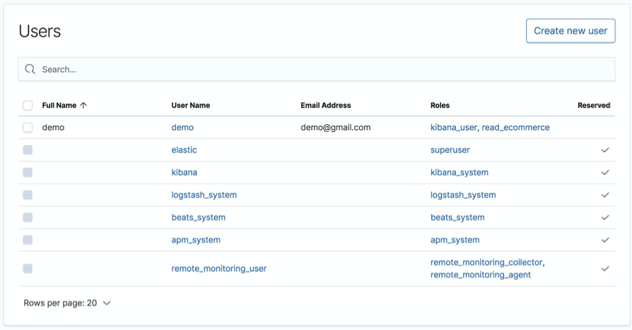

* create `demo` user that satisfies the following criteria:
	*  Use your own email address
	*  Assign the user to two roles: `read_only_orders` and `kibana_user`

### **10-3 删除索引失败**

```
#验证读权限,可以执行
POST orders/_search
{}
```

```
#验证写权限,报错
POST orders/_bulk
{"index":{}}
{"product" : "1","price" : 18,"payment" : "master","card" : "9876543210123456","name" : "jack"}
{"index":{}}
{"product" : "2","price" : 99,"payment" : "visa","card" : "1234567890123456","name" : "bob"}
```

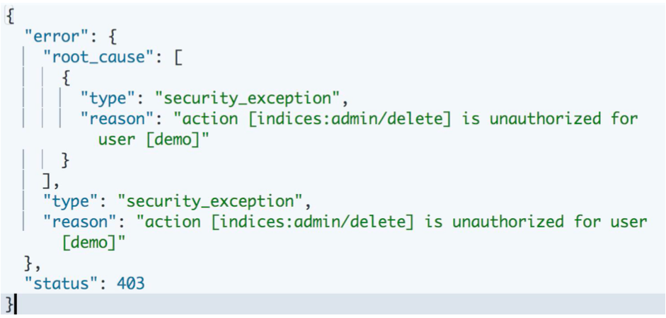

## **11、本节知识点**

* 为什么需要保护 ES 中的数据
* 如何使用 X-Pack Security 保护你的数据
* Elasticsearch 中 RBAC 的机制和默认创建的用户和角色
* 配置 Elasticsearch 和 Kibana 开启 身份认证和用户鉴权
* 使用 Native Realm，通过 API 和 Kibana 管理用户分组和权限


[https://www.elastic.co/guide/en/elasticsearch/reference/7.1/configuring-security.html](https://www.elastic.co/guide/en/elasticsearch/reference/7.1/configuring-security.html)