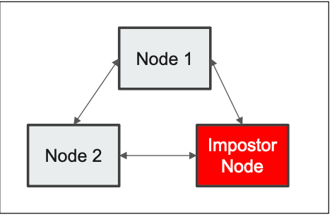
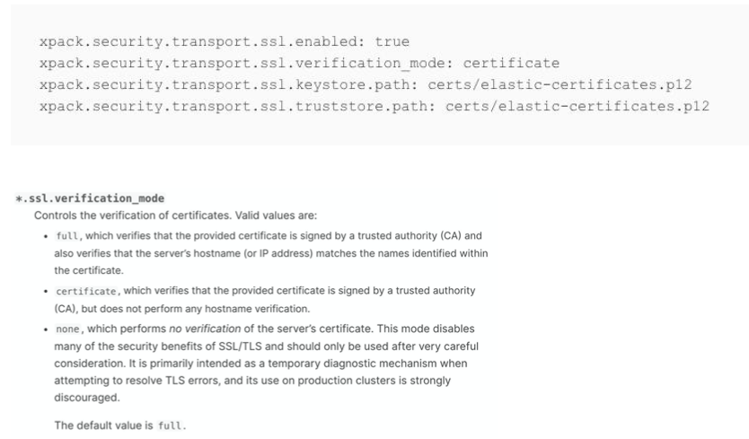

# **第二节 集群内部间的安全通信**

## **1、为什么要加密通讯**

* 加密数据 – 避免数据抓包，敏感信息泄漏
* 验证身份 – 避免 Impostor Node
	* Data / Cluster State



## **2、为节点创建证书**

### **2-1 TLS**

TLS 协议要求 Trusted Certificate Authority(CA)签发的 X.509的证书

### **2-2 证书认证的不同级别**
 
 * Certificate – 节点加入需要使用相同 CA 签发的证书
 * Full Verification – 节点加入集群需要相同 CA 签发的证书，还需要验证 Host name 或 IP 地址
 * No Verification – 任何节点都可以加入，开发环境中用于诊断目的

 
## **3、生成节点证书**
 
* `bin/elasticsearch-certutil ca`
* `bin/elasticsearch-certutil cert --ca elastic-stack-ca.p12`
* [https://www.elastic.co/guide/en/elasticsearch/reference/7.1/configuring-tls.html](https://www.elastic.co/guide/en/elasticsearch/reference/7.1/configuring-tls.html)

## **4、配置节点间通讯**



* 生成证书
* 为您的Elasticearch集群创建一个证书颁发机构。例如，使用elasticsearch-certutil ca命令：

```
$ bin/elasticsearch-certutil ca
This tool assists you in the generation of X.509 certificates and certificate
signing requests for use with SSL/TLS in the Elastic stack.

The 'ca' mode generates a new 'certificate authority'
This will create a new X.509 certificate and private key that can be used
to sign certificate when running in 'cert' mode.

Use the 'ca-dn' option if you wish to configure the 'distinguished name'
of the certificate authority

By default the 'ca' mode produces a single PKCS#12 output file which holds:
    * The CA certificate
    * The CA's private key

If you elect to generate PEM format certificates (the -pem option), then the output will
be a zip file containing individual files for the CA certificate and private key

Please enter the desired output file [elastic-stack-ca.p12]: 
Enter password for elastic-stack-ca.p12 :
```

```
$ ls | grep elastic-stack-ca
elastic-stack-ca.p12
```

**为群集中的每个节点生成证书和私钥。例如，使用elasticsearch-certutil cert 命令：**

```
$ bin/elasticsearch-certutil cert --ca elastic-stack-ca.p12


 bin/elasticsearch-certutil cert --ca elastic-stack-ca.p12
This tool assists you in the generation of X.509 certificates and certificate
signing requests for use with SSL/TLS in the Elastic stack.

The 'cert' mode generates X.509 certificate and private keys.
    * By default, this generates a single certificate and key for use
       on a single instance.
    * The '-multiple' option will prompt you to enter details for multiple
       instances and will generate a certificate and key for each one
    * The '-in' option allows for the certificate generation to be automated by describing
       the details of each instance in a YAML file

    * An instance is any piece of the Elastic Stack that requires an SSL certificate.
      Depending on your configuration, Elasticsearch, Logstash, Kibana, and Beats
      may all require a certificate and private key.
    * The minimum required value for each instance is a name. This can simply be the
      hostname, which will be used as the Common Name of the certificate. A full
      distinguished name may also be used.
    * A filename value may be required for each instance. This is necessary when the
      name would result in an invalid file or directory name. The name provided here
      is used as the directory name (within the zip) and the prefix for the key and
      certificate files. The filename is required if you are prompted and the name
      is not displayed in the prompt.
    * IP addresses and DNS names are optional. Multiple values can be specified as a
      comma separated string. If no IP addresses or DNS names are provided, you may
      disable hostname verification in your SSL configuration.

    * All certificates generated by this tool will be signed by a certificate authority (CA).
    * The tool can automatically generate a new CA for you, or you can provide your own with the
         -ca or -ca-cert command line options.

By default the 'cert' mode produces a single PKCS#12 output file which holds:
    * The instance certificate
    * The private key for the instance certificate
    * The CA certificate

If you specify any of the following options:
    * -pem (PEM formatted output)
    * -keep-ca-key (retain generated CA key)
    * -multiple (generate multiple certificates)
    * -in (generate certificates from an input file)
then the output will be be a zip file containing individual certificate/key files

Enter password for CA (elastic-stack-ca.p12) : 
Please enter the desired output file [elastic-certificates.p12]: 
Enter password for elastic-certificates.p12 : 

Certificates written to /usr/share/elasticsearch/elastic-certificates.p12

This file should be properly secured as it contains the private key for 
your instance.

This file is a self contained file and can be copied and used 'as is'
For each Elastic product that you wish to configure, you should copy
this '.p12' file to the relevant configuration directory
and then follow the SSL configuration instructions in the product guide.

For client applications, you may only need to copy the CA certificate and
configure the client to trust this certificate.
```

将证书拷贝到 `/etc/elasticsearch/certs/` 目录下

```
cd /usr/share/elasticsearch
mkdir /etc/elasticsearch/certs/
cp elastic-stack-ca.p12 elastic-certificates.p12 /etc/elasticsearch/certs/
```

`elasticsearch.yml` 配置

```
xpack.security.transport.ssl.enabled: true
xpack.security.transport.ssl.verification_mode: certificate

xpack.security.transport.ssl.keystore.path: certs/elastic-certificates.p12
xpack.security.transport.ssl.truststore.path: certs/elastic-certificates.p12
```

```
# ES 启用 https
elasticsearch -E node.name=node0 -E cluster.name=jx -E path.data=node0_data -E http.port=9200 -E xpack.security.enabled=true -E xpack.security.transport.ssl.enabled=true -E xpack.security.transport.ssl.verification_mode=certificate -E xpack.security.transport.ssl.keystore.path=certs/elastic-certificates.p12 -E xpack.security.http.ssl.enabled=true -E xpack.security.http.ssl.keystore.path=certs/elastic-certificates.p12 -E xpack.security.http.ssl.truststore.path=certs/elastic-certificates.p12


elasticsearch -E node.name=node1 -E cluster.name=jx -E path.data=node0_data -E http.port=9201 -E xpack.security.enabled=true -E xpack.security.transport.ssl.enabled=true -E xpack.security.transport.ssl.verification_mode=certificate -E xpack.security.transport.ssl.keystore.path=certs/elastic-certificates.p12 -E xpack.security.http.ssl.enabled=true -E xpack.security.http.ssl.keystore.path=certs/elastic-certificates.p12 -E xpack.security.http.ssl.truststore.path=certs/elastic-certificates.p12

```

**不提供证书的节点，无法加入**

```
bin/elasticsearch -E node.name=node2 -E cluster.name=geektime -E path.data=node2_data -E http.port=9202 -E xpack.security.enabled=true -E xpack.security.transport.ssl.enabled=true -E xpack.security.transport.ssl.verification_mode=certificate
```


## **5、本节知识点**

* 为什么内部通信需要加密
* 创建 Certificate Authority (CA)和节点的 Certificates
* 配置 Elasticsearch节点间通信加密


[https://www.elastic.co/guide/en/elasticsearch/reference/current/configuring-tls.html](https://www.elastic.co/guide/en/elasticsearch/reference/current/configuring-tls.html)