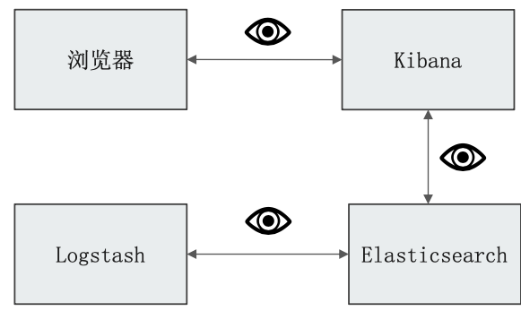
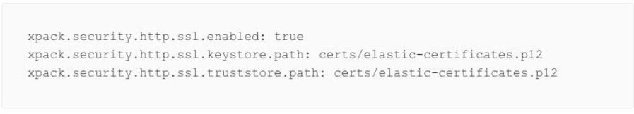
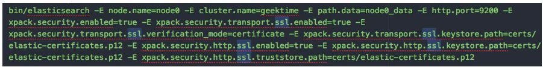
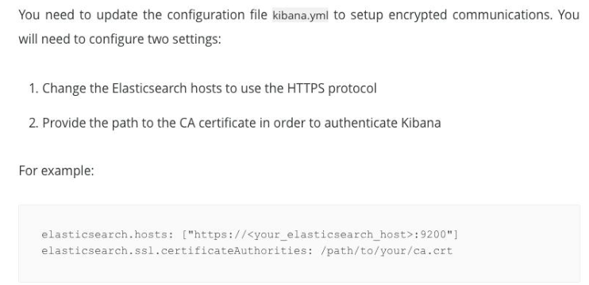
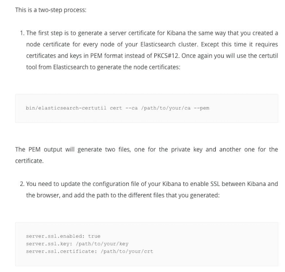

# **第三节 集群与外部间的安全通信**

### **本节知识点**

* 使用 HTTPS 的重要性
* 配置 Elasticsearch
* 配置 Kibana
	* Kibana to Elasticsearch 
	* Browser to Kibana

	
## **1、为什么需要 HTTPS**



### **1-1、配置 Elasticsearch for HTTPS**





```
elasticsearch -E node.name=node0 -E cluster.name=jx -E path.data=node0_data -E http.port=9200 -E xpack.security.enabled=true -E xpack.security.transport.ssl.enabled=true -E xpack.security.transport.ssl.verification_mode=certificate -E xpack.security.transport.ssl.keystore.path=certs/elastic-certificates.p12 -E xpack.security.http.ssl.enabled=true -E xpack.security.http.ssl.keystore.path=certs/elastic-certificates.p12 -E xpack.security.http.ssl.truststore.path=certs/elastic-certificates.p12 -E xpack.security.authc.anonymous.username=true
```

`https://192.168.33.12:9200/_cat/health?v`

## **2、配置 Kibana 连接 ES HTTPS**




```
sudo mkdir /usr/share/kibana/config/certs/ && cd /usr/share/kibana/config/certs/

# 为kibana生成pem
openssl pkcs12 -in elastic-certificates.p12 -cacerts -nokeys -out elastic-ca.pem

```

```
sudo vim /usr/share/kibana/config/kibana.yml


elasticsearch.hosts: ["https://localhost:9200"]
elasticsearch.ssl.certificateAuthorities: [ "/usr/share/kibana/config/certs/elastic-ca.pem" ]
elasticsearch.ssl.verificationMode: certificate
```

后台运行 kibana

```
nohup kibana &
```

```
http://192.168.33.12:5601/
```

## **3、配置使用 HTTPS 访问 Kibana**



```
# 为 Kibna 配置 HTTPS
# 生成后解压，包含了instance.crt 和 instance.key
bin/elasticsearch-certutil ca --pem
sudo cp instance.crt instance.key /usr/share/kibana/config/certs/
```


```
sudo vim /usr/share/kibana/config/kibana.yml


server.ssl.enabled: true
server.ssl.certificate: config/certs/instance.crt
server.ssl.key: config/certs/instance.key
```

后台运行 kibana

```
nohup kibana &
```

```
https://192.168.33.12:5601/
```

[https://www.elastic.co/guide/en/elasticsearch/reference/current/configuring-tls.html#tls-http](https://www.elastic.co/guide/en/elasticsearch/reference/current/configuring-tls.html#tls-http)