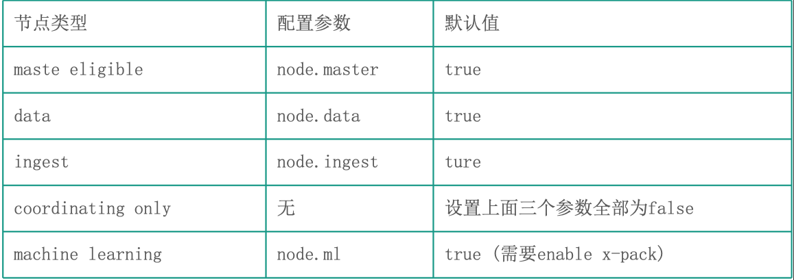
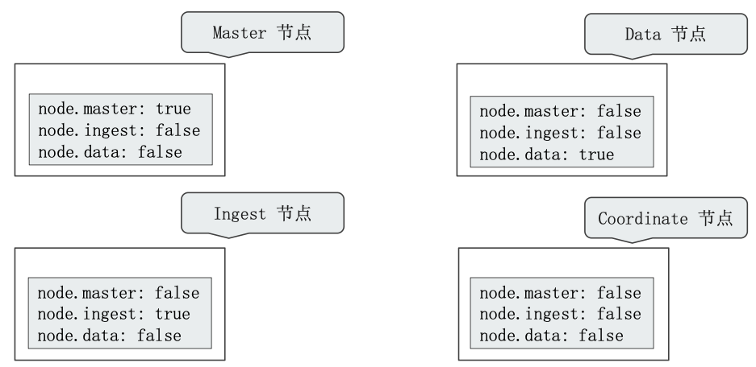
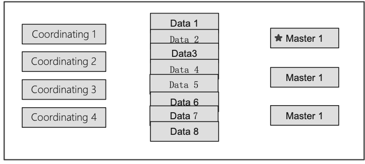
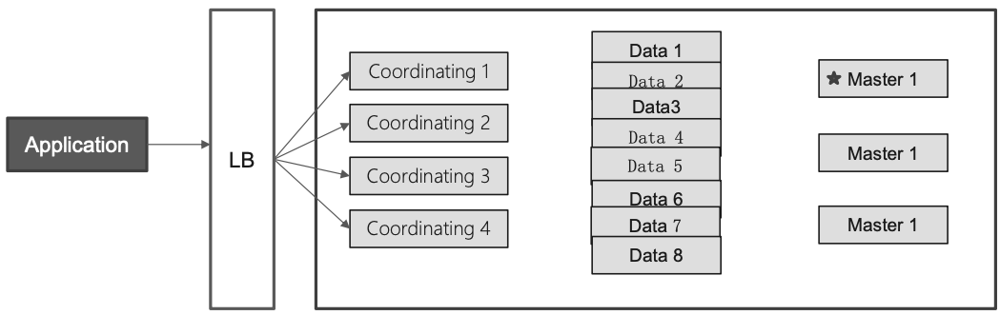
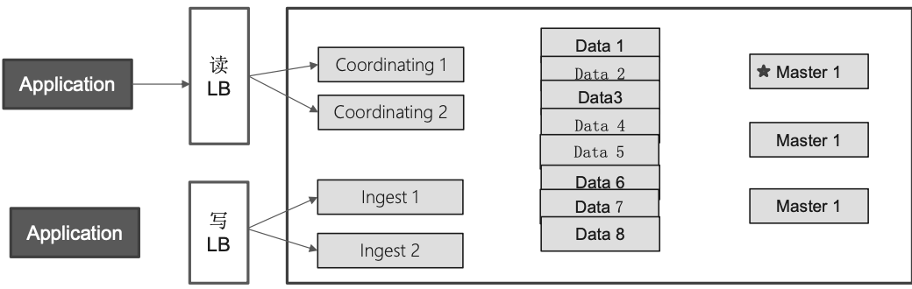
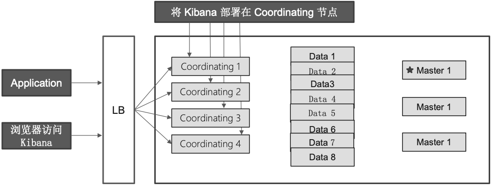
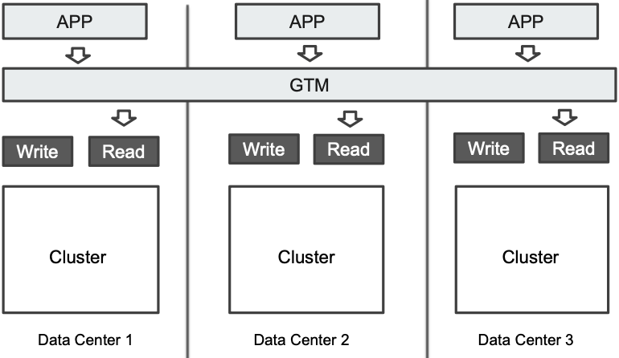

# **第一节 常见的集群部署方式**

## **1、节点类型**

* **不同角色的节点**
	* Master eligible / Data / Ingest / Coordinating / Machine Learning
* 在开发环境中，一个节点可承担多种角色
* 在生产环境中，
	* 根据数据量，写入和查询的吞吐量，选择合适的部署方式
	* **建议设置单一角色的节点(dedicated node)**

## **2、节点参数配置**

一个节点在默认情况会下同时扮演: **master eligible，data node 和 ingest node**

### **2-1 单一职责的节点**

一个节点只承担一个角色

### **2-2 单一角色:职责分离的好处**

* Dedicated master eligible nodes:负责集群状态(cluster state)的管理
	* 使用**低配置的 CPU，RAM 和磁盘**
* Dedicated data nodes: **负责数据存储及处理客户端请求**
	* 使用**高配置的 CPU, RAM 和磁盘**
* Dedicated ingest nodes:**负责数据处理**
	* 使用**高配置 CPU;中等配置的RAM; 低配置的磁盘**

### **2-3 Dedicate Coordinating Only Node (Client Node)**

* **配置:将 Master，Data，Ingest 都配置成 False**
	* Medium/High CUP;
	* Medium/High RAM;
	* Low Disk
* 生产环境中，建议为一些大的集群配置 Coordinating Only Nodes
	* **扮演 Load Balancers**。降低 Master 和 Data Nodes 的负载
	* **负责搜索结果的 Gather/Reduce**
	* 有时候无法预知客户端会发送怎么样的请求
		* **大量占用内存的结合操作，一个深度聚合可能会引发 OOM**

### **2-4 Dedicate Master Node**

从高可用 & 避免脑裂的角度出发

* 一般在生产环境中配置 3 台
* 一个集群只有 1 台活跃的主节点
	* 负责分片管理，索引创建，集群管理等操作

**如果和数据节点或者 Coordinate 节点混合部署**

* **数据节点相对有比较大的内存占用**
* Coordinate 节点有时候可能会有开销很高的查询，导致 OOM
* **这些都有可能影响 Master 节点，导致集群的不稳定**

### **2-5 基本部署:增加节点，水平扩展**

* 当磁盘容量无法满足需求时，可以增加数据节点; 
* 磁盘读写压力大时，增加数据节点

### **2-6 水平扩展:Coordinating Only Node**

当系统中有**大量的复杂查询及聚合时候**，**增加 Coordinating 节点，增加查询的性能**

### **2-7 读写分离**

### **2-8 在集群中部署 Kibana**

### **2-9 异地多活的部署**

集群处在三个数据中心;数据三写;GTM 分发读请求

**GTM Global Traffic Manager，一种负载均衡**

### **2-10 Q&A**

* 如果有创建索引的请求发送到了coordinating节点上，会被coordinating节点转发到master节点上么？

> 索引的创建，都需要通过master节点执行的

* 请问ES集群，操作系统磁盘使用RAID5还是RAID0，或者裸盘，哪个性能最好？

> 理论上不需要做raid。 存储推荐使用ssd，在warm节点机械盘可以考虑。网络存储不推荐。

* es节点按职责划分后，es客户端连接的es节点列表应该如何配置呢？

> 我们是通过在这些节点的前端设置一个用来写数据的负载均衡，一个读数据的负载均衡。然后将数据的读写逻辑分别配置到这两个loadbalancer上

* elasticsearch还有GTM来支持多写吗

>  GTM主要用来做数据的读取。在多个data center的部署场景。
> 
> gtm背后是几个相同的集群。这几个集群需要确保有相似的数据。
> 
> 所以，你需要程序分别写入这几个集群，保持数据一致。或者就写入一个集群，使用es的跨集群复制确保数据一致。

