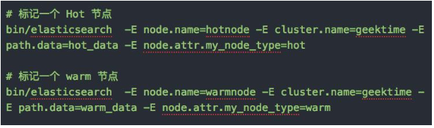
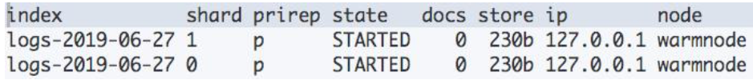
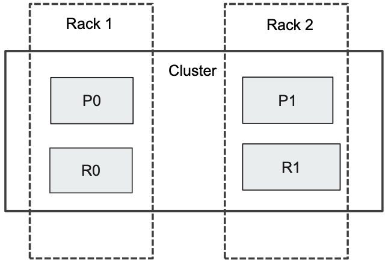
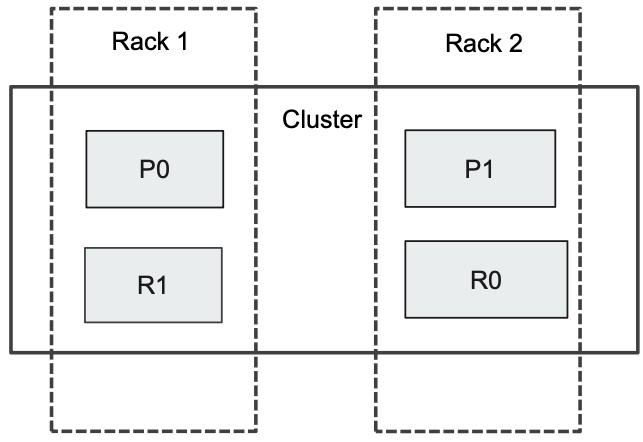
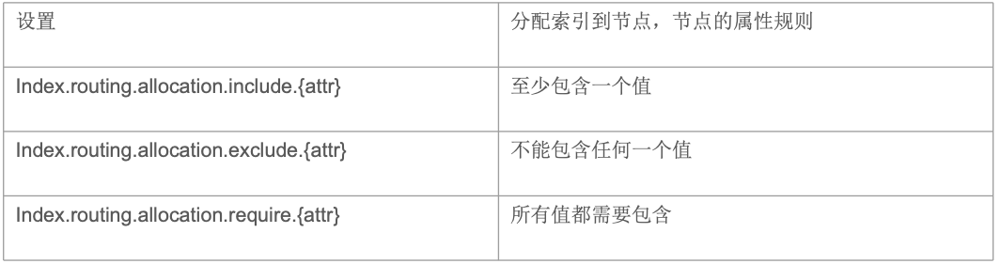

# **第二节 Hot & Warm 架构与 Shard Filtering**


### **日志类应用的部署架构**


## **1、什么是 Hot & Warm Architecture**

* **Hot & Warm Architecture**
	* 数据通常不会有 Update 操作;
	* 适用于 Time based 索引数据(生命周期管理)，同时数据量比较大的场景。
	* 引入 Warm 节点，低配置大容量的机器存放老数据，以降低部署成本
* 两类数据节点, 不同的硬件配置
	* Hot 节点(通常使用 SSD):**索引有不断有新文档写入。通常使用 SSD**
	* Warm 节点(通常使用 HDD):**索引不存在新数据的写入;同时也不存在大量的数据查询**

### **1-1 Hot Nodes**

**用于数据的写入**

* Indexing 对 CPU 和 IO 都有很高的要求。所以需要使用高配置的机器
* 存储的性能要好。建议使用 SSD


### **1-2 Warm Nodes**

**用于保存只读的索引，比较旧的数据**

* 通常使用大容量的磁盘(通常是 Spinning Disks)


### **1-3 配置 Hot & Warm Architecture**

使用 Shard Filtering，步骤分为以下几步

* 标记节点 (Tagging)
* 配置索引到 Hot Node
* 配置索引到 Warm 节点

### **1-4 标记节点**

**需要通过 “node.attr” 来标记一个节点**

* 节点的 attribute可以是任何的 key/value
* 可以通过 `elasticsearch.yml` 或者通过 `–E` 命令指定




### **1-5 配置 Hot 数据**

 创建索引时候，指定将其创建在 hot 节点上
 
 
 
 
  
### **1-6 旧数据移动到 Warm 节点**

**`Index.routing.allocation` 是一个索引级的 `dynamic setting`，可以通过 `API` 在后期进行设定**

* Curator / Index Life Cycle Management Tool


 

 
```
elasticsearch  -E node.name=hotnode -E cluster.name=jx -E path.data=node0_data -E node.attr.my_node_type=hot

elasticsearch  -E node.name=warmnode -E cluster.name=jx -E path.data=node1_data -E node.attr.my_node_type=warm
```

为啥不是`path.data=hot_data` & `path.data=warm_data`，本机没有这个文件目录，会导致集群启动失败

```
 [hotnode] master not discovered yet, this node has not previously joined a bootstrapped (v7+) cluster, and this node must discover master-eligible nodes [127.0.0.1:9300] to bootstrap a cluster: have discovered [{hotnode}{nwTLh_enQW-VRDHbGWG_iw}{zdk5R2yATLSrZoYUNEWovQ}{172.16.72.169}{172.16.72.169:9300}{dilmrt}{ml.machine_memory=3973804032, xpack.installed=true, transform.node=true, ml.max_open_jobs=20, type=hot}, {warmnode}{pZBoP-5oQUSb8pWxfWXhlQ}{x5jk1e5CSAmg1C89iVMOMA}{172.16.72.169}{172.16.72.169:9301}{dilmrt}{ml.machine_memory=3973804032, ml.max_open_jobs=20, xpack.installed=true, type=warm, transform.node=true}]; discovery will continue using [127.0.0.1:9300, [::1]:9300, 192.168.33.12:9300] from hosts providers and [{hotnode}{nwTLh_enQW-VRDHbGWG_iw}{zdk5R2yATLSrZoYUNEWovQ}{172.16.72.169}{172.16.72.169:9300}{dilmrt}{ml.machine_memory=3973804032, xpack.installed=true, transform.node=true, ml.max_open_jobs=20, type=hot}] from last-known cluster state; node term 0, last-accepted version 0 in term 0
```

```
http://192.168.33.12:9200/_cat/nodes?v
ip            heap.percent ram.percent cpu load_1m load_5m load_15m node.role master name
172.16.72.169           63          67   4    0.11    0.23     0.23 dilmrt    *      warmnode
172.16.72.169           35          67   6    0.11    0.23     0.23 dilmrt    -      hotnode


http://192.168.33.12:9200/_cat/health?v
epoch      timestamp cluster status node.total node.data shards pri relo init unassign pending_tasks max_task_wait_time active_shards_percent
1606191637 04:20:37  jx      green           2         2     24  12    0    0        0             0                  -                100.0%

http://192.168.33.12:9200/_cat/nodeattrs?v
node     host          ip            attr              value
warmnode 172.16.72.169 172.16.72.169 ml.machine_memory 3973804032
warmnode 172.16.72.169 172.16.72.169 ml.max_open_jobs  20
warmnode 172.16.72.169 172.16.72.169 xpack.installed   true
warmnode 172.16.72.169 172.16.72.169 my_node_type      warm
warmnode 172.16.72.169 172.16.72.169 transform.node    true
hotnode  172.16.72.169 172.16.72.169 ml.machine_memory 3973804032
hotnode  172.16.72.169 172.16.72.169 ml.max_open_jobs  20
hotnode  172.16.72.169 172.16.72.169 xpack.installed   true
hotnode  172.16.72.169 172.16.72.169 my_node_type      hot
hotnode  172.16.72.169 172.16.72.169 transform.node    true
```

```
# 查看节点
GET /_cat/nodeattrs?v

warmnode 172.16.72.169 172.16.72.169 my_node_type      warm
hotnode  172.16.72.169 172.16.72.169 my_node_type      hot
```

```
# 配置到 Hot节点
PUT log-2020-11-02
{
  "settings":{
    "number_of_shards":2,
    "number_of_replicas":0,
    "index.routing.allocation.require.my_node_type":"hot"
  }
}


PUT my_index1/_doc/1
{
  "key":"value"
}

GET _cat/shards?v

log-2020-11-02                 1     p      STARTED     0    208b 172.16.72.169 hotnode
log-2020-11-02                 0     p      STARTED     0    208b 172.16.72.169 hotnode
```

```
# 配置到 warm 节点
PUT log-2020-11-02/_settings
{  
  "index.routing.allocation.require.my_node_type":"warm"
}


GET _cat/shards?v

log-2020-11-02                 1     p      STARTED     0    208b 172.16.72.169 warmnode
log-2020-11-02                 0     p      STARTED     0    208b 172.16.72.169 warmnode
```


## **2、Rack Awareness**

### **2-1 Rack**

ES 的节点可能分布在不同的机架

* 当一个机架断电，**可能会同时丢失几个节点**
* **如果一个索引相同的主分片和副本分片，同时在这个机架上，就有可能导致数据的丢失**
* 通过 Rack Awareness 的机制， **就可以尽可能避免将同一个索引的主副分片同时分配在一个机架的节点上**



### **2-2 标记 Rack 节点 + 配置集群**

**标记一个 rack 1, rack2**

```
elasticsearch  -E node.name=node1 -E cluster.name=jx -E path.data=node1_data -E node.attr.my_rack_id=rack1

elasticsearch  -E node.name=node2 -E cluster.name=jx -E path.data=node2_data -E node.attr.my_rack_id=rack2

PUT _cluster/settings
{
  "persistent": {
    "cluster.routing.allocation.awareness.attributes": "my_rack_id"
  }
}
```

***Output***

```
{
  "acknowledged" : true,
  "persistent" : {
    "cluster" : {
      "routing" : {
        "allocation" : {
          "awareness" : {
            "attributes" : "my_rack_id"
          }
        }
      }
    }
  },
  "transient" : { }
}
```
```
DELETE my_index1

PUT my_index1
{
  "settings":{
    "number_of_shards":2,
    "number_of_replicas":1
  }
}

PUT my_index1/_doc/1
{
  "key":"value"
}
```

**分片分到node1, node2**

```
GET _cat/shards?v

my_index1                      1     r      STARTED     0    208b 172.16.72.169 node2
my_index1                      1     p      STARTED     0    208b 172.16.72.169 node1
my_index1                      0     p      STARTED     0    208b 172.16.72.169 node2
my_index1                      0     r      STARTED     0    208b 172.16.72.169 node1
```


### **2-3 Rack Awareness**

* ES 的节点可能分布在不同的机架 
	* 一个机架断电，数据可以恢复



```
# Fore awareness
# 标记一个 rack 1
elasticsearch  -E node.name=node1 -E cluster.name=jx -E path.data=node1_data -E node.attr.my_rack_id=rack1

# 标记一个 rack 1
elasticsearch  -E node.name=node2 -E cluster.name=jx -E path.data=node2_data -E node.attr.my_rack_id=rack1
```

```
PUT _cluster/settings
{
  "persistent": {
    "cluster.routing.allocation.awareness.attributes": "my_rack_id",
    "cluster.routing.allocation.awareness.force.my_rack_id.values": "rack1,rack2"
  }
}
```

```
GET _cluster/settings
```

***Output***

```
{
  "acknowledged" : true,
  "persistent" : {
    "cluster" : {
      "routing" : {
        "allocation" : {
          "awareness" : {
            "attributes" : "my_rack_id",
            "force" : {
              "my_rack_id" : {
                "values" : "rack1,rack2"
              }
            }
          }
        }
      }
    }
  },
  "transient" : { }
}
```

```
PUT my_index1
{
  "settings":{
    "number_of_shards":2,
    "number_of_replicas":1
  }
}

PUT my_index1/_doc/1
{
  "key":"value"
}
```

```
# 集群黄色
GET _cluster/health
```

**Output**

```
  "cluster_name" : "jx",
  "status" : "yellow",
  "timed_out" : false,
  "number_of_nodes" : 2,
  "number_of_data_nodes" : 2,
  "active_primary_shards" : 16,
  "active_shards" : 28,
  "relocating_shards" : 0,
  "initializing_shards" : 0,
  "unassigned_shards" : 2,
  "delayed_unassigned_shards" : 0,
  "number_of_pending_tasks" : 0,
  "number_of_in_flight_fetch" : 0,
  "task_max_waiting_in_queue_millis" : 0,
  "active_shards_percent_as_number" : 93.33333333333333
}
```

```
# 副本无法分配
GET _cat/shards?v


my_index1                      1     p      STARTED        0    208b 172.16.72.169 node1
my_index1                      1     r      UNASSIGNED                             
my_index1                      0     p      STARTED        1   3.6kb 172.16.72.169 node2
my_index1                      0     r      UNASSIGNED   
```

```
GET _cluster/allocation/explain?pretty
```

***Output:***

```
"deciders" : [
        {
          "decider" : "awareness",
          "decision" : "NO",
          "explanation" : "there are too many copies of the shard allocated to nodes with attribute [my_rack_id], there are [2] total configured shard copies for this shard id and [2] total attribute values, expected the allocated shard count per attribute [2] to be less than or equal to the upper bound of the required number of shards per attribute [1]"
        }
      ]
```

## **3、Shard Filtering**

**Shard Filtering**

* `“node.attr”` - 标记节点
* `“index.routing.allocation”` – 分配索引到节点



## **4、Q&A**

* 在创建所以时，将routing 配置到hot上。
* 在索引不再有数据写入时，通过修改 `routing.allocation`到`warm`，即可分配到warm。
* 从实际生产环境上，可以考虑创建`index template` 自动为新的索引执行`routing.allocation`。可以使用`ILM`，为warm阶段设置`routimg allocation`，并将`index`配置成只读，同时做force merge等操作。


