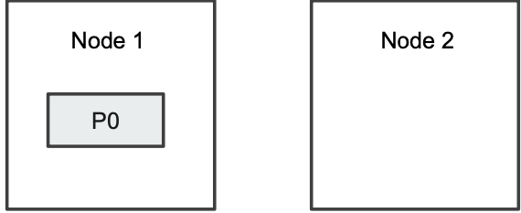
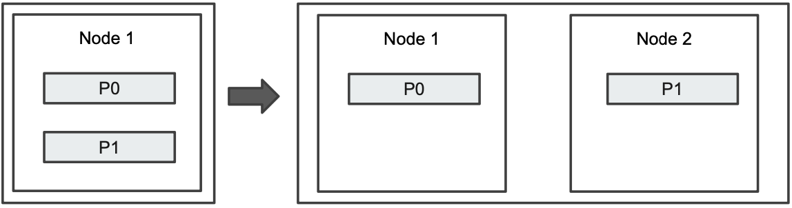
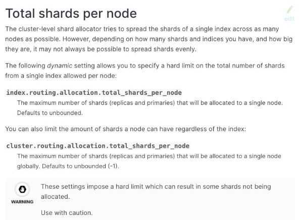

# **第三节 分片设定及管理**

## **1、单个分片**

* 7.0 开始，**新创建一个索引时，默认只有一个主分片**
	* 单个分片，查询算分，聚合不准的问题都可以得以避免
* 单个索引，单个分片时候，集群无法实现水平扩展
	* 即使增加新的节点，无法实现水平扩展

## **2、两个分片**

集群增加一个节点后，Elasticsearch 会自动进行分片的移动，也叫 **Shard Rebalancing**

## **3、如何设计分片数**

*  **当分片数 > 节点数时**
	*  一旦集群中有新的数据节点加入，分片就可以自动进行分配
	*  **分片在重新分配时，系统不会有 downtime**
* 多分片的好处:**一个索引如果分布在不同的节点，多个节点可以并行执行**
	* 查询可以并行执行
	* 数据写入可以分散到多个机器

### **3-1 一些例子**

**案例1**

* 每天 1 GB 的数据，一个索引一个主分片，一个副本分片
* 需保留半年的数据，接近 360 GB 的数据量 ，

**案例2**

* 5 个不同的日志，每天创建一个日志索引。**每个日志索引创建 10 个主分片**
* 保留半年的数据
* `5*10*30*6=9000个分片`

## **4、分片过多所带来的副作用**

*  Shard 是 Elasticsearch 实现集群水平扩展的最小单位
*   过多设置分片数会带来一些潜在的问题
	*   每个分片是一个 Lucene 的 索引，会使用机器的资源。**过多的分片会导致额外的性能开销**
	*   Lucene Indices / File descriptors / RAM / CPU
	*   每次搜索的请求，需要从每个分片上获取数据
	*   分片的 Meta 信息由 Master 节点维护。过多，会增加管理的负担。**经验值，控制分片总数在 10 W 以内**

	
## **5、如何确定主分片数**

### **5-1 从存储的物理角度看**

* 日志类应用，单个分片不要大于 50 GB
* 搜索类应用，单个分片不要超过20 GB

### **5-2 为什么要控制分片存储大小**

* 提高 Update 的性能
* Merge 时，减少所需的资源
* 丢失节点后，具备更快的恢复速度 / 便于分片在集群内 Rebalancing

## **6、如何确定副本分片数**

**6-1 副本是主分片的拷贝**

* 提高系统可用性:相应查询请求，防止数据丢失
* **需要占用和主分片一样的资源**

**6-2 对性能的影响**

* 副本会降低数据的索引速度:**有几份副本就会有几倍的 CPU 资源消耗在索引上**
* 会减缓对主分片的查询压力，但是会消耗同样的内存资源
	*  **如果机器资源充分，提高副本数，可以提高整体的查询 QPS**

## **7、调整分片总数设定，避免分配不均衡**

**ES 的分片策略会尽量保证节点上的分片数大致相同**

* **扩容的新节点没有数据，导致新索引集中在新的节点**
* 热点数据过于集中，可能会产生新能问题

## **8、Conclusion**

* 分片的设计与管理——分片是ES存储数据的地方，本质是一个lucene的索引，分片是ES机器实现水平扩展的最小单位，用她来存储数据必然会消耗系统的性能，如果存储的数据过大，则性能必然不佳。**ES官方建议日志应用最好小于50G，搜索应用最好小于20G。**
* 如果只有一个分片，那ES就失去了自动水平扩展的能力，具体应该设置多少分片数，需要根据实际场景来定，一般而已分片数应大于节点数。
* 另外，分片又分为主分片和副本，主分片提供读写的能力，副本只提供读的能力，副本是ES集群数据高可靠性的基石，另外，增加副本也能提高集群的读性能。
* 具体设置几个主分片需要做容量规划，主分片一旦设定，则不能随意修改，除非做reindex，主分片数是文档路由的关键参数，所以，一旦变化必然需要reindex。

