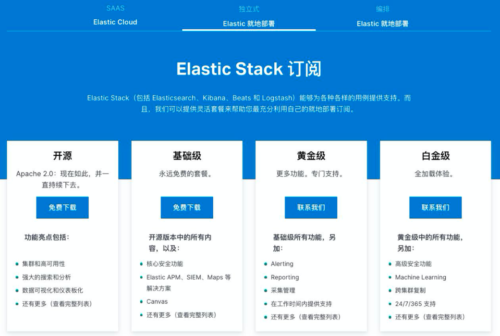
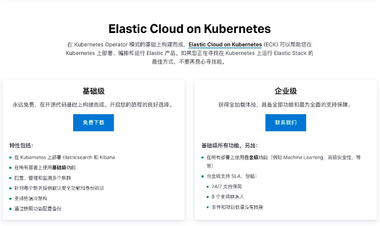
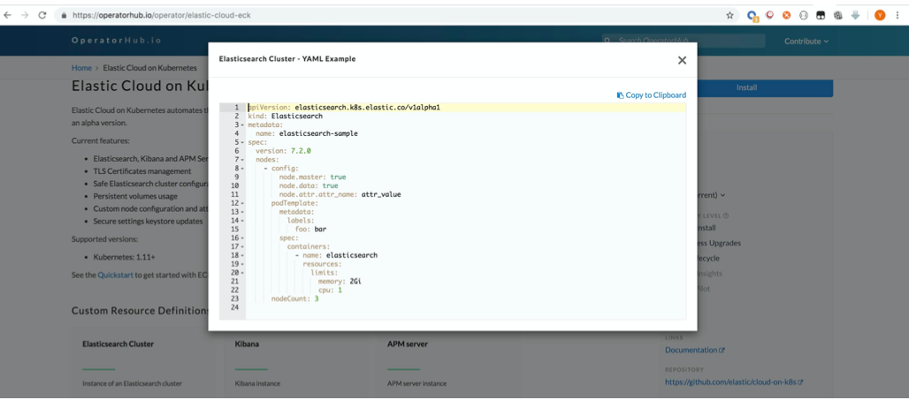
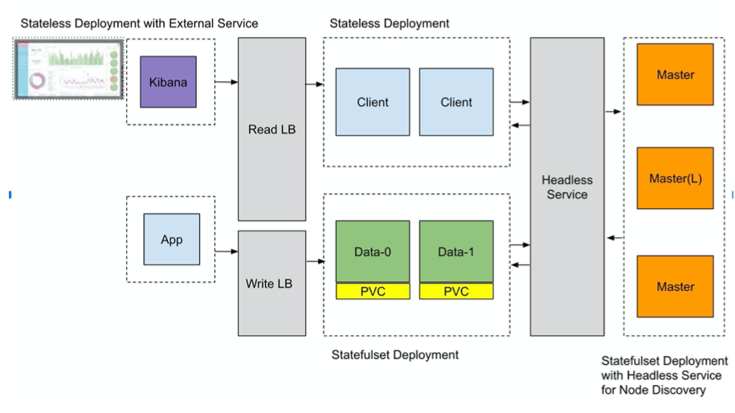
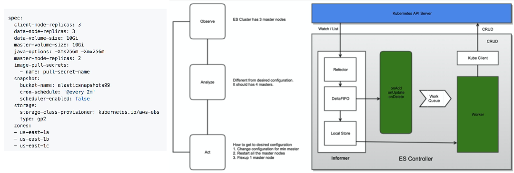
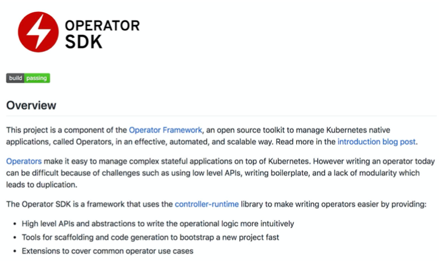
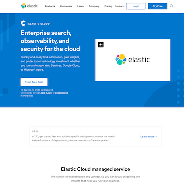
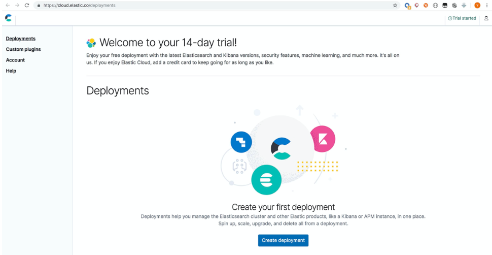
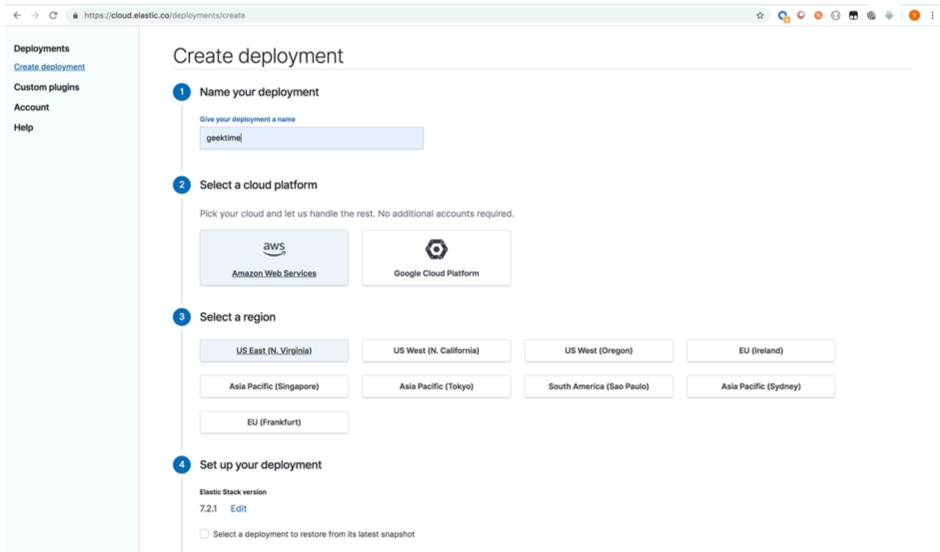
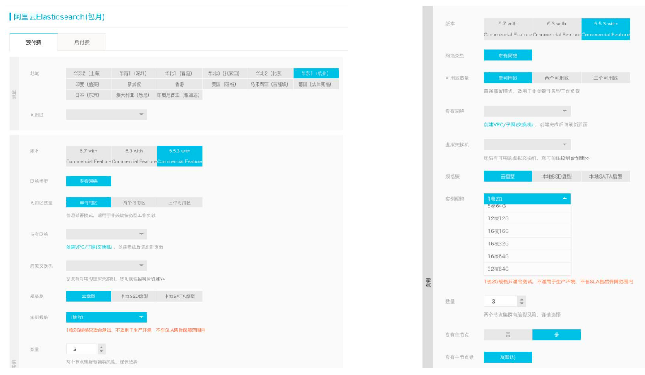

# **第五节、云上管理 Elasticsearch 的一些方法**

## **1、在私有云上管理 Elasticsearch 的一些方法**

### **1-1 管理单个集群**

* 集群容量不够时，需手工增加节点
* 有节点丢失时，手工修复或更换节点
	* 确保 Rack Awareness
* 集群版本升级;数据备份;滚动升级
	* 完全手动，管理成本高

### **1-2 ECE，帮助你管理多个 Elasticsearch 集群**

* ECE – Elastic Cloud Enterprise
	* [https://www.elastic.co/cn/products/ece](https://www.elastic.co/cn/products/ece)
* 通过单个控制台，管理多个集群
	* 支持不同方式的集群部署(支持各类部署) / 跨数据中心 / 部署 Anti Affinity
	* 统一监控所有集群的状态
	* 图形化操作
		* 增加删除节点
		* 升级集群 / 滚动更新 / 自动数据备份

### **1-3 基于 Kubernetes 的方案**

* 基于容器技术，使用 Operator 模式进行编排管理
* 配置，管理监控多个集群
* **支持Hot&Warm**
* 数据快照和恢复

### **1-4 Kubernetes CRD**

### **1-5 构建自己的管理系统**

**基于虚拟机的编排管理方式**

* Puppet Infrastructure (Puppet / Elasticsearch Puppet Module / Foreman)
* Workflow based Provision & Management

**基于 Kubernetes 的容器化编排管理方式**

* 基于 Operator 模式
* Kubernetes - Customer Resource Definition

### **1-6 将 Elasticsearch 部署在 Kubernetes**

### **1-7 什么是 Kubernetes Operator 模式**

### **1-8 Operator SDK**

[https://github.com/operator-framework/operator-sdk](https://github.com/operator-framework/operator-sdk)

## **2、在公有云上管理与部署 Elasticsearch**

### **2-1 Elastic Cloud**

https://www.elastic.co/cloud/

### **2-2 Chrome Lang: English**

**AWS + GCP**

### **2-3 Chrome Lang: Chinese**

> Elastic Cloud——注册账号可以免费试用14天哟😄
修改浏览器的语言，可以玩一下阿里或腾讯的产品

**Aliyun + Tencent**

[https://data.aliyun.com/product/elasticsearch](https://data.aliyun.com/product/elasticsearch)

### **2-3 理解集群的配置**

基于虚拟机的编排管理方式

*  Puppet Infrastructure (Puppet / Elasticsearch Puppet Module / Foreman)
*  Workflow based Provision & Management

基于 Kubernetes 的容器化编排管理方式

* 基于 Operator 模式
* Kubernetes - Customer Resource Definition