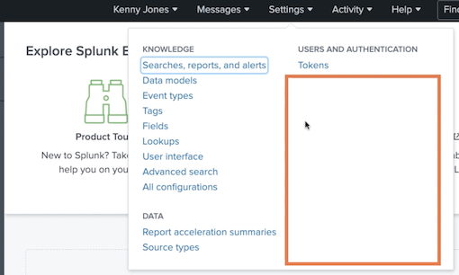

# **1 Splunk Administration: Managing Users and Authentication**

## Working with Roles and Users

### Understanding Splunk Enterprise Security Framework

**How Is Splunk Platform Secured?**

* **Role based acces**

Valid user account with one more roles is required to access Splunk

* **Single sign-on**

Integrate with enterprise single sign on solutions

* **Auditability**

**Audited evens such as searches and configuration file 
changes are indexed in `_audit` index**

### Additional Security Measures

* **Encrypted data flow**

Data travelling from Forwarders to Indexers are secured using SSL/TLS (can be disabled)

* **Assurance of data integrity**

Data in Splunk indexes can be checked for tampering

* **Authenticated cluster communication**

**Data travelling between Splunk instances are secured through pass4symmkey**

### **How the data flows in a secure environment.**


FIPS mode (Federal Information Processing Standard - FIPS 140-2) can be enabled

**That stands for federal information processing standard, FIPS 140‑2**. If you enable FIPS mode, Splunk automatically configures all security to comply with US Federal Government's security standards. Note that if you want to enable FIPS mode, you have to do it before you start Splunk Enterprise for the first time.

### Understanding Splunk Roles

* A collection of permissions and capabilities that defines a user function
* Users can be assigned to one or more roles
* Permissions grant read or write access to Splunk knowledge objects
* Capabilities are actions that can be performed in Splunk
* Role ultimately determines what a user can do and cannot do (privileges)

**Examples of Capabilities**

* **Capability: Description**
	* search: Lets a user perform searches
	* `schedule_search`: Lets a user schedule saved searches, create alerts
	* `edit_sourcetypes`: Lets a user edit sourcetypes
	* rtsearch: Lets a user perform real-time searches
	* `license_edit`: Lets a user edit licenses
	* `admin_all_objects`: Lets a user modify any object in the system 

	
**Where Do the Roles Come From?**


**Built-in roles**

Splunk ships with built-in roles with pre-defined capabilities. Examples: admin, power user 

**Custom roles**

You can create one or more custom roles by selectively choosing capabilities


**Creating and Editing Roles**

* Splunk Web

Use Splunk Web interface to add and edit roles

* Configuration File

### Splunk Built-in Roles

* **admin**

Modify all Splunk objects

* **power**

Create and edit shared knowledge objects

* user

Create and edit own knowledge objects

* **`can_delete`**

Delete events by keyword

* **`splunk-system-role`**

Special role for system processes

**Viewing Default Capabilities Using Splunk Web**


**Viewing Default Capabilities Using Btool**

```
/opt/splunk/bin$ ./splunk btool authorize list role_power

[role_power]

cumulativeRTSrchJobsQuota = 200
cumulativeSrchJobsQuota = 100
edit_sourcetypes = enabled
edit_statsd_transforms = enabled
```

You can also view `$SPLUNK_HOME/etc/system/default/authorize.conf` to identify capabilities for the built-in roles

**Do not edit the capabilities of the built-in roles.**

### **Create a User with Built-in Roles**

Creating a Local Splunk User

* Easiest way to create a user is to use Splunk Web
* The user must be assigned one or more roles (built-in or custom)
* By default the user will be created locally
* **It is recommended to have a strong password**
* In production environments, users typically are created in Enterprise Directories

**Creating Users Using Splunk Web**


### Demo

* View built-in roles and capabilities
* Demo
* View built-in users
* Check native and inherited capabilities of a role
* Create a local Splunk user
* Search `_audit` index


**login with new created user**



### ` _audit` index

* `index = _audit`


`_audit` is a special internal Spunk index that stores auditable events, such as users logging in, logging out, and making changes to configuration files.

* `index=_audit user=kjones`

* `index=_audit user=kjones action = "login attempt"`


**`duration`**

* `index=_audit user=kjones | transaction startswith="login attempt" endswith="logout"`


## 2 Creating a Custom Role

### 2-1 Why Create a Custom Role?

**Four Reasons to Create a Custom Role**

* Tweak default parameters
* Flexibility
* Index security
* Knowledge objects security

> You are able to restrict access to certain objects, such as search head apps, reports, dashboards, alerts, etc.

**Four Reasons to Create a Custom Role**

* Configure granular capabilities without having to update default roles

> Splunk comes with default roles such as admin, power, user, `can_delete`, and system‑role. Stay away from `can_delete` and splunk‑system‑role.
> 
> The factory roles:
**admin,power,user,can delete,splunk-system-role**

* Tuning done in default roles will get overwritten upon Splunk upgrade

> You can view the default capabilities in
`$SPLUNK_HOME/etc/system/default/authorize.conf`

> `accelerate_datamodel = enabled`

* You can secure indexes by configuring **srchIndexesAllowed**
* You can secure knowledge objects such as reports and apps

### 2-2 Creating a Custom Role Using Splunk Web

**Things You Need to Know before Creating a Custom Role**

* **Inheritance**
	* Mean which role that this role that you're creating will inherit from. When you create a custom role, it is not uncommon to inherit from the default Splunk roles, such as user our power. When you inherit from a role, all capabilities of the role that you are inheriting from will be automatically available for this role that you're creating
* **Capabilities**
	* Capabilities. In addition to inheriting the capabilities, you can add additional capabilities to the role. For example, in the earlier instance where I mentioned you can create an advanced power role and add `accelerate_datamodel` capability to it. This is the most important parameter for this custom role
* **Indexes that can be accessed**
	* This parameter determines which indexes can be accessed by a user who belongs to this role
* Default index
	* This is the index that will be searched
* Search restrictions
	* You can add special search filters. For example, you can exclude certain indexes using search restrictions.
* Resource configuration
	* You can configure resources such as disk space that can be used by a user in this role or the number of searches that are user in this role can run in parallel.

**Creating a Custom Splunk Role**

> Avoid inheriting `can_delete` role


**Important Resources Configuration**

* **Default App**: The default workspace for users with 
this role
* **User search job limit**: Number of searches a user with this role can run at the same time (default 3)
* **Role search job limit**: Total number of searches across all members of this role at the same time (default is unlimited)
* **Disk space limit**: Maximum disk space in mega bytes 
used by the search jobs of a user with this role (default 100MB)

### 2-3 Creating a Custom Role Using Configuration Files

* **`authentication.conf`**

Define authentication system parameters such as LDAP settings. Map roles to LDAP groups

* **`authorize.conf`**

**Create new roles and edit capabilities of roles**

* `user-prefs.conf`

**Specify the default app for a role**, along with other UI specific parameters

**Adding a Role in authorize.conf**

`$SPLUNK_HOME/etc/system/local/authorize.conf`

```
# Add new role for sales users

[role_sales_user]
importRoles = user
srchIndexesAllowed = main,sales_trans,web_logs
srchIndexesDefault = sales_trans
srchJobsQuota = 5
```

**Adding a Role in authorize.conf**

* `$SPLUNK_HOME/etc/system/local/authorize.conf`
* `$SPLUNK_HOME/etc/apps/auth_app/local/authorize.conf`

> In a search-head cluster, the configuration
files are deployed in 'default' directory

* In distributed env, place `authorize.conf` in Splunk search head
* Simply add a stanza for the role
* Restart Splunk to have the changes take effect

Never edit `$SPLUNK_HOME/etc/system/default/authorize.conf`. 
Instead use 
`$SPLUNK_HOME/etc/system/local/authorize.conf`

**Three Configuration Files**

### 2-4 Understanding Inheritance

**Role Inheritance**

* **Inheritance**

A role can be based on other existing role(s)

* **Capabilities**

A role automatically receives all capabilities and index access of the inherited role

* **Restriction**

Inherited capabilities and index access cannot be removed

Capabilities are always additive in nature. Users 
who belong to multiple roles receive all capabilities from all their roles.

**Role Inheritance Example**

Inherited Capabilities Cannot Be Removed

`advanced_user` inherits from `support_user`

```
[role_support_user]
srchIndexesAllowed = web_logs,app_logs

[role_advanced_user]
importRoles = support_user
srchIndexesAllowed = db_logs
```

Effective capabilities of `advanced_user`

```
[role_advanced_user]
srchIndexesAllowed = web_logs,app_logs,db_logs
```


### 2-5 Adding a User with Custom Role


> Navigate to Settings -> Users to add a user

**Adding a LDAP User with Custom Role**

* Map LDAP group to a Splunk role in authentication.conf
* Any user who belongs to a LDAP group gets all capabilities of the mapped Splunk role
* This is the typical setup in production environments

**LDAP Group Mapping**

LDAP Groups Are Mapped Using authentication.conf

**`authentication.conf`**

```
[authentication]
authType = LDAP

authSettings = myLDAP

[roleMap_myLDAP]

sales_user = sales
```

```
[role_sales_user]
importRoles = user
srchIndexesAllowed = main,sales_trans,web_logs

srchIndexesDefault = sales_trans
srchJobsQuota = 5
```

> power and admin have 10 and 50 srchJobsQuota respectively

### 2-6 Demo

* Create a custom role using Splunk Web
* Create a custom role using authorize.conf
* Create a user with a custom role
* Troubleshoot user access issues

take a look at the existing roles that are already there


**Inheritance**

* Inheritance from user


* **Capabilities**


**Indexes, Restrictions, Resources set as default**


The `sales_user` custom role has been created. Very simple and straightforward. Now let's see how we can create a custom role using configuration files

```
cd /Applications/Splunk/etc/system/local

vi authorize.conf
```

```
[role_finance_user]
cumulativeRTSrchJobsQuota=0
cumulativeSrchjobsQuota=0
importRoles = user
srchDiskQuota = 300
srchIndexesAllowed = summary
schMaxfime = 8640000

[role_sales_user]
cumulativeRTSrchJobsQuota=0
cumulativeSrchJobsQuota=0
importRoles = user
schIndexesAllowed = sales_trans
schIndexesDefault = sales_trans
srchMaxTime = 8640000

# Role for web developers
[role_web_user]
cumulativeRTSrchJobsQuota= 0
cumulativeSrchJobsQuota= 0
importRoles = user
schIndexesAllowed = web_logs
schIndexesDefault = web_logs
srchMaxTime = 8640000
```

**`srchMaxTime = 8640000`**

This is the maximum amount of time a search can run for a user in this role.

```
$ cd /Applications/Splunk/bin
$ ./splunk restart
```

You have the `web_user` role available. here Now as you can see, the default app is not showing up for `web_user`. That's because we did not update the `user‑prefs.conf`.

```
cd /etc/apps/user-prefs/local

$ pwd

/Applications/Splunk/etc/apps/user-prefs/local

$ vi user-prefs.conf
```
```
[role_finance_user]
default_namespace = splunk_metrics_workspace

[role_sales_user]
default_namespace = search

[role_web_user]
default_namespace = search
```

```
cd /Applications/Splunk/bin

./splunk restart
```


Sometimes the user reaches **his disk quota and the searches won't even run**. 

The searchers get queued until the old search jobs expire. To quickly determine this, you can use the rest command to call a particular REST API to list the current disk usage.

```
| rest services/admin/quota-usage
```


```
| rest services/admin/quota-usage | search title=jordanp
```


## 3 Configuring Splunk Authentication

### 3-1 Authentication Mechanisms

Authentication mechanisms are techniques by which Splunk authenticates a user. When a user logs in, Splunk needs to know if the user can be allowed to log in are not.

* Native (always on)

That means it cannot be disabled, and this is for a good reason. If Splunk loses connectivity with the external LDAP server, how can you log in? Since native mechanism is always on, admin user will be able to log into Splunk.


* External LDAP 

Can integrate your Active Directory with Splunk for authentication purposes. 

* SAML 

SAML stands for Security Assertion Markup Language. This is a very popular open standard that is used to assert security information via XML

* Scripted Authentication


Can have your own authentication system authenticate users for you in Splunk.

**Splunk Native Authentication**


* The default factory authentication mechanism (cannot be disabled)
* Users can be added, edited and deleted from Splunk Web
* Users are maintained in `$SPLUNK_HOME/etc/passwd` file

> If you come from UNIX administration background, this file should look a lot familiar to you. This is the file that's used to keep usernames and passwords in UNIX operating system. 

**Users in Native Authentication System**


### 3-2 Creating a LDAP Strategy


* LDAP host and port number
* Bind credentials
* User base DN and group base DN

> User base DN basically means the area are the subtree within LDAP where the users are located. Group base DN is the same thing, but for groups.

* User-name and real-user-name attributes
* Group-name and static-member attributes


**How LDAP Authentication Works**


> Once you configure this and get it working, this configuration seldom changes.

The user initiates login typically using username and password. The user generally connects to Splunk search head, which hosts the Splunk Web application. S

plunk search head talks to the external LDAP server. It could be OpenLDAP or Active Directory. 

**Note that the authentication happens on the Active Directory or LDAP server**.

**Creating a LDAP Strategy**


* User base DN specifies the location of your LDAP users, specified by the DN of your user subtree. **In this example, I have dc=example, dc=com**. 

* User base filter can be left blank if you do not have one.
 
* User name attribute is the attribute with which usernames are identified. Typically, it is UID. 


* If you are using Active Directory, this could be **sAMAccountName**.
 
* The real name attribute is also important. In this case, it is cn


Setting static group search filtering greatly improves LDAP performance


### 3-3 Mapping LDAP Groups to Splunk Roles

* **Splunk Web**

Map LDAP groups to Splunk roles using Splunk Web

* **authentication.conf**

Map LDAP groups to Splunk roles using authentication.conf (placed in Splunk search heads)


**Mapping LDAP Groups Using Conf File**

* **`authentication.conf`**

```
[authentication]
authType = LDAP
authSettings = myLDAP


[roleMap_myLDAP]
# Map sales LDAP group to sales_user Splunk role
sales_user = sales
```

For mapping LDAP groups into Splunk roles, the stanza is named `roleMap_authSettings`. There's one line that maps the LDAP group into Splunk role. 

* **`authorization.conf`**

```
# Creat sales_user Splunk role

[role_sales_user]
importRoles = user
srchIndexesAllowed = main,sales_trans,web_logs

srchIndexesDefault = sales_trans
srchJobsQuota = 5
```

### **3-4 Configuring Single Sign On**

**Why Single Sign On ?**

* No need to type in username/password
* No need to remember/renew passwords
* Faster login time means better user experience
* Avoids weak passwords

**How Single Sign On Works ?**


Splunk search head connects to the identity provider such as Ping Identity or Azure AD for the authentication. The identity provider asserts the authentication by sending an XML document back to Splunk search head

**Enabling SAML**


**Things You Need to Know before Configuring Single Sign On**

* A supported identity provider (Example: Ping identity, Azure AD, Okta)
* Role, realname and mail attributes
* Identity provider metadata file
* SSL certificate info
* Map SAML groups to Splunk roles

### **3-5 Implementing Multi-factor Authentication**

**Why Multi-factor Authentication ?**

* Additional source of validation for improved security
* Meet compliance/audit requirements such as NIST and GDPR
* Prevention of security attacks such as denial of service attack
* Reduce the risk of compromising passwords

**Supported Multi-factor Integrations**


**Duo Security**

Backed by a zero trust philosophy, Duo provides easily configurable multi-factor authentication

**RSA Security**

Provides multi-factor authentication with RSA Authentication Manager

**Enabling Multi-factor Authentication**


**Configuring Duo**


### 3-6 Demo

* Create a new LDAP strategy
* Map LDAP groups to Splunk roles
* Use authentication.conf to map roles
* Grant granular capabilities for a role


**Create a new LDAP strategy**

We will use Splunk Web to configure an LDAP strategy that connects to an external LDAP server.


**`ldap.forumsys.com`**

[https://www.forumsys.com/tutorials/integration-how-to/ldap/online-ldap-test-server/](https://www.forumsys.com/tutorials/integration-how-to/ldap/online-ldap-test-server/)


**Let's say chemists, and then assign power role for them.**


Mapped the chemists group into power role. Now by default, power role cannot edit Splunk licenses. You can go into Settings, and you can see that the Splunk licensing menu itself is not shown here


**I don't want them to be full‑blown admins. All I want them to do is simply manage licenses.**

```
cd ./etc/system/local
$ pwd
/Applications/Splunk/etc/system/local

vi authorize.conf
```
```
...
# Role for advanced power user
[role_advanced_power]
importRoles = power
license_edit = enabled
```

```
cd /Applications/Splunk/bin
./splunk restart
```

You can see that the `advanced_power` role that I just created is showing up under Available Roles. 


## Chapter Summary

* Splunk role based access control
* Splunk built in roles
* Create a custom Splunk role
* Configure external LDAP and map groups
* to Splunk roles
* Understand single sign-on and multi-factor authentication
* Troubleshoot user access issues