# 2 Working with Configuration Files and Indexes


## 1 Understanding Splunk Admin Basics and License Management

### 1-1 A Day in Splunk Enterprise Administrator’s Life

Splunk Enterprise Systems Administrators and Data Administrators have different responsibilities

**Splunk Enterprise Systems Administrator Tasks**

* Install Splunk Software
* Create and Manage Indexes
* Manage Splunk Licenses
* Configure Security
* Monitor Splunk and respond to Monitoring Console Alerts


**Splunk Enterprise Data Administrator Tasks**

* Create and manage inputs
* Manage parsing of data including line-breaking and timestamp extraction
* Design and establish new ingestion pipelines
* Manage Splunk configuration files
* Collaborate with users on data on-boarding

### 1-2 Splunk Enterprise Components

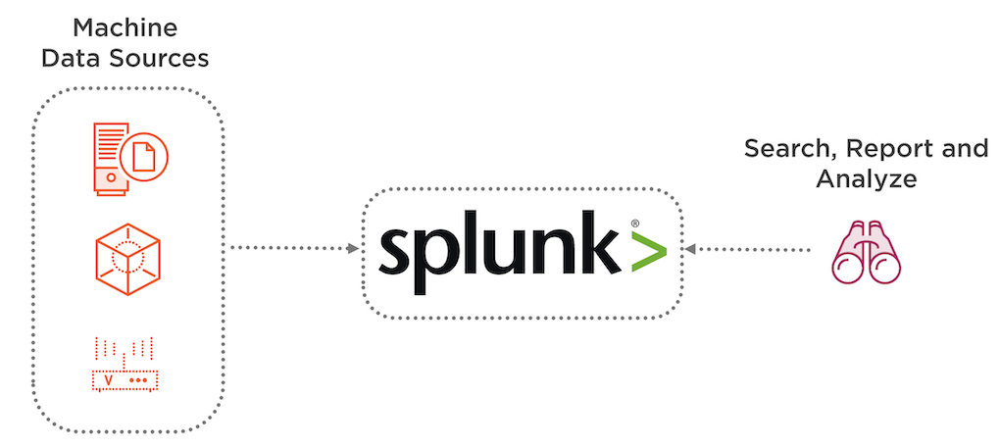

* **On the left side, you have machine data sources**. These are servers, containers or even network devices. They generate mission data. 
* The mission data from those systems are collected and indexed in Splunk platform. 
* The users interact with Splunk platform to search, report, and analyze. 


**Three Core Components**

* **Indexer**
	* Receive, parse and store machine data in files. Serve search requests
	* it is important to know that the s**ame splunkd daemon does both writing and reading the files from the disk**
* **Search Head** 
	* Web interface for the users. Dispatch searches to Indexers

* **Universal Forwarder**
	* Collects data from the clients and forwards for Indexing


**how Splunk works**

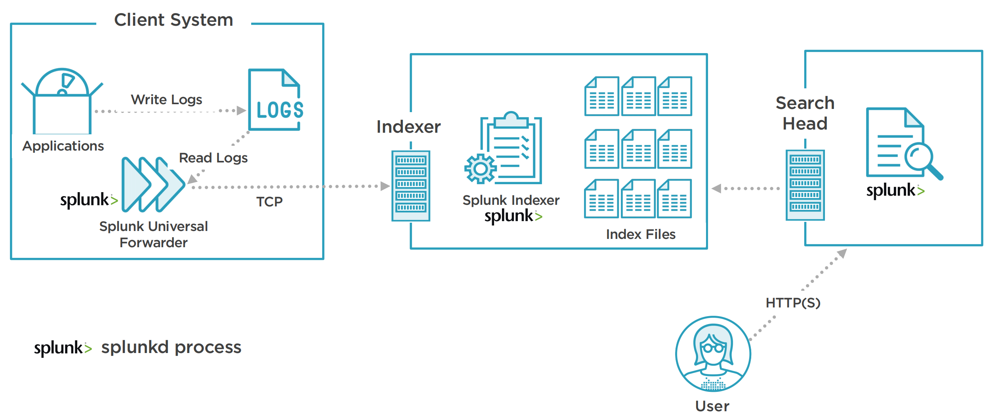


**Client System:**

Left side, you have the client system. The applications write logs to log files. 

Splunk universal forwarder, which is a Splunk process, reads those log files and sends them to the indexer via TCP. 

**Indexers:**

The indexers receive the data, parses them, organizes them in index files. 

**Search head process**

The search head process, which is again another splunkd process, is used as a web interface for the user. The search head is responsible for dispatching searches to the indexers, collect the data, and make it available for the user.

**Other Splunk Components**

* License Master
* Deployment Server
* Cluster Master
* Search Head Deployer
* Monitoring Console
* Heavy Forwarder


**License master**

* The License Master manages Splunk licenses
* Other Splunk Components(such as indexer and searches) are License Slaves 
* Can be a co-located with other components such as Monitoring Console
* Licenses can be managed through Splunk Web

**deployment server**


* Manages the Configuration files on the Deployment Clients
* Maintains configuration in `serverclass.conf`
	* Deployment clients typically mean the servers on which universal forwarders are installed.
* Alternative solutions such as ansible/puppet can be used
* Configuration files are packaged as apps
	* An app is a Splunk terminology. **App simply means a set of configuration files organized in order.**
* Deployment clients periodically poll Deployment Server
	* Deployment clients periodically poll deployment server and then download files that are designated for them, so it is rather a pull mechanism and not a push mechanism.


**Cluster Master**


* Cluster Master manages the **Indexer Cluster**
* There is only one Cluster Master
	* There is no high availability for the cluster master.
	* You can have a passive standby, but it cannot be active.
* Maintains data bucket status and handles replication
* Distributes configuration files and apps to Cluster members

**Search Head**

* Search Head Deployer distributes apps and configuration files to Search Head Cluster Members
* Keeps the files in `$SPLUNK_HOME/etc/shd-apps`
* Cannot run on the same instance as a cluster member

**Monitoring Console**


* Monitoring Console is a Web App that helps to monitor the system health
* Rich set of charts and statistics
* One-stop-shop to monitor everything 
* Only Administrators have access

**Heavy forwarders**

* Heavy forwarders can parse data before forwarding to indexer
* Full Splunk Enterprise binary with distributed search disabled
* Can also index data locally
* Smaller footprint compared to indexer


### 1-3 Splunk Licensing Options

**Splunk is not free. Splunk Licensing is based on the amount of data indexed**

A critical thing to note because it does not depend on the number of clients, as some of the licensing model works.

It does not depend on how many processes connect to Splunk indexers. 

**It is the amount of data that is received and indexed into Splunk platform.**

**Types of Splunk Licenses**

* Enterprise License
* Industrial IoT License
* Free License
* Forwarder License
* Trial License
* Dev/Test License

**Enterprise License**

* The Enterprise License can be bought for any indexing volume
* Enables all Splunk **features including clustering and distributed search**
* No-enforcement. Users can still search after a License violation
* Licenses can be stacked

You can purchase a license for any indexing volume from Splunk.

**Free License**

* **The Free license includes 500MB/day indexing, for life**
* Disabled features
	* Clustering
	* Authentication
	* Distributed Search
	* Alerting
	* Deployment management

**Trial License**

* The Trial License provides full Splunk features for 60 days
* After 60 days, it automatically becomes Free License
* Maximum 500 MB daily volume
* Sales Trial license can provided for customized limits

**Industrial IoT License**

* Splunk for Industrial IoT License
* Not stackable
* Access to Splunk Enterprise and a select premium Splunk Apps

**Forwarder License**

* Forwarder License allows forwarding of unlimited data
* Cannot be used for indexing
* No need to purchase them separately
* Universal Forwarders automatically apply Forwarder License
* Heavy Forwarders must be converted to Forwarder License group

**Dev/Test License**

* Dev/Test license for running Splunk in Non Prod environments
* Cannot be used in distributed environment
* Not stackable
* Can be used for Splunk App development


**What counts towards daily License quota?**

* **Full size of data flowing through the parsing pipeline**
	* Whatever gets into the parsing queue is what gets charged.
	
* **Not the disk storage**
	* It is not the ultimate final disk storage because **the data gets compressed and also added with the metadata and other indexing data in the disk**.
* **Does not include**
	* What is being charged is the data that flows through the parsing pipeline before it gets written to the disk
* Replicated Data
	* The data does not include replicated data.
* Summary indexes
* Internal Logs
	* Splunk Splunks itself. There's tons of logs that Splunk generates, and they all are indexed in **`_internal` index**. 
* Metadata


**Licensing in Distributed Environment**

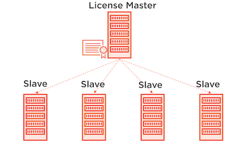


The license master is the only server that has the enterprise license stack installed. 

All other components in your environment act as license slaves, and they simply connect to the license master. 

**It is configured in `server.conf` on the licensed slaves**.

### 1-4 Managing License Violations

**License Warnings and Violations**

* Exceeding daily volume quota results in a Warning
* 5 or more warnings in a 30 day rolling period is a Violation
* **Searching is NOT disabled in violation period**
* Alert logged in Messages on any Splunk Web pages

**Monitoring License Warnings**

* **Monitoring Console**: Enable the license monitoring alerts
* **Licensing Page in Splunk Web**: Current and permanent violations
* **Usage Report in Splunk Web**: Current and previous 
30 days usage

**Handling License Violations**

* Review heavy hitters (Usage Report) and adjust intake
* The daily limit resets at midnight
* Buy more license


### Demo

* Licensing page in Splunk Web
* Review Warnings and Violations
* Usage Report
	* Current
	* Past 30 days
* Enable Monitoring Console License Alerts


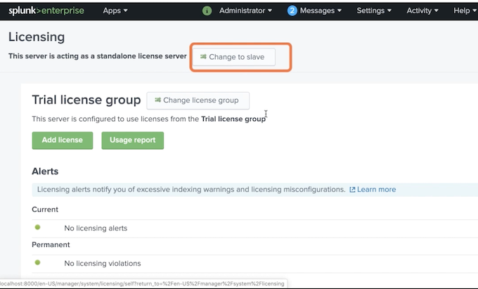

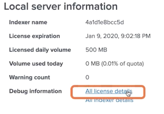

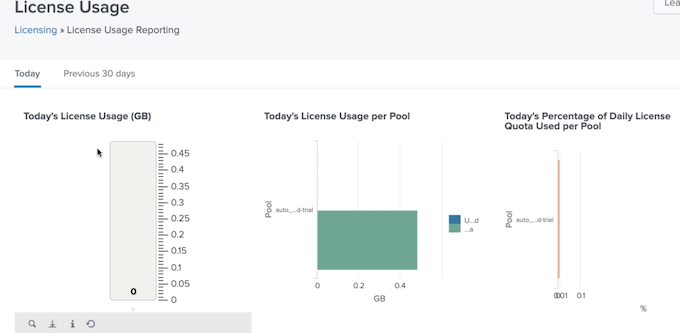

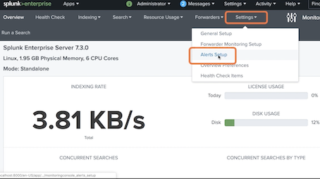

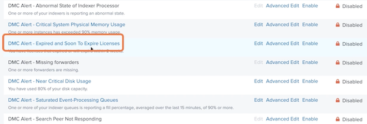

## **2 Working with Splunk Configuration Files**

* Understanding Splunk configuration files
* Structure of Splunk configuration files
* Layering the configuration files
	- Index-time
	- Search-time
* Precedence of configuration files
* Using btool to troubleshoot

### **2-1 Understanding Splunk Configuration Files**

**Splunk platform is configured using set of text-based configuration files**

**Splunk Configuration Files**

* Text files located in `SPLUNK_HOME/etc/…`
* `.conf` extension (Examples: `server.conf`, `deploymentclient.conf`)

> Typically, it's /opt/splunk in UNIX‑based systems. 

* Changes made via Splunk Web update configuration files
* Contain stanzas and key value pairs
* Govern a Splunk functionality

>  For example, **props.conf governs how data is parsed**.
> 
> **Server.conf governs the system‑level parameter of the splunkd process**.


There are only two Splunk software packages: **Splunk 
Enterprise and Splunk Universal Forwarder**


**Splunk Software Packages**

Splunk Enterprise

* Indexer
* Search Head
* License Master
* Deployment Server
* Cluster Master
* Search Head Deployer
* Monitoring Console
* Heavy Forwarder

Splunk Universal Forwarder

* Deployment Client

**Splunk Platform Directory Structure**

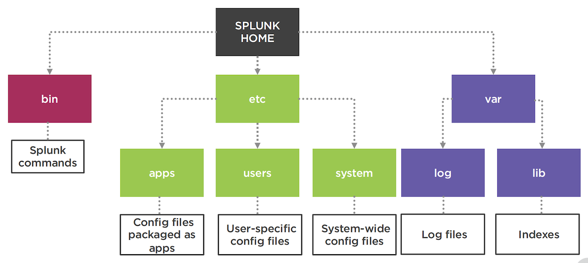


* On top, we have `SPLUNK_HOME`. In general, it is `/opt/splunk` in Linux‑based systems, but it is any directory that you chose to install Splunk. 
* bin directory under `SPLUNK_HOME `that contains Splunk commands, for example, the `./splunk` command that we typically use to restart a Splunk process is located under `SPLUNK_HOME` bin. 

* etc. It has three major directories. 
	* The first is apps. Under apps, we have configuration files packaged as apps. We will see that apps is one of the core ways Splunk manages configuration files. 
	* users directory, under which we have user‑specific configuration files. 
		* For example, **if a user logs onto Splunk Web and then creates an alert, the alert configuration goes inside the users directory**. 
	* System. Here is where system‑wide configuration files are stored. 

> If the user shares the alert, the configuration is
moved to the apps directory


* var directory under `SPLUNK_HOME` that contains two major directories.
	* log in which we have Splunk platform's log files. 
		* The index in which the logs are stored is `_internal`. 
	* Then we have **lib** directory, under which the indexes live. **Index is where the mission data is stored**. 

**Structure of Splunk Configuration File**

Configuration Files Are Made of Stanzas and Key-value Pairs	
	
**`indexes.conf`**
	
```
[default]
maxTotalDataSizeMB = 650000
maxGlobalRawDataSizeMB = 0

# idx1 index settings
[idx1]
homePath = volume:hot1/idx1
coldPath = volume:cold2/idx1
```


**`inputs.conf`	**

```
[monitor:///var/log/httpd]
sourcetype = access_common
ignoreOlderThan = 7d
index = web
```


**Two Ways to Learn Splunk Configuration Files**

* **README files**

`$SPLUNK_HOME/etc/system/README` directory contains 
example and spec files
	
* Spec files at docs.splunk.com	
[https://docs.splunk.com/Documentation/Splunk](https://docs.splunk.com/Documentation/Splunk)
	
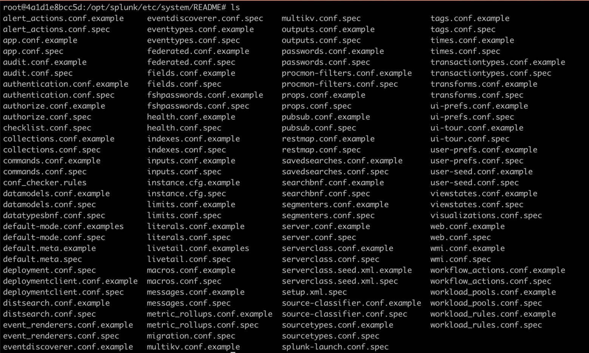

`PLUNK HOME/etc/system/README`

### **2-2 Layering Splunk Configuration Files**

**Splunk App**

* Splunk's way of organizing configuration files
* A directory under `SPLUNK_HOME/etc/apps`
* Contains Splunk configuration files
* Can also contain scripts and other necessary artifacts
* An add-on is an app that usually does not contain GUI

**Search & Reporting app**

* **Splunk ships with Search & Reporting app which is a prebuilt general-purpose app**.
* The configuration is stored under SPLUNK_HOME/etc/apps/search

**Splunk App Directory Structure**

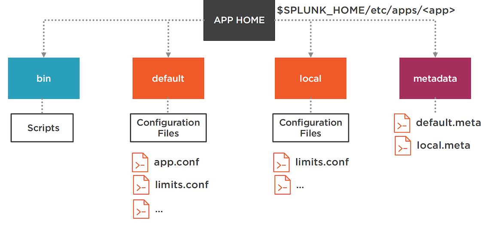

We have another special folder called metadata that contains default.meta and/or local.meta that defines the permissions for this app

**Default vs. Local Directories**

* **Default**
	* Shipped with Splunk
	* Will be overwritten upon Splunk upgrade
	* **Files should not be updated**
	* Contains default settings
	* **Does not override local**

* **Local**
	* User created
	* **Will be preserved upon Splunk upgrade**
	* **Recommended place to modify files**
	* **User-specific configuration changes**
	* Always overrides default


**All the Configuration File Locations**

	
* `etc/system/default`
* `etc/system/local`
* `etc/apps/search/default`
* `etc/apps/search/local`
* `etc/apps/<app>/default`
* `etc/apps/<app>/local`
* `etc/users/<user>/<app>/local`	
**Do not update files in etc/system/default**

Never update files in `etc/system/default`. It is the default system where the configuration, and it is bound to be updated or overwritten whenever you upgrade Splunk platform. 


### **2-3 Mastering Splunk Configuration Files Precedence**

**Index-time and Search-time**

* **Index-time**: Global context, such as input/parsing configuration

> configuration with a global context such as inputs.conf

* **Search-time**: App/User scoped, such as a user’s knowledge objects

> would be saved to searches.conf in which a user can have scheduled reports and even alerts

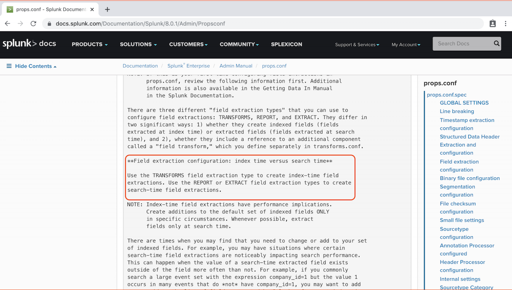

**Index-time Precedence**

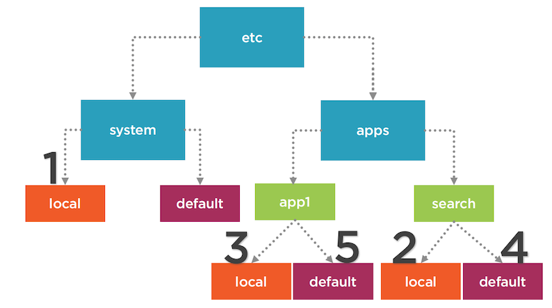


1. `etc/system/local`. Any configuration here will override configuration in any other location. This is the gold standard, **the mother of all configuration files, etc/system/local**.
2. `etc/apps/search/local`. Search is a special pre‑built app that comes with Splunk. 
3. `etc/apps`, any custom app, in this case, app1/local.
4. `etc/apps/search/default`. 
5. `etc/apps`, any app, in this case, app1, default.
6. `etc/system/default`. That gets the lowest precedence in any case, etc/system/default. 

if there are two or more apps that have conflicting settings, app directory name with the highest ASCII order wins. 

**Search-time Precedence**

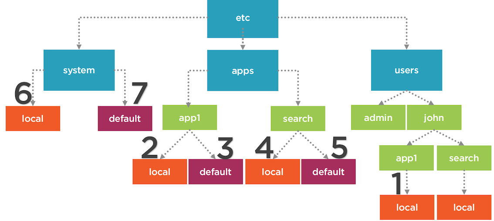


1. `etc/users`, username, and then the particular app he is working on, /local. You can see that `etc/system/local` does not get the top precedence. 
2. `etc/apps`, the app in which the user is working on right now, /local. 
3. `etc/apps`, app name, default. 
4. `etc/apps/search/local`. 
5. `etc/apps/search/default`. 
6. `etc/system/local`. You can see that during index time, `etc/system/local` is the most important directory, whereas during search time, it is almost the last.
7. `etc/system/default`. 


**How Splunk merges configuration files.** 


* Upon startup, Splunk merges configuration files for each type, very important point. 

> For example, if there are multiple `limits.conf` spread across various applications, or apps rather, upon startup, **Splunk will merge all the configurations into one single `limits.conf`**. 

* The resulting file combines settings from various directory locations. 
	* It is a union of all settings for the same configuration file that is available across different directories. 

* Only one file per file type will be used at runtime. 

**It does not matter how many `inputs.conf` are out there or how many `props.conf` are out there.**


For a given type, there is only one configuration file at runtime. If there is a conflict, precedence is applied. 

* **If there is a conflict, precedence is applied**
* **Local takes precedence over default**

**How layering and precedence works.**

consider props.conf. And in this section of `props.conf`, it happens to be processed during index time. 

Configuration File Merging Example 1

**`etc/apps/karun_app_props/local/props.conf`**

```
[web:log]
SHOULD_LINEMERGE = false
LINE_BREAKER = ([\r\n]+)\d{4}-
```

**`etc/apps/joe_app_props/local/props.conf`**

```
[app:log]
TIME_FORMAT = %Y-%m-%d %H:%M:%S%Z
TIME_PREFIX = ^
```

**`etc/apps/jack_app_props/local/props.conf`**

```
[db:log]
BREAK_ONLY_BEFORE_DATE = true
SHOULD_LINEMERGE=true

[web:log]
category = web
```

**Effective props.conf at runtime**

```
[web:log]
SHOULD_LINEMERGE = false
LINE_BREAKER = ([\r\n]+)\d{4}-
category = web

[app:log]
TIME_FORMAT = %Y-%m-%d %H:%M:%S%Z
TIME_PREFIX = ^

[db:log]
BREAK_ONLY_BEFORE_DATE = true
SHOULD_LINEMERGE=true
```

**Configuration File Merging Example 2**

```
etc/system/default/limits.conf
[inputproc]
file_tracking_db_threshold_mb = 500
learned_sourcetypes_limit = 1000


etc/apps/karun_limits_app/local/limits.conf
[inputproc]
max_fd = 500

etc/system/local/limits.conf
[inputproc]
max_fd = 300
```

Effective limits.conf at runtime

```
[inputproc]
file_tracking_db_threshold_mb = 500
learned_sourcetypes_limit = 1000
max_fd = 300
```

* `file_tracking_db_threshold_mb`： The first parameter defines the maximum size of fishbucket database，after which a new database file will be created. Fishbucket database is used to keep track of monitoring the input files and its progress. 
* `Learned_sourcetypes_limit` limits the maximum number of automatically created source types. 


**When overriding configuration with a local file, do not copy the entire file from default. Just add the overriding configuration.**


**Overriding the Default Configurations**

Correct Way to Override Defaults

`etc/system/default/props.conf`

```
[default]
CHARSET = UTF-8
LINE_BREAKER_LOOKBEHIND = 100
TRUNCATE = 10000
DATETIME_CONFIG = /etc/datetime.xml
ADD_EXTRA_TIME_FIELDS = True
ANNOTATE_PUNCT = True
```

TRUNCATE: defines the maximum number of lines after which an event will be truncated. So by default, it is 10000. 

Now in order to override this, all you need to do is to simply redefine TRUNCATE with the value that you want in `etc/system/local/props.conf`. 


**Again, do not copy the entire props.conf from default. Simply override it with etc/system/local/props.conf.**


**`etc/system/local/props.conf`**

```
[default]
TRUNCATE = 50000
```


Note that `etc/system/local/props.conf` is the mother of all configuration files. 

**As an added tip, the two locations where default configurations are stored out of the box is etc/system/default and etc/apps/search/default.**

### **2-4 Using btool to Work with Splunk Configuration Files**

* A Splunk command
* Located in `SPLUNK_HOME/bin`
* Retrieves the on-disk configuration of a Splunk configuration file
* Syntax: `splunk btool <conf file name> list [options]`
* `--debug` option shows the exact `.conf` file location


**Btool Example**

```
/opt/splunk/bin# ./splunk btool inputs list monitor:///var/log

[monitor:///var/log]
_rcvbuf = 1572864
disabled = false
host = Karun-Mac-Container
index = main


/opt/splunk/bin# ./splunk btool inputs list monitor:///var/log --debug
/opt/splunk/etc/apps/search/local/inputs.conf [monitor:///var/log]
/opt/splunk/etc/system/default/inputs.conf _rcvbuf = 1572864
/opt/splunk/etc/apps/search/local/inputs.conf disabled = false
/opt/splunk/etc/apps/search/local/inputs.conf host = Karun-Mac-Container
/opt/splunk/etc/apps/search/local/inputs.conf index = main
```


**retrieving the contents of inputs**

As you can see, there are two inputs.conf in play here. One comes from `etc/apps/search/local`, and the other one comes from `etc/system/default.inputs.conf`. 

```
/opt/splunk/bin$ ./splunk status

/opt/splunk/bin$ ps -ef | grep splunk

splunk -p 8089 start

cd system/default
/opt/splunk/etc/system/default$ ls
alert_actions.conf ....
app.conf

$ vi props. conf
# This file specifies how to parse a given log file
```

**Add new data inputs**

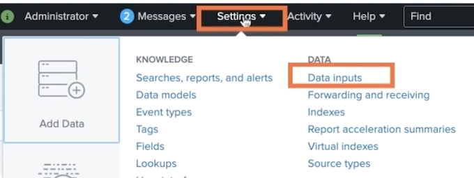

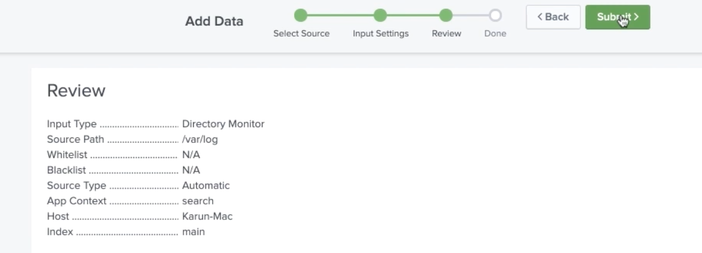

**Start searching**

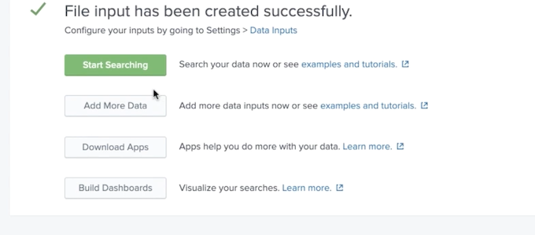

**`source="/var/log/*" host="Karun-Mac"`**

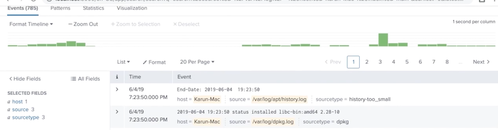

**New input file created**

```
/opt/splunk/etc/apps/search/local: 1s -lrt

inputs.conf

[splunktep://9997]
connection_host = ip

[monitor:///var/log]
disabled = false
host = Karun-Mac
index = main
```


```
/opt/splunk/bin$ ./splunk btool inputs list


/opt/splunk/bin$ ./splunk tool inputs lis monitor

[monitor:///opt/splunk/etc/splunk.version]
...
[monitor:///opt/splunk/var/loq/introspection]
```

```
./splunk btool inputs list monitor --debug
...
/opt/splunk/etc/apps/search/local/inputs.conf   [monitor:///var/log]  
/opt/splunk/etc/system/default/inputs.conf      _revbuf = 1572864
/opt/splunk/etc/apps/search/local/inputs.conf   disabled = false
/opt/splunk/etc/apps/search/local/inputs.conf   host = Karun-Mac
/opt/splunk/etc/apps/search/local/inputs.conf   index = main
```

```
/opt/splunk/bin$./splunk btool inputs list monitor:///var/log

[monitor:///var/log]
_revbuf = 1572864
disabled = false
host = Karun-Mac
index = main
```

### **2-5 More Examples of Using Btool**


* Review a Splunk configuration file
* Locate the btool command
* Use btool to retrieve configuration
* Use btool to analyze conflicts
* Using REST API to retrieve configuration

**dpkg source type**

Now I know that I did not manually create this sourcetype. Splunk uses sourcetype to parse the data, so I need to find out where the source type dpkg is defined.

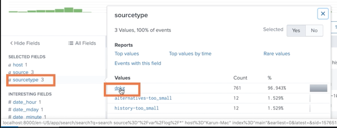

```
./splunk btool props list dpkg

/opt/splunk/etc/apps/learned/local/props.conf [dpkg]
```


**install Splunk `*NIX TA`, the Splunk UNIX TA**


The *NIX TA can be obtained from `splunkbase.solunk.com`

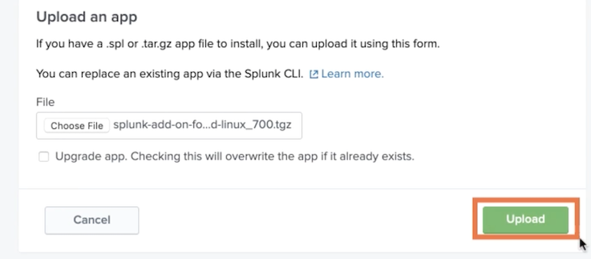

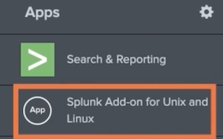

```
/opt/splunk/etc/apps$ ls-lrt
...
Splunk_TA_nix


cd opt/splunk/etc/apps/Splunk_TA_nix/local$ ls -lrt

vi inputs.conf
```

**Default is disable, enable all the input**


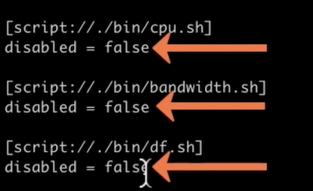

```
./splunk btool inputs list script://./bin/top.sh --debug
```

**How we can access Splunk configuration via rest API**

```
| rest services/properties
```

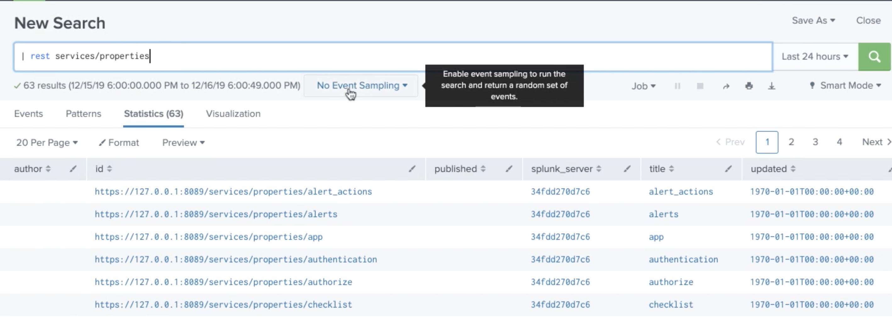

```
| rest services/properties/props 
```

```
| rest services/properties/props/dpkg/MAX_EVENTS
```

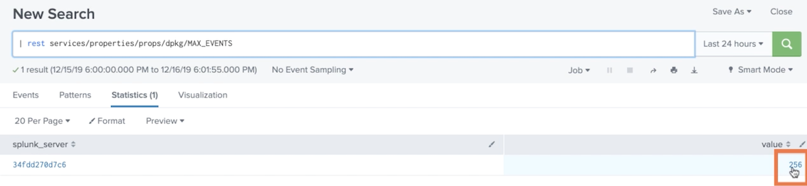

## 3 Understanding Splunk Index

Overview

* How Splunk organizes data
* Index buckets
	- Hot
	- Warm
	- Cold
	- Frozen
	- Thawed
* Creating an index

	- Using Splunk Web
	- Using configuration files
	- One index vs multiple indexes

* Index data integrity

### 3-1 How Splunk Organizes Data

Splunk stores data in indexes, **which are organized in directories and files in disk**

**Splunk Indexes**

* Indexes are stored in `SPLUNK_HOME/var/lib/splunk`
* The directory location is customizable for each index
* Indexes contain raw data and index files
* Indexes can be created by an Administrator
* Many prebuilt indexes
	- `_internal`
	- `_audit`
	- main

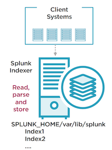

**Another useful internal index is `_introspection`which stores Spunk platform's performance metrics**

**Inside a Splunk Index**

* <mark>**Raw data**: Raw data is stored in compressed format</mark>
* <mark>**Tsidx files**: Time series index files that point to the raw data</mark>
* <mark>**metadata**: Metadata files such as **Sources.data, SourceTypes.data and Hosts.data**</mark>

### 3-2 **Splunk Data Buckets**

**Buckets**

* **Indexes store data in buckets**
* Buckets are set of directories organized by age
* **Contain raw data, tsidx files and metadata**
* **As the index grows, number of buckets grows as well**

**Types of Buckets**

- Hot
- Warm
- Cold
- Frozen
- Thawed

**Hot**

* Hot buckets contain the newest data
* **They are open for both read and write**
* **There can be more then one hot bucket in an index**
* Searchable
* Roll to warm bucket when buckets reach certain size, or upon Splunk restart

**`maxHotBuckets` in `indexes.conf` can beconfigured (default 3)**

**Warm**

* Warm buckets are created when hot buckets roll
* **Not open for writing, but searchable**
* They reside in the same directory as hot buckets but renamed
* Roll to cold buckets when exceeding maximum warm buckets setting

> maxWarmDBCount in indexes.conf can be configured (default 300)

**Cold**

* **Starting from oldest bucket (based on time), warm buckets roll to cold**
* Reside in different directory from hot and warm
* **Searchable**
* The directory location can be configured
* **Possible to save cost by using cheaper storage**

**Frozen**


* After cold buckets age out based on retention policy, they roll to frozen
* The default action is to delete; can be configured to archive
* **coldToFrozenDir** or **coldToFrozenScript** in `indexes.conf` configures archiving
* **Archived frozen buckets are not searchable**

> All events in a cold bucket must be eligible
to be frozen

**Thawed**


* Frozen buckets can be thawed
* **Thawed buckets are rebuilt into the index and searchable**
* **Location of thawed buckets can be configured in indexes.conf**
* No age restriction for thawed buckets
* **Use `splunk rebuild` command to rebuild**

**Bucket Locations**


* `SPLUNK_HOME/var/lib/splunk/myfirstindex/db/`
* `SPLUNK_HOME/var/lib/splunk/myfirstindex/db/`
* `SPLUNK_HOME/var/lib/splunk/myfirstindex/colddb/`
* Frozen buckets are deleted by default. Can be optionally archived.
* `SPLUNK_HOME/var/lib/splunk/myfirstindex/thaweddb/`

**Bucket Naming**

**Hot**

* `hot_v1_<local id>`
* `hot_v1_5`

**Warm**

* `db_<newest time>_<oldest_time>_<local id>`
* `db_1559676230_1559676181_0`


* Local id is the ID of the bucket
* Newest and oldest time are in UTC epoch time in seconds
* During a search, Splunk uses the time range in the bucket name before opening it

**Index Directory Structure**

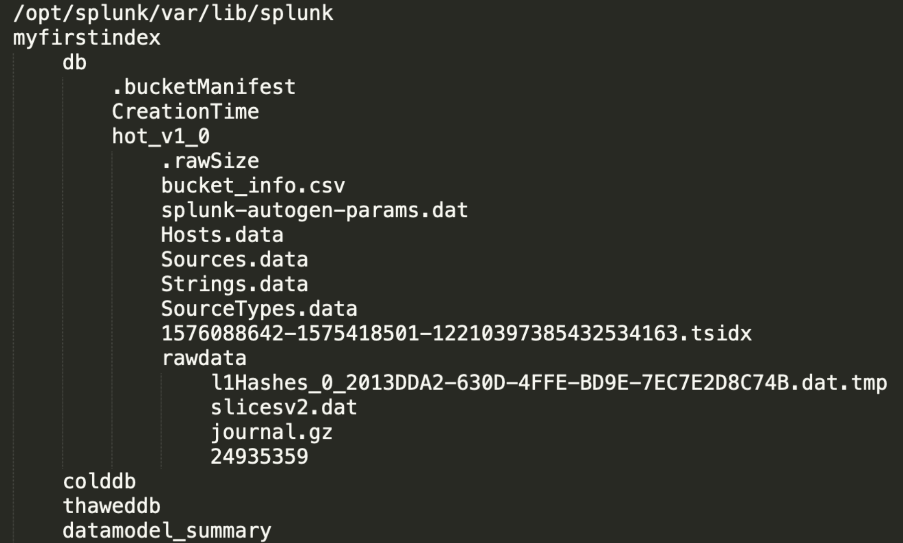

### **3-3 Creating Splunk Indexes**

**Why Create Multiple Indexes?**

* **Security**： Restrict access to index by Splunk role
* **Retention**： Retention policies are applied at index level

**`authorize.conf`**

Security is defined in authorize.conf

```
[role_myrole]      # Definition for myrole
importRoles = user   # Inherit user role’s capabilities
srchIndexesAllowed = os,idx1   #Allowed indexes are os and idx1
srchIndexesDefault = idx1  # Default index is idx1

[role_mysuperuserrole]
importRoles = user
srchIndexesAllowed = os,idx1,idx2  # Allowed indexes are os,idx1,idx2
srchIndexesDefault = idx2   # Default index is idx2
```

**`indexes.conf`**

Indexes are configured in indexes.conf

```
[myfirstindex]   # Definition for myfirstindex
coldPath =  $SPLUNK_DB/myfirstindex/colddb   # Location for cold buckets
enableDataIntegrityControl = 0  # Disable Data Integrity Control
enableTsidxReduction = 0        # Disable TSIDX reduction

homePath = $SPLUNK_DB/myfirstindex/db   # Location for hot and warm buckets

maxTotalDataSizeMB = 512000   # Maximum size of the index
frozenTimePeriodInSecs = 1209600  # Number of seconds after which bucket roles to frozen (every event in a bucket must be older than this limit)

thawedPath = $SPLUNK_DB/myfirstindex/thaweddb # Location for thawed buckets
```

**Creating Splunk Index**

* **Using Splunk Web**
	* Settings -> Indexes -> New Index

* **Using configuration files**
	* Copy existing stanza in `indexes.conf` and update. 
	* Restart of Splunk required

**Creating Index Using Splunk Web**
	
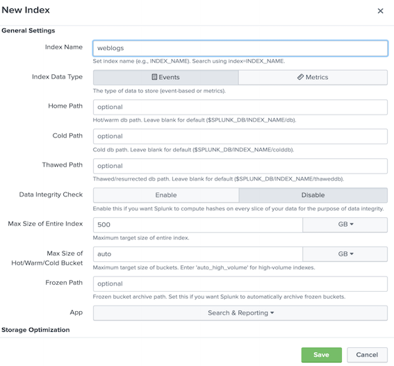

**Index Data Integrity**

* `enableDataIntegrityControl=true` in `indexes.conf`.
	* **Check integrity:**


**`./splunk check-integrity -index [ index name ] `**


* Allows to ensure indexed data has not been tampered with.
	* **Regenerate hash:** 

**`./splunk generate-hash-files -index [ index name ]`**

* Creates hash files (using SHA 256) as the data is indexed.
	*  Hash files are stored in **rawdata** directory within the index.

**One Index vs. Multiple Indexes**

* **Security**: Create separate indexes if you want to allow access selectively
* **Retention**: Create separate indexes if you want varying data retention periods
* **Management**: Easier management for chargeback processes

#### 3-4 Demo

* Create a Splunk index using Splunk Web

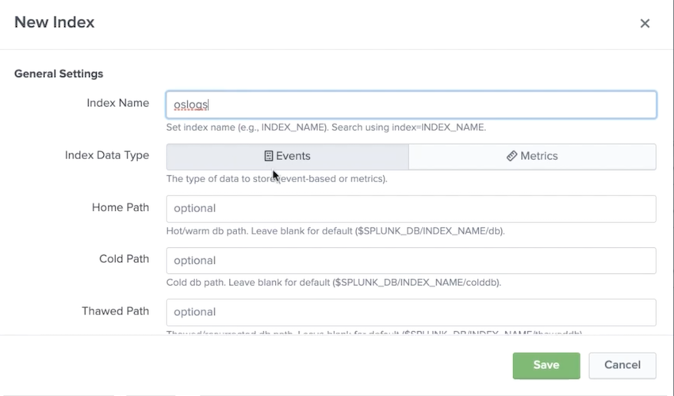

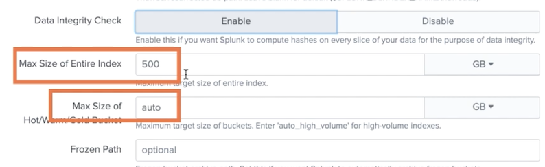


* Upload data

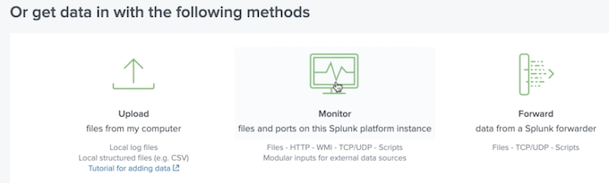

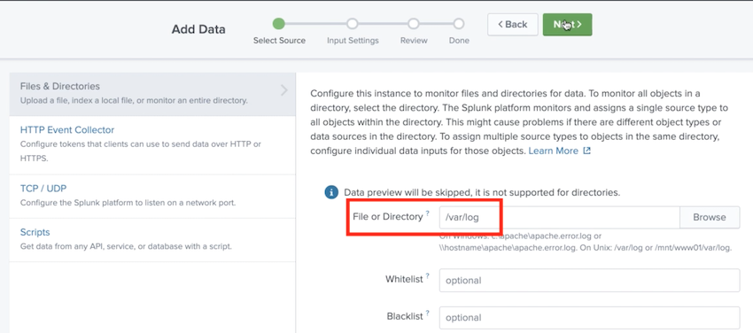

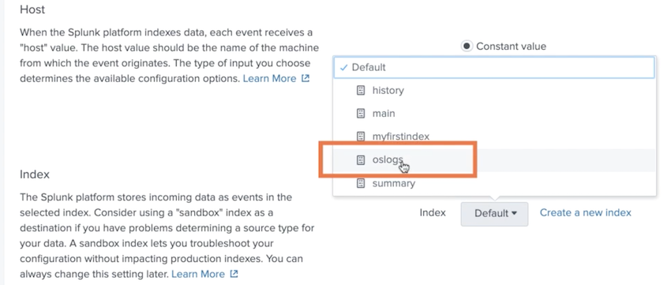

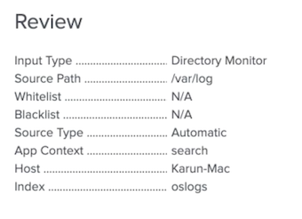

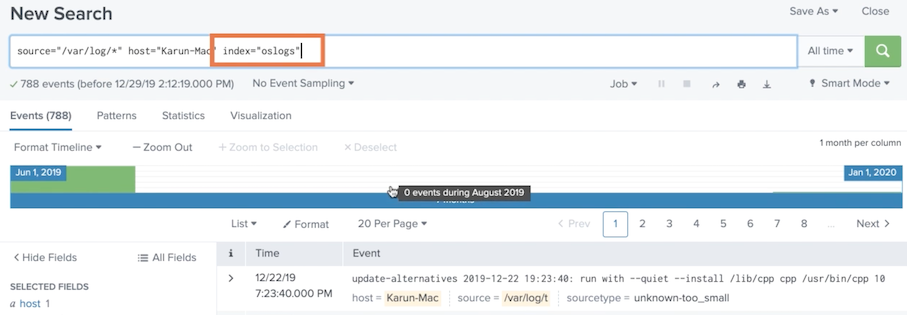

* Review the indexes.conf

```
cd var/lib/splunk/
cd oslogs

/opt/splunk/var/lib/splunk/oslogs$ ls -lrt
thaweddb
datamodel_summary

/opt/splunk/var/lib/splunk/oslogs/db$ ls -lrt
CreationTime
hot_v1_1
hot_v1_0

cd hot_v1_0
1577042620-1577042619-577230494255484
$ ls -lrt
bucket_info.csv
Strings.data
Sources.data
SourceTypes.data
Hosts. data
1559676212-1559676181-5772278361002267635.tsidx
splunk-autogen-params.dat
1559676230-1559676212-5772318639205556589.tsidx
rawdata

/opt/splunk/var/lib/splunk/oslos/db/db_1559676230_1559676181_1/rawdata$ ls
journal.az
12Hash_1_2013DDA2-630D-4FFE-BD9E-7EC7E2D8C74B.dat
slicesv2.dat
```

* Review the index directory structure

	- buckets
	- tsidx files
	- raw data

* Check data integrity

```
./slunk btool indexes list oslogs --debug

/opt/splunk/bin$./splunkcheck-integrity

WatchdogActionsManager reload started
Starting WatchdogThread for process pid=11068. Threads monitoring is enabled with response timeout set to 8000 ms
Operating on: id=oslogs bucket='/opt/splunk/var/lib/splunk/oslogs/db/db_1577042620_1577042619_0
Operating on: id=oslogs bucket='/opt/splunk/var/lib/splunk/oslogs/db/db_1559676230_1559676181_1'
Total buckets checked=2, succeeded=2, failed=0
```

## **4 Configuring Indexes**

* Learning to tune indexes.conf
* Understanding fishbucket
* Applying a data retention policy
* Managing Splunk index
	* Backup
	* Backup
	* Cleaning out
* Using monitoring-console to understand index configuration

### **4-1 Splunk Index Configuration File**

Indexes.conf file is used to configure Splunk indexes and their properties

**`Location of indexes.conf`**

* There is a default `indexes.conf` in `SPLUNK_HOME/etc/system/default` directory.
* **DO NOT edit this file**.
* Create a new indexes.conf in `SPLUNK_HOME/etc/system/local` directory and add specific customization there.


You can also place `indexes.conf` as part of an app under `SPLUNK_HOME/etc/apps/<app name>/local`.

Restart of splunkd required for any configuration changes

**Structure of `indexes.conf`**

The file can have a 'default' stanza for defining global properties

If a property is defined outside of any stanza, **at the top of the file, it is considered a global property**.


If a property is **defined at both global level and in a specific stanza, value in the stanza takes precedence.**

If there are multiple definitions of the same settings in a stanza, **last setting wins**.

* `Indexes.conf`

```
# A basic index definition

[weblogs]

homePath = $SPLUNK_DB/weblogs/db
coldPath = $SPLUNK_DB/weblogs/colddb
thawedPath = $SPLUNK_DB/weblogs/thaweddb

tstatsHomePath = $SPLUNK_DB/weblogs/datamodel_summary

frozenTimePeriodInSecs = 5184000
```

```
homePath = $SPLUNK_DB/weblogs/db  # Directory for hot and warm buckets

coldPath = $SPLUNK_DB/weblogs/colddb # Directory for cold buckets
thawedPath = $SPLUNK_DB/weblogs/thaweddb  # Directory for thawed buckets
tstatsHomePath = $SPLUNK_DB/weblogs/datamodel_summary  # Directory for accelerated data model summary tsidx files

frozenTimePeriodInSecs = 5184000 # Freeze data older than this many seconds

maxHotBuckets = 3  # Maximum number of hot buckets

maxDataSize = auto	# Maximum size of hot buckets (default 750MB)

maxTotalDataSizeMB = 400000  # Maximum size of an index

maxWarmDBCount = 300   # Maximum number of warm buckets
```

### **4-2 Understanding Fishbucket**

**Splunk Fishbucket**

fishbucket is a special Splunk internal index that is automatically created.

**Checkpoint**

Fishbucket keeps track of the ingestion progress of monitored files and directories

**Location**

It is located in `SPLUNK_HOME/var/lib/splunk/fishbucket`.

**Use**

Upon restart, using fishbucket, Splunk can start ingesting from where it left off

**Using Fishbucket**

**To re-index a particular file**

```
# Use btprobe command
./splunk cmd btprobe -d SPLUNK_HOME/var/lib/splunk/fishbucket/splunk_private_db --file <file name> --reset
```

**To re-index all monitored file**

```
# Remove the entire fishbucket directory

rm -rf /opt/splunk/var/lib/splunk/fishbucket

You must restart Splunk Forwarder
```

### **4-3 Applying a Data Retention Policy**


**Data Retention in Splunk**

* you must define a retention policy for the data indexed
* Retention policy is applied at **index level**
* Set **maxTotalDataSizeMB** and/or **frozenTimePeriodInSecs**
* **maxTotalDataSizeMB** overrides **frozenTimePeriodInSecs**
* **indexes.conf** is used to configure retention ploicy


**Configuring Data Retention**

* **maxTotalDataSizeMB**
	* Maximum size of the index in Mega Bytes. **Oldest data is frozen after this limit. Default is 500GB**

* **frozenTimePeriodInSecs**
	* **Time period in seconds after which the data rolls to frozen**. Default is 6 years



**What Happens to the Expired Data**

* When the bucket rolls from cold to frozen, by default the data is deleted
* If **coldToFrozenScript is configured, the script is executed** 
* If coldToFrozenDir is configured, **Splunk moves the expired buckets to this directory**
* To restore expired data, copy the archived buckets to thaweddb location and rebuild
	* `./splunk rebuild SPLUNK_HOME/var/lib/splunk/<index name>/thaweddb/<bucket name>`


### **4-4 Managing Splunk Indexes**

**Backing up Splunk**

* You must regularly backup Splunk. Daily incremental backups recommended.
* **Objects to backup**: Warm and cold buckets; Entire etc directory.
* **Hot buckets can't be backed up without stopping Splunk**.


> In a clustered environment, you may not need to backup data buckets as data is replicated.
> 
> **In distributed environments, ensure you backup search heads and heavy forwarders**.


**Deleting Events in a Splunk Index**

Best way is to let the data expire instead of deleting

**You can only do a virtual delete (i.e data is not removed from disk)**

**Even admins can't delete data by default**

* Create a user with `can_delete` capability.
* Run a search to list the desired events to be deleted.
* **Pipe the delete command**.

**Cleaning out a Splunk Index**

* Extremely dangerous command in production
* Destroys index data from disk
* syntax:
	* `splunk clean all -index <index name>`

	
### 4-5 Demo

* Review indexes.conf
	* Data retention policy


```
cd ../etc/system/default/
vi indexes.conf
```

```
cd /opt/splunk/etc/apps/search/locals
vi indexes.conf

[myfirstindex]
coldPath= $SPLUNK_DB/myfirstindex/colddb
enableDataIntegrityControl=1
enableTsidxReduction=0
homePath=$SPLUNK_DB/myfirstindex/db
maxTotalDataSizeMB=512000
thawedPath=$SPLUNK_DB/myfirstindex/thaweddb
archiver.enableDataArchive=0
bucketRebuildMemoryHint=0
compressRawdata = 1
enable0nlineBucketRepair = 1
minHotIdleSecsBeforeForceRoll=0
rtRouterQueueSize =
rtRouterThreads =
selfStorageThreads =
suspendHotRollByDeleteQuery=0
syncMeta = 1
tsidxWritingLevel =


[oslogs]
coldPath=$SPLUNK_DB/oslogs/colddb
enableDataIntegrityControl=1
enableTsidxReduction=0
homePath=$SPLUNK_DB/oslogs/db
maxTotalDataSizeMB=512000
thawedPath=$SPLUNK_DB/oslogs/thaweddb
```

```
cd /opt/splunk/bin
./splunk btool indexes list oslogs --debug | grep frozen

/opt/splunk/etc/system/default/indexes.conf  frozenTimePeriodInSecs = 188697600
```

* Review location and contents of fishbucket

```
cd fishbucket/
/opt/splunk/var/lib/splunk/fishbucket/splunk_private_db/

$ ls -lrt
snapshot
btree_index.dat
btree_records.dat
```


* Reset fishbucket to re-index data


```
index=oslogs source="/var/log/apt/history.log" "Commandline: apt-get install -y --no-install-recommends python-pip"
```

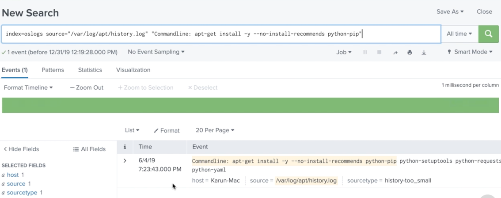


```
index=slogs source="/var/log/apt/history.log" "Commandline: apt-get install -y --no-install-recommends python-pip" | convert ctime
(_indextime) AS Indextime | table Indextime,_time,_raw
```

```
index=oslogs source="/var/log/apt/history.log" "Commandline: apt-get install -y --no-install-recommends python-pip" | convert ctime
(_indextime) AS Indextime | search Indextime = "12/31/2019 12:21:57"
```


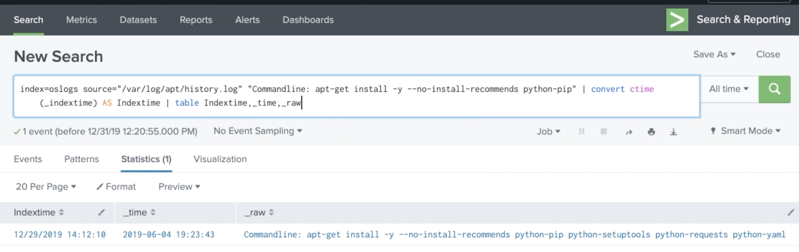

```
$rm -rf fishbucket/
cd /opt/splunk/bin

opt/splunk/bins./splunk restart
```


* Deleting events from an Index

**The user must have can_delete capability
to execute the delete command**

```
index=oslogs source="/var/log/apt/history.log" "Commandline: apt-get install -y --no-install-recommends python-pip" | convert ctime
(_indextime) AS Indextime | search Indextime = "12/31/2019 12:21:57"  | delete
```

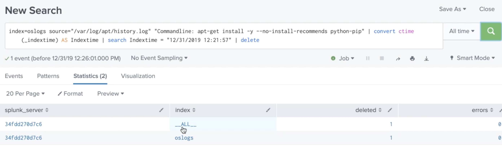


* Use monitoring console to monitor indexes

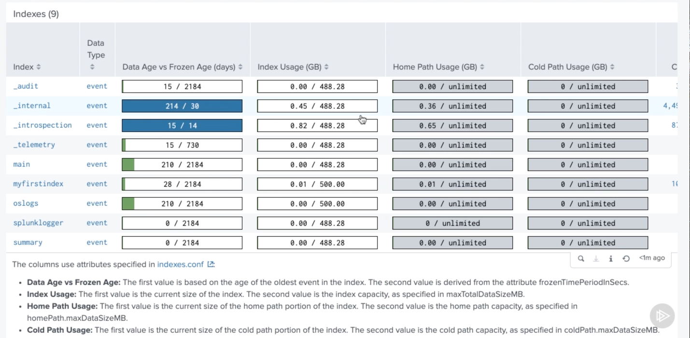


## Course Summary

* Licensing options and handling license violations
* Configuration files layering and precedence
* Using btool to troubleshoot
* **Creating and tuning Splunk indexes**
* Various Splunk data buckets
* Configuring a data retention policy
* Managing Splunk indexes



