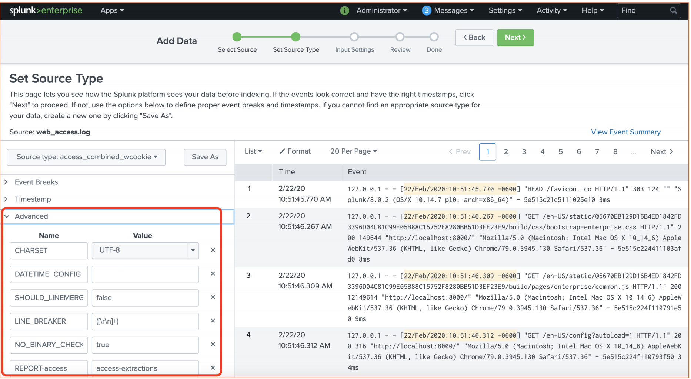

# **3 Managing Data and Forwarders**


## **1 Getting Data into Splunk**

* Understanding Splunk inputs
* Uploading data into Splunk
* Working with sourcetypes
* Understanding the phases of indexing
* **Index-time vs. search-time precedence**

### **1-1 Understanding Splunk Inputs**

**Splunk Enterprise Data Administrator Tasks**

* Create and manage inputs for **universal/heavy forwarders**
* Manage parsing of data including line-breaking and timestamp extraction
* Design and establish new ingestion pipelines
* Manage Splunk configuration files deployment
* Collaborate with users on data on-boarding

**Splunk Enterprise Systems Administrator Tasks**

* Install Splunk Software
* **Create and Manage Indexes**
* Manage Splunk Licenses
* Configure Security
* Monitor Splunk and respond to Monitoring Console Alerts


> On the left side, we have the client systems. 

* This could be applications, network devices or operating systems. They generate logs and other metrics.
* The **Splunk universal forwarder**, being the most common way of collecting data in Splunk, reads data from the log files and then sends them to the indexers using TCP. 
* **The data can be encrypted optionally**. 

> **The indexer receives data, parses them, and stores them in index files**. 

> The search head is the entry point for the user. He uses a search head to log onto Splunk via a web interface and **then uses a specialized query language, Search Processing Language, to query the data**. 

**Ingest Any Text Data from Anywhere**

* Authentication
* Audit
* Middleware
* OS 
* OS Performance
* Network device
* Network packets
* Web Server

---

* Sensors
* IoT Devices
* Database
* Messaging Systems
* CI/CD
* Automation 
* programs
* Mail Server
* LDAP Server

--- 

* Active Directory
* Containers
* Kubernetes/Contain
* er Orchestration
* Applications
* API
* Event viewer
* Mobile devices
* Call Detail record


**Data Inputs**

* A data source configured to send data to Splunk
* Data inputs send data to Splunk Indexers where the data is parsed and indexed
* **During indexing, stream of data from the input is transformed to searchable events**

**Indexing Flow**


* The universal forwarder is the data input. 
	* It uses `inputs.conf` as the primary configuration file to determine the behavior of the inputs. 
	* Data is collected from the source. 
	* **In most cases, these are the log files on the client systems.** 

* **The data is then sent to the indexer**. 
	* That's where the parsing happens. 
	* During parsing and indexing, **props.conf and transforms.conf**, two important configuration files, are utilized by Splunk. 

* Finally, the data is written to the disk. 
	* The data streams that originate at the input are simply transformed into searchable events and written to disk on the indexers. 


**Types of Data Inputs**

* **Files and folders**： Monitor text files
* **TCP/UDP**： Receive data on a TCP/UDP port Files and folders
* **HTTP**： Receive data on a HTTP listener
* **Scripted input**： Ingest output of a script
* **Windows input**： Windows event logs and perfmon data
* **Add-ons**： Custom apps from Splunkbase
* **Splunk Web**： Upload data directly from browser
* **CLI**： Command line interface
* **Modular inputs**： Custom input by extending Splunk
* **FIFO**： First in First out Queues

**Input Phase**

**Data is read from the source**

* Data is handled as streams
* Configuration settings are applied to entire stream
* Similar to unix tail

**Universal Forwarder is the most common input process**

* Universal Forwarder keeps track of the read process
* Metadata such as source, host and sourcetypes are added
* Additional configuration such as compression and encryption are applied


**Let's say if the universal forwarder restarts for some reason, either because a server is rebooted or because a server crashed, you don't want the universal forwarder to reread all the data that it had already ingested.**

 
**So universal forwarder has a very neat mechanism called fishbucket, using which it's going to keep track of the data that it ingests.** 
 
### **1-2 Working with Sourcetypes**

**Why Upload Data into Splunk?**

* Test the data for any parsing errors before onboarding
* Ability to try various regular expressions for **line-breaking and timestamp extractions**

> Splunk provides a great data upload wizard, using which you can catch parsing issues before you actually ingest them into the platform.


* Explore various input options such as **sourcetype** and **host**


**Uploading Data: Workflow**

> Here is the workflow of how you will get data into Splunk. 


**Types of Data You Can Upload**


* Any kind of **text files** (Example: Logs, CSV files)
* Splunk automatically recognizes many standard log files such as **apache web access logs and mysqld log**
* You can even **upload zip files**. Splunk will unzip and upload
* Make sure the data in the files have **valid timestamps**

**Parsing Options**



**Input Options**


### **1-3 Working with Sourcetypes**

**Sourcetypes**

* Splunk uses **sourcetypes** to categorize data
* Splunk comes with may **pretrained sourcetypes**
* Can be used while searching to **filter data**
* Defined in **`props.conf`** on the **indexer or heavy-forwarder**
* Automatically assigned by **Splunk, or explicitly assigned by data administrator**

**Using Sourcetype in Search**


**`index=main sourcetvoe=vendor_sales`**

**`LINE_BREAKER` and `TIME_FORMAT` are the two most important parameters in `props.conf`**


**Assigning Sourcetype in SplunkWeb**


**Pretrained Sourcetypes**

* Splunk automatically **recognizes many log files**
* Splunkbase apps can add new **sourcetypes**
* Examples
	* `linux_messages_syslog`
	* 	`access_combined`
* List of pretrained **sourcetypes** at https://docs.splunk.com

> https://docs.splunk.com/Documentation/Splunk/8.0.3/Data/Listofpretrainedsourcetypes


**Do not configure excessive number of sourcetypes**

> Splunk environments, do not exceed 200 sourcetypes, but for larger Splunk environments, when I say larger I mean at least 50 plus indexers

### **1-4 Understanding the Phases of Indexing**

**Three Phases of Indexing**


**Input phase: forwarders**

* Data is read from data sources such as files and network
* Metadata such as host,source and sourcetype are app
* Most configuration in **inputs.conf** (some in **props.conf**)
* Operates on the entire data stream

**Parsing phase**

* Data is broken into **events**
* **Timestamp** extracted
* Most configuration in **props.conf** (some in **transforms.conf**)
* Operates on individual events
* Event level transformations

**Indexing phase**

* Segment events that then can be searched
* Build index
* License meter runs before the data is written to disk
* Raw data and index files are written to disk (data buckets)

**Data Pipelines**

Screenshot from Splunk monitoring console


**Roles of Data Pipelines**

* Parsing pipeline  / **Character encoding / Line breaking**
* Merging pipeline / **Timestamp extraction / Merge multi-line events**
* Indexing pipeline / Indexing

### **1-5 Index-time vs. Search-time Precedence**

**Index-time and Search-time**

* **Index-time**： Global context, such as input/parsing configuration
* **Search-time**： App/User scoped, such as a user’s knowledge objects

**Why Learn About Precedence?**

* Splunk's behavior is primarily determined by configuration files
* **Multiple copies of the same configuration file can be in different directories**


* Configuration files are managed using a location-based priority scheme
* **During runtime Splunk merges the contents of all copies of a configuration file**
* **Conflicts are resolved by the precedence of the configuration file**

> Btool is an excellent tool to retrieve the configuration file contents.

**Index-time Precedence**


* `etc/system/local `is given the highest priority. 
* `etc/apps/search/local` followed by `etc/apps/app1/local`. (This can be any app)
* `etc/apps/search/default` and then `etc/apps/app1/default`. 

**If two are more apps have conflicting settings, app  directory name with highest 
ASCII order wins**

**What about search time?**


**Search-time Precedence**


### **1-6 Demo**

* Examine existing data inputs
* Upload data into Splunk
* Configure input options
* Create a new sourcetype while uploading data
* Review phases of indexing in monitoring console

Available data inputs in Splunk. **You go to Settings, Data inputs**


**`var/log/splunk` directory contains the platform‑level logs**

`$SPLUNK_HOME/var/log/splunk`


### Add data


**Select Source**

[https://docs.splunk.com/Documentation/Splunk/8.0.3/SearchTutorial/Systemrequirements#Download_the_tutorial_data_files](https://docs.splunk.com/Documentation/Splunk/8.0.3/SearchTutorial/Systemrequirements#Download_the_tutorial_data_files)

### Create index


`index=main sourcetype=vendor_sales`


**Source**


**Create source type**


**how the data ingestion pipeline works.**

**Click `Indexing`, `Performance`, `Indexing Performance: Instance`**


### **Summary**

* Inputs read data from the source and stream them to Indexers
* Data flows through input, parsing and indexing phases
* **Inputs.conf, props.conf and transforms.conf govern the ingestion behavior**
* Event level transformations can be done during indexing
* **Create custom sourcetypes if Splunk’s pre-trained sourcetypes don’t meet your needs**


## **2 Configure Splunk Forwarders**

* Determining appropriate forwarder type to use
* Installing and running universal forwarder
* Setting up forwarding
* Adding input to universal forwarder
* Implementing forwarder options
* Troubleshooting universal forwarders


```
Creating a Splunk universal forwarder using docker
--------------------------------------------------

$ docker pull splunk/universalforwarder

$ docker run -d --name uf1 -h uf1 -e "SPLUNK_START_ARGS=--accept-license" -e "SPLUNK_PASSWORD=splunkRocks" splunk/universalforwarder

9ec532c2ab1e0e3082bd0f84bc12a5fef9dc26b8c8e416ceeb4cb6ee713f2db7

[splunk@a1f4e45f7102 bin]$ ./splunk status
splunkd is running (PID: 730).
splunk helpers are running (PIDs: 731).
```

### **2-1 Splunk Forwarders**

**Splunk forwarder is an instance of Splunk that collects and forwards data to another Splunk instance, most commonly to an indexer**

**Data Flow**


* Data is read from the source
* Data streams are transformed into **searchable events and written to disk**

**Two Types of Forwarders**


* Universal Forwarder
	* 	Installed on the source hosts to collect and **send data to Splunk indexers or heavy forwarders**

* **Heavy Forwarder**
	* 	Sits between universal forwarders and indexers. **Parses data before sending to indexers**

**Universal Forwarder**

* Stripped down version of Splunk enterprise binary
* High performance, low footprint and production-ready
* Does not parse data (Exception: Structured files such as CSV files)

> When parsing is done by the forwarder side, props.conf resides on the forwarder

* **By default 256 KBps output bandwidth** (can be increased in `limits.conf`)

> On the indexer side, **maxKBps is set to 0 by default**, which is unlimited

* Built in, no-limit license


**Heavy Forwarder**

* Splunk enterprise binary with indexing turned off
* Indexing can be optionally turned on
* Parses data before forwarding to indexer or other third-party 
receivers

> **Indexer will ignore props.conf entries for a sourcetype/source/host when data flows through heavy forwarder**

* **Requires forwarder license**
* **Generally used as intermediary between universal forwarder and indexers**


**Universal Forwarder vs. Heavy Forwarder**

* Universal Forwarder
	* 	Reads data from source and **forwards to indexers or heavy forwarders**
	*  Splunk universal forwarder binary
	*  **Does not parse data except for structured data such as CSV**
	*  Does not index data
	*  Built-in license

* **Heavy Forwarder**
	* Receives data from universal forwarders and forwards to indexers
	* Splunk enterprise binary
	* Parses data before sending to indexers
	* Can optionally index data
	* Splunk forwarder license required

**Three Use Cases of Heavy Forwarders**

* **Parse and Route**

Parse data before sending to indexers

* **Firewall rule simplification**

When indexers are behind firewall, a rule is required to allow just the heavy forwarder

* **Hosting Splunk Add-ons Add-ons like**

DBConnect and HTTP Event collectors can be hosted in heavy forwarders

**A Note About Light Forwarder**

* Light forwarders have been deprecated since Splunk version 6.0
* Light forwarders were configured on Splunk Enterprise instances
* Universal forwarders are the recommended replacements for light forwarders


### **2-2 Installing and Running Universal Forwarders Installing and Running Universal Forwarders**


Supported Platforms

Linux / Windows / Mac OS / Solaris / AIX / Free BSD

> You can add universal forwarder install steps in Dockerfile using **entrypoint.sh**

**Installing Universal Forwarder in Unix**


* Download the tar ball and unzip at the desired location
* Install universal forwarder in a separate file system (example: /opt/splunkforwarder)
* The command splunk is located in **`SPLUNK_HOME/bin`** that can be 
* used to start/stop universal forwarder
* The default admin password is **changeme**,and should be changed
* **Employ configuration management tools such as ansible or puppet**

**Installing Universal Forwarder in Windows**

* You can use MSI install wizard or msiexec.exe command line
* Can be installed as a domain user (administrator privilege not required)
* Use **msiexec.exe** with `/quite` and `AGREETOLICENSE=yes` for complete silent install 
* Can enable windows event logs and perfmon ingestion 
* (recommended)
* Runs as a Windows service


**Avoid installing more than one instance of forwarder in a host.**

### **2-3 Setting up Forwarding**

* Step 1

Setup receiving on the indexer(s). **Primary configuration 
file is inputs.conf**

* Step 2

**Setup forwarding on the universal forwarders**. Primary 
configuration file is outputs.conf

**Setting up Receiving**

* Setup on the indexer(s) using Splunk Web gui, command line or `inputs.conf`
* Must be done before forwarders can send data
* Using GUI: `Settings -> Forwarding` and `Receiving -> Configure receiving`
* Command line: `splunk enable listen <port>`
	* Default port is **9997**. You can pick any available port

**Using Splunk Web to Setup Receiving**


**Using Command Line to Setup Receiving On the Indexer**

**Commands**

```
$ cd $SPLUNK_HOME/bin
$ ./splunk enable listen 9997
Listening for Splunk data on TCP 
port 9997.

$ netstat –an | grep 9997
tcp4 0 0 *.9997 
*.* LISTEN
```

Resulting `inputs.conf`

```
[splunktcp://9997]
connection_host = dns
# The connection_host parameter is used if the forwarder does not 
set the hostname. The default is dns where receiver will do a reverse dns lookup to find the host name of the forwarder.
```

**Setting up Forwarding**

* On the forwarders, use command line or `outputs.conf` to set up forwarding
* Command line: `./splunk add forward-server <Receiver ip host:port>` 
	* 	`./splunk add forward-server 192.168.0.11:9997`
* **You can edit `outputs.conf` directly to add forwarding**


**Using Command Line to Setup Forwarding (On the Forwarder)**

* Commands

```
$ cd $SPLUNK_HOME/bin

$ ./splunk add forward-server 192.168.0.11:9997

Added forwarding to: 192.168.0.11:9997.

$ ./splunk list forward-server

Active forwards: 192.168.0.11:9997

Configured but inactive forwards:None
```

* Resulting **outputs.conf**

```
[tcpout]
defaultGroup = default-autolbgroup

[tcpout:default-autolb-group]
server = 192.168.0.11:9997

[tcpoutserver://192.168.0.11:9997]
```

### **2-4 Adding Inputs to the Universal Forwarder**

**Four Ways to Add Inputs**

* Using deployment server to distribute inputs.conf
* Using Splunk command line
* Editing inputs.conf manually
* Using Splunk add-ons

**Using Command Line to Add Input （On the Forwarder）**

Commands

```
$ SPLUNK_HOME/bin/splunk add monitor /.../Logs/fsck_hfs.log

Added monitor of '/Users/karun/Library/Logs/fsck_hfs.log’

# inputs.conf
[monitor:///Users/karun/Library/Logs/fsck_hfs.log]

disabled = false
```

`inputs.conf` has been created in 'search' app at`$PLUNK_HOME/etc/apps/search/local/inputs.conf`.

**Verifying with btool**

```
./splunk btool inputs list monitor:///Users/karun/Library/Logs/fsck_hfs.log

[monitor:///Users/karun/Library/Logs/fsck_hfs.log] 

_rcvbuf = 1572864
disabled = false
host = Mac.local
index = default
```

```
[monitor:///Users/karun/Library/Logs/fsck_hfs.log] 

host = Mac.local
index = default
sourcetype = mac:system:fsck_log
_TCP_ROUTING = default-autolbgroup
blacklist = *trace.log
```

* File or directory to be monitored. For directory inputs, all files in all subdirectories included (recursive)
	* 	Use `recursive = false` in `inputs.conf` to disable recursion.
*  Host name to use for events from this input
*  Index name. The index must exist
*  Sourcetype to use for events from this input
*  Tcpout group to send data to, as specified in `outputs.conf`
*  Files to exclude from monitoring

**Location of inputs.conf**
	
* Splunk uses a framework of layered configuration files.
* Precedence of configuration is determined by the directory location.
* In practice, **`inputs.conf` is bundled in an app and distributed using deployment server**.


**Configuration file precedence under `$SPLUNK_HOME`**

- `etc/system/local` 
- `etc/apps/search/local`
- `etc/apps/<appname>/local`
- `etc/apps/search/default`
- `etc/apps/<appname>/default`
- `etc/system/default`

```
./splunk btool inputs list monitor: ///Users/karun/Library/Logs/fsck_hfs.log --debug
```

### **2-5 Additional Forwarder Configuration Options**

**Fine Tuning Forwarders**

* Forward data selectively to multiple indexers
* Load balance forwarding across indexers
* Configure compression
* Configure SSL
* Buffering (Queueing)
* Indexer acknowledgement


**Forward Data Selectively to Multiple Indexers**

* **Define two tcpout destinations in outputs.conf**
* Use `_TCP_ROUTING` in inputs.conf to selectively send data

**outputs.conf**

```
[tcpout:security]
server = sec_indexer:9997

[tcpout:sre]
server = sre_indexer:9997
```

**inputs.conf**

```
[monitor:///logs/audit.log]
_TCP_ROUTING = security

[monitor:///logs/error.log]
_TCP_ROUTING = sre
```

**Automatic Load Balancing**

* Specify a list of indexers in the server list in `outputs.conf`
* Every 30 seconds, forwarder will randomly select an available indexer from the list
* Frequency can be updated using autoLBFrequency setting (not recommended)

outputs.conf

```
[tcpout:indexers]
server = idx1:9997,idx2:9997,idx3:9997
```

> Automatic Load balancing is required for distributed search to be effective
> 
> **autoLBFrequency is set in outputs.conf**

**Enabling Compression**

* Enable compression on both indexer and forwarder
* Reduces network traffic, but slightly increases CPU usage

**`outputs.conf` on the forwarder**

```
[tcpout:indexer]
server = my_indexer:9997
compressed = true
```

**`nputs.conf` on the my_indexer**

```
[splunktcp:9997]
compressed = true
```

**Configuring SSL**

* Enabling SSL automatically enables compression
* Can increase CPU usage

outputs.conf on the forwarder

```
[tcpout:indexer]

server = my_indexer:9997
clientCert = clientcert.pem
sslRootCAPath = cacert.pem
sslPassword = <password>
```

inputs.conf on the `my_indexer`

> Solunk's default SSL certificates password "password'

```
[splunktcp-ssl:9997]

serverCert = mycert.pem
sslPassword = <password>
rootCA = cacert.pem
```

> Splunk's default SSL certificates password is "Password"

**Configuring Queueing**

* Configure maxQueueSize in `outputs.conf` to enable queueing
* Default is 500kb when useACK is false. 7MB when useACK is true
* When load balancing is enabled, queueing occurs only when all 
indexers are not available


**Configuring Indexer Acknowledgement**


* Ensures data is received by indexers
* Protects against data loss
* Forwarder resends data not acknowledged by indexer
* A wait queue is created with **3X size of maxQueueSize**
* **Enabaled by using `useACK = true` in `outputs.conf`**

### **2-6 Demo**

**Download Splunk Universal Forwarder 9.0.4**

https://www.splunk.com/en_us/download/universal-

```
ls splunkforwarder-8.0.4-767223ac207f-darwin-64.tgz
splunkforwarder-8.0.4-767223ac207f-darwin-64.tgz

cd /opt
/opt $ tar xvzf ~/Downloads/splunkforwarder-8.0.4-767223ac207f-darwin-64.tgz

/opt/splunkforwarder $ cd bin
/opt/splunkforwarder/bin $ ./splunk start --accept-license

Please enter an administrator username: admin
Password must contain at least:
* 8 total printable ASCII character(s).
Please enter a new password:

/opt/splunkforwarder/bin $ ./splunk status

splunkd is running (PID: 16282).
splunk helpers are running (PIDs: 16285)
```

* **Configuire Indexer**

```
~/platform/splunk/bin 

./splunk display listen
Receiving is disabled
```

**Add Forward and Receiving Data via commmand line**


```
~/platform/splunk/bin $ ./splunk enable listen 9997
Listening for Splunk data on TCP port 9997.

~/platform/splunk/bin $ netstat -an | grep 9997
tcp4 0. 0.  *.9997.  *. * LISTEN

~/platform/splunk/bin $ ./splunk btool inputs list
...
[splunktcp://99977
revbuf = 1572864
connection_host = ip
host = Mac.local
index = default
...

./splunk btool inputs list splunktcp://9997 --debug

/Users/karun/platform/splunk/etc/apps/search/local/inputs.conf [splunktcp://9997]
/Users/karun/platform/splunk/etc/system/default/inputs.conf revbuf = 1572864
/Users/karun/platform/splunk/etc/apps/search/local/inputs.conf connection_host = ip
/Users/karun/platform/splunk/etc/system/local/inputs.conf host = Mac.local
/Users/karun/platform/splunk/etc/system/default/inputs.conf index= default
```

* **Universal Forwarder**

```
docker pull splunk/universalforwarder

docker exec -u splunk -it uf1 /bin/bash

[splunk@uf1 splunkforwarder]$ cd bin
[splunk@uf1 bin]$ ./splunk list forward-server

[splunk@uf1 bin]$ ./splunk list forward-server
Active forwards:
None
Configured but inactive forwards:
None

[splunk@uf1 bin]$ ./splunk add forward-server 192.168.0.11:9997
Added forwarding to: 192.168.0.11:9997.

[splunk@uf1 bin]$ ./splunk btool outputs list
...
[tcpout-server://192.168.0.11:9997]
[tpout: default-autolb-group]
server = 192.168.0.11:9997
...

```

`index=_internal host=uf1`


Source type


```
$ docker exec -u splunk -it uf1 /bin/bash
[splunk@uf1 splunkforwarder]$ cd bin
[splunk@uf1 bin]$ ./splunk add monitor /opt/container_artifact/ansible.log

Your session is invalid.
Splunk username: admin
Added monitor of '*/opt/container_artifact/ansible.log'
```

Do not use `index=*` in your production environment as it might consume excessive resources

`index=* host=uf1 source=*ansible*`


```
[splunk@uf1 splunkforwarder]$ cd bin
[splunk@uf1 bin]$ ./splunk btool inputs

...
[monitor:///opt/container_artifact/ansible.log]
f_revbuf = 1572864
disabled = false
host = $decideOnStartup
index = default
...


[splunk@uf1 bin]$ ./splunk btool inputs list monitor: ///opt/container_artifact/ansible.log --debug

/opt/splunkforwarder/etc/apps/search/local/inputs.conf [monitor:///opt/container_artifact/ansible.log]
/opt/splunkforwarder/etc/system/default/inputs.conf _rcvbuf = 1572864
/opt/splunkforwarder/etc/apps/search/local/inputs.conf disabled = false
/opt/splunkforwarder/etc/system/default/inputs.conf host = $decideOnStartup
/opt/splunkforwarder/etc/system/default/inputs.conf i
ndex = default


[splunk@uf1 bin]$ vi /opt/splunkforwarder/etc/apps/search/local/inputs.conf

[monitor:///opt/container_artifact/ansible.log]
disabled = false

# Adding inputs for watchdog.log
[monitor:///opt/container_artifact/ansible.log]
disabled = false
index = main
sourcetype = splunk:watchdog_log

[splunk@uf1 bin]$ ./splunk restart
```

`index=* source=*watchdog.log*`


`Update $PLUNK HOME/etc/system/local/outputs.conf`

```
[splunk@uf1 splunkforwarder]$ cd etc/system/local

[indexAndForward]
index = false
[tcpout]
defaultGroup = default-autolb-group

[tcpout:default-autolb-group]
server = 192.168.0.11:9997
useACK = true

[tcpout server: //192.168.0.11:9997]
```

`index=_internal host=uf1 ack`


```
[splunk@uf1 splunkforwarder]$ cd bin
[splunk@uf1 bin]$ ./splunk status
splunkd is running (PID: 54057).
splunk helpers are running (PIDs: 54058)

[splunk@uf1 bin]$ ps -ef | grep splunk

splunk 54057 0 0 13:44 ? 00:00:01 splunkd -p 8089 restart

/splunk btool outputs list
```

**Summary**


* Most common way to send data to Splunk is using universal forwarders

* Use heavy forwarders as intermediary between forwarders and indexers

* **Heavy forwarders parse and optionally index data**

* **Major configuration files are inputs.conf and outputs.conf**

* **Forwarder configuration options include  SSL, queueing, load balancing and compression**

## **3 Manage Splunk Forwarders**

* Use of forwarder management
* Describe Splunk deployment server
* Use deployment apps
* Configure deployment clients
* Configure client groups using 
* serverclasses
* Monitor forwarders

### **3-1 Use of Forwarder Management**

Why Forwarder Management?

* **Centralized**
	* 	Handle thousands of forwarders from one system
* **Distribute configuration files**
	* 	Configuration files can be packaged as apps and distributed from a central place
* **Monitor forwarders**
	* 	**Monitor the availability of forwarders and restart them remotely**

**Forwarder Management in Practice**

* For indexer infrastructure changes, forwarder's `outputs.conf` needs to be updated
* **For changes in data sources**, `inputs.conf` needs to be updated
* If a forwarder is down, we need to be alerted in a reasonable time
* We can take advantage of Splunk's configuration files layering to create custom apps and distribute
* Installing forwarders is generally done by configuration management tools such as ansible or puppet

**Forwarder management is implemented using Splunk deployment server, a tool to manage Splunk configuration files**

### **3-2 Splunk Deployment Server**

Splunk Deployment Server

* A tool to manage Splunk configuration files
* Splunk Enterprise License is required
* Can be accessed via Splunk Web
* Keep a dedicated server for deployment server
* Cannot be used for installing/upgrading forwarders

**Deployment Server Architecture**


**Deployment Server   (1 - many)  Hosts with universal forwarders** 


**Deployment Server Architecture**


### **3-3 Deployment App**

* Mechanism to distribute configuration files to forwarders
* App must adhere to the standard Splunk app directory structure
* **It can contain configuration files, scripts, views and other resources**
* On the deployment server, apps are stored in `$SPLUNK_HOME/etc/deployment-apps`
* On the forwarders, apps will be deployed in `$SPLUNK_HOME/etc/apps`

**Sample App**


**Setting up Deployment Server**

* Create at least one app in `$SPLUNK_HOME/deploymentapps/`
* Forwarder management UI is not activated until a 
deployment app is found

**Forwarder Management**

The forwarder management UI distributes deployment apps to Splunk clients. 

No clients or apps are currently available on this deployment server.

**Setting up Deployment Server**


### **3-4 Deployment Clients**

**Setting up Deployment Clients**

* Forwarders must be setup as deployment clients
* Primary configuration file is **`deploymentclient.conf`**

```
Command

$./splunk set deploy-poll 192.168.0.11:8089
Configuration updated.
```

**`deploymentclient.conf`**

```
[targetbroker:deploymentServer]

targetUri = 192.168.0.11:8089
```

**Forwarder Management**


**`Deploymentclient.conf` Customization**

**Configuration**

* `targetUri = 192.168.0.11:8089` :  Must be under [targetbroker:deploymentServer] stanza. 
	* 	Specifies deployment Server
* `clientName = myWebServer` : A custom name that can be used by deploymentServer in serverclass
* `phoneHomeIntervalInSecs = 120` : How frequently the deployment server is checked for new content (default=60)

### **3-5 Setting up Serverclasses**

**Serverclass**

* Mechanism to group hosts (deployment clients) and designate the deployment apps to be deployed
* You can group hosts based on `dns/ip/client` name
* You can also group hosts based on the machine type
* Serverclasses are defined in serverclass.conf
* Wild cards allowed when specifying the host names

**Creating a Serverclass**


### **3-6 Monitoring Forwarders**

**Monitoring Forwarders**

* **Forwarder monitoring can be enabled from monitoring console (recommended)**
* Periodically (**15 minutes by default**), **using 
internal logs from the forwarders**, a forwarder asset table (lookup) is built

> **The lookup table name is `dmc_forwarder_assets`**

* **We can monitor**

- Forwarder state (active/missing)
- Data throughput (kb/s)
- Events throughput (events/s)

**Monitoring Console**


**Rebuilding Forwarder Assets**

* Monitoring console will mark a forwarder as missing if it has not reported in the past 15 minutes.
* **To avoid decommissioned servers from being reported**, you can rebuild the forwarder assets table
* This is a resource intensive process, so run it during off-peak hours
* **Monitoring console > Settings > Forwarder Monitoring Setup > Rebuild forwarder assets**

### Demo

* **Configure deployment server**
	- Create a deployment app
* **Configure deployment client**
* Create a serverclass
	- Add apps
	- Add clients
* **Deploy an app**
* **Monitor forwarders using monitoring console**

#### Indexer

**Create a deployment app**

```
cd etc/deployment-apps

/etc/deployment-apps > cd /tmp

cd /tmp > tree acme-forwarder-limits

acme-forwarder-limits
|
| _ default
		\_app. conf
\_local
	\_limits.conf
\_metadata
	\_default.meta
	
3 directories, 3 files
```

```
$ cat acme-forwarder-limits/default/app.conf
[default]

[install]
state = enabled

$ cat acme-forwarder-limits/metadata/default.meta
[]
access = read : [ * ], write:[ power, admin ]

$ cat acme-forwarder-limits/local/limits.conf
[thruput]
maxKBps = 2048
```

> On the indexers, maxKBps is set to 0 (unlimited) by default

```
/etc/deployment-apps >  cp -r /tmp/acme-forwarder-limits .

/etc/deployment-apps > ls

README
acme-forwarder-limits
```


#### Configure deployment client

```
docker exec -u splunk -it uf1 /bin/bash

[splunk@uf1 splunkforwarder]$ cd bin
[splunk@uf1 bin]$ pwd
/opt/splunkforwarder/bin

[splunk@uf1 bin]$ ./splunk set deploy-poll 192.168.0.11:8089

Your session is invalid. Please login.
Splunk username: admin

[splunk@uf1 local]$ cat deploymentclient.conf
[target-broker: deploymentServer]
targetUri=192.168.0.11:8089
```

> deploymentclient.conf is created in
`$SPLUNK_HOME/etc/system/local`

#### Create a serverclass


```
$ cd ../../apps
$ ll

acme-forwarder-limits
```

**Monitor forwarders using monitoring console**


## Summary

* Deployment server manages the distribution of configuration files
* **Forwarders are deployment clients (deploymentclient.conf)**
* Configuration files are packaged as deployment apps
* **Serverclass groups forwarders and assigns apps to be deployed (serverclass.conf)**
* Monitoring console can monitor the availability and throughput of forwarders

--

* Data goes through input, parsing and indexing phases
* **Master inputs.conf, outputs.conf, props.conf, and serverclass.conf**
* Heavy forwarders parse data and can be used to host add-ons
* Use deployment server to manage forwarders