# 4 Splunk Administration: Configuring Distributed Search

## **1 Understanding distributed search**

* Anatomy of a search
* Distributed search overview
* Search peers
* Knowledge bundle
* Knowledge bundle replication

### **1-1 Anatomy of a Search**

**The Splunk Platform**

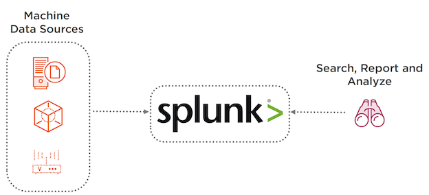

**Standalone Splunk**

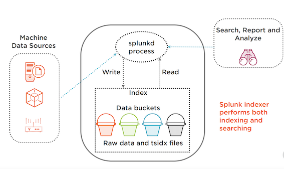

> Technically, this is known as inverted index

**Search Overview**

* During indexing, Splunk indexers convert the machine data stream into searchable events which are stored in indexes
* Indexes contain compressed raw data (journal.gz) and time-series index files (TSIDX)
* **Indexes store data in time-oriented buckets** (hot, warm, cold and frozen)
* **Indexers perform the search and return the results**
* Search results and meta data are stored as search artifacts until the search job expires

**How Splunk Retrieves Data**


* **Timeframe**： Identify data buckets based on the time range
* **Bloom Filter**： Calculate bloom filter on base search and compare against  bucket’s bloom filter

**Bloom Filter**

* **Bloom filter is a bit array created by running search terms through set of hashing algorithm**
* Splunk creates a bloom filter for each bucket
* When a search is run, **Splunk calculates the bloom filter for the base search, and compares with the bucket bloom filter**
* Only the matching buckets are opened
* Having as many filtering terms as possible in the base search improves search performance

**Search Artifact**

* Contains results and metadata
* Stored on `$SPLUNK_HOME/var/run/dispatch`
* Deleted when the search job expires
* Each job has its own directory
* Too many search artifacts can cause performance degradation


**Contents of Dispatch Directory**

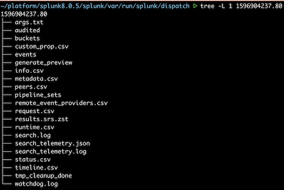

**Dispatch Directory Naming Convention**

Type of search

* Ad-hoc: Unix Time of the search. (1596904237.80)
* **Saved search**: 
	* `<run by user>__<context_user>__<app>__search
(admin__admin__search__mysearch_ 1596904237.80)`
* **Scheduled search**
	* `scheduler_nobody__web__mysearch__ 
1596904237.80`
* **Remote search**
	* `remote_<peer>_<search>`

**Default Time To Live of Search Artifacts**

* **Ad-hoc** : 10 minutes
* Manually invoked saved search: **10 minutes**
* Scheduled search without alert action: **Twice the scheduled period**
* Scheduled search with email action: **24 hours**
* Scheduled search with script action: **10 minutes**
* Scheduled search with summary indexing action   **2 minutes**


**Changing the TTL**

* Global search behavior can be updated in ***limits.conf*** using ***ttl*** or **`remote_ttl`** parameters under search stanza
* Individual sched searches can override TTL using `savedsearches.conf` or using Splunk Web
* Alert actions can override TTL using `alert_actions.conf` or using Splunk Web

**Overriding Alert Actions TTL**

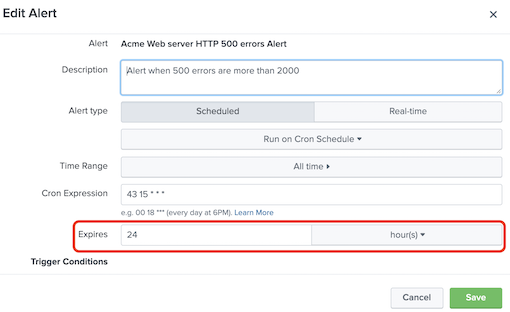

### **1-2 Distributed Search Overview**

**Distributed search separates search management & presentation layer from indexing & search retrieval layer**

Distributed Environment

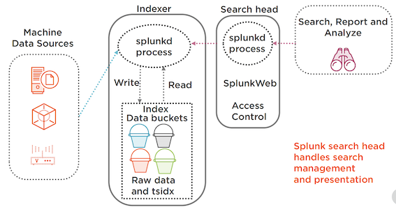

**Scaling**

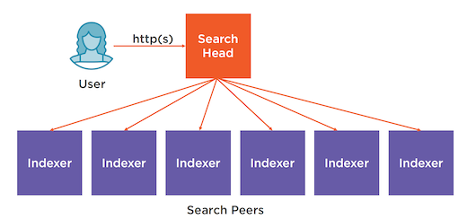

**How Distributed Search Works?**

* Search head receives user’s search request
* **Search head dispatches searches to the search peers (indexers)**
* Search peers run the search on behalf of search heads and return the results to the search head
* Search head merges the results from all the search peers
* Search head runs additional filtering and transformation commands (if applicable) and returns the results to the user

**Search Peers**

* The indexers that participate in distributed search are called search peers
* **Search peers must be added in search heads**
* If the search head participates in indexer cluster, search peers are automatically added
* **When a peer goes down, search head removes it from the peers list (default timeout 10 seconds)**

### **1-3 Splunk Knowledge Bundle**

**Knowledge Bundle**

* Archive of knowledge objects that search head sends to all search peers
* Includes knowledge objects such as event types, saved searches.
* **Search peers need these knowledge objects to execute searches on behalf of search heads**
* Contains a subset of `$SPLUNK_HOME/etc/system`, `$SPLUNK_HOME/etc/apps` & `$SPLUNK_HOME/etc/users`

**Location of Knowledge Bundle**

* Search Head   `$SPLUNK_HOME/var/run` (`.bundle` or `.delta` extension)
* **Search Peers**: `$SPLUNK_HOME/var/run/`
searchpeers

Content of Knowledge Bundle

**On the search peers:**

`$SPLUNK_HOME/var/run/searchpeers/<bundleid>`

- system
- users
- apps
- bundle.info


### **1-4 Knowledge Bundle Replication**

As part of distributed search, search head periodically 
distributes its knowledge bundle to its search peers

**What is Replicated?**

Search head periodically replicates knowledge bundle in the background or when initiating a search

**Full bundle**

The entire knowledge bundle

**Delta**

Changes since the last full bundle push


**Four Replication Policies**

* **Classic**：  Search head directly replicates to all search peers
* **Cascading**： Replicates to a subset of search peers which replicates to other search peers & so on
* **Mounted**: Search head places the knowledge bundle in shared storage (NOT recommended)
* **RFS**: Search head uploads knowledge bundle to a remote file system

**Configuring Replication Policy**

> The configuration file must reside on the search head

`distsearch.conf`

```
[replicationSettings]
replicationPolicy = [classic | cascading | rfs | mounted]
connectionTimeout = 60
maxBundleSize = 2048
```

**Managing Knowledge Bundle**

* You can customize what gets replicated
* Use `distsearch.conf ` to blacklist large files you don’t need replicated

```
[replicationBlacklist]
excludeLookups = apps/myapp/lookups/mybiglookup*
```

**Monitoring Knowledge Bundle Replication**

* **Splunk Web**  `Settings -> Distributed Search`
* **Monitoring Console** `Search -> Distributed Search`
* Command line  `$SPLUNK_HOME/bin/splunk show bundle-replication-status`
* **REST API**   `/services/search/distributed/bun dle/replication/config`


### Demo

* Review search in standalone environment
* Run an ad-hoc search and check the dispatch directory
* Review job inspector and search.log
* Change the default TTL of ad-hoc search
* Change the default TTL of a scheduled search

`index=main sourcetype=secure Failed`

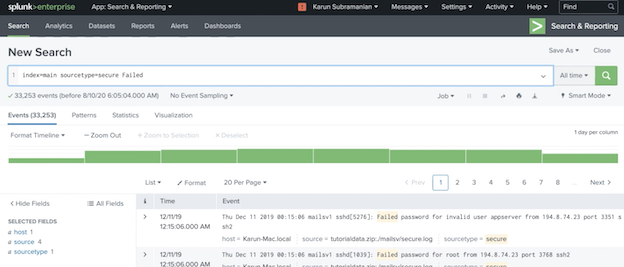

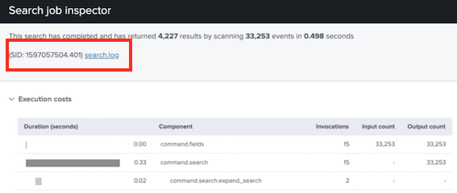

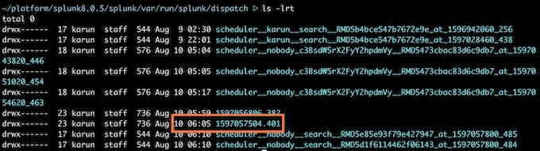

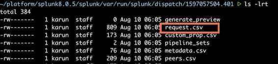

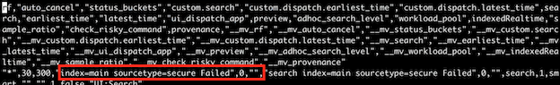

**`arg.txt`**

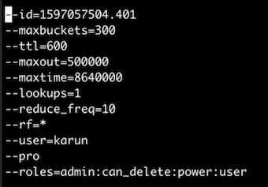

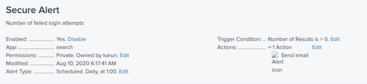


##**2 Configuring Distributed Search**

**Overview**

* Preparing indexers to participate in distributed search
* Adding search peers
* Configuring distributed search groups
* Monitoring search peers
* Quarantining search peers

### **2-1 Configuration at a Glance**

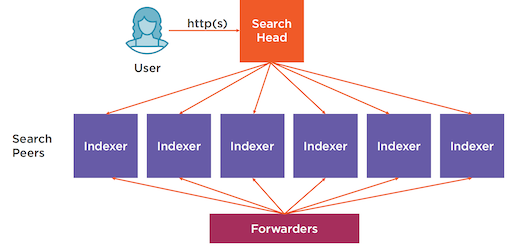

**Setting up Distributed Search**

* Install the same version of Splunk Enterprise in search head and search peers
* **Search head and search peers must use a license master**
* **Setup the same indexes in all search peers**
* Create a user with `edit_user` capability on all search peers
* Add search peers in search head via Splunk Web

**Preparing the Indexer**

* **Access**: Create a user with `edit_user` capability
* **Index**: Ensure indexes have data coming in from  forwarders
* **Connectivity**： Ensure search head can connect to management port (8089) of the indexer


### **2-2 Adding Search Peer Using Splunk Web**

Adding Search Peer Using Splunk Web

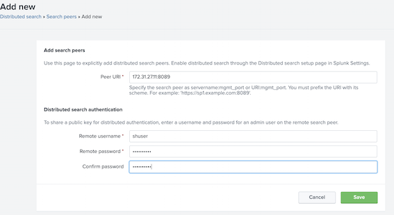

**Verifying Distributed Search**

* Examine the search peer in distributed search page in Splunk Web. Look for Replication Status
* Run a search to retrieve events from an index
* Check the internal logs on the indexer

**Verifying Search Peers**

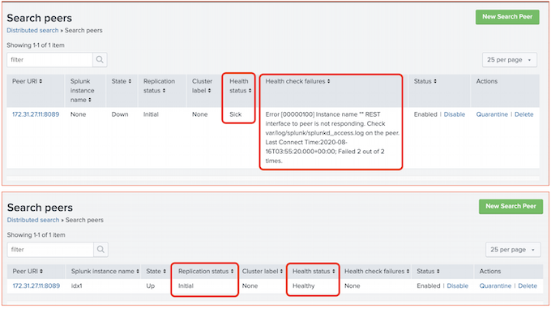


### **2-3 Distributed Search Groups**

**Distributed Search Groups**

* Search peers configured into specific groups using `distsearch.conf`
* Enables to run searches on targeted indexers
* Use `splunk_server_group` option in SPL to specify the group

**Distributed search groups should be avoided in indexer clusters**

* The primary copy of a data bucket can be in any indexer
* Enables to run searches on targeted indexers
* Can be employed in multiple indexer cluster scenarios

**Configuring  Distributed  Search Groups**

`distsearch.conf`

```
[distributedSearch]
servers = https://172.31.22.35:8089,https://172.31.27.11:8089,https://172.31.22.115:8089

[distributedSearch:sec]
servers = https://172.31.22.35:8089,https://172.31.27.11:8089

default = false

[distributedSearch:sre]
servers = https://172.31.22.115:8089
default = false
```

**Using Distributed Search Groups**

* Specify the distributed search group as part of SPL

`index=infra splunk_search_group = sre`

Verify by examining `splunk_server` field

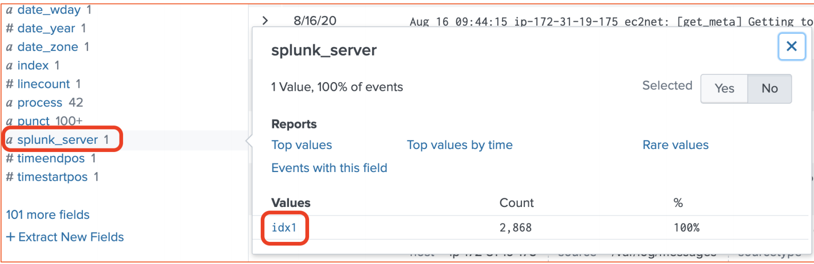

### **2-4 Quarantining a Search Peer**

* You can quarantine search peers from participating in searches
* Enables to perform maintenance on the search peer without affecting searches
* You can use Splunk Web’s to quarantine search peers

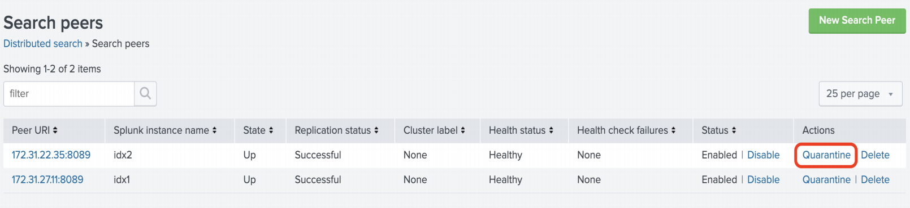

### **2-5 Demo**

* Prepare an indexer for distributed search
* Add search peers (indexer) in search head
* Verify distributed search

**Distributed Search Environment**

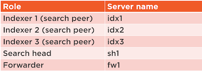

**Add new search peer**

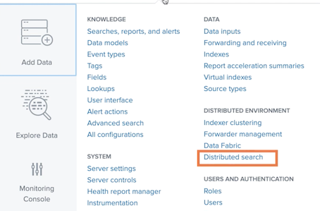

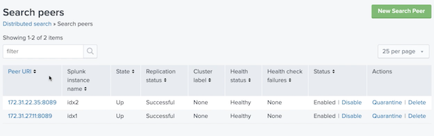

**Add new search peer user**

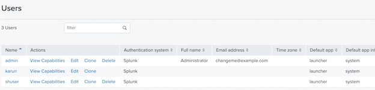

Add search peers

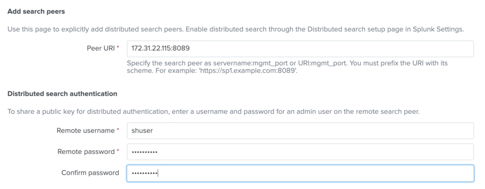


```
[splunk@ip-172-31-19-217 sh1 splunk]$ cd /opt/splunk
[spunk@ip-172-31-19-217 sh1 splunk]$ pwd
/opt/splunk
[plunk@ip-172-31-19-217 sh1 splunk]$ cd etc/system/local
[splunk@ip-172-31-19-217 sh1 local]$ ls
README
inputs.conf
migration. conf
server.conf
```

**`"distsearch. conf" `**

```
[distributedSearch]
servers = https://172.31.22.115:8089.https://172.31.22.35:8089.https://172.31.27.11:8089
```

`index=infra`

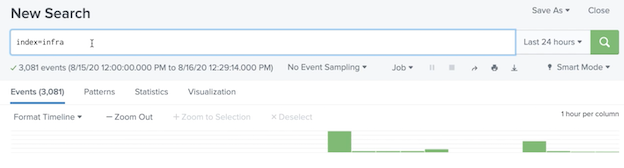

`idx1  			idx2 			 idx3`

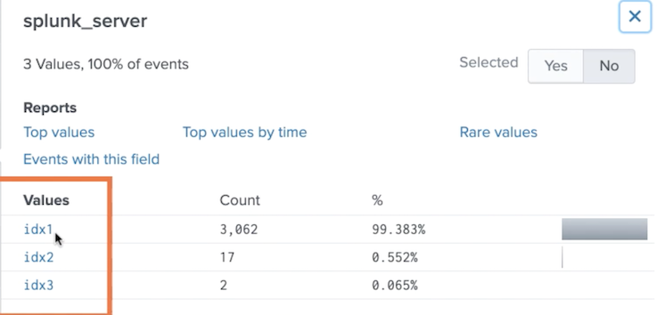

You can also `Inspect job`


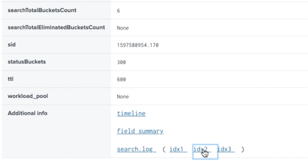

```
[plunk@ip-172-31-19-175 fw1 splunk]$ cd /opt/splunkforwarder/
[spunk@ip-172-31-19-175 fw1 splunkforwarder]$ cd etc/system/local
[plunk@ip-172-31-19-175 fw1 local]$

# outputs configuration to send data to indexers in aws
[tcpout: idxGroup]
server = 172.31.27.11:9997,172.31.22.35:9997,172.31.22.115:9997
```

**`inputs.conf`**

```
# Inputs to capture system logs and send it to aws indexers
[default]
host = fw1

[monitor:///var/log/messages]
TCP ROUTING = idxGroup
index = infra
sourcetype = syslog
ignore0lderThan = 7d
```

**The tepgroup idxGroup is defined in `outputs.conf`**

`index=_internal host=fwl`

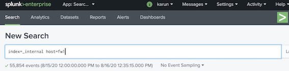

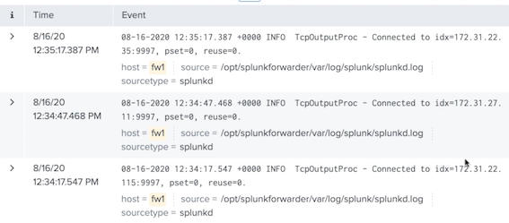

### Demo

* Configure distributed search group
* Invoke a search using distributed search group
* Quarantine a search peer

```
[Splunk@ip-172-31-19-217 sh1 local]$ pwd
/opt/splunk/etc/system/local

[Splunk@ip-172-31-19-217 sh1 local]$ ls
...
distsearch. conf

[Splunk@ip-172-31-19-217 sh1 local]$ vi distsearch. conf
[distributedSearch]
servers = https://172.31.22.115:8089.https://172.31.22.35:8089.httos://172.31.27.11:8089
```

Add sec search group and sre searcg group

```
[distributedSearch]
servers = https://172.31.22.115:8089.https://172.31.22.35:8089.httos://172.31.27.11:8089

[distributedSearch:sec]
servers = https://172.31.22.115:8089.https://172.31.22.35:8089.httos://172.31.27.11:8089
default = false

[distributedSearch:sre]
servers = https://172.31.22.115:8089
default = false
```

```
[plunk@ip-172-31-19-217 sh1 local]$ cd /opt/splunk/bin
sudo  ./splunk restart
```

**New Search**

```
index=infra splunk_server_group="sec"
```

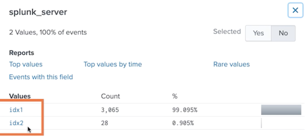

```
index=infra splunk_server group = "sre"
```

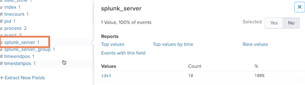

```
index=infra
```
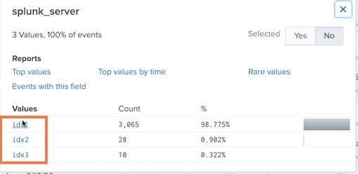

`splunk_server_group`

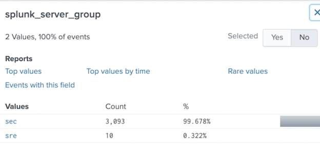

`Quarantine splunk_server`

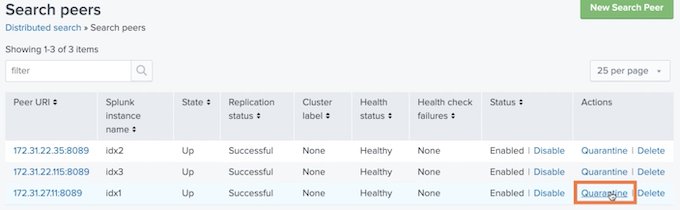

* Quarantined 172.31.2711:8089


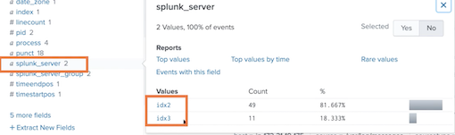

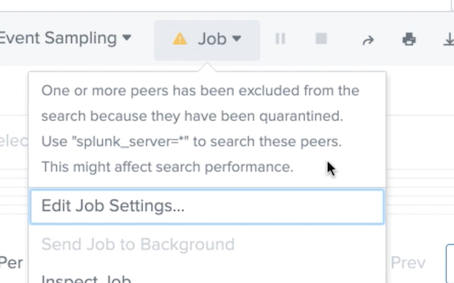

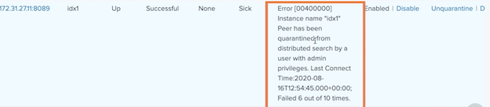

## 3 Scaling Distributed Search

**Overview**

* Scaling options available
* **Search head cluster architecture**
* Search head cluster operation
	* **Configuration replication**
	* **Artifact replication**
	* Deployer
* Creating a search head cluster

### **3-1 Search Head Scaling Options**

**Why Scale?**

* Prevention of single point of failure
* Prevention of performance issue due to resource constraints
* Distribute load across many servers geographically
* Efficiently perform server maintenance without causing outages

**Scaling Options**

* **Independent search heads**: Dedicated search heads 
with no communication between them
* **Search head clusters**: A group of search heads (minimum 3) in a cluster communicating with each other
* **Indexer clusters**:  Search heads that join indexer cluster can be independent or search head cluster

**Independent Search Heads**

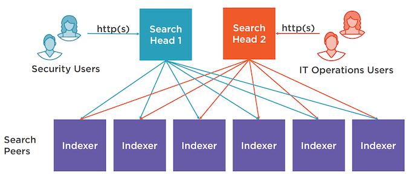

**Search Head Cluster**

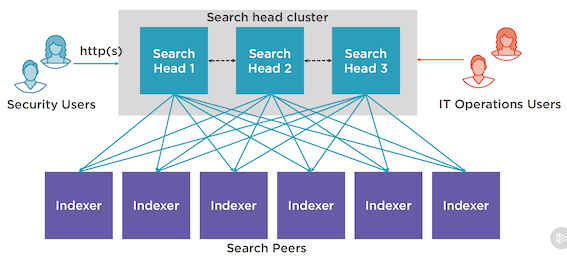

### **3-2 Search Head Cluster Architecture**

**Search Head Cluster Considerations**

* Minimum 3 members required
* **Always use new Splunk instances to create the cluster**
* Cluster members must have the same hardware capacity
* **Synchronize the clocks of all members including search peers**

**Key Benefits of Search Head Clustering**

* High availability and load balancing
* **Captain manages and distributes the scheduled jobs**
* Configuration and search artifacts replication
* Seamless user experience

**Search Head Cluster Architecture**

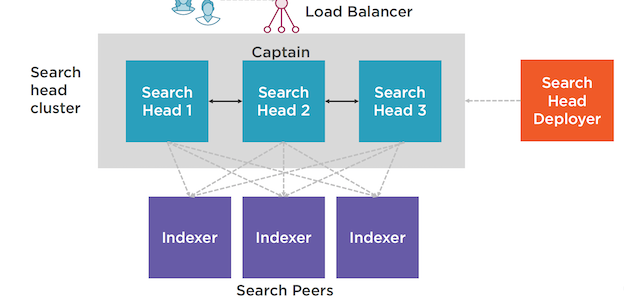

### **3-3 How Does the Search Head Cluster Work?**

**Search Head Captain**

* Captain centrally coordinates all **cluster-wide activities. Captain is also a member of the cluster**
* Captaincy can be configured to be **dynamic (default) or static**
	* With dynamic captaincy, **the cluster automatically elects a new captain using RAFT consensus algorithm**
	* Captain consumes more CPU and memory

**Scheduled Jobs and Artifacts**

* Captain is the **only scheduler**
* Captain chooses the search head cluster member to run search jobs based on load
* Search artifacts are replicated by captain to other members. 
	* Ad-hoc and real-time artifacts are not replicated

**Configuration Management**

* **Automatic Replication**
	* Changes done via Splunk Web, CLI and REST API are automatically replicated
* **Deployer**
	* Changes done to the `.conf` files must be distributed through Search head deployer 

**Deployer**

* A Splunk instance outside of SHC (search head cluster). Associated with SHC by using **pass4SymmKey** in `server.conf`
* Apps to be deployed are stored in `/etc/shcluster/apps`
* Merges ***default*** and ***local*** directory files and deploys to default directory on the **SHC members (never to local)**
* Automatically triggers a rolling restart if necessary

### Demo

* Initialize a 3-member search head cluster
* Add search peers
* Verify configuration replication

**Search Head Cluster Environment**

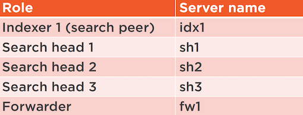

Search heads are going to be configured in a search head cluster

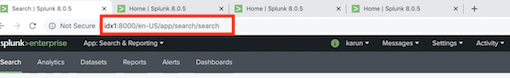


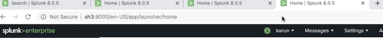

**sh1**

```
[Splunk@ip-172-31-25-141 sh1 ~]$ cd /opt/splunk/bin

$ ./splunk init shcluster-config -mgmt_uri https://172.31.25.141:8089 replication_port 9200 -secrect  shcluster

cd /opt/splunk/bin

$ sudo ./splunk restart
```

**sh2**

```
[splunk@ip-172-31-19-166 sh2 ~]$ cd /opt/splunk/bin
[splunk@ip-172-31-19-166 sh2 bin]$  ./splunk init shcluster-config -mgmt_uri https: //172.31.19.166:8089 -replication_port 9200 -secret shcluster

[splunk@ip-172-31-19-166 sh2 bin]$ sudo ./splunk restart
```

**sh3**

```
[splunk@ip-172-31-21-109 sh3 bin]$ ./splunk init shcluster-config -mgmt_uri https://172.31.21.109:8089 -replication_port 9200 -secret shcluster

[splunk@ip-172-31-19-166 sh2 bin]$ sudo ./splunk restart
```

**sh1**

```
[splunk@ip-172-31-25-141 sh1 bin]$ ./splunk bootstrap shcluster-captain -servers_list https://172.31.25.141:8089,https://172.31.19.166:8089.https://172.31.21.109:8089

[splunk@ip-172-31-25-141 sh1 bin]$ cd ../etc/system/local
[splunk@ip-172-31-25-141 sh1 local]$ vi server.conf
[splunk@ip-172-31-25-141 sh1 local]$ cd /opt/splunk/bin
[splunk@ip-172-31-25-141 sh1 bin]$ ./splunk show shcluster-status
```

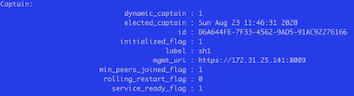

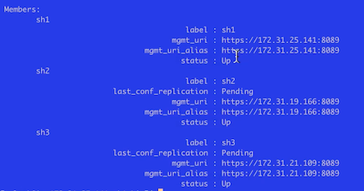

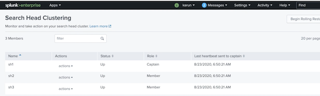

**`Begin Rolling Restart`**

**sh1**

```
cd ../etc/system/local
vi server.conf

[raft_statemachine]
disabled = false
replicate_search_peers = true
```

**sh2**

```
[splunk@ip-172-31-19-166 sh2 bin]$ cd ../etc/system/local
[splunk@ip-172-31-19-166 sh2 local]$ vi server.conf

[raft_statemachine]
disabled = false
replicate_search_peers = true

[splunk@ip-172-31-19-166 sh2 bin]$ sudo ./splunk restart
```
**sh3**

```
[splunk@ip-172-31-21-109 sh3 bin]$ cd ../etc/system/local
[splunk@ip-172-31-21-109 sh3 loca]$ vi server.conf
[raft_statemachine]
disabled = false
replicate_search_peers = true

[splunk@ip-172-31-21-109 sh3 loca]$ sudo ./splunk restart
```

```
[splunk@ip-172-31-25-141 sh1 bin$ ./splunk add search-server https: //172.31.27.192:8089 -remoteUsername shuser -remotePassword

Peer added
```

