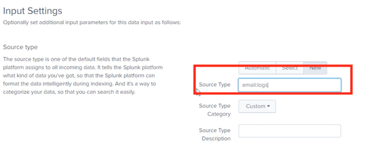
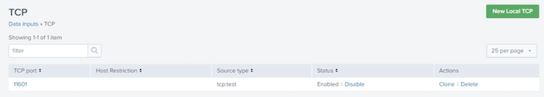
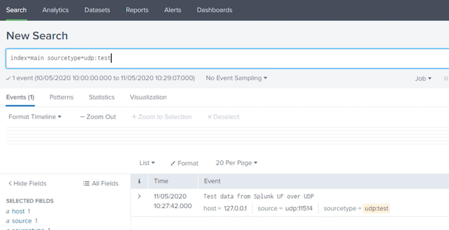
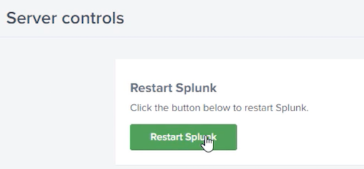

# **5 Splunk Administration: Monitoring and Creating Inputs**

**Overview**

* Introduction to input methods in Splunk
* Data pipeline in Splunk
* Demo: Setting up the test environment

## **1 Data Input Methods**

* **File/Dir Monitoring**: Continuous monitoring or one-time upload
* **Network Inputs**: Listen on TCP/UDP port
* **Windows Inputs**: Monitor Windows logs locally/remotely
* **Scripted Input**: Local/Remote script output sent to Splunk
* **HTTP Event Collector**: Endpoints to send data to Splunk over http(s)


**Data Pipeline in Splunk Enterprise**


### Demo

* Understand topology of test environment
* Setup test environment
	* Configure forwarding and receiving
	* Install demo app


* The Windows machine is named `Splunk_Server` with a static IP 172.17.11.17. 
	* Installed full Splunk instance on this host. 
	* **This host is also my indexer, as well as the search head**. 
	* All Windows related inputs will be set up on this host. 
	* It will receive data from Ubuntu host `Splunk_HF`. 


* Installed full Splunk instance on `Splunk_HF` as well and will configure it as a heavy forwarder. 
	* The static IP given to this host is 172.17.11.27.
	* It will receive data from `Splunk_UF` and forward it to `Splunk_Server`. 

* `Splunk_UF` on 172.17.11.29 is also an Ubuntu host where I've installed Splunk universal forwarder. 
	* It will be configured to forward data to the heavy forwarder, `Splunk_HF`. 
	* Lightweight tasks will be performed on this host. 

	


```
172.17.11.27:8000/en-GB/app/launcher/home
```


```
root@splunkuf:~# cd /opt/splunkforwarder/bin/
root@splunkuf:/opt/splunkforwarder/bin#./splunk install app /home/splunk/packages/psdemo01.spl
App '/home/splunk/packages/psdemo01.spl

You need to restart the Splunk Server (splunkd) for your changes to take effect.
root@splunk_uf:/opt/splunkforwarder/bin#
```

```
root@splunk_uf:/opt/splunkforwarder/bin# vi/opt/splunkforwarder/etc/system/local/outputs.conf

[tcpout:psdemo_indexers]
server=172.17.11.27:9997

root@splunk_uf:/opt/splunkforwarder/bin# ./splunk list forward-server

Active forward
	172.17.11.27:9997
```

### Summary

* Input methods in Splunk
* Demo: Setting up the test environment

	* 	Topology
	* 	Configuring forwarding and receiving
	* 	Installing the demo app

## **2 Monitoring Files and Directories**

* Monitoring files and directories in Splunk
* Uploading a file for one shot indexing
* Monitoring a log file through Splunk Web
* Monitoring files through inputs.conf
* Ignoring old files
* Using wildcards in monitoring stanza
* Blacklisting files
* Editing existing monitoring stanza


Monitoring Files and Directories

* One-shot indexing used for uploading a file once
* While continuously monitoring Splunk remembers the files and follows tail 
* **MonitorNoHandle** is **Windows** only input on files that get locked open for writing
* Files and directories can be monitored using Splunk Web, `inputs.conf` or CLI methods


* **Monitor stanza for file/directory path**

```
[monitor://<path/to/file/or/directory>]
```

* Use of regex and wildcards
* **Monitor mounted or shared directories**
* Can monitor compressed files
	* `.tar, .gz, .bz2, .tgz, .tbz,.zip, .z`
* Restart Splunk after changes


Monitoring Input Stanza

* `queue = parsingQueue | indexQueue`
	* Which queue to send events to
	* parsingQueue

* `host_regex = <regex>`
	* Regex that extracts host from file name
	* Setting in “host=”

* `host_segment = <int>`
	* Segment of monitored path for example a value 4 for `/data/logs/mail/server01.log` will set host to `server01.log`
	* Setting in “host=”

* `crcSalt = <int>|<SOURCE>`
	* Splunk eads first few lines for CRC check to prevent indexing same files. <SOURCE> causes Splunk to add full source path to CRC. Use with caution for rotating files.

* `ignoreOlderThan= <time_window>`
	* Doesn’t monitor file if update time is greater than number and unit d, h, m or s
	* `0 (disabled)`

* `followTail = 0|1`
	* Equivalent to *nix `tail –f`. Starts from tail
	* 0 (disabled)

* `recursive = true|false`
	*  If set to false Splunk ignore subdirectories while monitoring a directory
	*  true

* `/var/log/web/.../access.log`
	* `/var/log/web/www1/prod/access.log`
	* `/var/log/web/www3/access.log`

* `/var/log/web/www1/access.*`
	* `/var/log/web/www1/access.txt`
	* `/var/log/web/www1/access.log`

* `/var/log/web(1|2).log`
	* Only web(1|2).log

* `/var/log/web(1|2)*.log`
	* web1.log, web2test.log, web1server.log

* `/apache/.../web[A-Z0-9]*.log`
	* `/apache/www1/webCprod.log`
	* `/apache/www1/test/web5test.log`
	* `/apache/www/uat/webJ.log`

### 2-1 Monitoring Files and Directories

**Win event logs**

Collect locally or remotely using WMI

**Performance monitoring**

Performance counters in Performance Monitor

**Remote monitoring**

WMI queries

**Registry monitoring**

Changes to local Windows Registry

**Active Directory monitoring**

Changes to Active Directory


### **2-2 Demo: Monitoring Files and Directories in Splunk Web**


**By default, Splunk accepts a date 2,000 days ago that is roughly around 5 and a half years**. I

n this case, our timestamp is way older than this, so we need to give a much larger number. Largest we can go is 10,951 days.


**`props.conf`**


**`inputs.conf`**





```
[monitor: //C: \Program Files\Splunkletclapps\psdemo@1\data\email_logs]
disabled = false
sourcetype = email: logs
```

### **2-3 Demo: Monitoring Files and Directories Using inputs.conf File**


* Setup file monitoring in `inputs.conf`
* Reload monitor inputs
* Verify the monitor input
* Check results in Spunk Enterprise
* Demonstrate real-time ingestion


```
root@splunk_hf:~# cd /var/log
root@splunk_hf:/var/log# 11 auth*
auth.log
auth.log.1
auth.log.2.gz
auth.log.3.gz
auth.log.4.gz

root@splunk_hf:/var/log# tail auth.log
splunk_hf sshd[24784]: pam_unix(sshd:session): session opened for user splunk by (uid=0)
punk_hf systemd-logind[939]: New session 357 of user splunk.
...


root@splunk_hf:/opt/splunk/etc/apps/psdemo01/local# ll

app.conf
inputs.conf

root@splunk_hf:/opt/splunk/etc/apps/psdemo01/local# vi inputs.conf

[default]
host = splunk_uf

[monitor:///var/log/auth.log]
disabled = O
index = main
sourcetype = linux:auth

root@splunk_hf:/opt/splunk/etc/apps/psdemo01/local# /opt/splunk/bin/./splunk _internal call /services/data/inputs/monitor/_reload 
...

<link href-"/services/data/inputs/monitor/_new" rel="create"/>
<link href-"/services/data/inputs/monitor/_reload" rel="
_reload"/>
<link href-"/services/data/inputs/monitor/_acl" rel=
‹opensearch:totalResults>0</opensearch:totalResults>
‹opensearch:itemsPerPage>30</opensearch:itemsPerPage>
...

root@splunk_hf:/opt/splunk/etc/apps/psdemo01/local# /opt/splunk/bin/./splunk list monitor
...
$SPLUNK_HOME/etc/splunk.version
/var/log/auth.log
```

Search:  **`index=main sourcetype=linux:auth`**


### **2-4 Demo: Monitoring Files and Directories with Special Parameters**

* Monitor multiple files
* Ignore older files
* Overriding host name
* Editing and modifying a monitor input

```
root@splunk_hf:~# cd /var/log
root@splunk_hf:/var/log# ll syslo*

syslog
syslog.1
syslog.2.gz
syslog.3.gz
syslog.4.gz
syslog.5.gz
```


```
root@splunk_hf:/var/log# cat syslog

root@splunk_hf:/var/log# cd /opt/splunk/etc/apps/psdemo01/local/

$ ll
$ app.conf
$ inputs.conf

$ vi inputs.conf

[default]
host = splunk uf

[monitor:///var/log/auth.1og]
disabled = 0
index = main
sourcetype = linux:auth

[monitor:///var/log/syslog*]
disabled = 0
index = main
sourcetype = linux:syslog
ignoreOlderThan = 10d
host_segment = 3
```

```
/opt/splunk/bin/./splunk _internal call/services/data/inputs/monitor/_reload

root@splunk_hf:/opt/splunk/etc/apps/psdemo01/local# /opt/splunk/bin/./splunk/list

....
/var/log/syslog*
	/var/log/syslog
	/var/log/syslog.1
	/var/log/syslog.2.gz
	/var/log/syslog.3.gz
	/var/log/syslog.4.gz
	/var/log/syslog.5.gz

Monitored Files:
	$SPLUNK_HOME/etc/splunk.version
	/var/log/auth.log
```	


**`index=main sourcetype=linux:syslog`**


```
root@splunk_hf:/opt/splunk/etc/apps/psdemo01/local# ll /var/log/syslo*

/var/log/syslog
/var/log/syslog.1
/var/log/syslog.2.gz
/var/log/syslog.3.gz
/var/log/syslog.4.gz
/var/log/syslog.5.gz
```

```
$ vi inputs.conf

[default]
host = splunk uf

[monitor:///var/log/auth.1og]
disabled = 0
index = main
sourcetype = linux:auth

[monitor:///var/log/syslog*]
disabled = 0
index = main
sourcetype = linux:syslog
ignoreOlderThan = 30d
host_segment = 3
```

```
/opt/splunk/bin/./splunk _internal call/services/data/inputs/monitor/_reload
```


### **2-5 Demo: Blacklisting Monitored Files**

* Monitor multiple directories
* Blacklisting files
* Editing a monitor input stanza

```
root@splunk_hf:~# cd /opt/splunk/etc/apps/psdemo01/data/
root@splunk_hf:/opt/splunk/etc/apps/psdemo01/data# ll

apacheweb/
users.csv

root@splunk_hf:/opt/splunk/etc/apps/psdemo01/data#
root@splunk_hf:/opt/splunk/etc/apps/psdemo01/data# cd apacheweb/
root@splunk_hf:/opt/splunk/etc/apps/psdemo01/data/apacheweb# ll

www1/
www2/
www3/

root@splunk_hf:/opt/splunk/etc/apps/psdemo01/data/apacheweb#

root@splunk_hf:/opt/splunk/etc/apps/psdemo01/data/apacheweb#  find | sed 's|[^/]*/|\|-|g'

. 
|- www2
|-|-access_prod2.log
|-|-access_uat2.log
|-www1
|-|-access_prod1.log
|-|-access_uat1.log
| -www3
|-|-access_prod3.1og
|-|-access_uat3.log
```

```
root@splunk_hf:/opt/splunk/etc/apps/psdemo01/data/apacheweb# cd ../../local

root@splunk_hf:/opt/splunk/etc/apps/psdemo01/local# ll

app.conf
inputs.conf

root@splunk_hf:/opt/splunk/etc/apps/psdemo01/local# vi inputs.conf

```

```
...

[monitor:///opt/splunk/etc/apps/psdemo01/data/apacheweb/.../*.log]
disabled = false
sourcetype = access_combined
blacklist = access_uat\d\.log$
```

```
/opt/splunk/bin/./splunk _internal call/services/data/inputs/monitor/_reload

root@splunk_hf:/opt/splunk/etc/apps/psdemo01/local#/opt/splunk/bin/./splunk list monitor

opt/splunk/etc/apps/psdemo01/data/apacheweb/..
/opt/splunk/etc/apps/psdemo01/data/apacheweb/www1
/opt/splunk/etc/apps/psdemo01/data/apacheweb/www1/access_prod1.log
/opt/splunk/etc/apps/psdemo01/data/apacheweb/www2
/opt/splunk/etc/apps/psdemo01/data/apacheweb/www2/access_prod2.log
/opt/splunk/etc/apps/psdemo01/data/apacheweb/www?
/opt/splunk/etc/apps/psdemo01/data/apacheweb/www3/access_prod3.log
```

`index=main sourcetype=access_combined`


```
...

[monitor:///opt/splunk/etc/apps/psdemo01/data/apacheweb/.../*.log]
disabled = false
sourcetype = access_combined
# blacklist = access_uat\d\.log$
```

```
/opt/splunk/bin/./splunk _internal call/services/data/inputs/monitor/_reload

root@splunk_hf:/opt/splunk/etc/apps/psdemo01/local#/opt/splunk/bin/./splunk list monitor

/opt/splunk/etc/apps/psdemo01/data/apacheweb/.../*.log
/opt/splunk/etc/apps/psdemo01/data/apacheweb/www1/access_prod1.log
/opt/splunk/etc/apps/psdemo01/data/apacheweb/www1/access_uat1.log
/opt/splunk/etc/apps/psdemo01/data/apacheweb/www1/access_uat1.log
/opt/splunk/etc/apps/psdemo01/data/apacheweb/www2
/opt/splunk/etc/apps/psdemo01/data/apacheweb/www2/access_prod2.log
/opt/splunk/etc/apps/psdemo01/data/apacheweb/www2/access_uat2.log

/var/log/syslog*

/var/log/syslog
/var/log/syslog.1
/var/log/syslog.2.gz
/var/log/syslog.3.gz
/var/log/syslog.4.gz
/var/log/syslog.5.gz

$SPLUNK_HOME/etc/splunk.version
```

```
index=main sourcetype=access_combined
```


**Summary**


* How Splunk monitors files and directories
* One time uploading in Splunk Web
* Monitoring a directory in Splunk Web
* Monitoring files using inputs.conf
* Excluding older files from monitoring
* Use of wildcards
* Ignoring files through blacklisting
* Reloading monitor inputs


## **3 Getting Data from Network Sources**

### **3-1 Introduction to Network Inputs in Splunk Enterprise**

**Network Inputs**

* **TCP/UDP** - Accept input on any port
* **Network Services** - Capture data from syslog or netcat
* **Secure** - Accepted from hosts with correct SSL certs
* **Agentless** - No need for UF on the source
* **Configurations** - Splunk web, conf files and CLI commands


**Network Inputs**

* TCP
	* Connection oriented
	* Reliable
	* Flow-control
	* Packet ordering
	* Slow

* UDP
	* Connectionless
	* Unreliable
	* No flow-control mechanism
	* No packet ordering ensured


**Network Inputs**

* `[protocol://<remote server>:<port>]`
* `host=<string>`
* `source=<string>`
* `queue = parsinqQueue | indexQueue`
* `connection_host = ip | dns | none`
* `_revbuf = <integer> bytes `(UDP only)
* `no_priority_stripping = true | false`
* `no_appending_timestamp = true | false`
* UP packets and line merging
* Universal forwarder as a middle tier for better performance


### **3-2 Demo: Configuring TCP Input through Splunk Web**

I'm going to create a TCP input using Splunk web.


> I'll leave it blank means any host is allowed to send the data.


* `top:test`
* `TCP Network Input`


```
root@splunkuf:~# echo "TCP test message from splunkuf"
| nc -v 172.17.11.27 -t 11601 -wO
Connection to 172.17.11.27 11601 port [tcp/*]
succeeded!
```

`index=main sourcetype=tcp:test`




### Demo: Configuring UDP Input Using inputs.conf File

* Create a UP input using conf files
* Test the created input

```
root@splunk_uf:/# cd /opt/splunkforwarder/etc/apps/psdemo01/local/
root@splunk_uf:/opt/splunkforwarder/etc/apps/psdemo01/local# vi inputs.conf

[udp://115147
connection_host = ip
index = main
sourcetype = udp:test


root@splunk_uf:/opt/splunkforwarder/etc/apps/psdemo01/local# /opt/splunkforwarder/bin/./splunk restart

$ echo "Test data from Splunk UF over UDp" > /dev/udp/1
27.0.0.1/11514
```

`index=main sourcetype=udp:test`



## **4 Getting Windows Data In**

* Windows event log data
* Local and remote data collection
* Collecting Windows data on local system
* Collecting Windows data remotely
* Collecting host data

### **4-1 Monitoring Windows Data in Splunk Enterprise**

* **Win event logs**: Collect locally or remotely using WMI
* **Performance monitoring**: Performance counters in Performance Monitor
* **Remote monitoring**: WMI queries
* **Registry monitoring**: Changes to local Windows Registry
* **Active Directory monitoring**: Changes to Active Directory

**Windows Event Logs**

* **Windows Event Log service handles the logging**
* **Microsoft Event Viewer is used to view events** 
* Splunk can monitor local and remote log channels
* Splunk must run on Windows as Local System/Domain Admin
* **Splunk uses WMI to read remote logs**

**Monitoring Windows System**

* **perfmon**: 
	* perfmon type input provides performance metrics from the host for components like CPU, memory, disk, etc.
* **WinHostMon**
	* WinHostMon stanza helps gathering inventory from a host like specifications of the CPU, disks, running processes, services, etc. 
* **WinRegMon**
	* WinRegMon stanza is created to monitor registry changes on the host. This input is very useful to troubleshoot, as well as auditing purposes. 
* **admon**
	* Admon stanza provides us insight into **Active Directory domain or forest‑level changes to the users, computers, and other Active Directory objects**.
* **WinNetMon**
	* WinNetMon stanza provides insight to network activity and help monitoring all transactions on the network like network connections and helps detect anomalies and risks like denial‑of‑service attacks by pinpointing the hosts involved.
* **WinPrintMon**
	* WinPrintMon stanza gives all statistics about printers and print jobs, helps in auditing the printer subsystem, as well as troubleshooting purposes. 


### **4-2 Demo: Setting-up a Local Event Log Collection**

* Setup local event log collection 
* Edit the input
* Verify results


`index=main sourcetype=WinEventLog:Security`


**Remote event log collections**


`> This PC › PSDemo (C:) > Program Files > Splunk > etc › apps › launcher > local`

`inputs.conf`


### **4-3 Demo: White-listing and Black-listing Windows Events**

* Blacklisting and whitelisting events
* Apply whitelist to security log

**Filtering Win Event Logs**

* Blacklisting
* Whitelisting
	* `whitelist, whitelist1… whitelist9`
* Multiple events
	* blacklist = 0-2000, 6008
	* whitelist = 4624,4625
	* `whitelist1 = EventCode=%^462.$% User=%awan%`

* Blacklisting means to **ignore certain set of events and allow all the rest**. 
* Whitelists work in the same way, but allow certain events while blocking everything else. 


`inputs.conf`

```
[WinEventLog://Security]
checkpointInterval = 5
whitelist = 4624, 4625
current only = 0
disabled = 0
start_from = oldest

[WinEventLog://Application]
checkpointInterval = 5
current_only = 0
disabled = 0
start_from = oldest
```



`index=main sourcetype=WinEventLog:Security`


we have learned how to strip off the unnecessary event codes to reduce the noise and amount of data ingested into Splunk

### **4-4 Demo: Create a Remote Windows Event Log Collection**

* Creating remote win event log collection
* Test the created input

**Monitoring WinEventLogs Remotely**

Splunk monitors Windows event logs on remote hosts using WMI

* Setup `wmi.conf`
	* WMI stanza in `wmi.conf`
* **Member of AD Domain**
	* The source machine should be member of same AD domain
* **Run as Domain Admin**
	* The account Splunk is running as should have domain admin privilege.


Remote event logs input has been created successfully.


`This PC › PSDemo (C:) > Program Files > Splunk > etc › apps > search › local`

`wmi.conf`

```
[WMI:WinRemoteLogs]
disabled = 0
event_log_file = Security
index = default
interval = 5
server = WinRemote
```

`index=main sourcetype="WinEventLog:Security"`


`Program Files › Splunk › etc › apps › search › local`

`wmi.conf`

```
[WinHostMon://LocalHostMon]
interval = 3600
type = Processor; Disk
```


`index=main source=LocalHostMon`


* Monitoring Windows data
* Demo: Collecting Windows data locally
* Demo: Filtering Windows event log data
* Demo: Gathering Windows data remotely
* Demo: Monitoring local host data


## **6 Scripted Inputs**

### Overview

* **Scripted inputs in Splunk**
* **Creating input through Splunk web**
* **Creating scripted inputs using inputs.conf**
* PowerShell Modular inputs
	* Using Splunk web 
	* Using inputs.conf

* Using wrapper scripts

Where to use scripted inputs?

* Data is dynamic in nature
* Data is on external/remote systems
* Need to apply transformations on data before ingesting
* Need to authenticate before accessing the data
* Scheduled or continuous monitoring of a system

### **6-1 Scripted Input: Use-Case Scenario**

We can use shell scripts, Python scripts, Windows batch files, PowerShell, or any other utility that can format and stream the data that we want to index into Splunk. 

It is so powerful that we can virtually do any data acquisition task in Splunk using this feature. 

Scripted inputs in Splunk are set up in `inputs.conf` files using specific stanza


For all those scenarios where we are not able to use simple scripts where we need to send parameters to script or the program running the script is outside of Splunk environment, we can use wrapper scripts. 

* We can schedule it using standard cron expression or just provide a number of seconds. 
* If we provide value 0 for the interval, this means that the script will run continuously. 
* For a value ‑1, it will only run once on startup. 

After setting up scripted input stanza in inputs.conf, **we can reload scripted inputs explicitly without restarting Splunk, and we can enable or disable our scripts through the stanza attribute disabled**, which is set to false or true accordingly. 


Scripted inputs are used when the data we are looking at is dynamic in nature, for instance, performance counters like CPU, memory, or disk usage where the data is on external or remote systems, for instance, databases that you send SQL queries through your script and then pass the output and send to Splunk or using the APIs. 


Another use case might be where you need to apply transformations before sending data to Splunk. For instance, you have data in CSV format, and for some reason, you need to convert it to JSON format before sending to Splunk. 

Also, sometimes we need to authenticate against a system before getting access to data. For instance, your files are in an AWS S3 bucket. 

We also use scripts where we want to schedule our inputs, for example, polling a remote logger for current sensor values after 15 minutes for continuously monitoring something for change and sending to Splunk as soon as the condition becomes true. 


### **Demo: Creating Scripted Inputs in Splunk Web**


* **Scripted inputs using Splunk Web**
* **Deploy a Python Script**
* Send data to Splunk for ingestion
	* **Read data**
	* **Convert to JSON**
	* Forward to the indexer
* Scripted inputs deployment wizard
* Changes in `inputs.conf`
	* Verify successful execution and data ingestion


```
root@splunk_hf:~# cd /opt/splunk/etc/apps/psdemo01/bin/
root@splunk_hf:/opt/splunk/etc/apps/psdemo01/bin# ll

getServices.ps1
getUsersFromFile.py
.idea/
README
simpleScriptedInput.py

root@splunk_hf:/opt/splunk/etc/apps/psdemo01/bin#
```

**`getUsersFromFile.py`**

```
import cv, json

from os.path import dirname, realpath, join

filePath = join(dirname(dirname(realpath(__file__))), 'data', 'users.csv')

with open (filePath) as usersFile:
	CSvReader = cv.DictReader(usersFile)
	for row in csvReader:
		print(json.dumps(row))
```


	


**`index=main`**


```
root@splunk_hf:/opt/splunk/etc/apps/psdemo01/local# ll
app.conf
inputs.conf


vi inputs.conf

[default]
host = splunk_uf

[script://SSPLUNK_HOME/etc/apps/psdemo01/bin/getUsersFromFile.py]
disabled = false
interval = 10 19 * * *
sourcetype = json_no_timestamp
```

### **Demo: Creating Scripted Inputs Using Configuration Files**

* Setup a scripted input through conf files
* Deploy a bash script on the UF
* Run scripted input manually
* Changes to inputs.conf
* Reload scripted inputs without a restart
* Verify scripted input
* Troubleshooting

```
root@splunkuf:~# cd /opt/splunkforwarder/etc/apps/psdemo01/bin/
root@splunk_uf:/opt/splunkforwarder/etc/apps/psdemo01/bin# ll

getServices.ps1
getUsersFromFile.py
.idea/
perfmon.sh*
README
simpleScriptedInput.py
```

**`perfmon.sh`**

```
#! /bin/bash

timestamp() {
	date +"%T"
}

MEMORY=$(free -m | awk 'NR==2{printf "%.2f%%", $3*100/$2}')
DISK=$(df -h | awk '$NF=="/"{printf "%s", $5}')
CPU=$(top -bn1 | grep load | awk '{printf "%.2f%%", $(NF-2)}')
echo "$(timestamp) Memory=\"$MEMORY\", Disk=\"$DISK\", CPU=\"$CPU\""
```

```
root@splunk_uf:/opt/splunkforwarder/etc/apps/psdemo01/bin# /opt/splunkforwarder/bin/./splunk cmd /opt/splunkforwarder/etc/apps/psdemo01/bin/perfmon.sh

12:55:14 Memory="5.48%", Disk="6%", CPU="0.00%"
```

**`inputs.conf`**

```
[script://$SPLUNK_HOME/etc/apps/psdemo01/bin/perfmon.sh]
disabled = false
index = main
interval = 20
sourcetype = server:performance
```

```
root@splunk_uf:/opt/splunkforwarder/etc/apps/psdemo01/local#/opt/splunkforwarder/bin/./splunk _internal call /services/data/inputs/script/_reload

QUERYING: 'https: //127.0.0.1:8089/services/data/inputs/script/_reload
```

**`index=main sourcetype=server:performance`**


**Error script: perfmon.sh**

```
...
echo1 "$(timestamp) Memory=\"$MEMORY\", Disk=\"$DISK\", CPU=\"$CPU\""
```

```
root@splunk_uf:/opt/splunkforwarder/etc/apps/psdemo01/bin# /opt/splunkforwarder/bin/./splunk cmd /opt/splunkforwarder/etc/apps/psdemo01/bin/perfmon.sh

/opt/splunkforwarder/etc/apps/psdemo01/bin/perfmon.sh: line 11: echo1: command not found
```

```
root@splunk_uf:/opt/splunkforwarder/etc/apps/psdemo01/bin# cd /opt/splunkforwarder/var/log/splunk/
root@splunk_uf:/opt/splunkforwarder/var/log/splunk# tail -f splunkd.log
```


**`index=_internal host=splunk_uf error perfmon.sh`**


### **Demo: Creating PowerShell Modular Input in Splunk Web**

* PowerShell scripted/modular inputs
* PowerShell scripted input using Splunk Web
* View stanza in inputs.conf
* Verify scripted input

**PowerShell Script Inputs**

* Easy to interact with Windows platform
* Specific stanza:
	* `[powershell://MyPowerShellScript]`
* script & schedule attributes
* System requirements
	* Splunk instance on Windows
	* Splunk must run as Local System user
	* PowerShell v3.0 or later
	* Microsoft `.NET v4.5` or later

The Use-case

* Get all services on Windows
* Convert them to key-value format
* Send data to Splunk


**`getServices.ps1`**

```
$timeStamp = = Get-date -Format
$services = Get-Service

foreach($Service in $services){
	Write-Output "$timeStamp Name=`"$($service.Name)`", Status=`"$($service.Status)`", DisplayName=`"$($service.DisplayName)`""
}
```


**`index=main sourcetype=windows:services`**


### **Demo: Creating PowerShell Modular Input Using Configuration Files**

* PowerShell scripted input using conf files
* Single command
* Create stanza in inputs.conf
* Verify scripted input


**`getProcess.ps1`**

```
Get-Process | select ProcessName, id, CPU | foreach { Write-Output "$((Get-Date).ToString('dd-MM-yyyy HH: mm")) ProcessName=`"($_.ProcessName)`", Id=`"$($_.id)`", CPU=`"$($_.CPU)`""}
```

**`inputs.conf`**

```
[powershell://WindowsServices]
schedule = 1800
script = . "$SplunkHome\etc\apps\psdemo01\bin\getServices.ps1"
sourcetype = windows:services 

[powershell://WindowsProcesses]
schedule = 60
script = Get-Process | select ProcessName, id, CPU | foreach { Write-Output "$((Get-Date).ToString('dd-MM-yyyy HH:mm")) ProcessName=`"($_.ProcessName)`", Id=`"$($_.id)`", CPU=`"$($_.CPU)`""}
```

```
C:\Program Files\Splunk\bin> splunk _internal call /services/data/inputs/powershell/reload
```

**`index=main sourcetype=windows:processes`**


### Demo: Creating Scripted Inputs Using Wrapper Script

* Wrapper scripts
* Scripted input using wrapper script
* Verify scripted input

**Wrapper Script Use-cases**

* Deploy scripted inputs on Universal Forwarders
* Runs scripts types that Splunk cannot run out-of-the-box
* Version conflicts or passing arguments

**Deploying a Wrapper Script**

* CLI command wrapped in a file
	* `.sh for linux OS`
	* `.bat for Windows OS`
* Deployed as normal scripted input

```
root@splunk_uf:/opt/splunkforwarder/etc/apps/psdemo01/bin# ll

...
pythonWrapper.sh*
...
```

```
root@splunk_uf:/opt/splunkforwarder/etc/apps/psdemo01/bin# cd  ../data
root@splunk_uf:/opt/splunkforwarder/etc/apps/psdemo01/data# ll
users.csv
```

**`pythonWrapper.sh`**

```
python3 /opt/splunkforwarder/etc/apps/psdemo01/bin/getUsersFromFile.py
```

**`inputs.conf`**

```
[script://$SPLUNK_HOME/etc/apps/psdemo01/bin/perfmon.sh]
disabled = false
index = main
interval = 20
sourcetype = server:performance

[script://$SPLUNK_HOME/etc/apps/psdemo01/bin/pythonwrapper.sh]
disabled = false
index = main
interval = 60
sourcetype = json_no_timestamp
source = wrapper
```

```
root@splunk_uf:/opt/splunkforwarder/etc/apps/psdemo01/local# cd /opt/splunkforwarder/bin/
root@splunk_uf:/opt/splunkforwarder/bin# ./splunk _internal call /services/data/inputs/script/_reload
```

`index=main source=wrapper`


**Summary**

* Scripted inputs
* Bash, Python and PowerShell scripts
* Scripted inputs on all types of Splunk instances
* Windows and Linux
* Different types of scripted inputs
	* Scripted inputs
	* Powershell modular inputs
	* Wrapper scripts

## **8 Configuring Inputs**

* Default fields in Splunk Enterprise
* Process of overriding default fields
* Demo: Overriding source field
* Demo: Timestamp extraction

### **3-1 Indexed Field Extractions**


**Parsing phase**

* Event boundaries
* Add index-time fields
	* Default fields
	* Custom fields

Search time field extractions are performed after the data is indexed

**Default field extractions**

* Tagged with each event Three types
	* Internal fields
	* Default datetime fields
	* Basic default fields

Most commonly used are host, source, sourcetype, index	
**Default-field overriding**

Applied to a set of events Transforms applied

* props.conf
* transforms.conf
	* REGEX
	* FORMAT
	* `DEST_KEY`

Capturing group regex from the event data or static string can be provided


## **4 The HTTP Event Collector (HEC)**

* Introducing **HTTP Event Collector**
* Creating HEC token using Splunk Web
* Sending data to HEC through a script
* Turning indexer acknowledgement on


### 4-1 Introduction to Splunk HTTP Event Collector (HEC)


* **Fast & efficient**： Sends data over HTTP(S)
* **Agentless monitoring**: Directly sends data to Splunk
* **Application developers** Baked into the code
* **Token based**： No need for credentials hard-coding
* **No Configuration Overheads**： Proxies allow for HTTP 
communication

**Configuring HTTP Event Collector**


* `[http://TokenName]` stanza in inputs.conf
* Enable globally
* Unique GUID
* Default port 8088
* Indexer acknowledgement

**Global Settings**

* [http] **stanza contains global settings**
* `disabled=true/false`
* `maxSockets=<integer>`
* `maxThreads=<integer>`
* `outputGroup=<indexer_group>`

**Per-token Settings**

* `queueSize=<integer>KB|MB|GB`
* `persistentqueueSize=<integer>KB|MB|GB`
* `connection_host`
* Index and indexes
* token (a94a5897-2666-485c-a62f-0dc070463ef1)

```
curl -k -u "x:12345678-1234-1234-1234-1234567890AB" https://mysplunkserver.example.com:8088/services/collector/event -d '{"sourcetype": "my_sourcetype",

	"host": "my_host", 
	"index": "my_preferred_index", 
	"source": "my_source", 
	"event": "My sample event!"
}
```

Sending Data to HEC (Local Server)

**Using cURL command with basic authentication**


```
curl -k -H "Authorization: Splunk 12345678-1234-1234-1234-1234567890AB" https://mysplunkserver.example.com:8088/services/collector/event -d '{"sourcetype":  "my_sourcetype",

"host": "my_host", 
"index": "my_preferred_index", 
"source": "my_source", 
"event": "My sample event!"}
```

Sending Data to HEC (Local Server)

**Using cURL command with HTTP Authentication**

```
curl -k -H "Authorization: Splunk 12345678-1234-1234-1234-1234567890AB" https:// http-inputs- <cust>.splunkcloud.com/services/collector/event -d '{"sourcetype": "my_sourcetype",

"host": "my_host", 
"index": "my_preferred_index", 
"source": "my_source", 
"event": “My sample event!"}
```

Sending Data to HEC (Splunk Cloud)

**Using cURL command**

### **4-2 Demo: Creating HEC Token in Splunk Web**

* Create a HEC Token in Splunk Web
* Test the token
* Check the input stanza
* Send data to HEC using a script


**Status: disabled**

**`Global Settings`**


`index=main source=hec_manual_test`


```
root@splunk_hf:~# cd /opt/splunk/etc/apps/psdemo01/local/
root@splunk_hf:/opt/splunk/etc/apps/psdemo01/local# ll

app.conf
inputs.conf

vi inputs.conf

[default]
host = splunk_uf

[http://PSDemo Users Test]
disabled = 0
host = splunk_hf
index = main
indexes = history,main
source = hec_test_users
sourcetype = json_no_timestamp
token = a94a5897-2666-485c-a62f-Odc070463ef1
useACK = 0
```

### **4-3 Demo: Sending Events through HEC Using a Script**

* Send users data to Splunk using HEC token
* Setup and run the Python Script
* Verify results


Scripted Input: Use-Case Scenario


```
cd /opt/splunkforwarder/etc/apps/psdemo01/bin/# ll

...
sendUsersUsingHEC.pV
...
```


```
import cv, json, requests, urllib3
from os.path import dirname, realpath, join

#Disable certs warning
urllib3.disable_warnings(urllib3.exceptions. InsecureRequestwarning)

FilePath = join(dirname (dirname(realpath(__file__))), 'data', 'users.csv')

#Add the HEC token that you want to send the data through

authToken="a94a5897-2666-485c-a62f-0dc070463ef1"

#IP or name of the host HEC token is set on
splunkHost= "172.17.11.27"

#Port set for HEC communication. Defaults to 8088
hecPort = "8080"

#Prepart the URL the URL
url = "https://"+splunkHost+":"+hecPort+"/services/collector/event"

#Prepare the header with the HEC token
authHeader = {'Authorization' : 'Splunk '+authToken}

#Read the users from file and loop through each record
with open (filePath) as usersfile:
	csvReader = cv.DictReader(usersFile)
	for row in csvReader: 
	# Initialise and update current record to send through HEC
		record = {}
		record.update({'source': 'hec_test'})
		record.update({'sourcetype': 'json_no_timestamp'})
		record.update({event': (json.dumps(row))})
		
	# Send the record
		r = requests.post(url, headers=authHeader, json-record, verify=False)
```

```
python3 sendUsersUsingHEC.py
```

New search: **`index=main source="hec_test"`**


### Demo: Enabling Indexer Acknowledgement for Reliable Data Ingestion


Indexer acknowledgements


* `useAck=true`
* **Per-token basis**
* **X-Splunk-Request-Channel**
* **Package tracking**
	* services/collector/event
		* Acknowledgement ID
	* services/collector/ack
		* Status


```
curl -k -u "x:a94a5897-2666-485c-a62f-0dc070463ef1" https://hostname_or_ip:8088/services/collector/event -H "X-Splunk-Request-Channel: FE0ECFAD-13D5-401B-847D-77833BD77131“ -d '{"source": “mysource", "event": “myevent"}’
```

`{"text":"Success","code":0,"ackId":7}`

Sending Data with Indexer Acknowledgement

Using cURL command

```
curl -k -u "x:a94a5897-2666-485c-a62f-0dc070463ef1" "https://hostname_or_ip:8088/services/collector/ack" -H "X-Splunk-Request-Channel: E0ECFAD-13D5-401B-847D-77833BD77131" -d '{"acks":[7]}'
```

`{"acks":{“7":true}}`

```
root@splunk_hf:~# cd /opt/splunk/etc/apps/psdemo01/local/

vi inputs.conf

[default]
host = splunk_uf

[http://PSDemo Users Test]
disabled = 0
host = splunk_hf
index = main
indexes = history,main
source = hec_test_users
sourcetype = json_no_timestamp
token = a94a5897-2666-485c-a62f-Odc070463ef1
useACK = 1
```

```
root@splunk_hf:/opt/splunk/etc/apps/psdemo01/local# /opt/splunk/bin/./splunk restart
```


* HTTP Event Collector
* Demo: HEC token using Splunk Web
* Demo: Sending data to HEC using script
* Demo: Indexer acknowledgement

## **5 Configuring Inputs**

**Overview**

* Default fields in Splunk Enterprise
* Process of overriding default fields
* Demo: Overriding source field
* Demo: Timestamp extraction


### **5-1 Event Parsing and Default Field Extraction in Splunk Enterprise**


**Parsing phase Event**

* Event boundaries
* **Add index-time fields**
	* Default fields
	* Custom fields

Search time field extractions are performed after the data is indexed

For example, we want to assign a field a certain value based on other field value and make it part of the event. 

We can also perform search time field extractions, but the difference is that the search time field extractions don't become permanently part of the event.


**Default field extractions**

> The default fields extracted are tagged to each event before it is indexed and written to the disk. 

Tagged with each event Three types

- Internal fields
	- 	The internal fields contain information that Splunk software uses for internal purposes. These fields start with an underscore. Most common ones are `_raw`, `_time`, and `_index` time, and the default datetime fields are basically different granular representation of the timestamp like `date_hour`, `date_minute`, or `date_month`, etc.
- Default datetime fields
- Basic default fields

The basic default fields provide basic information about an event such as where it originated, what type of data it contains, what index it is located in, etc.

Common basic fields are host, source, sourcetype, index, line count, and timestamp.

**Default-field overriding**

Applied to a set of events Transforms applied

* props.conf
* transforms.conf
	* REGEX
	* FORMAT
	* `DEST_KEY`

Capturing group regex from the event data or static string can be provided


### **5-2 Demo: Overriding a Default Field**

Override source value in a monitor input

* props.conf
* transforms.conf

Test the results

```
root@splunk_hf:/opt/splunk/etc/apps/psdemo01/local# ll

app.conf
inputs.conf

# vi inputs.conf
```

```
[default]
host = splunk_hf

[monitor:///opt/splunk/etc/apps/psdemo01/data/web_source_override.log]
disabled = false
sourcetype = web:sourceoverride
index-main
```

```
root@splunk_hf:/opt/splunk/etc/apps/psdemo01/local# vi props.conf

[web:sourceoverride]
TRANSFORMS-changesource = web_src_override
```

```
transforms.conf

[web_src_override]
REGEX = (\d+\.\d+\.\d+\.\d+)
FORMAT = source::$1
DEST_KEY = MetaData:Source
```

```
root@splunk_hf:/opt/splunk/etc/apps/psdemo01/local# /opt/splunk/bin/./splunk restart
```

`index=main sourcetype=web:sourceoverride`


### **5-3 Demo: Assigning Custom Timestamp to Events**

* Override timestamp
* Test the results

```
root@splunk_hf:/opt/splunk/etc/apps/psdemo01/local# vi inputs.conf

[default]
host = splunk_hf
[monitor:///opt/splunk/etc/apps/psdemo01/data/server_perfmon.log]
disabled = false
index = main
sourcetype = server:perfmon
```

**`vi props.conf`**

```
[server:perfmon]
TIME_PREFIX = TimeAdded\=\"
TIME_FORMAT = %Y-%m-%d %H:%M:%S
```

```
root@splunk_hf:/opt/splunk/etc/apps/psdemo01/local# /opt/splunk/bin/./splunk restart
```

`index=main sourcetype=server:perfmon`


