# **6 Splunk Administration: Parsing and Manipulating Data**

## 1 Splunk Enterprise Administration: Parsing and Manipulating Data

**Overview**

* Event processing in Splunk Enterprise
* Role of configuration files
	* `props.conf`
	* `transforms.conf`
* Introduction to the course
* Demo: Setting up the test environment

### **1-1 Event Processing in Splunk Enterprise**

**Data Pipeline in Splunk Enterprise**

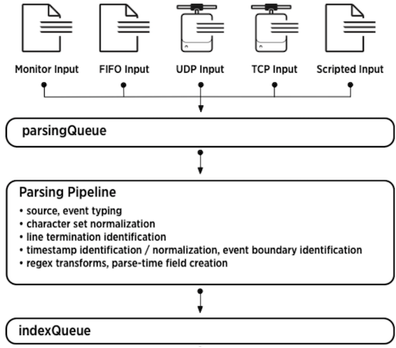

**`props.conf`**

* **Configuring pre-processing properties**
* Attribute/value pairs
* Observe order of precedence
	* System local directory – highest
	* App local directory
	* App default directory
	* System default directory – lowest

	
**Restart required**

**`Transforms.conf`**

* Settings to configure data transformations
* Covers the “how” part of things
* Requires corresponding setting in `props.conf`
* Unique stanza name
	* REGEX
	* `WRITE_META`
	* `DEST_KEY`
	* FORMAT

**Data Input Methods**

* **Event Line-breaking**
	*  Identifying and configuring line-breaks

* **Parsing Timestamps**
	* Recognizing and parsing timestamps

* **Field Extractions**
	* Custom and default field extractions and overriding

	
* **Routing and Filtering**
	* Filtering and sending events to selective and multiple indexers

### **1-2 Demo: Setting up the Test Environment**

* Understand topology of test environment
* Setup test environment
	- Configure forwarding and receiving
	- Install EventGen and the demo app

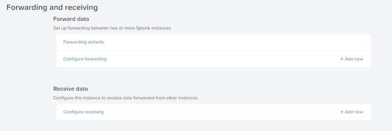

**add `New Receiving Port`**

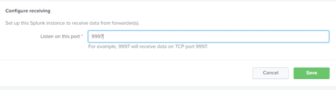

**`Forward data`**

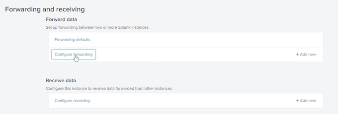

`172.17.11.29:9997`

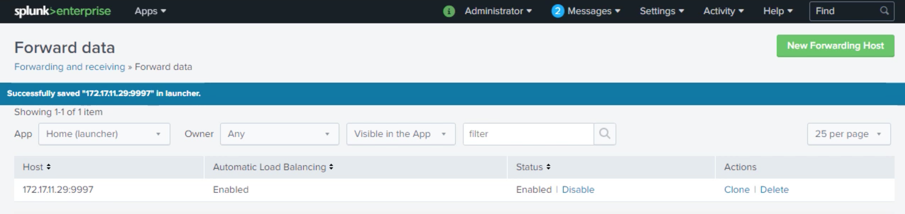

```
root@splunk_hf:/opt/splunk/etc/system/local# vi outputs.conf

[tcpout]
defaultGroup = default-autolb-group

[tcpout: default-autolb-group]
server = 172.17.11.29:9997

[tcpout-server://172.17.11.29:99971
```

```
root@splunk_hf:/opt/splunk/etc/system/local# /opt/splunk/bin/./splunk list forward-server

root@splunk_hf:/opt/splunk/etc/apps/psdemo/default# vi inputs.conf
```

```
sourcetype = customers
[
script://./bin/lineBreaking.py]
disabled = 0
interval = 60
index = main
source = linebreaking_script
sourcetype = linebreaking

[script://./bin/lineMerging.py]
disabled = 0
interval = 60
index = main
source = linemerging_script
sourcetype = linemerging

[script://./bin/configureLineBreaker.py]
disabled = 0
interval = 60
index = main
source = configurelinebreaker_script
sourcetype = configlinebreaker

[script://./bin/timestampoverride.py]
disabled = 0
interval = 60
index = main
source = timestamp_override_script
sourcetype = timestamp_override
```

**`index=main | stats count by sourcetype`**

## 2 Configuring Event Line-breaking

* Event line-breaking
* Demo: Breaking simple events
* Demo: Breaking multiline events
* Demo: Breaking events using line breaker

### 2-1 Configuring Line-breaks in Splunk Enterprise

**Line breaking**

* `SHOULD_LINEMERGE=false`
* Uses LINE_BREAKER regex that by default is: `([\r\n]+)`

**Line merging**

* Explicitly provide line break setting using attributes like `BREAK_ONLY_BEFORE` or `MUST_BREAK_AFTER` etc
* `SHOULD_LINEMERGE=true`

**Configuring Multi-line Event Boundaries**

* Break and re-assemble data stream 
* Add a stanza in `props.conf`
* Set `SHOULD_LINEMERGE = true`
* ***Set the line merging attributes***
	* `BREAK_ONLY_BEFORE`
	* `BREAK_ONLY_BEFORE_DATE`
	* `MUST_BREAK_AFTER`
	* `MAX_EVENTS`


**Breaking Data Stream into Real Events**

* More efficient but hard to work with
* Add a stanza in `props.conf`
* Set `SHOULD_LINEMERGE = false`
* Set `LINE_BREAKER` attribute
	* Default is `([\r\n]+)`
	* Set to regex matching event boundary
	* Restart Splunk

### 2-2 Demo: Configuring Line-breaking Using a Regex

* Configuring simple line breaking
* Based on regex pattern
* Configurations in props.conf
	* `SHOULD_LINEMERGE = true`
	* `MUST_BREAK_AFTER = <regex>`
* Restart Splunk

```
root@splunk_hf:/opt/splunk/etc/apps/psdemo# vi default/inputs.conf

[script://./bin/getPerformance.py]
disabled= 0
index = main
source = perfmon_script
sourcetype = performance

[script://./bin/custGen.py]
disabled = 0
interval = 300
index = main
source = custgen_script
sourcetype = customers


[script://./bin/lineBreaking.py]
disabled = 0
interval = 60
index = main
source = linebreaking_script
sourcetype = linebreaking
```

```
root@splunk_hf:/opt/splunk/etc/apps/psdemo# vi bin/lineBreaking.py

import random as r

for i in range(1,10) :
	print ("This is an event with id" + str(r.randrange(111,999)))+ "\n"
```


**`index=main sourcetype=linebreaking`**

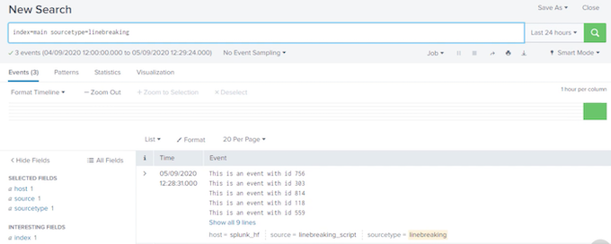

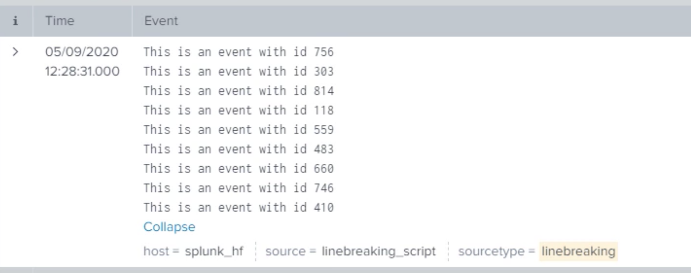

```
vi bin/lineBreaking.py

vi local/props.conf

SHOULD_LINEMERGE = true
MUST_BREAK_AFTER = \d{3}
```

```
root@splunk_hf:/opt/splunk/etc/apps/psdemo#/opt/splunk/bin/splunk restart
```
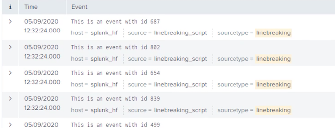

### 2-3 Demo: Breaking Multi-line Events and Line-merging

* **Line breaking in multiline events**
	* `BREAK_ONLY_BEFORE_DATE`
* **Based on regex pattern**
* **Configurations in props.conf**
	* `SHOULD_LINEMERGE = true`
	* `BREAK_ONLY_BEFORE= <regex>`
* **Restart Splunk**

```
root@splunk_hf:/opt/splunk/etc/apps/psdemo# vi default/inputs.conf

[script://./bin/getPerformance.py]
disabled = 0
index = main
source = perfmon_script
sourcetype = performance


[script://./bin/custGen.py]
disabled = 0
interval = 300
index = main
source = custgen_script
sourcetype = customers

[script://./bin/lineBreaking.py]
disabled = 0
interval = 60
index = main
source = linebreaking_script
sourcetype = linebreaking

[script://./bin/lineMerging.py]
disabled = 0
interval = 60
index = main
source = linemerging_script
sourcetype = linemerging
```

`"bin/lineMerging.py"`

```
from datetime import datetime as dt

def getTimestamp():
	return dt.now().strftime("%Y-%m-%d %H:%M")
	
for i in range(1,10):
	print ("<soe> The temperature received from the sensors was NORMAL. Temperature recorded at: ")
	print (getTimestamp()+" was 38 degrees celcius. This is the end of event")
```

```
root@splunk_hf:/opt/splunk/etc/apps/psdemo# /opt/splunk/bin/pythonbin/lineMerging.py

<soe> The temperature received from the sensors was NORMAL. Temperature recorded at:
2020-09-05 13:07 was 38 degrees celcius. This is the end of event
<soe> The temperature received from the sensors was NORMAL. Temperature
<soe> The temperature received from the sensors was NORMAL. Temperature recorded at
2020-09-05 13:07 was 38 degrees celcius. This is the end of event
```

**`index=main sourcetype=linemerging`**

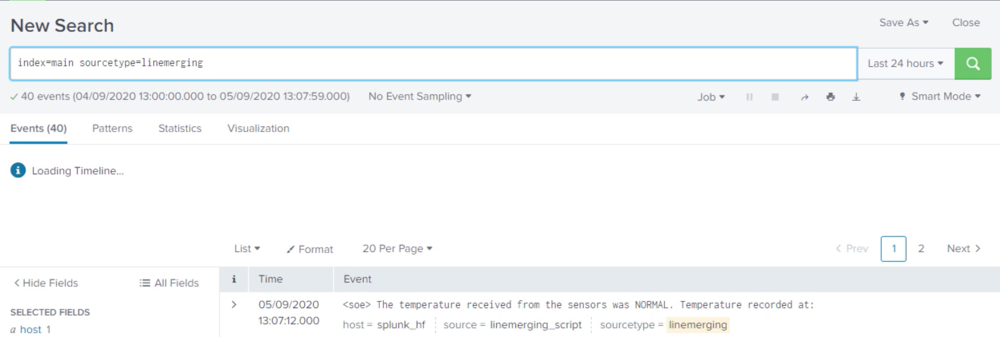

**`"local/props.conf"`**

```
[linebreaking]
SHOULD_LINEMERGE = true
MUST_BREAK_AFTER = \{3}

[linemerging]
SHOULD_LINEMERGE = true
BRFAK_ONLY_BEFORE = \<soe>\
```

`/opt/splunk/bin/splunk restart`

**`index=main sourcetype=linemerging`**


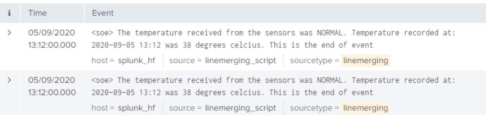


### 2-4 Demo: Configuring Line-breaking with Line Breaker Attribute

* Configuring simple line breaking
* More efficient method
* Configurations in props.conf
	- `SHOULD_LINEMERGE = false`
	- `LINE_BREAKER = <regex>`
* Restart Splunk

```
root@splunk_hf:/opt/splunk/etc/apps/psdemo# vi default/inputs.conf

sourcetype = performance

[script://./bin/custGen.py]
disabled = 0
interval = 300
index = main
source = custgen_script
sourcetype = customers

[script://./bin/lineBreaking.py]
disabled = 0
interval = 60
index = main
source = linebreaking_script
sourcetype = linebreaking

[script://./bin/lineMerging.py]
disabled = 0
interval = 60
index = main
source = linemerging_script
sourcetype = linemerging

[script://./bin/configureLineBreaker.py]
disabled = 0
interval = 60
index = main
source = configurelinebreaker_script
sourcetype = configlinebreaker
```

```
root@splunk_hf:/opt/splunk/etc/apps/psdemo# vi default/inputs.conf

"bin/configureLineBreaker.py"

for i in range(1,10) :
	print('<This is line number: "+str(i)+" of event>")
```

**`index=main sourcetype = configlinebreaker`**

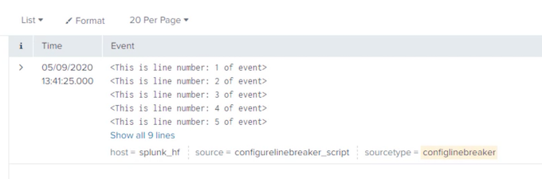

```
root@splunk_hf:/opt/splunk/etc/apps/psdemo#/opt/splunk/bin/python bin/configureLineBreaker.py

<This is line number: 1 of event>
<This is line number: 2 of event>
<This is line number: 3 of event>
<This is line number: 4 of event>
<This is line number: 5 of event>
<This is line number: 6 of event>
<This is line number: 7 of event>
<This is line number: 8 of event>
<This is line number: 9 of event>
```

```
vi local/props.conf

/opt/splunk/bin/splunk restart
```

**`index=main sourcetype = configlinebreaker`**

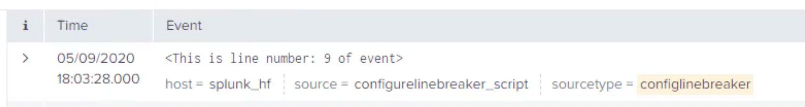

```
[linebreaking]
SHOULD_LINEMERGE = true
MUST_BREAK_AFTER = \d{3}

[linemerging]
SHOULD_LINEMERGE = true
BREAK_ONLY_BEFORE = \<soe\>

[configlinebreaker]
SHOULD_LINEMERGE = false
LINE_BREAKER = (\>)
```

```
/opt/splunk/bin/splunk restart
```

`index=main sourcetype="confielinebreaker"`

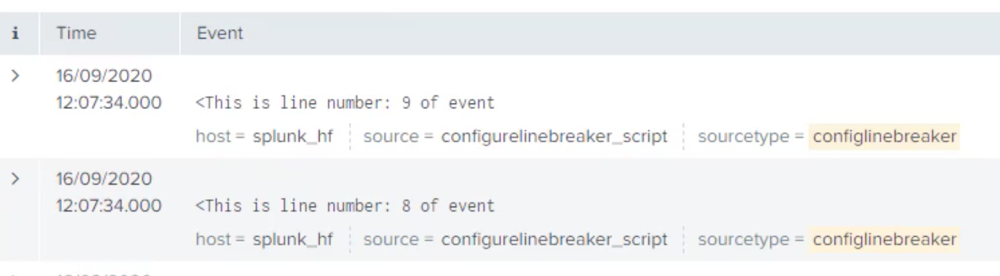

## 3 Identifying and Parsing Timestamps

* Timestamp properties in Splunk 
* Timestamp attributes
* Timestamp formats
* Demo: Time-zone recognition
* Demo: Timestamp attributes in Splunk Web
* Demo: Timestamp overriding

### 3-1 Configuring Timestamp Recognition in Splunk Enterprise

* **Nothing without a timestamp**
	* All events must have a timestamp. If not, Splunk assigns one

* Edit `props.conf`
	* To configure or modify timestamps we edit `props.conf`

* Timestamp recognition
	* Splunk recognizes most of the timestamp formats out-of-the box

* Enhanced strptime() support
	* Keep the text to three lines or fewer

* Timestamp validity attributes
	* For accepting or rejecting the timestamp in the events

**Editing Timestamp Properties**

* Timestamp configurations are done on heavy forwarders or indexers
* Configuration applied to `<sourcetype>, source::<source>` or `host::<host>`
* Identifying correct format of the timestamp is the key
* Select the correct timestamp if multiple timestamps are present
* Account for correct time-zones

**Timestamp Attributes**

* **`DATETIME_CONFIG`**
	* **Provide a file that contains timestamp formats**. 
NONE to disable & CURRENT **for current ts**
	* 	`$SPLUNK_HOME/etc/datetime.xml`

* **`TIME_PREFIX`**
	* **Regex pattern found before each timestamp**
	* Empty string

* **`MAX_TIMESTAMP_LOOKAHEAD`**
	* **Number of characters from start of event**
	* 128 characters

* `TIME_FORMAT`
	* **Unix** `strptime()` format **string**
	* Empty string

* **TZ**
	* Time-zone like UTC or +10:00 for Australia/Brisbane etc
	* Empty string

* `MAX_DAYS_AGO`
	* **Ignore events older than this value. `MAX_DAYS_AGO=10` will ignore events over 10 
days old**
	* 2000 days

* `MAX_DAYS_HENCE`
	* **Ignore events more than this values in future. 
`MAX_DAYS_HENCE=3` will ignore events over 3 
days in future**
	* 2 days

	
**Timestamp Format**

* `%d, %m, %Y` **Number of day, month and year (four digit). `%y` for two digits**
* `%b, %B`: Abbreviated month (Jan, Jun), Full name (January, June)
* `%H, %I, %p, %M, %S`:  Hour (24 hours) %I (12 hours) with `%p` as locale’s equivalent of AM or PM. %M minutes and `%S` seconds
* `%Z` Time zone abbreviations like GMT
* `%z, %:z, %::z`:  **Time zone offset +1000, +10:00 and +10:00:00**
* `%s` **Epoch time (10 digits)**
* `%N` **For GNU date-time nanoseconds. Sub-seconds %3N, %6N**
* `%+` **For standard Unix date format timestamps**


### 3-2 Demo: Translating Time Zones

**Configuring Time-zone**

* Sample events in UTC time
* Adding configuration to props.conf
* Converting to local time before indexing

```
root@splunk_hf:~# cd /opt/splunk/etc/apps/psdemo/ 
root@splunk_hf:/opt/splunk/etc/apps/psdemo# ll bin
...
utcTimestamp.py
...

vi bin/utcTimestamp.py

from time import strftime, gmtime
for i in range(0,5) :
	print(strftime("%Y-%m-%d %H:%M" ,gmtime())+" This event is originally in UTC time with id: " + str(i))
	
	
root@splunk_hf:/opt/splunk/etc/apps/psdemo# /opt/splunk/bin/splunk cmd python bin/utcTimestamp.py

2020-09-19 01:50 This event is originally in UTC time with id: 0
2020-09-19 01:50 This event is originally in UTC time with id: 1
2020-09-19 01:50 This event is originally in UTC time with id: 2
2020-09-19 01:50 This event is originally in UTC time with id: 3
2020-09-19 01:50 This event is originally in UTC time with id: 4
```
```
root@splunk_hf:/opt/splunk/etc/apps/psdemo# date
Sat Sep 19 11:50:16 AEST 2020
```

```
[script://./bin/utcTimestamp.py]
disabled = 0
index = main
source = utcts_script
sourcetype = utc_timestamp

[script://./bin/getPerformance.py]
disabled = 0
index = main
source = perfmon_script
sourcetype = performance

[script://./bin/custGen.py]
disabled = O
interval = 300
index = main
source = custgen_script
sourcetype= customers

[script://./bin/lineBreaking.py]
disabled = 0
interval = 60
index = main
source = linebreaking_script
sourcetype = linebreaking

[script://./bin/lineMerging.py]
disabled =0
interval = 60
index = main
sourcetype = linemerging
```

**`index=main sourcetype=utc_timestamp`**

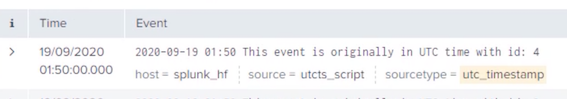

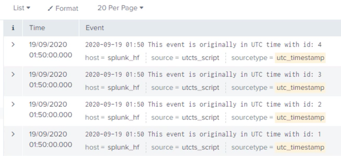

* Timestamp format: `%d%b-%Y:%H:%M:%S`

* Timestamp prefix `\`

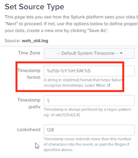

`"local/props.conf"`

```
[utc_timestamp]
TZ = UTC
```
```
root@splunk_hf:/opt/splunk/etc/apps/psdemo# vi local/props.conf
root@splunk_hf:/opt/splunk/etc/apps/psdemo# /opt/splunk/bin/splunk restart
```

**`index=main sourcetype=utc_timestamp`**

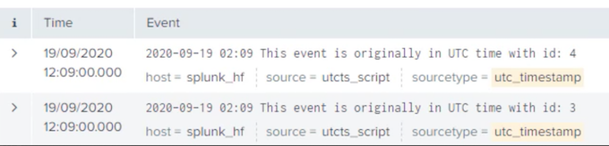

### 3-3 Demo: Using Splunk Web for Timestamp Recognition and Extraction

Configure timestamp through Splunk Web

* Events with non-standard timestamp
* Very old events
* Timestamp prefix value
* Timestamp recognition & line breaking
* Stanza in props.conf

```
root@splunk_hf:~# cd /opt/splunk/etc/apps/psdemo/
root@splunk_hf:/opt/splunk/etc/apps/psdemo# vi data/web_old.log

61.130.186.27 -- [30Mar-1998:14:03:13] "GET /cart.do?action=addtocart&itemId-HYD-29&JSESSIONID-CA9MO3AZIUSANA34656 HTTP 1.1" 503 694 "http://www.salesonline.com/category.screen?categoryId-BLUE_GIZMOS" "Mozilla/5.0 (Windows; U;
Windows NT 5.1; en-GB; rv:1.8.1.6) Gecko/20070725 Firefox/2.0.0.6" 444
```

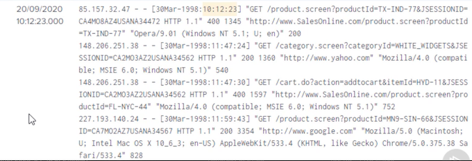

`%d%b-%Y:%H:%M:%S`

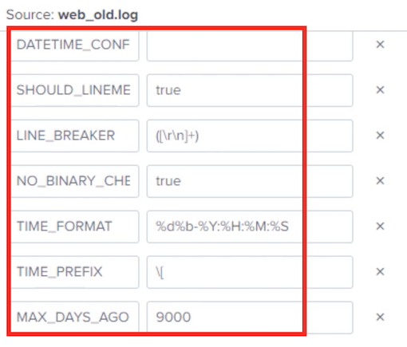

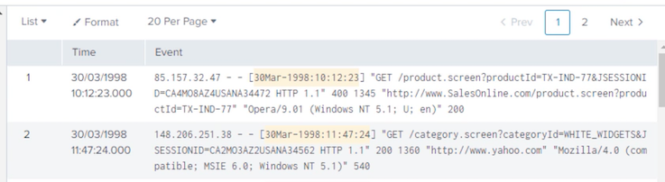

`index=main sourcetype=old_weblogs`

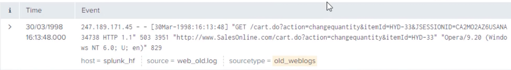

```
[utc_timestamp]
TZ = UTC

[old_weblogs]
DATETIME_CONFIG =
LINE_BREAKER = ([\r\n]+)
MAX_DAYS_AGO = 9000
NO_BINARY_CHECK = true
TIME_FORMAT = %d%b-%Y:%H:%M:%S
TIME_PREFIX = \[
category = Custom
description = Very old web server logs with weird date format
pulldown_type = true
```

### 3-4 Demo: Overriding Timestamps

Overriding event timestamp

* Events with multiple timestamps
* Custom timestamp
* Configuration in `props.conf`

```
root@splunk_hf:/opt/splunk/etc/apps/psdemo# vi bin/timestampoverride.py

import datetime, time
for i in range(0,5):
	print (datetime.datetime.now().strftime("%d/%m/%Y %H:%M:%S") + ". is the timestamp on this event number: " 
str(i) + ". But I want timestamp=" + (datetime.datetime.now()- datetime.timedelta(minutes=90)).strftime("%Y, %B %d at %H:%M:%S"))
	time.sleep(5)
```

```
root@splunk_hf:/opt/splunk/etc/apps/psdemo# /opt/splunk/bin/splunk cmd pythonbin/timestampOverride.py

20/09/2020 17:38:45 is the timestamp on this event number: O. But I want timestamp=2020. September 20 at 16:08:45
20/09/2020 17:38:50 is the timestamp on this event number: 1. But I want timestamp=2020. September 20 at 16:08:50
```

**`index=main sourcetype=timestamp_override`**


`"local/props.conf"`

```
[utc_timestamp]
TZ = UTC

[old _weblogs]
DATETIME_CONFIG= 
LINE_BREAKER = ([\r\n]+)
MAX_DAYS_AGO = 9000
NO_BINARY_CHECK = true
TIME FORMAT = %d%b-%Y:%H:%M:%S
TIME_PREFIX = \[
category = Custom
description = Very old web server logs with weird date format
pulldown_type = true

[timestamp_override]
TIME_PREFIX = timestamp=
TIME_FORMAT = %Y, %B %d at %H:%M:%S
MAX_TIMESTAMP_LOOKAHEAD = 200
DATETIME_CONFIG=
```

```
root@splunk_hf:/opt/splunk/etc/apps/psdemo#/opt/splunk/bin/splunk restart
```

`index=main sourcetype=timestamp_override`


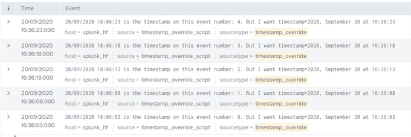


* Timestamp recognition in Splunk
* Timestamp attributes
* Translating time-zones
* Using Splunk web for timestamp handling
* Overriding timestamp


## 4 Overriding Default Fields and Custom Fields Extraction

* Defaults fields in Splunk Enterprise
* Process of overriding default fields
* Demo: Overriding default fields
* Index-time field extraction
* Demo: Custom fields extraction


### **4-1 Overriding Default Fields**

Default Fields

* Tagged and added automatically to event data at index time
* **Each default field holds information about the data it is tagged to**
* Three types of default fields: **Internal, basic and datetime**
* Overridden when default behavior needs to be changed
* Change does not apply to previously indexed events

* **Internal**
	* `_raw`, `_time`, `_indextime`, `_cd`


**Default Field Override – Scenarios**

Default fields that we often need to override

* host
* source
* sourcetype

**Some examples:**

* Host is replaced when events originate from log server and host value exists in the event
* **Source is overridden when file name is replaced with more suitable text**
* **Sourcetype is changed based on existence of some text or specific pattern in the event**

**Overriding Default Fields at Input Creation Time**

* Through Splunk Web
* In configuration files
* Provide values for relevant attribute
	* host
	* source
	* sourcetype
	* index

**datetime**

* `date_hour`, `date_minute`,
* `date_year`, `date_zone`,
* `date_mday`, `date_month`,
* `date_second`, `date_wday`

Splunk Enterprise Administration: Monitoring and Creating Inputs

**Overriding Default Fields in Existing Inputs**

* Define suitable value to assign
	* **Static value**
	* **Regular expression**
* Identify events to apply change
	* Regex based
* Write stanzas in configuration files
	* transforms.conf
	* props.conf
* Restart Splunk


**Overriding “host” Field**

Configuration to override the host field

`transforms.conf`

```
[my_field_override_stanza_name]

REGEX = \w+\s\d+\s\d+:\d+:\d+\s(router\d+)\s
FORMAT = host::$1
DEST_KEY = MetaData:Host
```


```
Apr 11 10:32:22 router1 mgd[3606]: UI_DBASE_LOGOUT_EVENT: User ‘smith' exiting configuration mode

Apr 11 11:36:15 switch2 mgd[3606]: UI_COMMIT: User 'root' performed commit: no comment

Apr 11 11:46:37 router5 mib2d[2905]: SNMP_TRAP_LINK_DOWN: ifIndex 82, ifAdminStatus up(1), ifOperStatus
down(2), ifName at-1/0/0
```

**Overriding “host” Field**

Configuration to override the host field

`props.conf`

```
[mysourcetype|source::my_source|host::my_host]

TRANSFORMS-override_host = my_field_override_stanza_name
```

```
Apr 11 10:32:22 router1 mgd[3606]: UI_DBASE_LOGOUT_EVENT: User ‘smith' exiting configuration mode

Apr 11 11:36:15 switch2 mgd[3606]: UI_COMMIT: User 'root' performed commit: no comment

Apr 11 11:46:37 router5 mib2d[2905]: SNMP_TRAP_LINK_DOWN: ifIndex 82, ifAdminStatus up(1), ifOperStatus
down(2), ifName at-1/0/0
```

* `host = router1`
* `host = old_value`
* `host = router5`


### **4-2 Overriding Sourcetype**

* Use-case scenario
* Creating regular expression
* Setting up configuration files
* Testing Results

Overriding Sourcetype: Use-Case Scenario

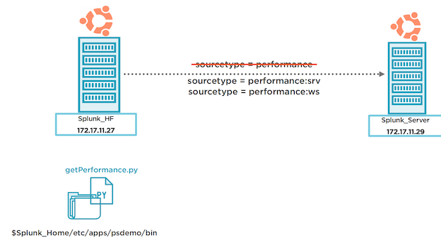


```
root@splunk_hf:/opt/splunk/etc/apps/psdemo/default# /opt/splunk/bin/python ../bin/getPerformance.py

2020-07-08 11:57:33 src=srv_pssepm01, cpu=59, ram=81, disk=37
2020-07-08 11:57:33 src=srv_psmai101, cpu=56, ram=85, disk=32
2020-07-08 11:57:33 sr=srv_psmailo2, cpu=58, ram=82, disk=35
2020-07-08 11:57:33 src=srv_psdc01, cpu=80, ram=82, disk=37
2020-07-08 11:57:33 sc=srv_psdhcp01, cpu=79, ram=93, disk=32
```

`index=main source=perfmon_script`

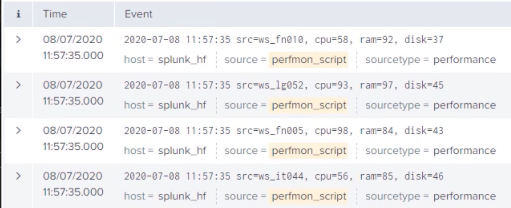

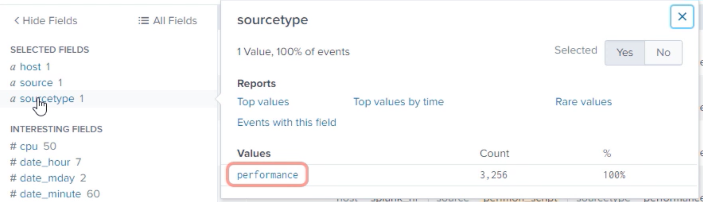

* `sourcetype=performance:srv`
* `sourcetype=performance:ws`

```
root@splunk_hf:/opt/splunk/etc/apps/psdemo/default# cd ../local
```

**`transforms.conf`**

```
[source::perfmon_script]
TRANSFORMS-changesourcetype = performance_sourcetype_override
```


**`props.conf`**

```
[performance_sourcetype_override]
REGEX = src\=(ws|srv)\_
FORMAT = sourcetype::performance:$1
DEST_KEY = MetaData:Sourcetype
```

```
root@splunk_hf:/opt/splunk/etc/apps/psdemo/local#/opt/splunk/bin/./splunk restart
```

`index=main source=perfmon_script`

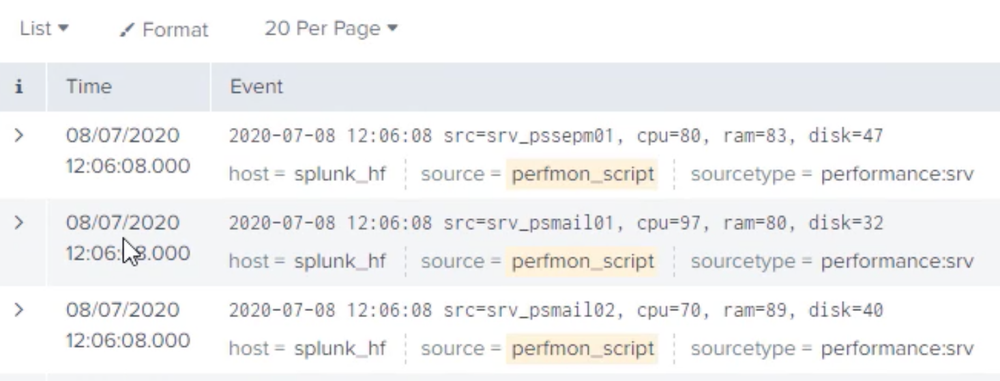

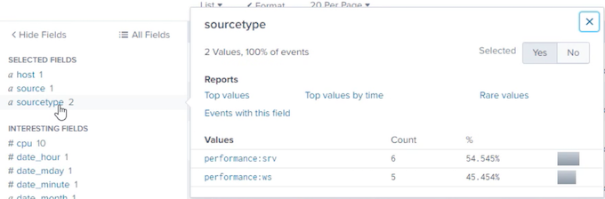


### **4-3 Creating Custom Fields at Index-time**

**Index-time Field Extractions**

* Fields extracted and written to metadata
* Similar to default fields overriding process
	* transforms.conf
	* props.conf
	* fields.conf
* Restart Splunk after changes


`transforms.conf`

```
REGEX = <suitable regular exp>

FORMAT = <key>::<val>

WRITE_META = true
```

* Changes to transforms.conf
* Regular expression that identifies events to apply changes as well as captures groups to assign values to extracted fields
* `key1::$1` `key2::“some string”` `$2::$3` 
	* Default value is `<stanza_name>::$1` 
	* Not required if you are using namecapturing groups for example: 
	* `(?<_KEY_1>[^\=]*)\=(?<_VAL_1>[^\,]*)\, 
_KEY_<string> & _VAL_<string>` is special 
capturing group
	* Only valid for index time extractions. It 
writes REGEX to metadata 
automatically. Default value is false


```
DEFAULT_VALUE = <value>
SOURCE_KEY = <key>

REPEAT_MATCH = true|false
LOOKAHEAD = <integer>
```

* What would be the default value if regex fails?
* The key to which the value of the regex would apply to. It should be present at the time of this extraction. 
Default is `_raw`.
* Regex is applied multiple times to `SOURCE_KEY` after finding first match
* How far to look ahead in an event for the regex match. Default 4096

**`props.conf`**

```
TRANSFORMS-<name> = <stanza_name>
```

Reference the transform created previously from `props.conf` using TRANSFORMS- keyword for index 
time extractions. 

You’ll use `EXTRACT-` in the case of search time extractions

**`fields.conf`**

```
[field_name]

INDEXED = true
```

* Reference the transform created previously from props.conf
* Tells Splunk to extract and store the field in metadata at index time. 
	* If not set to true, the field will not be extracted at index time. 
	* Default is false. Check for index & search time extraction conflicts

### **4-4 Demo: Creating Custom Fields at Index-time**

* Identifying custom fields
* Changes in configuration files
* Check results in Spunk Enterprise

`index=main sourcetype=netflow`

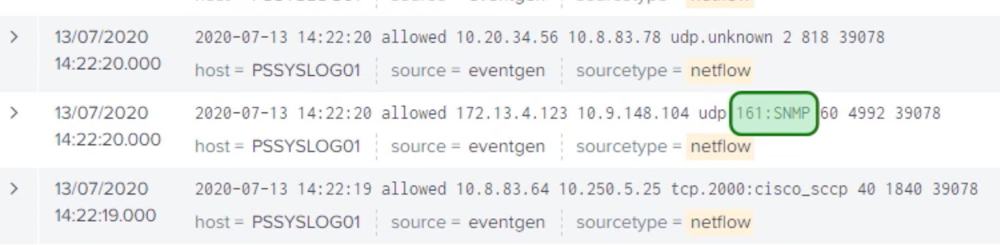

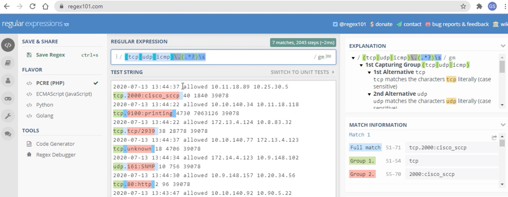

```
root@spunk_hf:~# cd /opt/splunk/etc/apps/psdemo/local/

root@splunk_hf:/opt/splunk/etc/apps/psdemo/local# vi transforms.conf 

[performance_sourcetype_override]
REGEX = src\=(ws|srv)\
FORMAT = sourcetype::performance:$1
DEST_KEY = MetaData:Sourcetype

[netflow_custom_fields]
REGEX = (tcpludp|icmp)\.(.*?)\s
FORMAT = protocol::$1 protocol_detail::$2
WRITE_META = true
```

**`props.conf`**

```
[source: :perfmon_script]
TRANSFORMS-changesourcetype = performance_sourcetype_override

[netflow]
TRANSFORMS-netflow = netflow_custom_fields
```

`fields.conf`

```
[protocoll
INDEXED=true

[protocol_detail]
```

```
root@splunk_hf:/opt/splunk/etc/apps/psdemo/local# /opt/splunk/bin/./splunk restart
```

`index=main sourcetype=netflow`

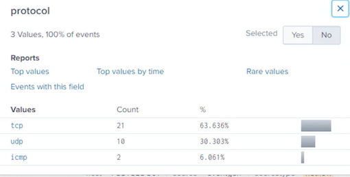


* Default fields in Splunk Enterprise
* Overriding default fields – why and how
* Demo: Overriding default fields
* Index time extractions – why and how
* Demo: Extracting custom fields

## **5 Routing and Filtering Events**

* Routing event data
	- Route all or specific events
	- Indexer groups
	- Default routing
* Filtering events
	- Filtering queues
	- Filtering in/out events
* Demo: Routing and filtering events


### **5-1 Routing Event Data**

* **Based on host, source, source type or a pattern in events**
* **Pattern based routing can only be done on a full Splunk instance**
* **Universal Forwarders route data based on host, source or sourcetype**
* **Can forward to multiple target indexer groups**
* **Can be routed to third party systems**

Routing Event Data

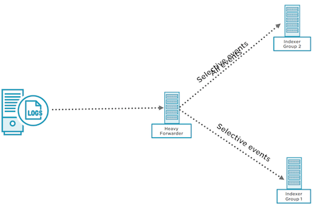

`index=main source=WinEventLog:Security`

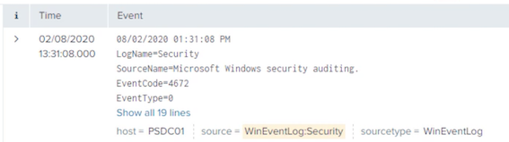

**Configuring Event Routing**

A sample stanza that routes events to target groups.

**`transforms.conf`**

```
[myRoutingStanza]
REGEX = action=\"blocked\" OR .
DEST_KEY = _TCP_ROUTING|_SYSLOG_ROUTING
FORMAT = indexerGroup1,indexerGroup2
```

* A regular expression that captures all the events to be routed. (.) or just a '.' refers to all events.By default all events routed to default indexer
* `DEST_KEY`attribute tells Splunk what we need to do with the event captured in the previous step
* **FORMAT attribute** will hold the values of indexer group or groups where these events will be routed

**`props.conf`**

```
[sourcetype|source|host]
TRANSFORMS-routing = stanza1, stanza2
```

* Reference thestanza created in transfroms.conf from props.conf


**`outputs.conf`**

```
[tcpout:myFirstIndexerGroup]
server = 172.1.1.10:9997,172.1.1.11:9997

[tcpout:mySecondIndexerGroup]
server = indexer3:9997,indexer4:9997

[tcpout]
defaultGroup = myFirstIndexerGroup
```

* Groups are defined with suitable names and list of 
server ip/dns name:port
* Default group is selected


### **5-2 Demo: Routing Event Data**

* Part I
	- Identify subset of event to rout
	- Understanding current topology
	- Route the subset of events
* Part II
	- Route same events to multiple indexers
	- Overriding default indexer group


Overriding Sourcetype: Use-Case Scenario

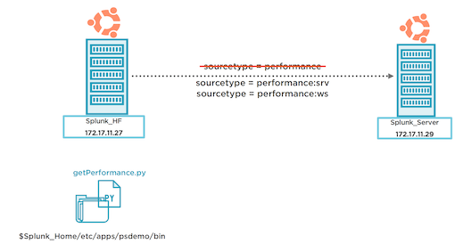

Routing Events

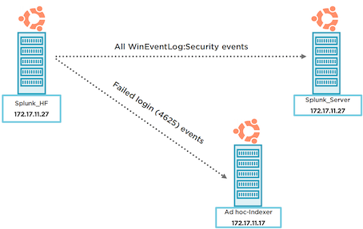

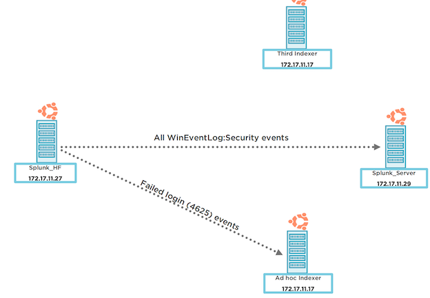

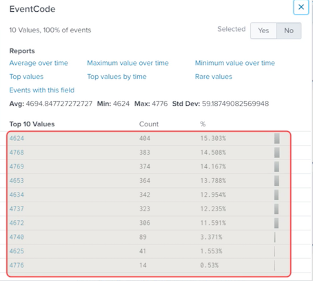

```
index=main source=WinEventLog:Security EventCode=4625
```

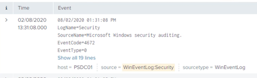

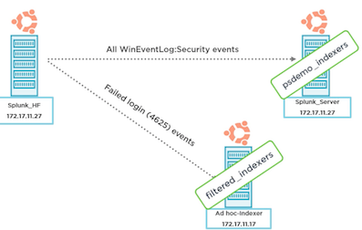

```
root@splunk_hf:/# cd /opt/splunk/bin/
root@splunk_hf:/opt/splunk/bin# ./splunk list forward-server

Active forwards:
172.17.11.29:9997
Configured but inactive forwards:
None

root@splunk_hf:/opt/splunk/bin# cd ../etc/system/local/
root@splunkhf:/opt/splunk/etc/system/local# vi outputs.conf

[tcpout]
defaultGroup=psdemo_indexers

[tcpout:psdemo_indexers]
server=172.17.11.29:9997

[tcpout:filtered_indexers]
server=172.17.11.17:9997


root@splunk_hf:/opt/splunk/etc/system/local# /opt/splunk/bin/./splunk restart

root@splunk_hf:/opt/splunk/etc/system/local# /opt/splunk/bin/./splunk list forward-server

Active forwards:
	172.17.11.17:9997
	172.17.11.29:9997
Configured but inactive forwards:
	None
	
root@splunk_hf:/opt/splunk/etc/apps/psdemo/local#

vi transforms.conf

[loginFailedRouting]
REGEX = EventCode= 4625
DEST_KEY = _TCP_ROUTING
FORMAT = filtered_indexer

vi props.conf

[source::WinEventLog:Security]
TRANSFORMS-routing=loginFailedRouting

root@splunk_hf:/opt/splunk/etc/apps/psdemo/local# /opt/splunk/bin/./splunk restart
```

`index=main source=WinEventLog:Security EventCode=4625`

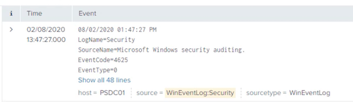

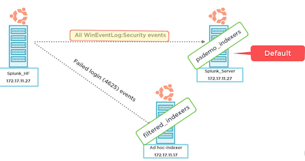

`vi transforms.conf`

```
[loginFailedRouting]
REGEX = EventCode=4625
DEST_KEY = _TCP_ROUTING
FORMAT = filtered_indexers, psdemo_indexers
```

```
root@splunk_hf:/opt/splunk/etc/apps/psdemo/local# /opt/splunk/bin/./splunk restart
```

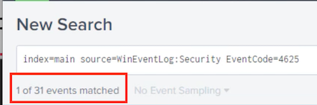

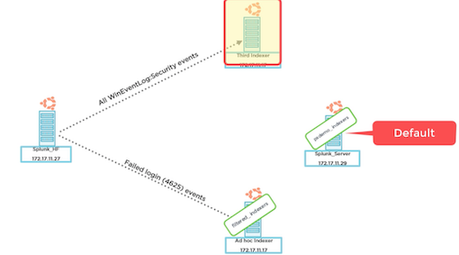

```
root@splunk_hf:/opt/splunk/etc/apps/psdemo/local# vi transforms.conf

[allWinSecurityEventsRouting]
REGEX = (.)
DEST_KEY = _TCP_ROUTING
FORMAT = psdemo_indexers


[loginFailedRouting]
REGEX = EventCode=4625
DEST_KEY = _TCP_ROUTING
FORMAT = filtered_indexers, psdemo_indexers
```

`props.conf`

```
[source::WinEventLog:Security]
TRANSFORMS-routing=allWinSecurityEventsRouting,loginFailedRouting
```

```
root@splunk_hf:/opt/splunk/etc/apps/psdemo/local#/opt/splunk/bin/./splunk restart
```

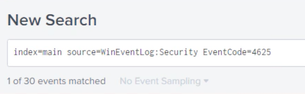

## 6 Manipulating Raw Data

* **Anonymize, mask or modify event data**
* SEDCMD
	- Configuration and working
	- Demo
* **Regex transform**
	- Configuration and working
	- Demo

### **6-1 Manipulating Raw Data in Splunk Enterprise**

**Manipulating Raw Data in Splunk**

* Anonymize, mask or delete sensitive or unwanted information
* Configure heavy forwarders or indexers to manipulate arriving data
* Splunk cloud customers use a heavy forwarder
* Two methods: **SEDCMD like sed script or regex transform**
* Use stanza based on **host, source, sourcetype** to select events

### **6-2 Manipulating Events Using SEDCMD**

**SEDCMD**


* Configured through props.conf
* Anonymize with sed script

	- `SEDCMD-<class>`
	- `s/<regex>/<replace>/flags`
	- `flags: g – global or a number`
	- `Applied to _raw only`

	
* Replace characters with sed script
	- `SEDCMD-<class> = y/<string1>/string2/`
	- `y/abc/ABC/`

### **6-3 Demo: Manipulating Events Using SEDCMD**


* Part I
	- Masking data using SEDCMD script
	- 1234-4567-7890-0123
	- XXXX-XXXX-XXXX-0123
* Part II
	- Replacing data with SEDCMD script
	- +61 412 234 456
	- (+61) (412 234 456)


**`index=main source=WineventLog:Security`**

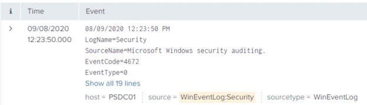


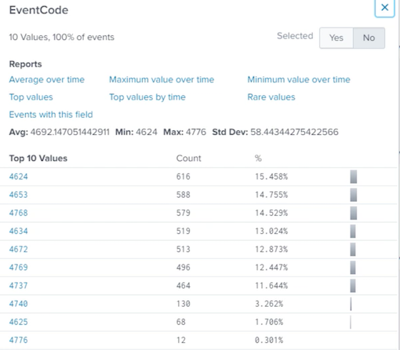


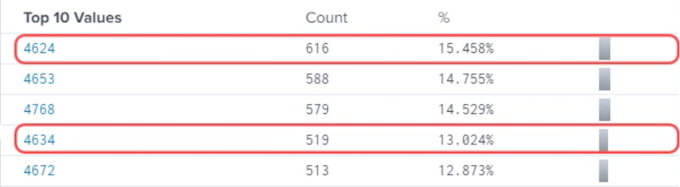

```
root@splunk_hf:~# cd /opt/splunk/etc/apps/psdemo/local/
root@splunk_hf:/opt/splunk/etc/apps/psdemo/local# ll

fields.conf
props.conf
transforms.conf
```

`transforms.conf`

```
[allwinSecurityEventsRouting]
REGEX = (.)
DEST_KEY = _TCP_ROUTING
FORMAT = psdemo_indexers

[loginFailedRouting]
REGEX = EventCode=4625
DEST_KEY = _TCP_ROUTING
FORMAT = filtered_indexers, psdemo_indexers

[setNul1]
REGEX = EventCode=(4624|4634)
DEST_KEY = queue
FORMAT = nullQueue
```

`props.conf`

```
[source::WinEventLog:Security]
TRANSFORMS-routing = allwinSecurityEventsRouting, loginFailedRouting
TRANSFORMS-null = setNull
```

```
root@splunk_hf:/opt/splunk/etc/apps/psdemo/local# /opt/splunk/bin/./splunk restart
```

`index=main source=WineventLog:Security`

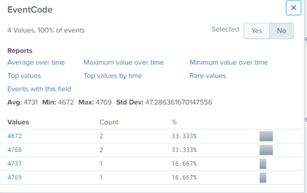

Filtering and Routing Events

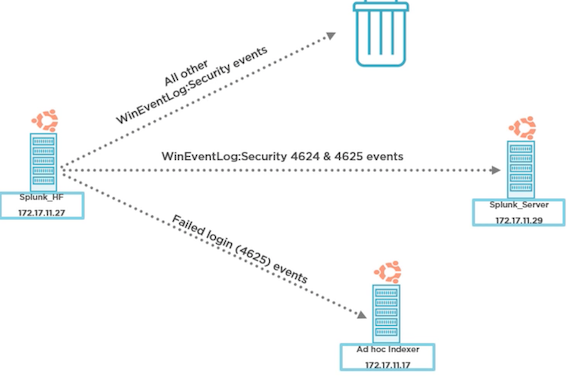


`transforms.conf`

```
[allwinSecurityEventsRouting]
REGEX = (.)
DEST_KEY = _TCP_ROUTING
FORMAT = psdemo_indexers

[loginFailedRouting]
REGEX = EventCode=4625
DEST_KEY = _TCP_ROUTING
FORMAT = filtered_indexers, psdemo_indexers

[setNul1]
REGEX = .
DEST_KEY = queue
FORMAT = nul1Queue

[setParsing]
REGEX = EventCode=(4624|4625)
DEST_KEY = queue
FORMAT = indexOueue
```

`props.conf`

```
[source::WinEventLog:Security]
TRANSFORMS-routing =allwinSecurityEventsRouting,loginFailedRouting
TRANSFORMS-null = setNu1l,setParsing
```

```
/opt/splunk/bin/./splunk restart
```

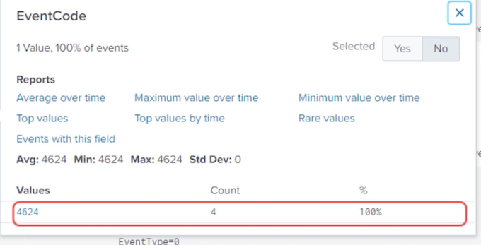


`index=main source=WineventLog:Security`

```
root@splunk_hf:~# cd /opt/splunk/etc/apps/psdemo/
root@splunk_hf:/opt/splunk/etc/apps/psdemo# vi default/inputs.conf
```

```
"bin/custGen.py"


import random
from datetime import datetime

def getCreditCardNum():
	creditCardNum=str(random.randint(2222,9999))
	for _ in range(3):
		creditCardNum += "-" + str(random. randint(2222,9999))
	return creditCardNum

def getMobileNum():
	mobileNum = "+61 42"+str(random.randint(0,9))
	for	_ in range(2):
	mobileNum += " "+ str (random.randint(111.999))
	return mobileNum

def getTimeStamp() :
	return datetime.now().strftime("%Y-%m-%d%H:%M:%S")

firstNames = [""]	
lastNames = [""]	

for firstName in firstNames:
	record = getTimeStamp() + ' CustomerName=" ' + firstName + ' ' +random.choice(lastNames)+'", ' + 'CreditCard=" '+getCreditCardNum()+" ， MobileNumber="'+getMobileNum() + '"'
print (record)	
```

`index=main sourcetype=customers`

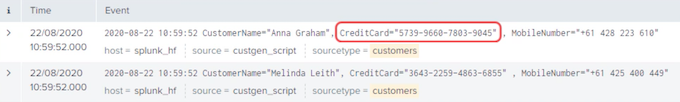


```
root@splunk_hf:/opt/splunk/etc/apps/psdemo# vi local/props.conf


[customers]
SEDCMD-cc = S/(1d{4})\-){33}/XXXX-XXXX-XXXX-/g

root@splunk_hf:/opt/splunk/etc/apps/psdemo# /opt/splunk/bin/./splunk restart
```

`index=main sourcetype=customers`


```
root@splunk_hf:/opt/splunk/etc/apps/psdemo# vi local/props.conf

[customers]
SEDCMD-CC = S/(\d{4}\-) {3}/XXXX-XXXX-XXXX-/g
SEDCMD-mn = s/MobileNumber\=\"(\+61)\s([^\"]*)/MobileNumber="0\2/g
```

`vi local/props.conf`

```
root@splunk_hf:/opt/splunk/etc/apps/psdemo# /opt/splunk/bin/./splunk restart
```

`index=main sourcetype=customers`


```
[customers]
SEDCMD-cust = S/(\d{4}\-) {3}/XXXX-XXXX-XXXX-/g s/MobileNumber\=\"(\+61)\s([^\"]*)/MobileNumber="0\2/g
```


### **6-4 Manipulating Events Using Regex Transform**


**REGEX Transform**

* Configured through props and transforms
* **transforms.conf**	
	* REGEX – a PERC regex
	* FORMAT – arrange event post change
	* `DEST_KEY` – applied to field e. g raw

* **props.conf**
	* `TRANSFORM-<class>`
	* Comma separated list of transforms

### **6-5 Demo: Manipulating Events Using Regex Transform**

Anonymizing data with regex transform

* Masking credit card number
* 1234-4567-7890-0123
* XXXX-XXXX-XXXX-0123
* Creating a suitable regex
* Configuring transforms and props.conf
* Verifying results

`props. conf`

```
[customers]
SEDCMD-cust = S/(\d{4}\-) {3}/XXXX-XXXX-XXXX-/g s/MobileNumber\=\"(\+61)\s([^\"]*)/MobileNumber="0\2/g
```

**`index=main sourcetype=customers`**


`regex101.com`

```
root@splunk_hf:~# cd /opt/splunk/etc/apps/psdemo/local/
root@splunk_hf:/opt/splunk/etc/apps/psdemo/local# vi transforms.conf

[maskcc]
REGEX = ^(.*)CreditCard\=\"(\d+\-){3}(.*)$
FORMAT = $1CreditCard- "XXXX-XXXX-XXXX-$3"
_DEST_KEY = _raw

props.conf

[customers]
TRANSFORMS-maskcreditcard = maskCC
```

`index=main sourcetype=customers`


