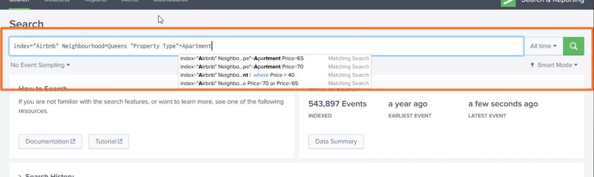
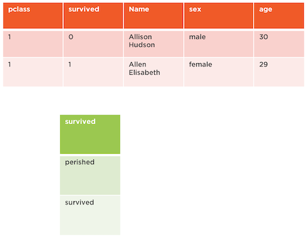

# **7 Performing Basic Splunk Searches**

## 1 Introduction to Search in Splunk

* Performing Basic Searches
* Field Searches Basics
* Splunk Processing Language
* Transformative Searches in Splunk
* Beyond Search Splunk Search

### 1-1 Searching Machine Data


* Index
* Search Head
* Forwarder


* Indexer, right, our indexer is going to bring in our data, it's going to index it so it can be searched. 
* The next component is our **search head**. **So our search head is where we're actually querying our data, writing in our data queries, being able to pull our reports from the data that we've pulled**, 
* Last component is that forwarder, So multiple, multiple machines that are sending data to be indexed and then we're using our search head which we'll interact with a ton in this course, **but the forwarder could be these edge devices where the data and the log files are being pushed from the host machines to our indexer and then being able to search it with our search head**. 

### Demo: Basics of Splunk Search

`index=main| top limit=20 EventCode`

**Splunk Search Interface**


### Splunk Data Sets

**Splunk Data Options**

* Semi-structured
* Machine generated
* Often overlooked

* Something like the csv files or log generated files from your Windows machine, or Mac, or Linux machine. 
* **Machine generated**, even machine generated from an export of a database, but the data is coming in in some kind of fashion from a machine generated. Remember, 90% of the world's data that's being generated is coming machine generated. 
* dark data, but a lot of times, this data is overlooked. 

* **Servers** can have forwarders on that's going to send information whether it be our servers, can be your NAZ device, it can be your networking devices. 
* **Clouds** are what are applications, what are you running in the cloud, there's a lot of ways to get data out of the cloud or get data into the cloud for your Splunk instance so that you can have a wholistic picture of what's going on in your environment. 
* **Workstations**, being able to find data and log files that are on your workstations and be able to pull those into your main Splunk instance so that you can actually comb through and look at your data. 
* **regular expression** on it, which is what Splunk is doing and helping can feed that data into our Splunk environment and start searching it. 

### Demo: Uploaded Splunk Course Data


```
source="titanic passenger list.csv" host="thenson-desktop" index="titanic" sourcetype="csv"
```


## 2 Understanding the Basics of Splunk Search

* Understanding Spunk roles
* Learning how data is stored in Splunk
* Explaining Spunk data lifecycle

### 2-1 Splunk Roles in Search

Every Splunk user falls into a role which gives the user
different functionalities in Splunk.

* User can create and edit searches owned by user
* Power can edit shared object and alerts
* Admin can perform most Splunk search functions

### 2-2 Data Storage in Splunk

**Index**

Splunk stores data in an index. 

> So Splunk is actually going to store this data in an index which helps us feed it with searches, so we can view our data

Ingested data goes through the process of indexing which converts data to searchable events.


* **Creates metadata**
	* It creates metadata off that data element so that it's searchable and it also gives it some parameters for Splunk to be able to do some administrative on the back-end.
* Compresses data
* Index for data


Indexing

**`Neighborhood=Brooklyn + timestamp`**


**`timestamp`**

**Now there are multiple buckets and each one of those are stored by age of data.** 

What is a Bucket?

* Splunk file system
* Stored by age of data

timestamp


So we're timestamping our data and we're going to put it in the first bucket, but as that bucket starts to reach a certain size, it's going to need to tier off to another bucket. 

So you might have bucket 1 through 9 for all of your events, bucket 10 through 19 for the other ones, or 20 through 29. So these are just some arbitrary numbers. It could be a lot larger, it could be a lot smaller. 


### 2-3 Bucket Management in Splunk

What is a Bucket?

* Splunk file system
* Stored by age of data


* **Creating Indexes**
	* Bucket Allocation
* **Performance Requirements**
* **Storage Requirements**
* **Size Splunk Cluster**


**Bucket Lifecyle**

* Hot Bucket： 24 hours
* Warm Bucket： 3 Months
* Cold Bucket： 3 + Months
* Frozen Bucket： 1 Year

**Index Data Options**

* Hot
* Warm
* Cold


### Demo: Splunk Bucket Management


## 2 Performing Basic Spunk Searches

> USING FIELD SEARCHES FOR SPLUNK SEARCHES

`index=main`

 v
* Explore search bar and timelines
* Define field operators in plunk search
* Navigate the plunk search sidebar
* Analyze the search results field
* Discuss best practices for searches

### 2-1 Search Bar & Timeline

**Navigating the Search Bar**

* Search Bar
* Time Range
* Job
* Timeline
* Saved Searches
	* This gives us the option to be able to go in and save specific searches so that we can either share it out with other users or bring it into our own dashboard.
* Modes

**Splunk Search Modes**

* Field discovery **turned off** for event searches. No event or field data for stats searches.
* Field discovery **turned on** for event searches. No event or field data for stats searches.
* All events and field data.

> Fast mode, and in this one the field discovery is turned off for event searches, and then statistics for events and fields are also not turned on as well.
> 
> The second one strikes a middle balance between that. So it's called the smart mode, and it's a default value in Splunk.  Field discovery is turned on for these events searches, but just like in fast mode, the stats, searches, there are no field or no event data as well in those. 
> 
> Last one is on the other end of the spectrum, **so all event and field data is just evident in there**. So this is called your **verbose mode**. So this is going to be the most costly whenever we talk about search, compute, and capacity here from this perspective.

### 2-2 Search Field Operators

**Field Operators**

Characters used in Splunk queries for analyze search
results. Common functions are wildcards, Booleans and
comparison operators.

**Spunk Field Operators**

* Field Expressions

	* `field=value`  Field and value match
	* `field!=value` Field and value don't match
	* `field<value`  Field less than value
	* `field>value`  Field greater than value
	* `field<=value` Field less than or greater than
	value
	* `field>=value` Field greater than or greater
	than value


* Boolean Operators

	* Field NOT value
		* Not Boolean
		* Field does not contain value
	* `field=value1 OR field=value2`
		* OR Boolean
		* Field has at least one value or both values in expression
	* `field=value1 AND field=value2`
		* AND Boolean
		* **Field has both values in expression**


* Wildcards		

```
Host="thenson-desktop"

Results only where
Host = "thenson-desktop"
Host = "thenson-server"
Host = "thenson-mobile"
```


### 2-2 Splunk Field Sidebar

**fields are case sensitve**

```
index=airbnb beds=4
```

**Field Sidebar**

Located on left portion of Splunk search. Pulls selected
fields and interesting field for quick search results. Also offers quick reports such as top values and rare values.


**`index=airbnb Beds!=4`**


**`index=airbnb Beds<4`**


**`index=airbnb Beds=4 OR Beds=3`**


**`values are not case sensitve`**

`index=airbnb Neighbourhood=bro*`


### 2-3 Splunk Field Sidebar


* Fields assigned
	* Selected fields
	* Interesting fields
* Quick field numbers
* Text fields a
* Numeric fields #

`index=airbnb Neighbourhood="bro*"`


* `a String`
* `# Numeric`


* Rare values

`index=airbnb Neighbourhood="bro*" | rare limit=20 Beds`


* Top values by time

`host="thenson-desktop" | timechart count by EventCode limit=10`


### 2-4 Splunk Results Field

**Splunk Search Results**

Main portion of Splunk Search where events are
displayed from search results.

* Field Sidebar
* Include Fields
* Top Field Values

**Events displayed**

* Formatting
* Per event

**Displayed fields clickable**

* Add
* Exclude
* New

More Results Display Options

Raw Events / Patterns / Statistics / Visualizations

* Examine Raw Results
* Display Options

`index=airbnb`


`index=airbnb Price!=80`


`index=airbnb Price!=80 AND Beds=4`


**Top Vaules**

`index=airbnb Price!=80 AND Beds=4| top limit=20 Neighbourhood`


`index=airbnb Price!=80 AND Beds=4| top limit=20 Neighbourhood`


### 2-5 Infrastructure will define Spunk Search performance

* Build searches based on narrowest criteria
* Timeline impacts most searches
* Index data sets and plan for scale

**Overview**


* Explored search bar and timelines
* Defined field operators in Splunk search
* Navigated the Splunk search sidebar
* Analyzed the search results field
* Discussed best practices for searches

## 3 Building SPL Queries in Splunk

* Learning the Search Processing Language
* Understanding SPL Keywords and commands
* Building SPL Queries with Splunk commands

**Search Processing Language** is Spunk's syntax for
writing queries in the Spunk platform.

Example SQL

```
SELECT Neighbourhood, Property_Type
FROM Airbnb
WHERE Neighbourhood=Queens, Property_Type=Apartment
```

```
index="Airbnb" Neighbourhood=Queens "Property Type" = Apartment
```

Search Processing Language (Settings for SPL)


### Building SPL Queries

**Chaining Commands**

Search Processing Commands use the pipe `|` commands
to chain search commands together.


```
index="Airbnb" Neighbourhood=Queens "Property Type" = Apartment | command 1 argument
```

SPL Keywords

* AS
* BY
* OVER
* WHERE

```
index="Airbnb" where Price > 40
```

```
index="Airbnb" | where Price > 40
```

**Where: Splunk command use to return results in which "where" command is true**

Search Processing Language

* Chaining Command
* Key Commands

```
index="Airbnb" Neighbourhood=Queens "Property Type" = Apartment | fields - Beds
```




```
index="Airbnb" Neighbourhood=Queens "Property Type"=Apartment | where Price > 40
```


```
index="Airbnb" Neighbourhood=Queens "Property Type"=Apartment | where Price=70 or Price=65
```


### 3-3 SPL Filtering & Modifying Search Results

**Chaining Commands**

Search Processing Commands use the pipe | commands
to chain search commands together.

```
Host=*
| fields [fieldname1], [fieldname2]
```

**Fields: Splunk fields command add or remove field listed**.

```
Host=*
| search [keyword]
```

**Search: Splunk search allows to searching raw text while using chaining command.**


```
Host=*
| dedup [fieldname]
```

**Dedup: Splunk dedup removes duplicate fields from search results.**

```
Host= *
| Renames [fieldname]
```

**Rename: Splunk rename allows for field names to be changed in search results.**

Search Processing Language

* Field
* Dedup
* Rename

**Hide fields**

```
index="Airbnb" Neighbourhood=Queens "Property Type"=Apartment | fields - Beds
```


**see certain fields**


```
index="Airbnb" Neighbourhood=Queens "Property Type"=Apartment | fields + Beds

index="Airbnb" Neighbourhood=Queens "Property Type"=Apartment | fields + Beds, price
```


```
index="Airbnb" Neighbourhood=Queens "Property Type"=Apartment | search Pretty
```


```
index="Airbnb" Neighbourhood=Queens "Property Type"=Apartment | search large
```


```
index="Airbnb" Neighbourhood=Queens "Property Type"=Apartment | search large | rename Price as Cost
```


### SPL Ordering Search Results

```
Host=*
| head number
```

Splunk head returns the first 10 events unless specified by another number.

```
Host=*
| tail [num]
```

Splunk tail returns the last 10 events unless specified by another number.

```
Host=*
| sort [fieldname]
```

Splunk sort will order field by ascending order.

```
Host=*
| reserve
```

Splunk reverse will put search results in reverse order.

```
Host=*
| tables [fieldname]
```

SPL command for creating a table with specific fields

Search Processing Language

* Sort
* Tail
* Head


```
index="Airbnb" Neighbourhood=Queens "Property Type"=Apartment | tail

index="Airbnb" Neighbourhood=Queens "Property Type"=Apartment | tail 30

index="Airbnb" Neighbourhood=Queens "Property Type"=Apartment | head 30

index="Airbnb" Neighbourhood=Queens "Property Type"=Apartment | sort Price

index="Airbnb" Neighbourhood=Queens "Property Type"=Apartment | sort Price desc
```


* Understood how SPL compares to SQL
* Implemented multiple SPL queries
* Walked through ordering, modifying, and filtering SPL commands

## 4 PERFORMING TRANSFORMATIVE SEARCHES

* Utilizing Transforming Commands
* Understanding the Stats commands
* Charting in Splunk with transforming commands

### 4-1 What Are Transformative Commands?

**Transforming Commands**

Allow for search commands to create data structure
from field values. Frequently used for Splunk Enterprise
visualizations.

```
Host=*
| top [fieldname]
```

Returns **frequent value** for the defaulted top 10 results


```
Host=*
| rare [fieldname]
```

Returns **least frequent value** for the defaulted top 10 results

```
Host=*
| highlight [fieldname1] [fieldname2]
```

**Shows results in raw events mode with fields highlighted**

```
Host=*
contingency [fieldname1] [fieldname]
```

Shows associations between fields in table

**Basic Transforming Commands**

* Top
* Rare
* Contingency

**SELECTED FIELDS**


`top limit=3 Beds`

```
index=airbnb
| top limit=3 Beds
```


`rare limit=3 Beds`

```
index=airbnb
| rare limit=3 Beds
```


```
index=airbnb
| contingency Neighbourhood "Property Type"
```


### 4-2 Splunk Stats Commands

**Stats Commands**

**Special type of transforming Splunk commands used
primarily for calculations to for table results.**

```
Host=*
| stats avg([fieldname])
```

Calculate results based on average function

```
Host=*
| stats count (eval[fieldname]) as newname
```

Returns time **series chart over the data element following command**

```
Host=*
| stats max(fieldname)
```

Returns maximum value from a specific field

```
Host=*
| stats min(fieldname)
```

Returns minimum value from a specific field

```
Host=*
| stats sum(fieldname)
```

Returns sum of fields in specific value

Stats Commands

* Min
* Max
* Average
* Count

```
index=airbnb
| stats min(price)
```


```
index=airbnb
| stats min(Price) by Neighbourhood
```


```
index=airbnb
| stats max(Price) by Neighbourhood
```


```
index=airbnb
| stats avg(price)
```


```
index=airbnb
| stats avg(price) by Neighbourhood
```


### 4-3 Spunk Chart Commands

**Chart Commands**

**Type of Splunk transforming command for presenting
data in tables or visualization. Typically includes stats commands.**

```
Host=*
| chart somefunction([fieldname])
```

**Returns chart of the data element following command. Commonly used with stat command**

```
Host=*
| timechart somefunction([fieldname])
```

Returns time series chart over the data element following command. Commonly used with stat command.


Demo: Charting Transforming Commands

* Chart
* TimeChart


```
index=airbnb
| chart count as types by "Property Type"
```


```
host="thenson-desktop"
| timechart count as messages by Keywords
```


```
host="thenson-desktop"
| timechart count as messages by Keywords
```


## 5 Beyond the Basic Search

### Lookup

Search Processing Language is Spunk's syntax for **writing queries in the Splunk platform.**




**Building Lookup in Splunk**

* Add Lookup for Titanic
* Construct Lookup query


`lookup.csv`

```
survived, status
O, perished
1, survived
```


```
index="titanic" survived=* | lookup lookup.csv survived OUTPUT status | table survived status
```


### Day in the Life of Splunk Admin

* Ensuring Splunk and architecture are built
* Building Splunk searches and support Splunk search users
* Creating and aiding in the visualization of data